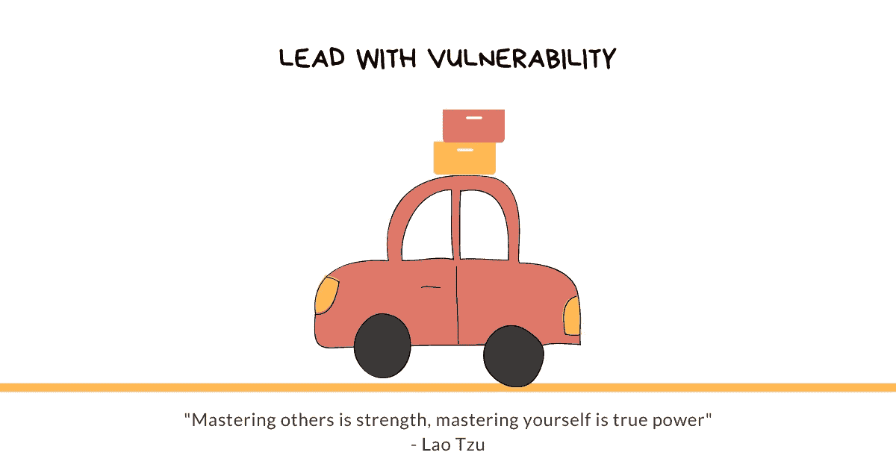

# 如果你敢领导，就用脆弱来领导

> 原文：<https://betterprogramming.pub/if-you-dare-to-lead-lead-with-vulnerability-d7a6b48dcf7a>

## 成为更好的领导者

鸣谢:作者

就像乌龟躲在壳里，豪猪的尖刺在感觉到危险时会跳出来引起注意一样，我们人类在感觉到威胁时也会穿上防护甲。危险的情况、未知的焦虑和暴露的危险唤起了与害怕被捕食者追逐相同的情绪反应。

我们感到脆弱。但是我们没有拥抱脆弱，接受我们的恐惧，用好奇心引导，而是戴上了保护的盾牌。即使在害怕的时候，我们也会表现出自信；即使在不确定的时候，我们也会自信地说话；因为害怕遭到反对而隐藏自己的错误；为了避免情绪暴露的风险，我们会避免正面冲突。

试图保持这种形象变成了与自己的不断斗争，因为这不是真正的我们。我们没有把精力花在做正确的事情上，而是花在努力变得正确上。

我们要么变得脆弱并建立有意义的关系，要么躲在我们的保护盔甲后面，在那里别人看不到我们真实的自我。创造一个我们是完美的，我们有所有的答案，我们永远不会错的形象会扼杀我们自己和我们周围其他人的成长。

脆弱不是发泄出来，不是用我们根深蒂固的恐惧给别人增加负担，也不是讲让别人不舒服的故事。

> “没有边界的脆弱会导致脱节、不信任和脱离。把一切都说出来或者无边界的披露是我们保护自己免受真正的脆弱的一种方式。”
> 
> —《胆大妄为》中的布琳·布朗

它需要建立健康的界限，让我们出于寻找答案的愿望而分享，鼓励他人敞开心扉，激发信息的自由流动，勇于接受我们的局限性，并有学习和成长的心态。

我们脆弱背后的动力来自于知道我们在哪里，我们想去哪里，并接受我们无法独自做到这一点。这是在告诉别人我们需要他们。

# 脆弱就是力量

长大后，我们学会隐藏自己的真实感受，上演一场完美的演出。我们被告知，表达我们所缺乏的是软弱的标志，为了成功，我们需要假装我们有所需要。

难怪当我们进入职场时，我们会带着这种心态。

当承担一个我们不了解的新项目时，我们太害怕问澄清性的问题，认为问问题会被认为是无能的表现。比起寻求清晰，我们更喜欢投射自信。

当第一次给一群人做报告时，我们决定独自做，认为寻求帮助是软弱的表现。我们假设建立信誉意味着独自去做。

当我们[不同意时，](https://www.techtello.com/agree-to-disagree-vs-disagree-and-commit/)我们不会说出来，或者我们会避免困难的对话，以避免进行真实对话所需的情感流露的风险。我们认为随波逐流是避免伤害他人和获得尊重的一种方式。

总是穿上保护盔甲会阻止我们建立有意义的关系。我们把精力花在保持虚假形象上，而不是通过让真实的自己被人看到来获得信任。

脆弱不是弱点。是实力。它是放下戒备的勇气，是被人看见的勇气，是接受未知的勇气，是承认错误的勇气，是最终相信自己并不完美的勇气。我们总是在进步。

我们和其他真实的人联系在一起——那些和我们一样有缺点的人。当我们表现出脆弱时，我们发出信号“做你自己没问题。没必要藏着掖着。”它邀请其他人畅所欲言，接受他们的错误，并在他们不知道某些事情时寻求帮助。总之，它致力于一条学习和成长的道路，而不是建立一种伪装的文化。

当领导者通过接受弱点来接受不完美时，他们就赋予了组织中的人回报的权力。他们创造了一种文化，在这种文化中，新的想法诞生了，人们被鼓励去试验，从他们的失败中学习，尝试新的[策略](https://www.techtello.com/strategy-vs-tactics/)，而不是坚持现状，躲在他们的失败背后。

> “脆弱性是创新、创造力和变革的发源地。创造就是制造以前从未存在过的东西。没有比这更脆弱的了。对变化的适应性就是脆弱性。”
> 
> —布琳·布朗

创新不是从完美中诞生的——它是不完美的礼物。

# 从脆弱性开始

用脆弱来引导并不容易，它不会自然而然地来到我们身边。我们多年来接受的将脆弱视为弱点的训练不会在一天内消失。这就是为什么我们需要勇气去实践它，去失败并再次尝试。

会有困惑的时刻——是我太脆弱还是不够脆弱？—害怕别人会怎么想，甚至可能因为接受而感到羞耻，但表现出脆弱并不是为了克服这些感觉。它是接受它们的存在，并练习勇敢面对它们。有了持续的练习，脆弱将变得毫不费力。它会成为你的一部分。

遵循以下七项关键实践，从漏洞入手:

## 1.说“我不知道”，然后说“我需要帮助”

当我们不知道某事时，假装知道会对寻求做出正确决定所需的信息造成障碍。

我们认为说“我不知道”等同于“我不知道我在这个职位上做什么”但是，当它成为我们身份的一部分时——那种表现为无所不知的期望——我们害怕自己会被评价为无知。其他人会质疑我们的权威，并由于我们无法给他们提供答案而对我们失去信任。

我们变得不愿意询问信息，害怕被发现，[点头同意](https://www.techtello.com/avoid-groupthink/)我们不理解的想法，当我们的内在自我因恐惧而爆炸时，努力描绘外部的平静。

人们不指望我们知道所有的答案。它是我们自己头脑的创造。想一想:

*   你真的指望别人什么都知道吗？
*   当他们说他们不知道某事时，你有什么感觉？
*   你是评价他们，轻视他们，还是欣赏他们的脆弱？

H.斯坦福大学商学院(Stanford Business School)教授欧文·格罗斯贝克(Irving Grousbeck)曾说过，“当一位直接下属带着一个你无法回答的问题来到你面前时，抵制住猜测的诱惑。相反，你可以考虑说:“我不知道。”这三个词构成了一个强有力的回答，显示了谦逊和自信。"

> “我相信，最优秀的经理人会承认自己不知道的事情，并为其腾出空间——这不仅是因为谦逊是一种美德，还因为除非一个人接受这种心态，否则最引人注目的突破就不会发生。我认为经理们必须放松控制，而不是收紧。他们必须接受风险；他们必须信任与他们一起工作的人，并努力为他们扫清道路；他们必须始终关注和参与任何制造恐惧的事情。此外，成功的领导者接受现实，即他们的模型可能是错误的或不完整的。只有当我们承认我们不知道的东西时，我们才有希望学会它。”—《创造力公司》中的艾德·卡姆尔

说“我不知道”是有力的。当我们鼓起勇气说“我不知道”的时候，我们会感到虚伪的重量从我们的身体上卸下来了。

我们现在可以把精力花在寻找正确的答案上，而不是花在与自己斗争上。我们可以邀请其他人分享他们的观点。我们可以告诉他们我们需要他们的帮助。我们可以创造一种文化，在这种文化中，找到正确的答案比拥有所有的答案更重要。

## 2.承认你犯了错误，并分享你学到的东西

当我们不接受脆弱时，我们要么试图隐藏我们的错误，要么寻找容易责备的目标。

我们投资[沉没成本](https://www.techtello.com/sunk-cost-fallacy/)只是为了证明我们做出了正确的投资，与一个有毒的员工保持太长时间的联系，而不是接受我们做出了错误的招聘决定，或者隐藏糟糕的交易和失败的项目。

这向别人传达了什么？犯错是不对的。组织中的人要么专注于避免错误，要么追求卓越。你想要哪一个？

没有通往卓越的捷径。它植根于失败，但我们必须找到全心全意接受失败的勇气。我们必须经历剖析这些失败并从中吸取教训的痛苦过程，带着希望迈出新的一步，即使不能保证它会成功——并且一遍又一遍地这样做而不放弃。

作为练习，不要只是接受错误。分享你从这个过程中学到的东西——你是如何决定的，你尝试了什么，哪里出错了，它教会了你什么？专注于学习，人们会忽略错误，并看到承担这些风险的价值。他们明白，只有当我们有勇气去实验、失败、学习和重复时，才有可能获得有意义的见解。

通过接受错误来显示弱点，将我们的注意力从隐藏错误转移到寻找解决方案。它在组织中建立了一种[成长心态](https://www.techtello.com/fixed-mindset-vs-growth-mindset/)。

## 3.灵活地改变你的观点

当我们把我们的身份和我们的观点联系在一起时，我们很难忽略它，也很难通过带着真正的好奇心和开放的心态探索另一个人的观点来表现出脆弱。我们坚持自己的信念，没有意识到我们可能是错的。

通过坚持自己的想法，我们无视他人的感受，传达了一个信息，即我们不在乎他们的想法。无论是确定关键产品战略的会议，还是做出招聘决定的需要，或者是执行计划的最后步骤，或者是艰难对话的一部分，对他人想法和意见的僵化会阻止我们建立有意义的联系。

我们专注于让别人以我们的方式看待事物，并努力让他们朝着我们的方向发展，这破坏了信任。一旦得知我们不会让步，人们会避免交谈，保持沉默，并简单地点头表示同意。

专注地倾听他人的想法，提出好的[开放式问题](https://www.techtello.com/open-ended-questions/)，表现出倾向于最佳选择的灵活性，即使这可能不是我们的首选，这都是领导力的表现。这表明任何人都可以有最好的想法，人们不应该害怕表达自己的观点。最终，重要的是做出符合组织最大利益的决策。

改变我们的想法并不是软弱的标志，也不是我们不知道自己在做什么的信号。这是超越我们的信念和假设，探索可能性世界的勇气。正是脆弱战胜了我们的正义感，支持了观点的灵活性。

## 4.拥抱冲突，即使它让人不舒服

工作场所充满了冲突——相互竞争的优先权、与一个[难相处的同事](https://www.techtello.com/how-to-deal-with-difficult-people/)一起工作、拒绝升职、对一个决定有不同意见、拒绝我们的想法等等。

以富有成效的方式处理冲突需要走出我们的舒适区，并承担拥抱它所带来的情感暴露的风险。在这种情况下的脆弱来源于结果的不确定性，得罪他人的风险，以及对我们会让事情变得更糟的恐惧。

> “每当我们发现自己在争论、辩论、逃避或以其他无效的方式行事时，那是因为我们不知道如何分享意义。我们没有进行健康的对话，而是玩愚蠢而昂贵的游戏。”
> 
> ——约瑟夫·格雷尼在《至关重要的对话》中

是的，这些讨论让人不舒服，我们很容易避开它们，希望它们会自己解决。但是推迟这些讨论只会火上浇油。这导致了期望的错位和缺乏明确性，也是工作中许多[挫折](https://www.techtello.com/frustration-at-work/)和焦虑的来源。

拥抱冲突，表达你的意图，并邀请他人分享他们的观点。不要跑向你的盔甲，即使它会让你不舒服。

## 5.说你害怕

你是否担心迫在眉睫的截止日期，害怕你的下一个重要演示，在领导一个具有挑战性的项目时感觉自己像一个[冒牌货](https://www.techtello.com/imposter-syndrome/)，或者担心新收购的公司会如何？

在这种情况下，我们大多数人都感到害怕，但我们并不承认这一点。害怕并不意味着我们没有能力承担责任，也不意味着一有机会我们就会逃避。这也不意味着我们应该向每个人公布我们的恐惧。

关键是接受我们的脆弱，向我们信任的人表达我们的感受。这向其他人保证这样的感觉是可以的。听到我们并不孤独，听到其他人也在为同样的感受而挣扎，这也让我们感觉更好。

如果你的同事说，“我对这个项目感到害怕，你会怎么办？利害攸关的事情太多了。”你会评价他们并怀疑他们的能力吗，或者想“如果我处在你的位置，我也会害怕的。”

一位宣布对下一笔大收购感到紧张的首席执行官，听起来不会软弱，而是会因为接受大量收购结果不佳这一严峻事实而被人欣赏。

展示你的脆弱。跟需要听的人说你害怕。害怕并不是缺乏力量，而是接受现实的勇气。

## 6.点击次数不比点击“是”次数多

说“不”是承认我们的局限性，是一种做正确事情的勇气行为。有时我们隐藏自己的情绪，装出一副快乐的面孔，掩盖我们的分歧，并按下“是”按钮，尽管我们身体的每个细胞都想说“不”

说“不”并不容易，但我们甚至没有努力去学习如何说。因为我们认为说“不”会让人们评判我们，怀疑我们的能力，质疑我们的承诺。它需要通过暴露我们自己来接受弱点。我们必须有不被喜欢的勇气，并认识到取悦每个人不是我们的工作。

有时是我们的[讨人喜欢的](https://www.techtello.com/stop-being-a-people-pleaser/)倾向妨碍了我们，而在其他时候，我们只是不知道如何创造价值，最终默认为是。我们没有意识到的是，通过说“是”，我们可能会在那一刻避免面对自己的脆弱，但这只是暂时的。一旦我们接受了自己的承诺却没有兑现，现实就会给我们沉重的打击。什么会让人们更不高兴——是我们一开始就说不，还是我们说好却没有兑现承诺而变得过于热情？

> “你必须决定你最优先考虑的事情是什么，并且要有勇气——愉快地、微笑地、毫无歉意地——对其他事情说‘不’。要做到这一点，就要有一个更大的“是”在心里燃烧。”
> 
> —斯蒂芬·R·科维

清楚有效地说“不”。我们可以既脆弱又尊重他人。

## 7.分享你正在进行的工作

建立新技能所需要的谦逊和自律来自于接受我们并不完美，而且总是有更多东西需要学习。这是一种变得更好的决心，通过接受学习的道路来自脆弱。不虚心面对自己的不足，就无法真正的学习和成长。

与他人分享我们正在培养的新技能并不是展示我们缺乏什么，而是宣告我们希望成为什么样的人。一旦我们的身份引导我们的行动，它也帮助我们从我们的信念和假设中解放出来，让我们以开放和好奇的态度接受新的想法。

我们总是在进步的思维模式打造了以前看起来不可能的新路径。我们的脆弱帮助我们超越自己的局限，去探索充满可能性的世界。

中国古代哲学家老子说过:

> “控制别人是力量——控制自己才是真正的力量。”

脆弱就是力量。这是你真正的力量。

# **总结**

从脆弱性入手。

1.  说“我不知道”，然后说“我需要帮助。”做一个没有所有答案但渴望找到正确答案的人。
2.  承认你犯了一个错误，并分享任何教训。像其他人一样，接受自己不会犯错的事实，但不要躲在背后。承认自己的错误，并毫不犹豫地与他人分享你所学到的东西。
3.  对改变你的观点持开放态度。不要把你的身份和你的观点联系在一起。重要的是做出正确的决定。
4.  拥抱冲突，即使它让人不舒服。不要让不适阻止你做正确的事情——在正确的时间和正确的人进行对话。
5.  说你害怕。即使害怕，也不要穿上盔甲，假装自信。接受你的恐惧有助于你看清你处境的真实情况。
6.  点击不会比点击“是”更频繁。不要出于取悦他人的愿望而行动。相信创造真正的价值——这需要经常说“不”。
7.  分享你正在进行的工作。你并不完美，你对学习和成长的渴望是帮助你成为你想成为的人的最大力量。