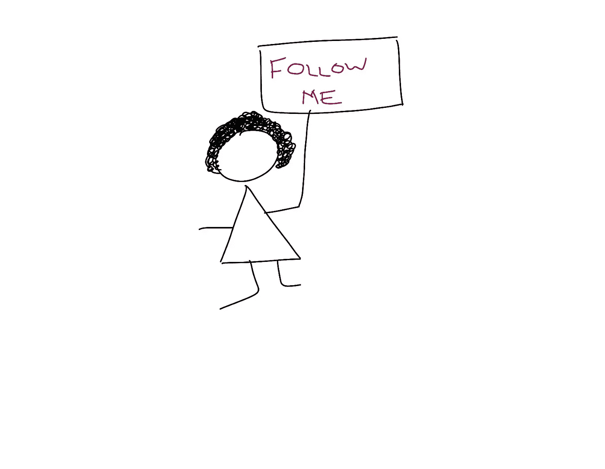
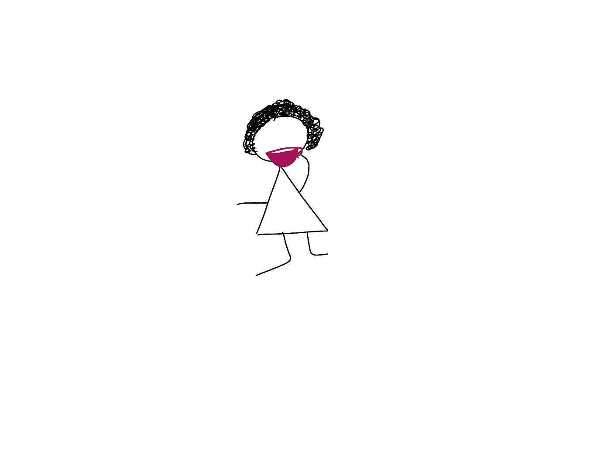
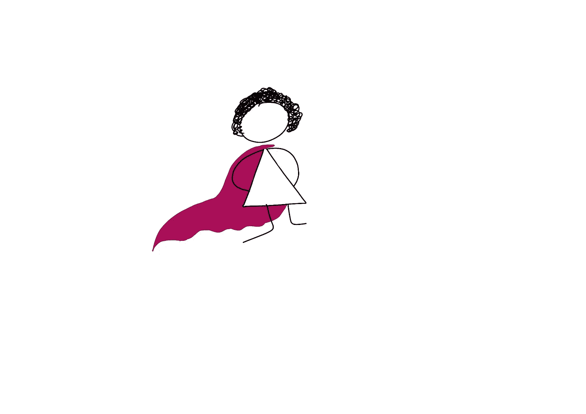
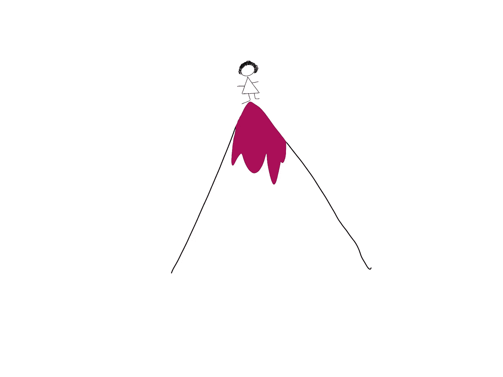
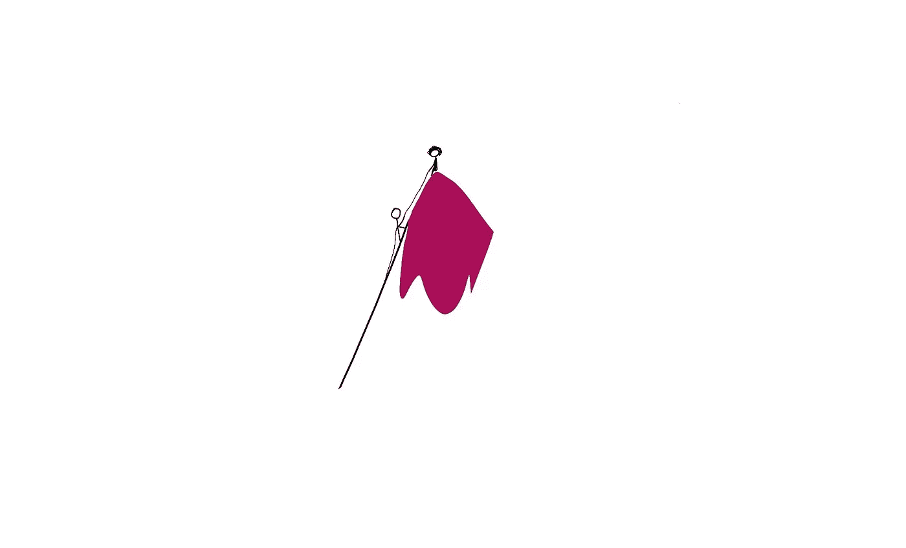
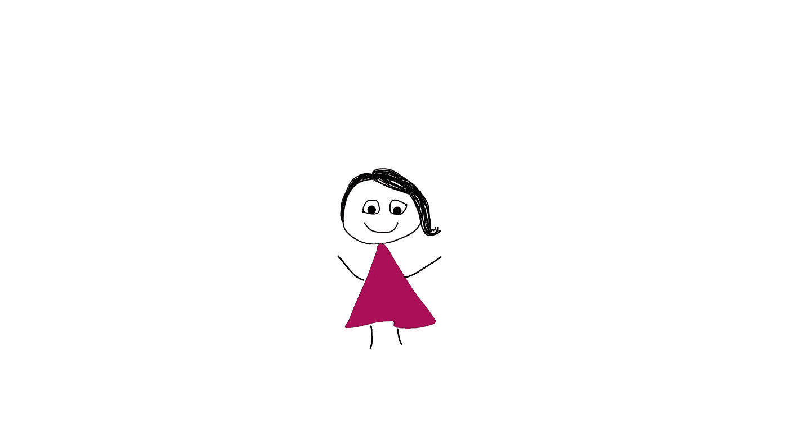

# 如果你不带头，别人会

> 原文：<https://betterprogramming.pub/if-you-dont-lead-others-will-b9e8e1ab3c8a>

## 成为你想在世界上看到的领袖

你准备好了吗？

大自然厌恶真空。亚里士多德的理论可能有例外，但当涉及到领导力时，它往往是正确的。有时候有人问我，为什么领导力对我很重要？为什么我一直想当领导？我的回答:因为如果我不做，别人也会做。然后我怎么才能做我想做的事情呢？所以，以下是我和你应该渴望成为领导者的一些原因。

# 力量

信徒们继续相信，嗯是的

是的，我渴望权力。但不是在统治世界的意义上。我想要能带来真正改变的力量。无论是小规模还是大规模。做出积极影响生活的决定的能力。我的团队中的人，我的顾客，以及他们家人的生活。掌控自己选择的权力。成为第一的力量。成为最后一名。犯下毁灭性的错误。和改变人生的胜利。按照自己的方式生活和工作并定义自己成功的权力。以及在每个工作周结束时用茶杯喝威士忌的权力。

# 富丽堂皇

没人能打倒我

我没有夸大妄想。我的生活丰富而充实。单以我的标准来看。以任何其他标准来看，我都是一个普通的有色人种女性，有一份体面的工作，一个小小的家，一个幸福的家庭。但对我来说，这是伟大的。比我想象的要大得多。但是我想要更多。不仅仅是为了我自己，也是为了每一个和我一样的人。我想让每个像我一样的人走进一个满是和他们一点也不像的人的房间时，都感觉自己很了不起。我希望人们根据他们的肤色来评判他们——但最终他们会胜出。我想让他们知道，这不仅是可能的，而且将成为常态。在这个世界上，我们不再需要谈论性别和种族平等，因为像我这样的人将不再为领导而战。

# 在上面

我要飞得更高(更高)，更高(更高)，更高(更高)

我喜欢在上面。把你肮脏的思想从阴沟里拿出来；我说的是生意上的。我不想觉得自己是某人的奴才。或者等着别人告诉我，我已经准备好成为一名领导者，因为我现在已经有了做一名仆人的 *x* 年经验。你真的需要有人告诉你你做得有多好吗？你不是已经知道了吗？那些你偷懒，没怎么做事的日子。这没什么不好，我们都有这样的日子。但你知道你并没有处于最佳状态。与你杀死它的那些日子相比。*是啊，你做到了！*看，你已经知道了。

所以不要再等着有人喊“集合喽啰！”开始成为你想成为的领导者。领导力不是爬上公司阶梯的顶端。远非如此。领导力是为你周围的人创造成长和幸福的机会。帮助他们看到自己最好的一面，迎接面临的挑战。如果你不再是一个跟班，你就可以每天都在上面。

# 力量

继续前进，直到你到达更高的地方

力量来自内心。等等等等。我能听到你翻白眼，“*是的，告诉我一些我不知道的事情*”我说的不是体力或脑力。我说的是感知。你认为你周围谁是强者？你的搭档？你妈妈？你的直线经理？你老板的老板？现在问问自己为什么？答案往往是他们面对困难时坚持不懈的毅力。或者他们可以接触到更重要或更有影响力的人，并大胆地利用这种影响力为自己谋利。或者 *x* 年的教育或经验使他们比其他人更加博学。

但这真的让他们与你如此不同吗？仅仅是对力量或重要性的感知，就能让你把他们视为领袖。这种感知打开了大门。我喜欢那种力量带来的东西。你也应该这样。如果你缺乏经验，那么要意识到在你无拘无束的头脑中有力量和力量——因为这让你不害怕风险——并且渴望证明自己。它能激发出你最好的一面。那么，你想成为领导者吗？然后培养对力量的感知。成为你敬仰的人。然后一些。

# 阴性的

领导力给了我女性化的能力。然后逍遥法外。如果我能以自己的方式做领导并取得成功，那么我说的就是事实。如果我说情感、同理心和脆弱造就一个好的领导者，那么人们会听。如果我能证明，我不需要效仿我的男性同行来成为一名领导者，那么也许，仅仅是也许，这个世界将开始透过我的玫瑰色眼镜来看待领导力。

也许所有让我变得女性化的东西都会成为核心领导技能，而不是需要掩盖和回避的东西。如果我能把做母亲作为职业生涯的加速器而不是挫折，那么也许这将鼓励其他人考虑家庭。我想拥有一切。我可以。你也可以。如果你和我都能成为世界需要的领导者就好了。

一个高，一个如何

从一个人到另一个人，感谢阅读。很情绪化。