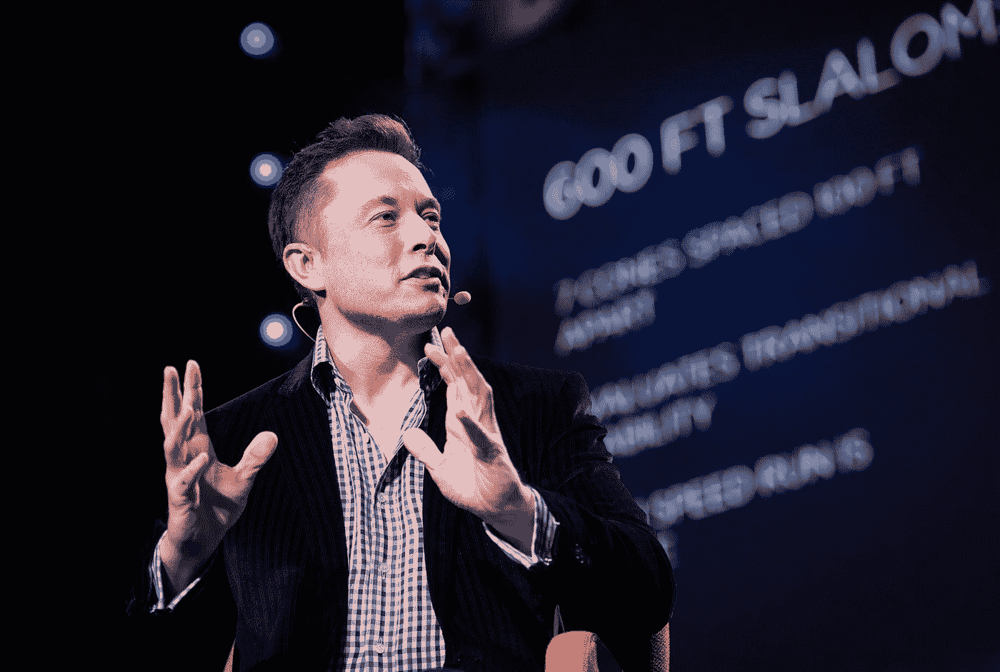

# 如果你找不到工作，你并不孤单

> 原文：<https://betterprogramming.pub/if-you-failed-to-get-a-job-you-are-not-alone-66c074b211ed>

## 行业巨头如何看待和处理失败

[埃隆·马斯克](https://thewhitonline.com/2020/11/opinion/lonsdorf-elon-musk-isnt-a-good-person-just-because-hes-rich-and-invents-stuff/)

当你被一份工作拒绝时，你会觉得自己很失败，是唯一一个没有意识到这一点的人，你注定要失败。

你打击了自己。

然而，如果你看看数据，你很难找到一个从未失败过，或者从未被拒绝过的人。

在这一类别中，我们包括那些目前也让我们惊讶于他们所做的工作的人。

# 埃隆·马斯克，贝宝创始人，特斯拉，Space X

埃隆·马斯克(Elon Musk)是这份名单上最受欢迎的人之一，因为他是最雄心勃勃、最努力工作的人之一，他的目标是让人类成为星际物种。

就像其他人一样，他一生中也面临过许多失败。

其中一个人在网景公司申请开发人员的工作时，没有得到任何回复。

显然，网景公司在埃隆的简历上没有看到任何计算机科学学位或经验，所以他们甚至没有给他机会。

他拥有沃顿商学院的经济学和物理学学位。

事实上，他确实想去他们的办公室，但太害羞了，不敢和那里的任何人说话。

以下是网景公司前副总裁[描述的情况:](https://www.quora.com/What-has-Elon-Musk-failed-at/answer/Jim-Hamerly-1)

> “他没能在网景公司找到工作，这真是传奇。我是那里的副总裁，他提交了一份简历，当没有人回应时，他选择进入我们的大厅，坐在那里，显然太害羞了，不敢和任何人说话。在我们每月招聘 50 名工程师的时候，招聘活动是不真实的，所以他很容易被忽视。”

# **GitHub 创始人克里斯·万斯特拉斯**

克里斯·万斯特拉斯

当你读到这里的时候，你可能根本不需要 GitHub 的介绍。

然而，你可能不知道它的创始人在雅虎找不到工作:

> “在联合创办 GitHub 之前，我申请了雅虎的一份工程工作，没有得到。不要让别人打击你。”

可以说，创办 GitHub 比在雅虎找份工作更好。

# WhatsApp 创始人布莱恩·阿克顿

如今，很多人都在使用 WhatsApp，但人们通常不会想到，它是由一个多年后被收购它的公司拒绝的人开发出来的。

脸书在 2009 年拒绝了布莱恩:

作者提供的截图

同年，他也被推特拒绝:

作者提供的截图

随后，他与搭档简·库姆合作，开发了 WhatsApp。

不到五年后，脸书以 190 亿美元收购了 WhatsApp。

对布莱恩来说还不错，对吧？

# Shopify 创始人 Tobias Lütke

[托拜厄斯·吕特克](https://commons.wikimedia.org/wiki/File:Tobias_L%C3%BCtke,_Shopify.jpg)

尽管托拜厄斯设法完成了雇佣程序，并即将签署合同，但由于工作许可证丢失，他无法开始[的工作](http://www.montrealintechnology.com/15-interesting-things-you-didnt-know-about-shopify-ceo-tobias-lutke/)。

一位律师建议他不能真的在加拿大开始工作，而是可以开自己的公司。

对于托比亚斯来说，没有工作许可证实际上是因祸得福，他根据自己对滑雪的爱好创建了一家企业。

由于当时很难用任何现有的工具来建立电子商务网站，他自己开发了这个网站。

这个网站如此与众不同，以至于有人向他询问:

“就是不一样。这不是正常的网格。它讲故事。托拜厄斯说:“这显然是现代和 web 2.0ey。所以人们说，‘我想在这个基础上建立我的业务。’”。

> “斯科特和我说，‘好吧，滑板还是软件？’很明显，我们应该选择软件。"

# 家酿啤酒的创始人，马克斯·豪厄尔

如果你使用 Mac 或 Linux，你可能会使用家酿或者至少已经听说过它。

对于那些以前没有机会了解家酿的人来说，这是一个免费的开源软件包管理系统，有助于在 macOS 和 Linux 上安装软件。

尽管为开源项目做贡献是展示技能的一个很好的方式，可以为你带来新的机会，但你仍然有可能在谷歌的[面试](https://twitter.com/mxcl/status/608682016205344768?lang=en)中失败:

> “谷歌:我们 90%的工程师都用你写的软件(家酿)，但你不能在白板上倒二叉树，所以去死吧。”——马克斯·豪厄尔在推特上说

被多次拒绝的人多了去了，但是他们没有停下来。

他们继续学习并利用其他机会。

以下是取自本[页面](https://rejected.us/)的几个例子:

> “作为一名记者和自学成才的程序员，在过去的 10 年里，我向我国的报纸和电视台提出了无数的技术创新项目，但都遭到了拒绝。三年前，56 岁的我在欧洲媒体上安排了第一个聊天机器人，并担任了 2 家初创公司(游戏和虚拟助手)的开发人员。1 年前，我被聘为人工智能程序员，为联络中心开发语音助手。”— **保罗·奎里多**

> “Atlassian 用‘你不知道你想要什么’拒绝了我。他们是对的。我建立了一个开发社区，一个国际会议，一个创业公司，交易密码，30 年后退休。”
> 
> — **Eduards Sizovs，DevTube 的创始人**

> “主要社交网络公司在一次面试后拒绝了我，‘我们认为你对 JS 了解不够。
> 
> —《你不知道的 JS》作者凯尔·辛普森

> “我被 10 次无薪实习拒之门外。现在我在推特工作。”—乔恩·库伯曼

> “因为对 JavaScript 了解不够，被 Atlassian 的初级职位拒之门外。不久之后，他们就开始使用我为他们的大部分 JavaScript 堆栈编写的 JavaScript 编译器。”—塞巴斯蒂安·麦肯齐

> “被麻省理工学院拒绝，接受了计算机科学博士项目。(我选择了伯克利读研究生。)在 2003 年、2006 年、2007 年被谷歌拒绝；2015 年受聘于谷歌。之前被脸书、推特和苹果拒绝过。”—蒂姆·谢瓦利埃

如你所见，并不是每个人都像电影和社交媒体给人的印象那样一夜成名。

微软并不是比尔·盖茨和保罗·艾伦创办的第一家公司。20 世纪 70 年代初，他们在 T4 还有另一家名为 Traf-O-Data 的公司，由于亏损，他们不得不关闭了这家公司。他们从那次经历中学到的经验在微软发挥了至关重要的作用。

1998 年，雅虎拒绝以 100 万美元收购谷歌。

在凭借《愤怒的小鸟》一夜成名之前，Rovio 开发了 51 款不成功的游戏。

正如视频游戏设计师威尔·莱特[所说](http://www.gamasutra.com/features/20050520/cifaldi_pfv.htm)，*“实际上，我更倾向于根据一个人经历了多少次失败来雇佣他。我认为这是最好的学习系统。”*

每个人在面试或其他任何事情上可能都不会有好的初始体验。

只要你不断的提高和学习，就没有所谓的失败。

作者提供的截图

> “在我的职业生涯中，我已经错过了 9000 多次投篮。我已经输了将近 300 场比赛。有 26 次我被委托去投制胜一球，但我都没投进。我一生中失败了一次又一次。这就是我成功的原因。”—迈克尔·乔丹