# 如果你想和量子计算赌一把…

> 原文：<https://betterprogramming.pub/if-you-want-to-gamble-with-quantum-computing-e327c11f97e5>

## …确保概率对你有利

*编者按:本文仅供娱乐、教育和参考之用。你采取的任何与这篇文章有关的可能与赌博有关的行动完全完全是你自己的。*

本帖是本书的一部分: [**用 Python 动手做量子机器学习**](https://www.pyqml.com/page?ref=medium_gamble&dest=/) **。**

你喜欢赌博吗？

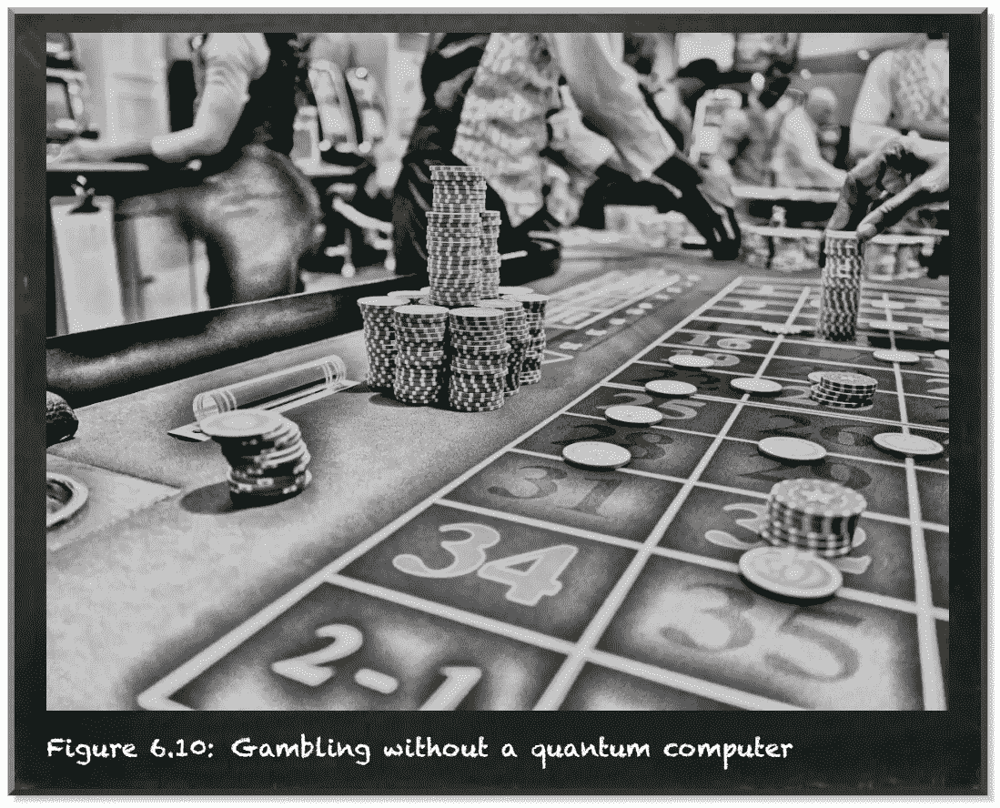

改编自[凯](https://unsplash.com/@kaysha?utm_source=unsplash&utm_medium=referral&utm_content=creditCopyText)于 [Unsplash](https://unsplash.com/s/photos/casino?utm_source=unsplash&utm_medium=referral&utm_content=creditCopyText)

如果是的话，量子计算适合你。

因为当你测量一个量子比特的时候，你观察到的东西取决于几率。除非你测量它，否则量子位处于|0⟩态和|1⟩.态的叠加状态但是一旦测出来，不是`0`就是`1`。如果你在相同的状态下测量一百个量子比特，你不会得到一百次相同的结果。你会得到一个`0`和`1`的列表。你得到的`0`和`1`的比例对应于量子位状态所需要的概率分布。

在[上一篇](https://towardsdatascience.com/quantumic-math-are-you-ready-for-the-red-pill-4860f0ad79bf)中，我们了解了哈达玛门。它允许我们将一个量子比特叠加。例如，如果你从|0⟩的一个量子位开始，应用哈达玛门会在|+⟩.产生一个量子位

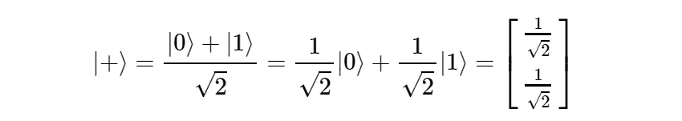

|0⟩和|1⟩两个州的结果概率幅度都是 1/sqrt(2)。它们的平方分别表示测量`0`和`1`的概率。两种概率都是 1/2。所以我们有一半的机会。

如果你要赌任何一种结果，都不会有什么好的建议。如果你玩的时间足够长，你会以相同的输赢数结束。公平的比赛。

但如果你是一个赌场，提供这样一个公平的游戏不会让你赚到任何钱。你需要增加获胜的机会。赌场就是这么做的。这就是“银行总是赢家”这句话的由来。例如，幸运之轮和流行的吃角子老虎机对玩家最不利。这些游戏有 10%或更多的房子优势。但即使是在 21 点这个最公平的游戏中，如果在最佳状态下玩，也有大约 1%的赌场优势。

假设当我们测量`1`时赌场赢了，当我们测量`0`时玩家赢了。作为赌场，我们想增加 10%的胜算，这样我们就有 60%的胜算。

我们已经知道一种方法。我们可以在量子位初始化时指定它的概率振幅。因为概率是概率幅度的平方，我们需要提供我们想要指定的概率的平方根(第 7 行)。

加权初始状态

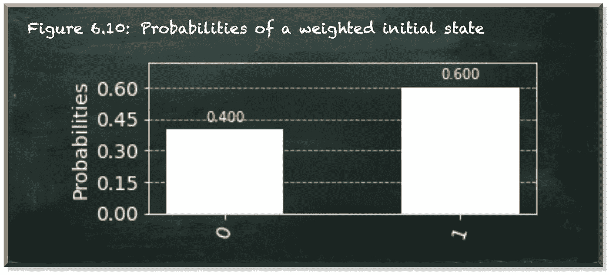

作者弗兰克·齐克特的图片

但是我们如何在初始化之外改变测量`0`或`1`的概率呢？

在[之前的文章](https://towardsdatascience.com/do-you-struggle-with-the-quantum-superposition-86d0f2147bfb)中，我们没有指定确切的概率，而是通过角度θ (theta)来控制概率。这是基态向量|0⟩和量子位态|ψ⟩.之间的角度θ控制向量头到系统顶部和底部的接近度(虚线)。这些接近度代表概率幅度，其平方分别是测量`0`或`1`的概率。α^2 表示测量|ψ⟩的概率为`0`。β^2 表示测量它的概率为`1`。

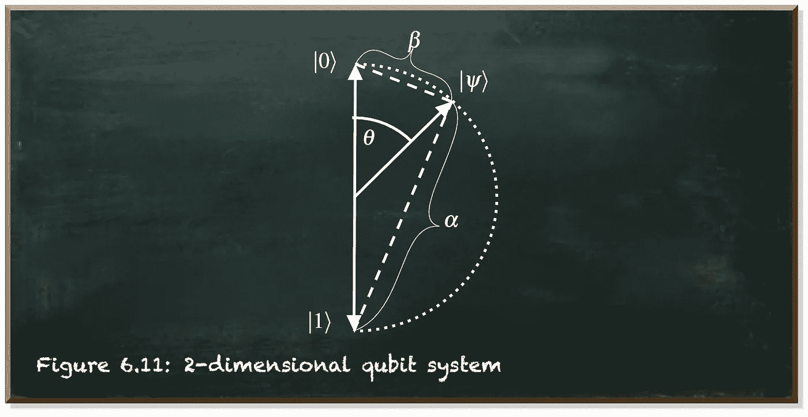

作者弗兰克·齐克特的图片

我们可以推导出α和β的值，从而推导出状态|ψ⟩:


在另一篇文章的[中，我们学习了如何使用矩阵来转换量子位的状态。我们用外行人的解释，|a⟩⟨b|把我们的量子比特从|b⟩态变成了|a⟩.态](https://towardsdatascience.com/quantumic-math-are-you-ready-for-the-red-pill-4860f0ad79bf)

那么我们为什么不用这个解释来旋转我们的量子比特态呢？θ是状态|0⟩和量子位状态向量|ψ⟩.之间的角度因此，将|0⟩旋转θ意味着将它变成|ψ⟩.ket-bra |ψ⟩⟨0|标志着我们转型的一部分。

下图中我们命名为|ψ′⟩的量子位状态描述了|1⟩状态旋转θ。ket-bra |ψ′⟩⟨1|标志着我们转型的第二部分。

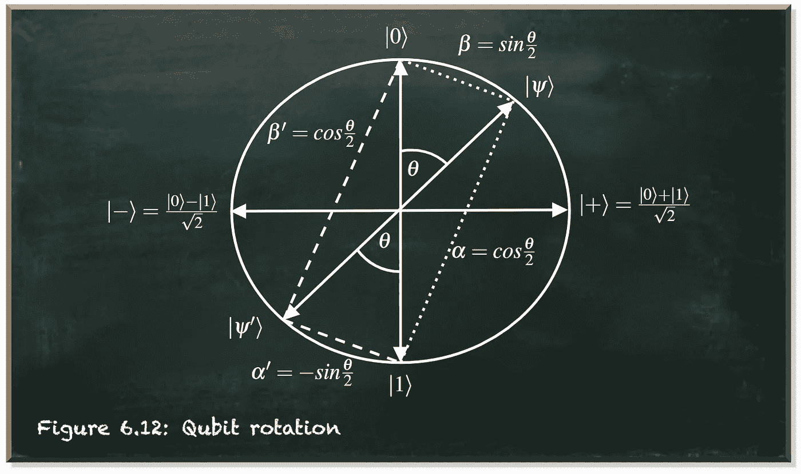

作者弗兰克·齐克特的图片

下面的等式描述了我们的量子位的旋转:

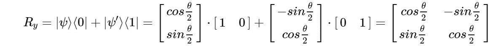

这个矩阵被称为旋转矩阵。这里唯一的量子细节是，我们取θ/2 的正弦和余弦，而不是θ。原因是我们用|0⟩和|1⟩在同一轴上相对的状态来表示量子位的特定方式。

```
Usually, the rotation matrix implies a counter-clockwise rotation because in a standard representation, increasing angles "open" counter-clockwise. But the qubit state vector "opens" clockwise starting from the state |0>. Therefore, the rotation matrix implies a clockwise rotation.
```

**另一个问题是，为什么公式中有一个 sin(θ/2)？**

当你看上图时，你可以看到量子位态|ψ′⟩在左手边结束。那一边的状态概率等于右边的状态概率(如果在垂直轴上镜像)。但是在[之前的文章](https://towardsdatascience.com/quantumic-math-are-you-ready-for-the-red-pill-4860f0ad79bf)中，我们也学到了可逆转换的重要性。所以我们显然需要区分顺时针旋转和逆时针旋转。因为我们需要区分我们是在|0⟩州(导致|+⟩)还是在|1⟩州(导致|−⟩).)应用了哈达玛门这是同样的理由。

**但是为什么我们给α’指定一个负值而不给β’指定一个负值呢？**

在量子力学中，我们通常将纵轴左侧的所有矢量解释为β为负值。虽然这是真的，但事实上没有办法区分这两种状态

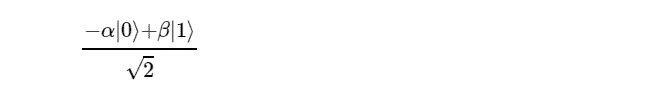

和

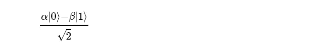

当我们在具有正交轴的经典二维向量空间中查看旋转矩阵时，我们可以看到，在负区域中的是α’的值，而不是β’的值。


作者弗兰克·齐克特的图片

如你所见，矢量|ψ′⟩在 x 轴的负区域结束。到 y 轴的距离为 sinθ。因此，上限值(代表 x 坐标)为负值。

通过对我们的量子系统使用相同的旋转矩阵，我们使用了一个许多数学家都熟悉的公式。

让我们来看看我们的转型行动。

旋转量子位状态

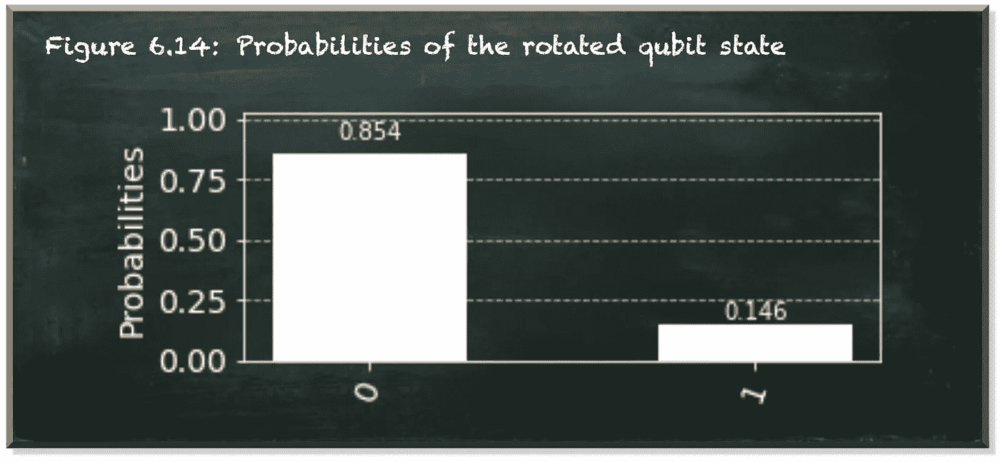

作者弗兰克·齐克特的图片

[Qiskit](https://qiskit.org/) `QuantumCircuit`对象提供了`ry`函数(第 13 行)。`ry`代表 Ry 门。因为它围绕量子系统的 y 轴旋转量子位，所以这个函数将角度θ(以弧度为单位)作为第一个参数。`2*pi`的值表示旋转了 360 度。它将量子位的位置作为第二个参数来应用门。

Ry 门很容易逆转。只需应用另一个以θ为参数的 RyRy 门。

我们一开始的目标是将赌场的胜算提高 10%。就角度θ而言，10%是多少？

θ表示基准国|0⟩和|ψ⟩.之间的角度从我们的量子态公式…


…我们可以看到，sin 的态|1⟩有一个概率振幅(θ/2)。因此，在|ψ⟩状态下测量量子位为`1`的概率是概率振幅的平方。


让我们解出角度θ的方程。


该公式显示了角度θ，该角度表示将|ψ⟩测量为`1`的概率。

下面的函数`prob_to_angle`用 Python 实现了这个等式。测量量子位为`1`需要一个概率，并返回对应的角度θ。

让我们使用这个函数将测量我们的量子位作为一个`1`的概率设置为 60%。

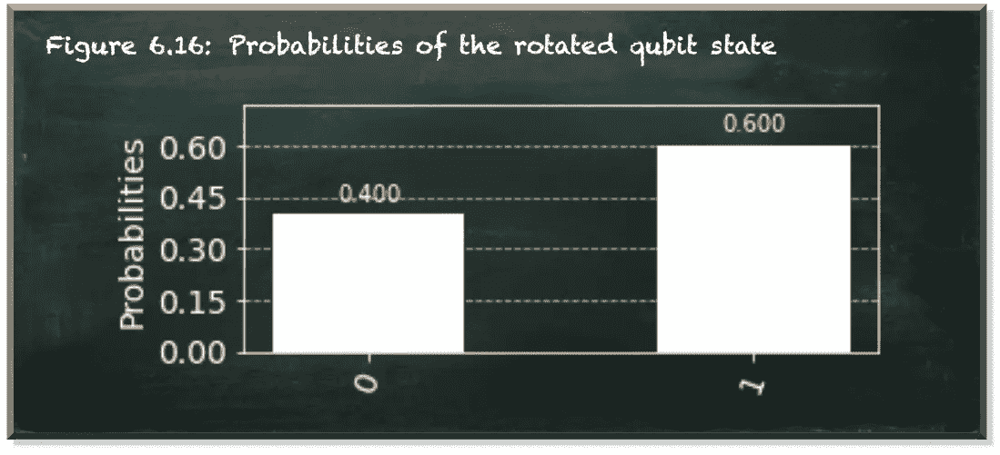

作者弗兰克·齐克特的图片

我们用|0⟩状态初始化我们的量子位(第 4 行)。我们对量子位应用 Ry gate，并将调用概率值为`0.6`的`prob_to_angle`的结果作为第一个参数传递(第 13 行)。代码的其余部分保持不变。

结果，我们看到有 60%的机会测量量子位作为值`1`。我们已经找到了一种有效的方法来控制分别测量`0`和`1`的概率。

让我们看看，如果我们对另一种状态的量子位应用 Ry 门，会发生什么

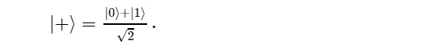

在下面的例子中，我们将量子位初始化为|+⟩.状态它有 50%的概率测量处于状态`0`或`1`的量子位(第 4 行)。我们把它旋转了我们从 10%的概率计算出来的角度(第 13 行)。

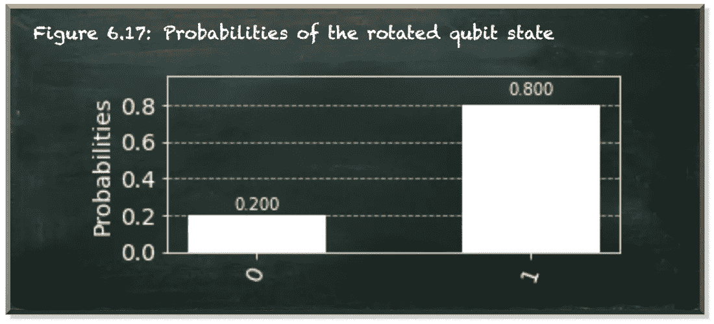

作者弗兰克·齐克特的图片

等等，这不对。我们有 80%的机会测量量子位作为一个`1`。但我们预计只有 60%。

问题是我们如何从它所代表的概率计算角度θ。θ是矢量|ψ⟩和基态矢量|0⟩.之间的角度但三角函数(如正弦和反正弦)的梯度不是常数。因此，一个角度表示从圆的顶部(州|0⟩)开始的概率是同一角度表示从水平轴(如州|+⟩.)开始的另一个概率

我们可以解决这个问题。我们计算总角度θ，它代表先验概率和我们希望量子位改变的概率之和`2*asin(sqrt(prob+prior))`。我们从中减去代表先前`-2*asin(sqrt(prior))`的角度。结果是代表量子位当前状态的概率变化的角度。

我们编写一个新函数`prob_to_angle_with_prior`(第 3-7 行)。这个函数将我们希望量子位改变的概率作为第一个参数。它将量子位的先验概率作为第二个参数。

当我们运行代码时，我们看到了预期的结果。

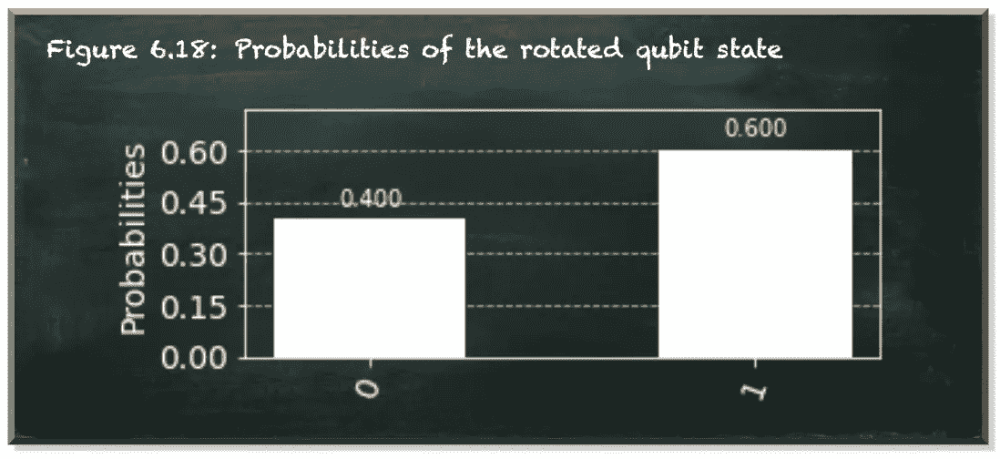

作者弗兰克·齐克特的图片

围绕 y 轴旋转量子位允许你通过角度θ控制测量`0`和`1`的概率。你可以用测量量子位的概率变化来表示θ为`1`(P1(ψ’))和测量的先验概率`1` (P1(ψ))


# 结论

这一次，这不是一种将概率推向某个方向的全面无忧无虑的方式。虽然你可以把角度θ推得越来越远，但它对最终概率的影响取决于你的量子位状态向量|ψ⟩.的方向如果矢量|ψ⟩指向 y 轴的右侧，将其旋转θ会增加测量`1`的概率。但是如果矢量|ψ⟩指向 y 轴的左侧，将其旋转θ会降低测量的概率`1`。

在量子计算中，你去哪里总是取决于你从哪里来。

对于第二个问题，从实用的角度来看，更重要的是，如果你想按一定的百分比改变测量概率，你需要知道先验概率。你需要知道量子位的状态。记住，测量量子位会将它压缩到`0`或`1`。测量有效地破坏了量子位叠加。但是如果不允许你测量量子位，你怎么能确定先验概率呢？

在本节使用的简单例子中，我们可以手动追踪量子位元的状态。但是对于任何有意义的量子电路来说，这就变得不可能了。事实上，量子电路相对于经典算法的全部优势都建立在量子位探索经典算法无法追踪的状态的能力之上。

为了超越量子位元状态的可追踪操控，我们需要一次处理多个量子位元。当我们组合量子位时，更复杂的转换成为可能。

本帖是本书的一部分: [**用 Python 动手做量子机器学习**](https://www.pyqml.com/page?ref=medium_gamble&dest=/) **。**

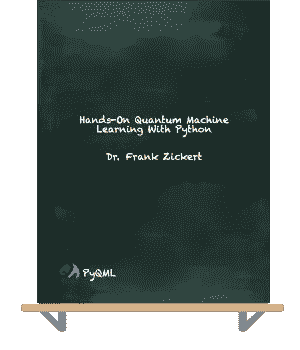

在这里免费获得前三章。