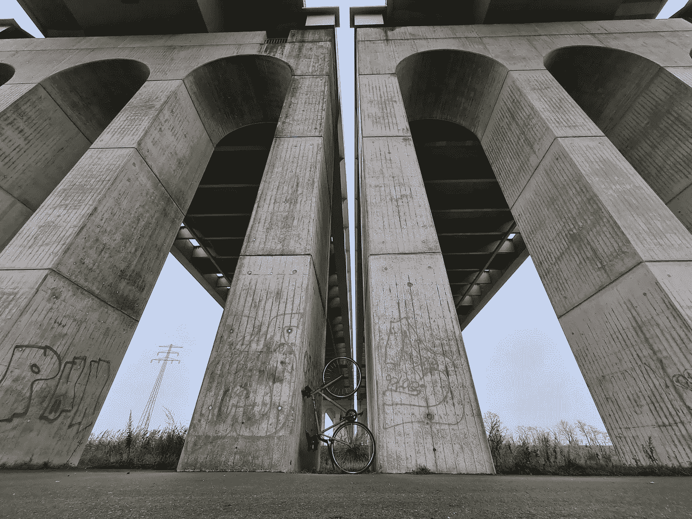
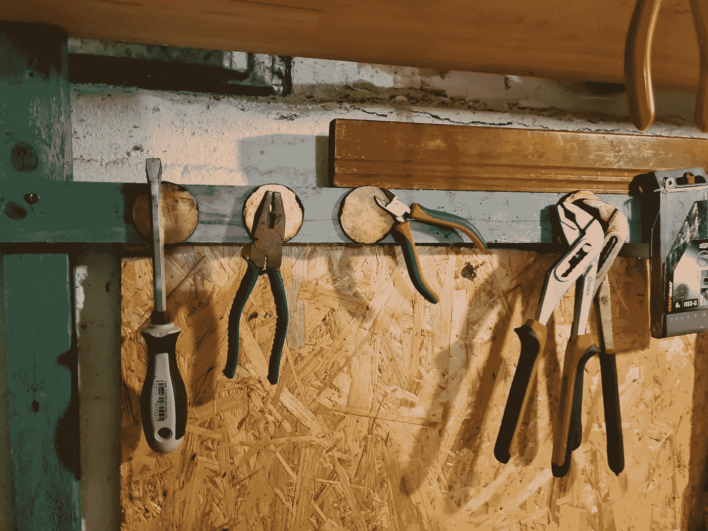
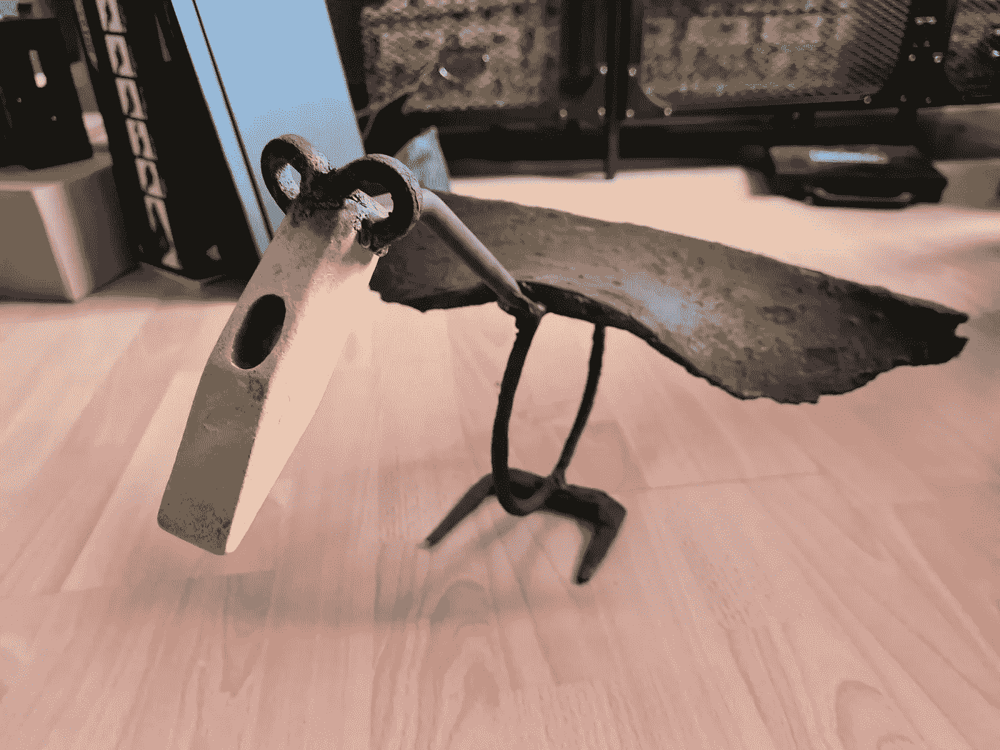
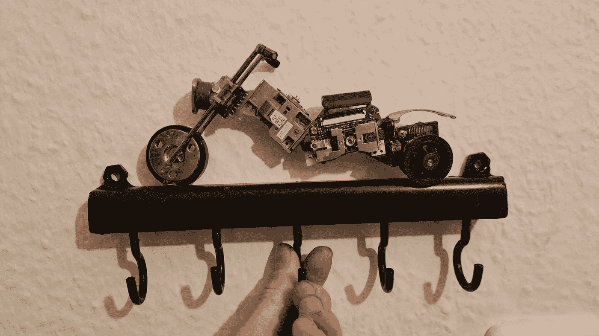
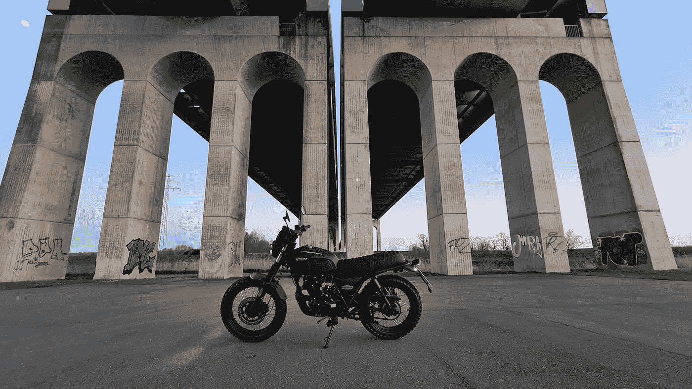

# 如果你是一名程序员，这些都是平衡工作和生活的好爱好

> 原文：<https://betterprogramming.pub/if-youre-a-programmer-these-are-great-hobbies-to-balance-work-and-life-5d12c168f113>

## 这可能是你需要完善的最重要的技能

我的老师曾经告诉我，我会死在桥下。作者照片。

众所周知，我们许多程序员在办公桌前花了很多时间——可能每天不止八个小时。玩游戏很有趣，但那是在做了八个小时同样的事情后，再坐六个小时盯着屏幕。从事自己的编码项目会给已经很长的一天增加额外的几个小时。

你很有可能把自己推进一个兔子洞，达到各种令人担忧的程度。在第一幕中，我确实花了一些时间在地窖里耕耘，我也对我的个人编码项目做了一些半夜的承诺。在某种程度上，您很高兴将提交和推入 VS 代码映射到热键，这样当您的手指在黑暗中工作时，您可以休息一下。当黑暗主题感觉太亮时，这可能是停止的好时机。

倦怠、厌倦和各种健康问题潜伏在旅程的远端——对工作的不满是可能的副作用之一。

这些年来，我做了不少让我保持理智的事情。今天，我想和你分享一份经过提炼的爱好清单，这些爱好可以创造奇迹，解放你的思想。

# 手工活

我一直喜欢建造东西，修理东西，摆弄电子产品、木材和金属。这些天，我用随机的金属碎片或用磁铁从河里捞出的东西来制作艺术碎片(顺便说一下，这是另一个很好的爱好)。

这就是我的地下工作室的样子，我所做的一切都是基于 YouTube 教育。使用工具可能会令人害怕，但也很有趣，而且几乎是沉思。有了它们，我创造了一些东西，比如这只从德国海岸飞到芝加哥酒吧的鸟:

这是托尔·哈默比克。

手工制作的伟大之处在于，作为一名程序员，你拥有挖掘这一点所需的所有技能。你可以看到工具和问题，这种方式允许你将它们分解成单独的组件——调试程序和找出二冲程发动机是否在 carb 中获得了过多的空气或不足的气体之间几乎没有区别。唯一的区别是，当您将事情缩小到 SQL 查询中缺少的分号时，一个会弄脏您的手，另一个会让您感到脏。

我绝对喜欢在 YouTube 上观看工具修复视频，在那里你可以放松，同时通过观看其他人以各种各样、通常是创造性的方式使用工具来学习。最后，我花了几年时间买了一整套工具，有些很贵，但价格仍然不到 1000 美元。

我给这整个工艺一个坚实的 5/7。

# 骑自行车、徒步旅行、游泳

总的来说，运动显然不是你一生中做过的最糟糕的事情，但我选择这三件事有一个特殊的原因:没有人阻止你去做。即使是你自己。几乎任何人都可以跳上自行车四处骑行(即使一开始很慢)，而我花了好几年才跑完一公里。随着你变得更强壮，任何人都可以徒步旅行，无论是一小时还是一天。游泳？很多乐趣和湖泊都是免费的。付费的地方通常很便宜。

这个小可爱和我在一起十年了，我害怕有一天我们不得不分开。

# 摄影

这曾经是一种人们不得不投入资金的爱好——在我们口袋里都有很棒的相机之前。不过，这只会让它变得更有趣，而且几乎任何值得拍摄的照片都会让你走出家门，进入现实世界。甚至厕所自拍在卡车停靠站的厕所里也更好看。

我在 Instagram 和一个名为 Gurushots 的网站上度过了一段美好时光，这个网站每天举办由用户投票的摄影比赛。太有趣了。

显然，在使用你的照片时，天空是极限。你可能最终会在这个名为 Medium 的小网站上写一篇文章，这样你就有借口去翻你电脑上的图片文件夹了。

# 艺术

听我说:我也根本不会画画。我的这种艺术将所有的艺术碎片与创新和升级结合在一起，但是如果你有能力买得起纸笔或者 iPad 和铅笔，你可以创造出值得一看的艺术。

一个网络漫画可能是一个伟大的创意出口，并可能支付一杯或两杯咖啡。你可能知道一个叫做 *XKCD* 的小漫画。其他人画风景。如果你使用 ProCreate，它有一个屏幕录制功能。你的 YouTube 频道就在那里。

有时候，我会给朋友做礼物，比如这个用旧电脑零件做的钥匙扣:

你也许可以称之为艺术。完成那件事后，我确实感到很有成就感。也很放松。非常放松。

就在前几天，我在 Instagram 上发现了[这个家伙，他把现实生活中的物体变成了小艺术品。](https://www.instagram.com/jesuso_ortiz/)

# 微型企业

我坚信，我们将会看到更多这样的公司出现，但是这种主要在周末运营的小公司并不是什么新鲜事。一旦那条大道重新开放，我会带着我的废艺术品去跳蚤市场，但我迄今为止见过的最酷的是在临界质量期间(巨大的自行车骑行，如果你不熟悉的话)，一个家伙有一辆载有一些咖啡罐和三明治的货运自行车，随着他的存货迅速售罄，速度越来越快。

如果不是因为这些文书工作，我完全可以给自己弄一个类似钢琴的东西，然后开一个小咖啡店。这听起来就像是我能处理的适量的社交活动。另外，我会成为自己最好的顾客。

这里的重点不是赚钱，而是赚足够的钱来支付你的成本，给你去那里的理由和动力。如果你最终做了足够的面团，请随意烘烤一些面包。

# 摩托车运动

你认识的人可能会骑摩托车。有可能你认识的某个人骑着他们的车撞到了一棵树上，希望他还活着来讲述这个故事。这是一个被许多人误解的爱好，可能不适合你。

那么，为什么它会出现在我的清单上呢？因为我非常喜欢。我喜欢探索，事实上你非常需要你的手一直放在车把上。抓住你的手机甚至不是一个选项。我喜欢我的自行车有多可爱，多便宜，我的小组有多有趣。我现在的社交圈 80%都是一群不同年龄段的不适应者，他们骑着小自行车四处闲逛，享受着愚蠢的快乐时光。

在德国，我们有一项新的法律，允许任何有汽车执照的人参加一些课程，并获得一个折扣很多的摩托车执照(700€，而不是> 2K€)。这只适用于 125 立方厘米及以下。这些自行车只是简单的乐趣——速度足够快，可以做任何你想做的事情，但又足够古怪，可以自动远离任何过于严肃的人。

我喜欢人们称他们的自行车为 Espresso racers 或 primascramblerinas 的精神。这正是我喜欢的幽默。这是我的自行车做自行车的事情的照片。

你能闻到夜晚的空气吗？

# 建议:如果你离开办公桌一两个小时，你会发现精神健康状况大大改善

在过去的八年里，我见过各种各样处于各种绝望和幻灭状态的办公桌前工作人员——有时是在浴室的镜子里。

坦率地说，我认为我的社交圈里没有一个人是技术人员，至少有点精神错乱、愤世嫉俗或幻想破灭。有些人只是学会了比其他人更好地处理他们的酒，或者设法在他们被消费掉之前及时控制他们的嗜好。

请注意:你可能会开始喜欢外面的世界。接下来，你会开始查看你的银行账户，好像如果你真的尽力而为的话，它可能刚好能为你一年的公路旅行提供资金。

# 我的其他文章

 [## 我主要从色情文学中学习编码

### 它教会了我很多有用的技术

levelup.gitconnected.com](https://levelup.gitconnected.com/i-learned-coding-mostly-from-porn-471da75ea763)  [## 编程面试的问题让我没有立即出局

### "和女人一起工作有什么问题吗？"

levelup.gitconnected.com](https://levelup.gitconnected.com/the-programming-interview-question-that-made-me-nope-out-immediately-e02e88d7864e)