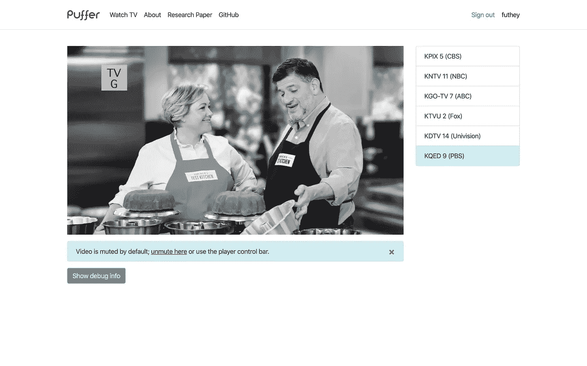
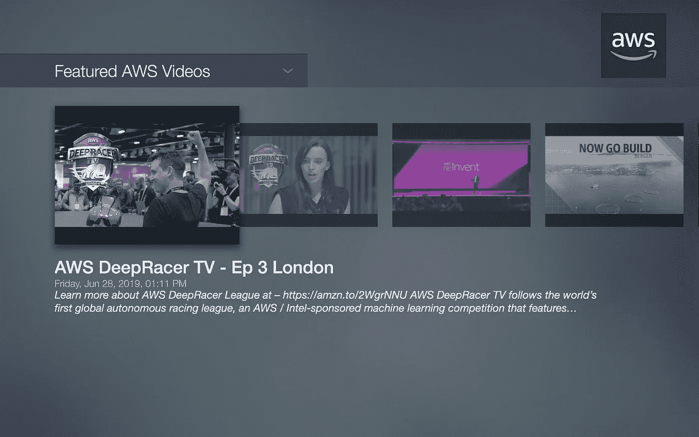
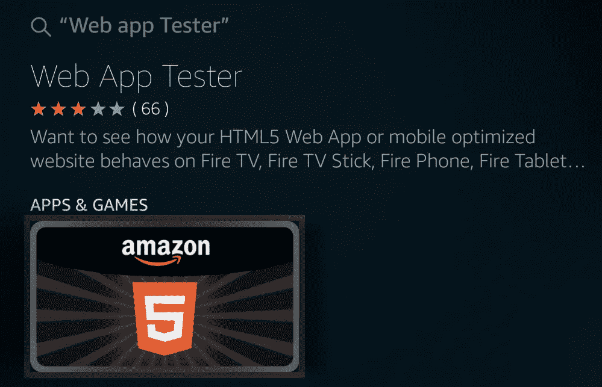
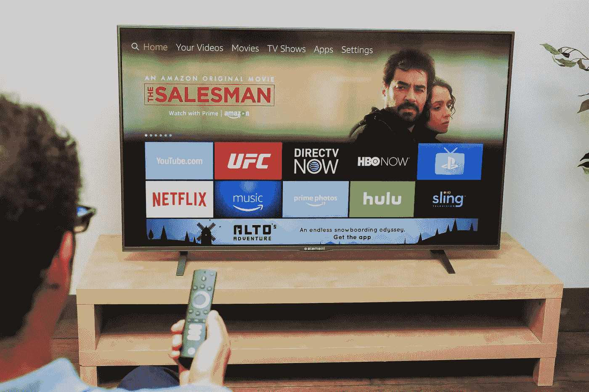
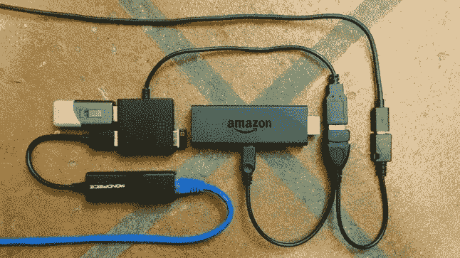
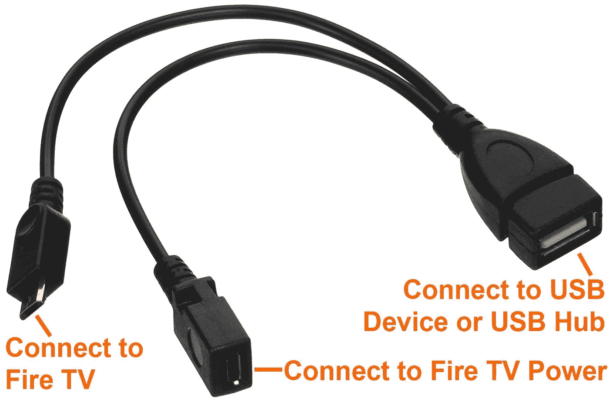
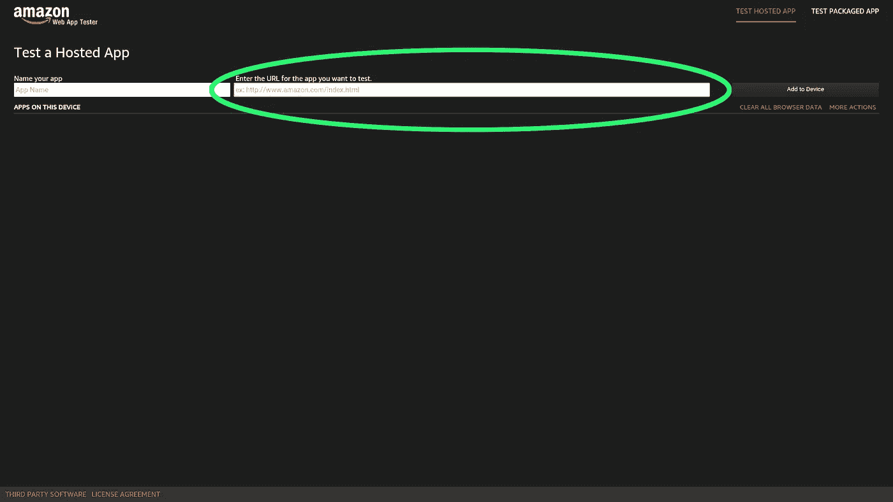
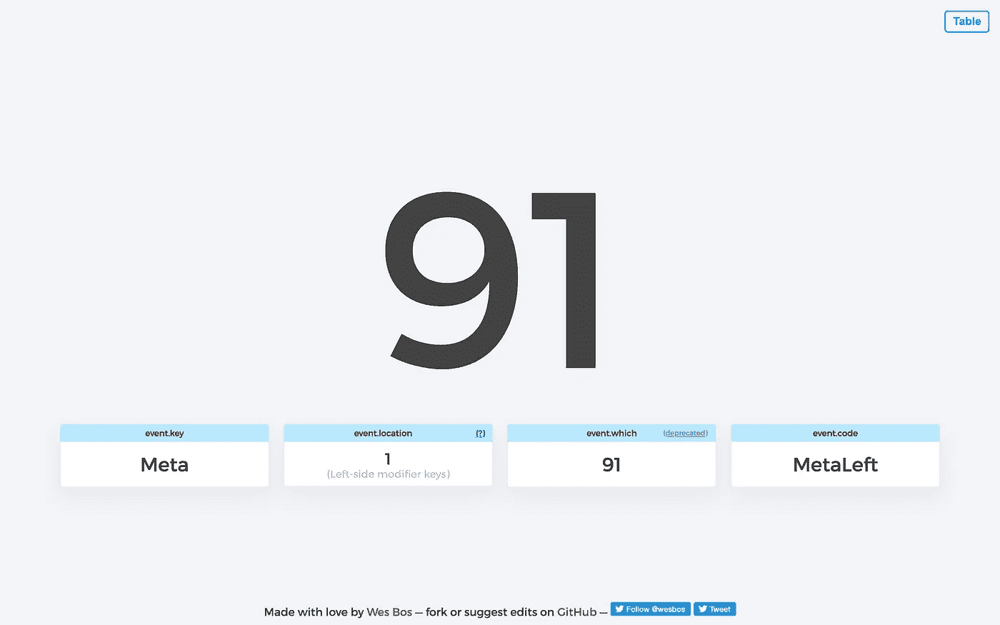
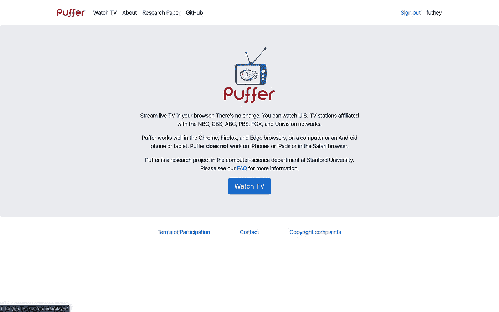
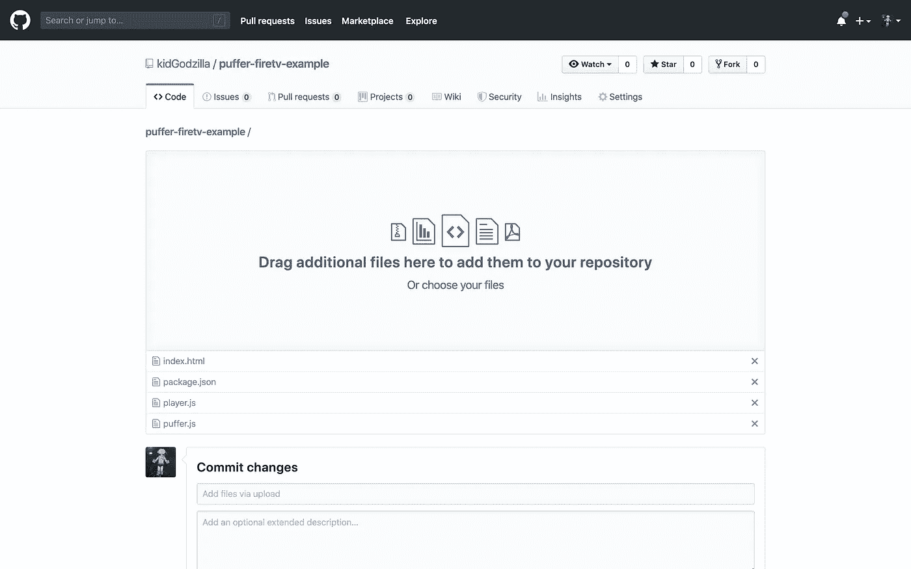

# 如何搭建一个火电视 App，比你想象的简单

> 原文：<https://betterprogramming.pub/if-youve-never-considered-building-a-fire-tv-app-before-do-it-it-s-stupid-how-easy-it-is-dd155e052c5e>

## 如果你能建一个网站，你就能建一个真正的火电视 app


格伦·卡斯滕斯-彼得斯在 [Unsplash](https://unsplash.com/search/photos/fire-tv?utm_source=unsplash&utm_medium=referral&utm_content=creditCopyText) 上拍摄的照片

**免责声明:**我与[亚马逊](https://www.amazon.com)没有正式关系，但我是一名开发人员，拥有为另一家主要内容提供商开发流媒体电视应用的经验。观点是我自己的。

没有多少人在开发电视流媒体应用。苹果电视(Apple TV)或安卓电视(Android TV)等平台通常没有太多开源项目。所以，你认为这些平台很难进入是正确的。

而且，作为一个在这个行业呆过一段时间的人，很明显这些设备可用的工具是针对业内人士的，而不是普通的开发人员。

但是如果我告诉你，任何人都可以使用 HTML5 **、** JavaScript **、**、 [jQuery](https://jquery.com/) 、**、**或其他简单的网络技术来创建一个简单的网页，那么最大的新兴互联电视生态系统之一将会怎样？

如果我告诉你，大多数 Fire TV 应用程序都是简单的网页，运行在经过修改的[Chromium](https://www.chromium.org)runtime**(你熟悉谷歌 Chrome，对吧？)?**

**亚马逊甚至为你提供工具，自动打包任何网页或静态 web 应用程序，以便在 Fire TV 上运行。**

**更好的是，Fire OS 本身只是 Android **、**的简化版，在亚马逊应用商店发布应用程序是免费的，你为 Fire TV 发布的应用程序也可以发布到其他 Fire OS 设备上，比如 Fire 平板电脑。**

**嗯，都是真的。**

**欢迎来到 CTV 西部的应用程序开发。**

# **近 4000 万用户，并且还在增长**

**当我说 Fire OS 平台增长很快时，我指的是*快*。**

**而且，由于亚马逊似乎打算在这一点上几乎放弃 Fire OS 硬件，他们的市场份额只会增加。**

**Fire OS 今年年初拥有 3000 万活跃用户，超过了 T2 的 Roku，成为流媒体硬件市场的老大。后来的报道称，在 Prime Day 之前，该设备在**T5 拥有 3400 万用户。****

**而且，在 Prime Day 活动期间，Fire TV Stick 受到了大力宣传，成为为期两天的 Prime 活动中最畅销的交易[。](https://bgr.com/2019/07/15/prime-day-2019-top-5-best-selling-deals-amazon-announcement/)**

**因此，毫不奇怪，研究小组，如[eMarketer](https://variety.com/2017/digital/news/roku-apple-tv-chromecast-amazon-fire-tv-market-share-2017-1202506850/) **，**预测，到 2021 年，消防电视将达到近 7000 万观众。**

**如果你正在寻找一个新项目，为什么不尝试构建一个智能电视流媒体应用程序呢？**

# **我们将要建造的**

## **应用 1:直播电视流媒体应用**

**难度等级:简单得离谱。**

****

**对于我们的第一个应用程序，我们将把斯坦福河豚直播电视流媒体应用程序“移植”到网络 Fire TV 上。**

**对于第一个应用程序，我们将利用最近推出的广播电视流媒体服务，这是斯坦福河豚项目的一部分。**

**它已经具备了我们构建一个工作的 Fire TV 应用程序所需的大部分功能，并展示了如何轻松地使用现有的 web 技术来创建丰富的联网电视应用程序。**

**我们正在构建的直播消防电视应用程序的最终版本。**

## **应用 2: YouTube 流媒体应用示例**

**难度等级:中等。**

****

**我们要讨论的第二个应用是 Youtube 播放器的例子**

**对于第二个应用程序，我们将看看 Fire TV 示例代码库，展示一个完美的连接电视应用程序的更多功能。**

# **获得合适的工具**

**至少，你需要一个 Fire 电视棒来开始这个教程。**

**也许你在黄金时段花 14.99 美元买了一个，还带了两个月的 HBO？如果不是，没关系。目前，我能找到的最好的交易是 44.99 美元的 4k 流媒体电视棒(亚马逊，美国)(T17)，这仍然是一个很好的交易。(别担心，那不是代销商链接。)**

## **1.亚马逊网络应用测试器**

**接下来，你需要从你的 Fire TV 设备上下载 [Amazon Web App Tester](https://developer.amazon.com/docs/fire-tv/webapp-app-tester.html) 。**

**您可以使用语音遥控器搜索“Web App Tester”来完成此操作。**

****

## **2.专业提示:连接 USB 键盘进行开发**

**记住，Fire OS 只是 Android。大多数 USB 设备都能正常工作(你需要做的就是把它们插上电源)。**

****

**我有一个 Fire TV(元素)，所以连接 USB 集线器很容易。但是，如果你使用 Fire 电视棒，你可能需要购买 USB OTG 电缆。**

****

**如何将 USB OTG 电缆与 Fire 电视棒配合使用的示例**

**这在易贝可能要花 3 美元，在亚马逊可能会稍微贵一点。**

**它连接在 Fire TV Stick 和电源线之间，露出一个 USB 端口，可以用来连接拇指驱动器、USB 键盘或 USB 集线器。**

****

# **了解您的输入设备**

**既然我们已经设置了 Web App Tester，让我们使用它来了解更多关于我们的输入设备的信息。**

****

**在你的 Fire TV 设备上，通过创建一个新的“应用程序”，输入 URL:[https://keycode.info/](https://keycode.info/)，然后按下*添加到设备*，进入 Web 应用程序测试器，前往[https://keycode.info/](https://keycode.info/)。**

**完成后，您将看到一个可以运行的应用程序列表，然后单击屏幕右侧的*测试*来启动应用程序。**

**这应该会出现在您的电视上:**

****

**[https://keycode.info/](https://keycode.info/)告诉你更多关于你在键盘上按键的信息。**

# **按遥控器上的键**

**你应该会遇到一个惊喜:你的基本导航控件与你在任何网络应用程序和键盘上使用的键码完全相同。**

**Fire TV 遥控器映射到普通的箭头键，Enter 表示确定，Escape 表示返回。**

**此外，焦点状态管理是为 HTML5 应用程序自动处理的，Chromium 浏览器遵循 web 历史/典型的后退按钮行为。**

**未处理的后退按钮相当于`history.back()`。**

**这个你不用想太多。只需构建一个体面的 web 应用程序，而不需要一大堆奇怪的绝对/固定定位工具，让 Fire OS 来完成繁重的工作(目前)。**

**我建议关注以下要点，忽略其他要点:**

```
Back Button: 27
OK Button: 13
Arrow Left: 37
Arrow Up: 38
Arrow Right: 39
Arrow Down: 40
Rewind: 227
Play/Pause: 179
Fast Forward: 228
```

**避免尝试过载语音遥控器按钮、设置/菜单按钮、主屏幕按钮、音量控制和特殊按钮(例如某些物理遥控器上的网飞和 HBO 按钮)。**

**不仅这些键在许多设备中缺失，过载这些键可能会让用户感到困惑。而且，虽然现在可能会阻止这些键的默认动作，但这可能会在未来的更新中中断，我已经看到了这种行为在不同版本之间的变化。**

# **组装我们的第一个应用程序**

**对于我们的第一个应用程序，我们将拼凑一个现有 web 应用程序的版本， [Puffer](http://puffer.stanford.edu) **，**作为概念验证，以了解更多关于 Fire TV 应用程序如何工作的信息。**

**有了这个，我们就可以在 Fire TV 上看几个免费的广播电视频道了。**

**该应用程序转播六个湾区频道(CBS、NBC、PBS、Univision、Fox 和 ABC)。**

**我们正在构建的直播消防电视应用程序的最终版本**

**你需要注册一个账户(简单，不需要电子邮件或验证)，并“同意在美国”，可能是出于法律目的。虽然你可能不一定真的在美国…**

## **第一步:登录河豚**

**首先，你需要登录 Puffer，进入播放器页面，并在你本地的 Chrome 浏览器中查看它的工作情况。**

****

# **在 GitHub 上派生我的回购(可选)**

**除了遵循下面的指导，你也可以直接[分叉我的回购](https://github.com/kidGodzilla/puffer-firetv-example)。**

**如果您跳过 DIY 指南中的以下步骤，请务必更新`index.html`底部的课程详细信息。**

# **DIY 指南/工作原理**

## **下载网页并运行本地开发服务器**

**您必须对现有页面进行一点点的重写才能开始。**

**最简单的开始方式是*查看本页的源代码*:**

```
view-source:[https://puffer.stanford.edu/player/](https://puffer.stanford.edu/player/)
```

**新建一个文件夹`puffer`，将该页面内容复制粘贴到一个新文件`index.html`。**

## **修复相对 URL，JavaScript**

**接下来，搜索并将所有以`/static/puffer/` 开头的相对网址替换为绝对网址，比如:[https://puffer . Stanford . edu/static/puffer/dist/js/jquery-3 . 3 . 1 . slim . min . js](https://puffer.stanford.edu/static/puffer/dist/js/jquery-3.3.1.slim.min.js)**

**接下来，您可以(可选地)删除所有的分析跟踪代码。**

**现在，您需要下载两个 JavaScript 文件到您的`puffer`目录。**

```
[https://puffer.stanford.edu/static/puffer/js/player.js](https://puffer.stanford.edu/static/puffer/js/player.js)
[https://puffer.stanford.edu/static/puffer/js/puffer.js](https://puffer.stanford.edu/static/puffer/js/player.js)
```

**你会注意到靠近`index.html` 末尾的那一行引用了`player.js`。将其修改为指向您的本地文件:**

```
<script src="player.js"></script>
```

## **修复 WebSockets**

**接下来，您需要修复 WebSockets，使它们指向 Puffer 服务器(不是您自己的)。**

**这是在`puffer.js` 的第`662`行(可以搜索`location.hostname`)**

**将`location.hostname`替换为:**

```
'puffer.stanford.edu'
```

**制造:**

```
const ws_host_port = **'puffer.stanford.edu'** + ':' + port;
```

# **在本地运行应用程序**

**我添加了一个`package.json`文件，如果你已经有了一个[节点](https://nodejs.org/)环境，那么你可以很容易地在你的机器上本地运行这个应用。**

**您可以使用以下命令来运行它:**

```
npm install && npm start
```

**这将在`[http://localhost:1111/](http://localhost:1111/)`上打开一个运行您的 web 应用程序的新服务器。**

**如果您已经设置了网络，您甚至可以使用 Web App Tester 直接在 Fire TV 设备中进行测试。**

# **用您自己的更新会话详细信息**

**如果您转到我的存储库，您需要在登录后从本页底部获取您的会话详细信息:**

```
view-source:[https://puffer.stanford.edu/player/](https://puffer.stanford.edu/player/)
```

**并且，用你自己的信息替换我的“假”信息:**

**看视频:**

**此代码位于`index.html`**底部附近，包含一些连接到流所需的会话细节，可能在一到两个小时后失效。****

****请记住:如果您开始收到错误，您将需要在您的主计算机上重新打开页面并更新此代码。****

# ****部署您的应用****

****部署你的应用进行测试的最简单的方法可能是 GitHub & GitHub Pages(免费)。****

********

****创建新的存储库之后，您可以通过拖放上传您的示例文件(不需要 Git 技能！).****

****你的 gh-pages 分支将在网上公开。****

****最快的方法是[分叉我的回购](https://github.com/kidGodzilla/puffer-firetv-example)并在`index.html`底部更新您的会话详细信息。****

****确保您正在使用当前会话详细信息编辑正确的分支！****

****完成后，您可以使用您的 gh-pages URL 和 Amazon Web App Tester 来实时查看您的应用。****

****您的最终 URL 将如下所示:****

****`[https://kidgodzilla.github.io/puffer-firetv-example/](https://kidgodzilla.github.io/puffer-firetv-example/)`****

****用户名是你自己的，不是我的。****

****它应该是这样的:****

****在遥控器上，您可以使用向上/向下键来更换频道，使用向左/向右键来调节音量。****

****对我来说，每次我换频道时视频都是静音的，换频道后我需要按右键取消静音。****

# ****高级:添加更多功能/更新样式****

## ****自动取消视频静音****

****如果您愿意，可以在您的`</body>`标签之前添加这个脚本标签，以自动取消视频静音:****

## ****更新/修复样式****

****我写了一小段 CSS，你可以用来“修复”应用的 CSS 样式，以简化 Fire TV 上的事情。****

****把这个放在你的`<head></head>` 标签里面(在最后，在`</head>`之前):****

# ****继续探索****

****如果你想继续探索使用 HTML5 技术开发 Fire TV 应用程序，我建议你看看 GitHub 上的亚马逊官方回购中的例子:****

****[](https://github.com/amzn/web-app-starter-kit-for-fire-tv) [## amzn/we B- app-fire-TV 入门套件

### Web 应用程序初学者工具包示例。通过在…上创建帐户，为 amzn/we B- app-starter-kit-for-fire-TV 开发做出贡献

github.com](https://github.com/amzn/web-app-starter-kit-for-fire-tv) 

## 现场示例/演示

 [## 适用于 Fire TV 的 Web 应用入门套件—示例

### 适用于 Fire TV 的 Web 应用入门套件—示例

Fire TV 的 Web 应用入门套件—示例 samzn.github.io](https://amzn.github.io/web-app-starter-kit-for-fire-tv/) 

玩得开心！我希望这能帮助您开始您的联网电视应用程序构建之旅。


【Meetingroom365.com】|[@ kidgdzilla](https://twitter.com/kidgdzilla)(推特)|[@ futhey](https://indiehackers.com/futhey)(indie hackers)|[@ kidgozilla](https://github.com/kidgodzilla)(GitHub)****