# 忽略专业人员——使用 Print()调试 Python 代码

> 原文：<https://betterprogramming.pub/ignore-the-professionals-debug-your-python-code-using-print-2579301edb2b>

## 只要能完成任务就行

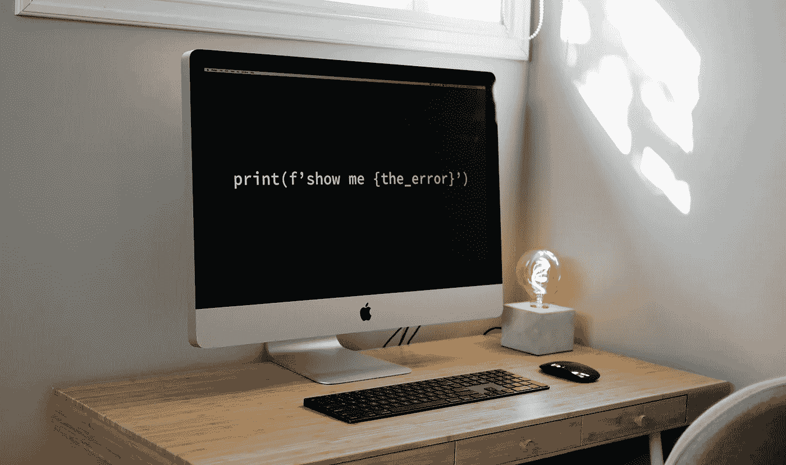

作者照片

当你告诉专业程序员你使用`print()`来查找错误时，他们会朝你扔椅子。作为初学者，使用完整的调试设置深入研究堆栈跟踪有什么意义吗？有些人说是的，因为你最好从一开始就学习它。我说，“只要能完成任务就行。”

我不是说你不应该学习阅读错误——那是不同的东西。当您自己动手或者希望为他人创建小代码片段时，您需要像专业人员一样进行调试吗？作为一个快乐的业余程序员，在你的整个程序员生涯中，你可能不需要“正确地”调试。

# 打印还是不打印

大多数代码在某种程度上都需要调试。幸运的是，有几种方法可以在不进入完全开发模式的情况下调试您的代码。

让我们先来看看 print 如何帮助您调试代码。

## 打印()

`print()`将为您提供您正在进行的工作的即时可视化表示。如果你知道你在寻找什么样的输出，你会在终端中看到它。如果是正确的，继续前进。如果没有，深入挖掘。

下面是一个使用`print()`的例子:

```
greek_gods = ['Zeus','Poseidon','Apollo','Bob']
greek_gods_only = [god for god in greek_gods if god!='Bob']
gods = ','.join(greek_gods_only)
```

你怎么知道你是否把鲍勃踢出了派对？

```
print(gods)
```

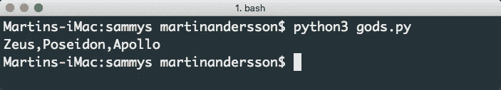

鲍勃已经离开了聚会

既然鲍勃已经离开了晚会，我们可以看看另一个现实生活中的例子。

我最近在 Autodesk Maya 中编写了一个处理相机的工具。在一个动画场景中，我需要列出所有拍摄的相机，并把 Maya 的默认相机排除在外。幸运的是，Maya 已经定义了默认摄像机(`startupCamera = True`)。这样很容易找到它们。

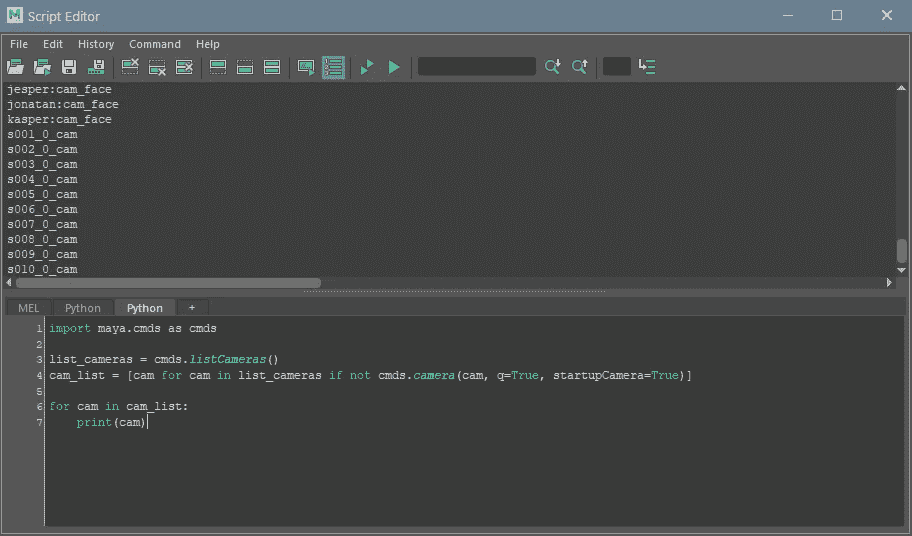

面部相机…

正如你所看到的，这里仍然有一些不需要的摄像头，一些参考文件中的前三个人脸摄像头。既然我已经亲眼看到了错误，我可以通过添加以下内容来消除它们:

`and ‘face’ not in cam`

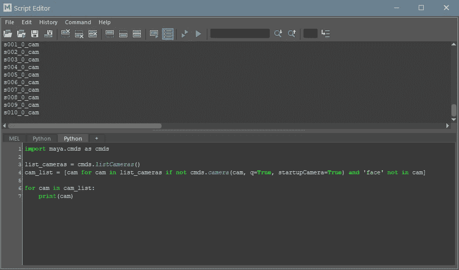

美丽的

如果不打印来检查输出是什么，我会通过管道发送代码。一封出错的邮件会被退回，我们会花一些时间去追踪它。这个错误并不明显，因为它是一个逻辑错误，而不是阻止代码运行的错误。

打印省钱！

# 调试备选方案

好吧，所以你想进一步探索你的选择。你喜欢印刷，但你意识到扩大你的视野和增加你的武器库总是好的。

让我们看看调试代码的其他方法。希望你能找到新的最爱(或者继续打印)

# Python 导师

[Python Tutor](http://www.pythontutor.com) 是一种简单直观的方法。该服务将允许您运行您的代码，并一步一步地返回您的代码所做的事情的可视化表示。

我们来看一个疯狂的高级函数。添加代码并单击 Visualize Execution。

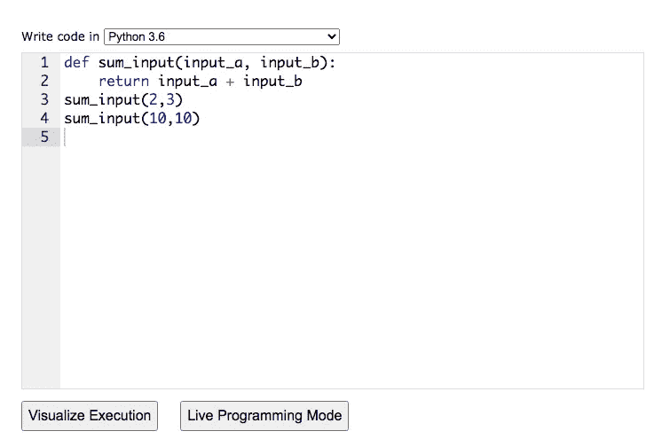

当您这样做时，您将能够一次一行地单步执行您的代码。代码在左边，输出在右边。

这里你可以看到这个程序的最后一步(第 9 步)。第 4 行`sum_input(10,10)`运行，您可以看到返回值和返回它的函数列在右边。


Python Tutor 是检查代码的一种快速而直观的方式。

# 维护

> 断言只是检查条件是否返回真的布尔表达式。如果为真，程序什么也不做，转到下一行代码。但是，如果它是 false，程序就会停止并抛出一个错误。— [编程](https://www.programiz.com/python-programming/assert-statement)

下面是一个使用`assert`的简单例子:

```
def sum_input(input_a, input_b):
    return input_a + input_bassert sum_input(2,3) == 5
assert sum_input(2,3) != 5
```

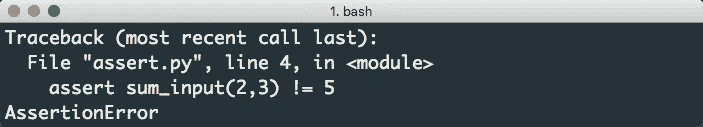

断言误差告诉我们 2+3 确实是 5

使用`assert`，你可以检查你的代码是否如你所愿。在上面的代码中，您期望代码返回 5；这就是为什么您使用这个返回`True`的代码。

`assert sum_input(2,3) == 5`

然后是这段代码:

`assert sum_input(2,3) != 5`

2 + 3 只能是 5，因此你预期会有一个错误(你得到了)。将代码更改为

或者除 5 之外的任何值，都不会出现错误。

既然是你挑起了这些错误，那么如果没有错误就很奇怪了，对吗？尝试以下方法清理代码:

```
def sum_input(input_a, input_b):
    return input_a + input_bassert sum_input(2,3) == 5
assert sum_input(2,3) != 6
```

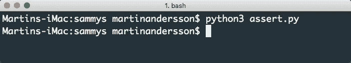

这个程序运行起来就像奥运会上的尤塞恩·博尔特

您可以创建自己的错误消息:

```
assert sum_input(2,3) != 5, '2+3 is 5...Stop this nonsense'
```

# 托尼

我最近被介绍给了 [Thonny](https://thonny.org/) 并立刻坠入爱河。Thonny 是一个简单的 IDE，它提供了内部调试器。这个调试器将向您显示代码中正在发生的一切。它提供了极好的简单性和出色的调试器。

让我们来看看这个代码示例。该程序检查与 Python 程序位于同一文件夹中的所有文件。然后它返回一个带有元组的列表:`(‘filename’, ‘extension’)`。

Thonny 会让你知道你的代码看起来是否正确。这里我们可以看到代码运行并返回结果:

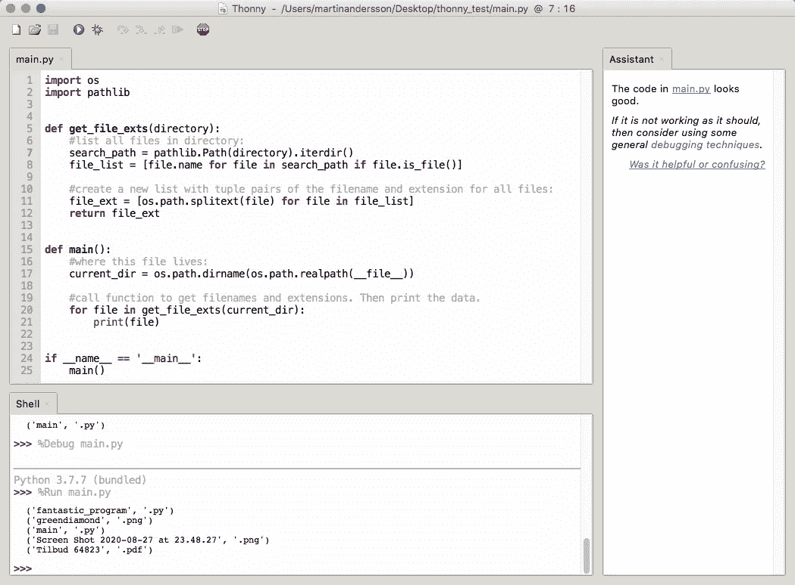

代码部分、外壳部分和辅助部分

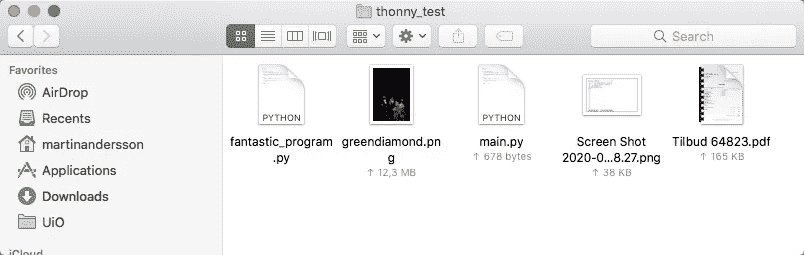

成功返回文件夹中的文件名和扩展名

如果我们故意添加一个错误，比如将`search_path`重命名为`searchc_path`，我们可以看到助手给出了一些惊人的反馈。

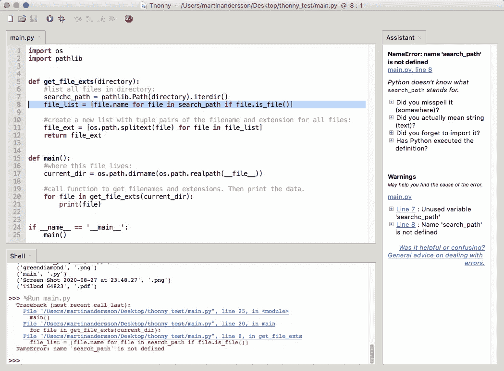

单击助手中的第 8 行链接会突出显示错误。

助手也给了我们几个提示，这样我们就更容易排除故障。如果我们展开“你(在某处)拼错了吗？”Thonny 向我们展示了相似的名字。错误在哪里是很明显的。

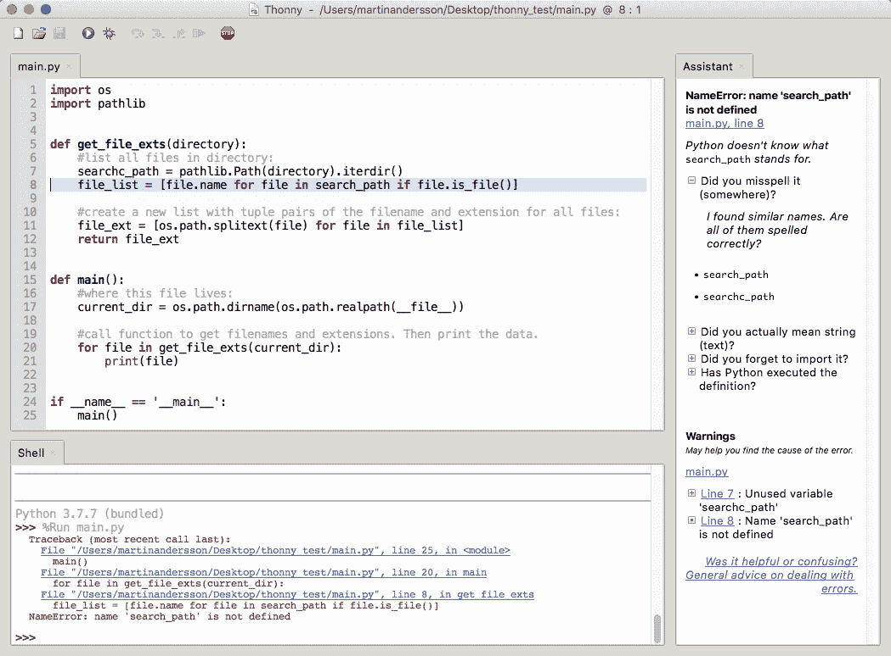

谢谢你，助理。现在我知道我的错误在哪里了。

如果进入调试模式，Thonny 会一步一步地检查代码，向您展示代码中发生的一切。


调试方式

它停在第 24 行，`if`语句。

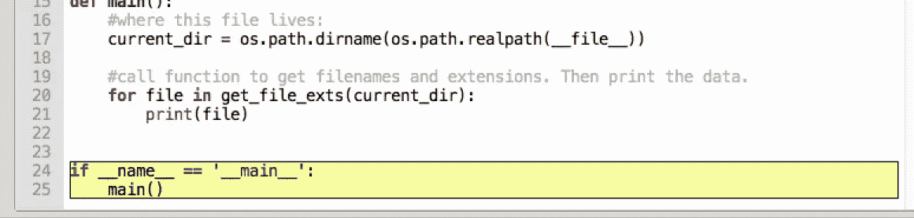

突出显示部分

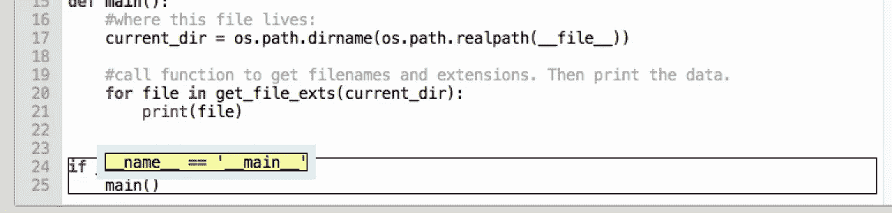

让我们知道 if 语句要求什么

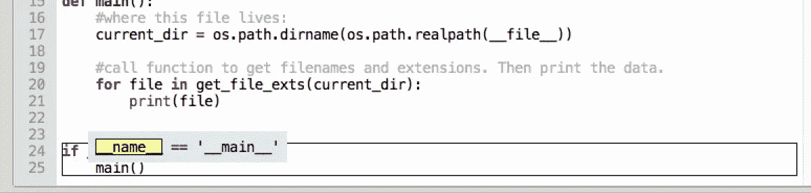

我们来看看`__name__`

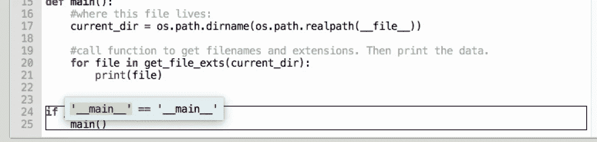

是' __main__ '吗？

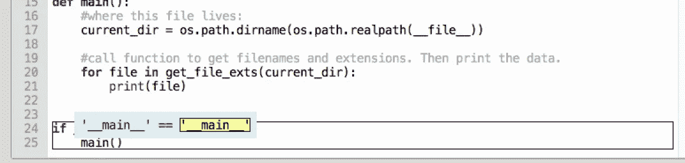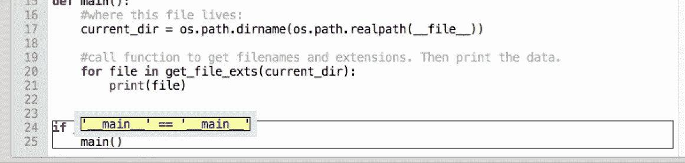

它们匹配吗？

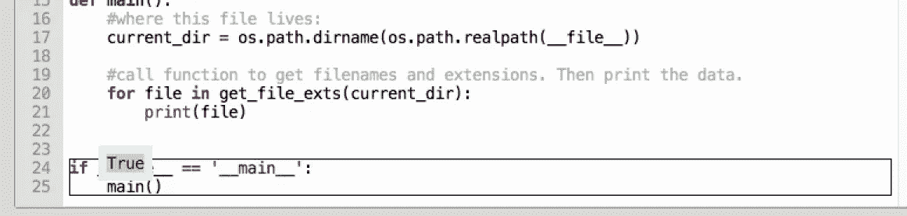

是的，他们有。运行 main()

# pdb——Python 的内置调试器

如果你更喜欢终端舞蹈，Python 附带了一个名为`pdb`的内置调试器。使用`pdb`的好处是你不会在你的代码中到处都是打印函数。您还可以检查函数、检查变量，并在不编辑源代码的情况下现场测试您的代码。这样你就不会因为需要测试几个案例而破坏你的代码。

简单地在你的代码中添加`breakpoint()`，让解释器知道你想在哪里进入调试模式。如果您没有使用较新版本的 Python (3。x)你得加上线`import pdb; pdb.set_trace()`。

要阅读更多关于`pdb`的内容，请阅读[文档](https://docs.python.org/3/library/pdb.html)。

[真正的 Python](https://realpython.com/lessons/python-debugging-pdb-overview/) 在调试器上也有很好的教程系列。

# 最后

打印不能代替正确的调试。这在有开发团队的工作场所中绝不有效，但是对于一个初学者来说，它可以很好地工作。我认为有比我们知道的更多的印刷人。它很快，你会知道预期的输出应该是什么。它能在几秒钟内给你视觉反馈。

如果您想看看调试代码的替代方法，请尝试一下。也许你会找到更适合你的新方法。

如果你希望继续印刷，我真诚地认为你应该这样做，只要你的主要开发者允许。