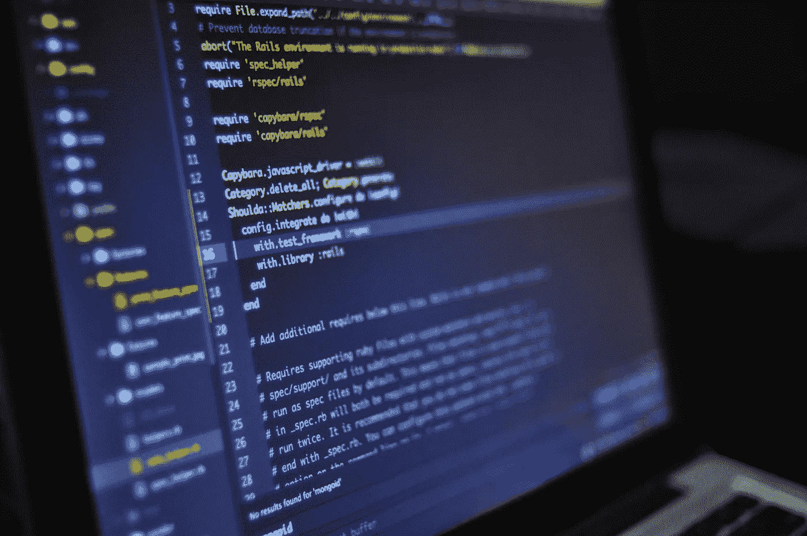

# 我是一名程序员，但我讨厌编程

> 原文：<https://betterprogramming.pub/im-a-programmer-but-i-hate-programming-20f5771c4888>

## 你怎么能讨厌你已经做了多年的事情呢？

照片由来自[佩克斯](https://www.pexels.com/photo/blur-close-up-code-computer-546819/?utm_content=attributionCopyText&utm_medium=referral&utm_source=pexels)的[路易斯·戈麦斯](https://www.pexels.com/@luis-gomes-166706?utm_content=attributionCopyText&utm_medium=referral&utm_source=pexels)拍摄

我激起你的好奇心了吗？也许你已经得出结论，你也不喜欢编程？如果大约五年前有人问我将来是否会讨厌编程，答案会是，*“那是不可能的！*”。

然而，今天我在这里，在一个编程被视为现代生活技能圣杯的社会里，说出这些近乎亵渎神明的话。具有讽刺意味的是，在这个议程中，编程被视为最赚钱的职业，这也助长了我对编程的厌恶。

# 爱变成了恨

当我开始攻读计算机科学硕士学位时，我开始对编程失去兴趣。很奇怪，不是吗？一个人怎么能对他们进入研究生领域所追求的主题失去兴趣呢？这个问题的答案是，你的环境在其中起了很大的作用。

本科生和研究生编程环境之间的鲜明对比还有很多需要改进的地方。本科生的环境是令人鼓舞和友好的。你被允许犯错误；你只是刚刚开始学习。如果你对什么都不了解，这是可以接受的，如果你在编程界不出名，这也没什么关系。生活是简单而伟大的。

来自[像素](https://www.pexels.com/photo/man-wearing-black-and-white-stripe-shirt-looking-at-white-printer-papers-on-the-wall-212286/?utm_content=attributionCopyText&utm_medium=referral&utm_source=pexels)的[启动股票照片](https://www.pexels.com/@startup-stock-photos?utm_content=attributionCopyText&utm_medium=referral&utm_source=pexels)

然而，研究生的环境，因为缺乏更好的词，是一场大规模的撒尿比赛。这不是一个你的编程技能可以简单地成长和繁荣的环境。这是一场斗狗。

这是一个你的代码需要高水平和完美的地方，几乎没有任何出错的空间。你争取最好的教授的注意。你全身心地投入到撰写最好的论文中，在会议上发表，为你所代表的大学赢得奖项。

你需要不断地为你的代码提出新的想法、新的研究和新的理论——否则，它甚至不会被看第二眼。如果你没有在至少两个 A+级别的计算机科学会议上发表你是第一作者的论文，你会被忽略。你不要在这种环境下为了对编程的热爱而编码；你编码是为了生存。

# 我们已经成为精英

我们看到有经验的程序员跳出来帮助新程序员解决他们难以理解的概念的日子已经一去不复返了。现在，如果你在编码方面需要帮助，你会得到模糊的答案，甚至是更模糊的代码片段，以及严厉的回答，“剩下的你自己去弄清楚。”

入门级的工作要求也增加了。如果你不知道如何做后端和网页设计，你甚至不能申请前端开发人员的工作。如果你甚至试图在没有任何证书的情况下申请，如 [CPP](https://cppinstitute.org/cpp-c-certified-professional-programmer) 、 [CLP](https://cppinstitute.org/clp-c-certified-professional-programmer) 或 [MCSD](https://www.microsoft.com/en-us/learning/mcsd-certification.aspx) ，你会被嘲笑。参加这些考试要花费 300 多美元，如果你负担不起，那你就不走运了。

编程不再适合初学者。如果你正在寻找一个编程的职业，你不仅要优秀，还要在这方面非常出色。你必须有足够的钱，这样你也可以做认证。否则，你将需要自由编程来赚取收入。

照片由 [Pexels](https://www.pexels.com/photo/two-women-looking-at-the-code-at-laptop-1181263/?utm_content=attributionCopyText&utm_medium=referral&utm_source=pexels) 的[克里斯蒂娜·莫里洛](https://www.pexels.com/@divinetechygirl?utm_content=attributionCopyText&utm_medium=referral&utm_source=pexels)拍摄

# 从现在开始的前进道路

我已经在编程上投入了太多的时间，现在不能放弃。它已经从激发我快乐的东西变质了。所有的快乐都被编程社区已经变得如此枯竭的事实吸走了。

我不再因为热爱而编码，而是因为需要而编码。

也许，只是也许，有一天，我会重新爱上编程。但是现在，我会说一百万次:“我是一名程序员，但是我讨厌编程”。对于有抱负的程序员，不要失去你的火花。学习编程是因为你想学，而不是因为别人让你学。拥有计算机科学学位并不会像你想象的那样打开许多大门，所以保持强大，为了乐趣而继续学习，如果利润随之而来，它就会随之而来。