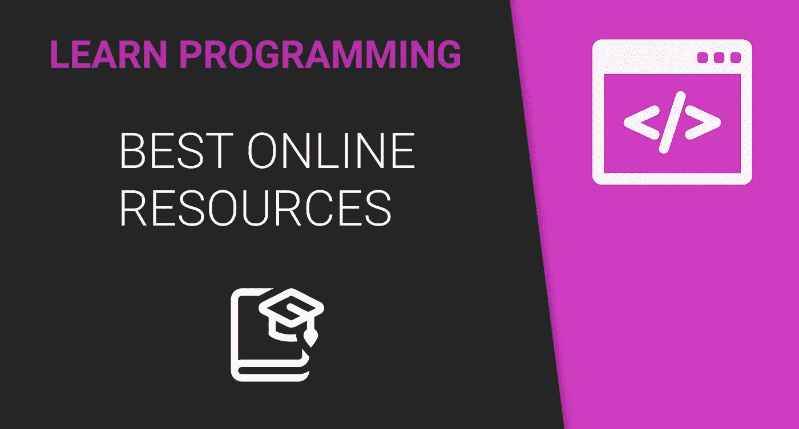
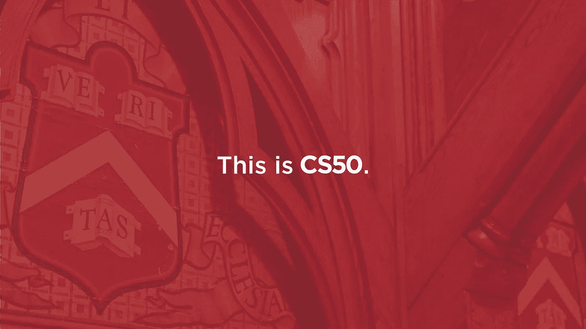
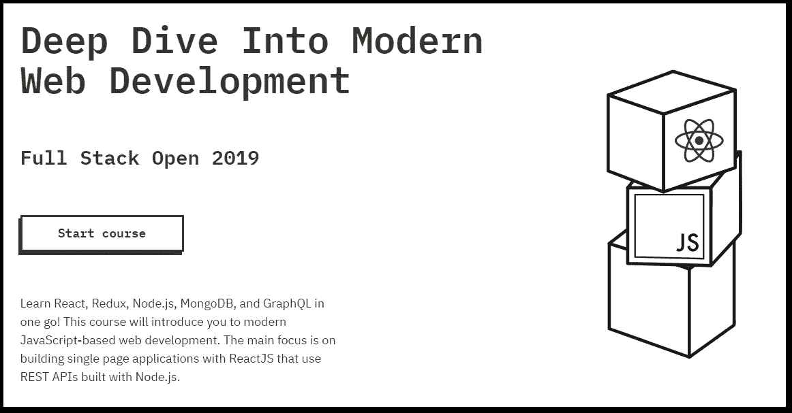

# 我是一名自学成才的开发人员，我利用这些免费资源找到了我的第一份工作

> 原文：<https://betterprogramming.pub/im-a-self-taught-developer-and-i-used-these-free-resources-to-land-my-first-job-5091b01293c4>

## 这些资源将帮助你成为一名开发者，而无需花费任何金钱

我是一个自学成才的开发者。经过多年的实践和在业余时间学习如何编码，我终于找到了我的第一份工作，成为一名开发人员。

这花费了大量的时间和精力，使用了许多不同的资源——但我设法做到了不花一分钱。

其他人现在也有和我一样的情况，这不是不可能的。不得不做一份标准的朝九晚五的工作，希望有一天能改变职业道路。

也许他们上不起学，或者辞去现在的工作去追求成为程序员的梦想。这需要很多时间，也不容易——但这篇文章将有希望让你相信，不花任何钱或辞职，这是完全可能的。

我收集了教我如何编码的最好的资源。我已经使用了它们，我全心全意地把它们推荐给任何想成为程序员的人。所以，事不宜迟——他们来了。

# 1.CS50 计算机科学导论

哈佛大学的 [*计算机科学导论*](https://www.edx.org/course/cs50s-introduction-to-computer-science) 可能是世界上最受欢迎的在线课程之一，注册人数超过 140 万。这是有充分理由的。

在我看来，如果你想成为一名开发人员，这门课程是必不可少的。它真正教授了计算机科学的基础——事情是如何在引擎盖下工作的——这将使你在编码时更容易理解你在做什么。

老师大卫·j·马兰很厉害。他真的很在乎他的功课，尽管每次课只有两个小时，但时间过得很快。本课程分为几个部分，侧重于不同的重要编程概念。

你将从 C 开始，到后来只使用 [Python](https://www.python.org/) (除非明年的版本有任何变化)。它们还涵盖了基本的 HTML、CSS 和 JavaScript。

CS50 是哈佛的一门为期 12 周的课程，所以节奏相当快，每周的问题集都很难。完成它们需要很多时间，我建议你真的花时间去学习你在做什么。

不要为此感到紧张。如果你需要帮助，社区也很有帮助。

# 2.用 Java 进行面向对象编程

哈佛不是唯一一所提供免费编程课程的大学。赫尔辛基大学可能在数量上提供更多，而且质量也非常好。

[*Java 面向对象编程*](https://moocfi.github.io/courses/2013/programming-part-1/) 是一个在线 MOOC，分为两个部分。与 CS50 不同，本课程是只读的，也就是说没有视频或讲座。你将通过阅读掌握这门课程。

你可能已经想到了，在这门课中你只会用到 Java。但是不要让这欺骗了你——即使你可能不想学习 Java，这门课程更多的是学习编程，而不是真正学习语法。

我向你保证，即使你再也不会接触 Java 你也会感谢我上了这门课。

本课程更侧重于面向对象编程的概念，这种概念在许多其他编程语言中都有使用。这也是一门非常好的入门课程——你会学到编程的所有基础知识，包括概念和语法。

这门课程(或者说这个列表上的任何一门课程)最大的好处就是你必须自己动手。边做边学。

每个概念都有一个编程练习，你必须通过它才能继续，这使你实际上写代码(而不仅仅是阅读)。在我看来，这是最好的学习方法。

我不能强调这门课程对我有多好——我真的向任何人推荐这门课程，不管你是否想使用 Java。

# 3.全栈打开

说到赫尔辛基大学，我们来谈谈他们出版的另一门课程。 [Full Stack Open](https://fullstackopen.com/en/) 是他们为想从事 web 开发的人开设的课程。

它是基于 JavaScript 的，涵盖了前端和后端。我可能会推荐先上另外两门课——这门课需要关于编程的基础知识，更侧重于框架。

全栈开放非常像 Java MOOC。它是只读的，所以你可以阅读整个课程。

您将涵盖各种各样的框架。您将学习 React、 [Node.js](https://nodejs.org/) 、 [Redux](https://redux.js.org/) 和 [MongoDB](https://www.mongodb.com/) 等等。基本上，成为一个网站开发者最重要的部分。

这门课在提交练习的方式上与 Java MOOC 并不完全一样。你将在项目中工作，而不是为每个新概念做一个新的练习。在一个部分的结尾，你将通过 GitHub 提交你的项目。

# 其他资源

这三门课是我选修的。一旦完成，他们中的每一个都会给你提供一个证书(尽管你必须为 CS50 付费)。

所有的课程都会让你独立思考并实际编写代码，而不是仅仅跟随视频教程中的某个人。

我也使用了许多其他资源，它们并不是真正的在线课程。我不会深入讨论这些，但我想我会提到它们，以防你也想使用它们。

## /r/learn 编程

在过去的几年里，我可能每天都去这个子网站。要么贴点什么，要么就是随便逛逛。所有的课程都是通过这种方式找到的，总的来说，人们非常乐于助人。

人们张贴一切——提示、教程、问题和建议。如果你真的想学习编程，我真的建议你试一试。

大多数语言也有自己的子编辑。例如，如果你想学习 Python，你可以访问 [/r/learnpython](https://www.reddit.com/r/learnpython/) 。

## 开发到

我发现这个[社区](https://dev.to/)很晚，但我很高兴我做到了。每天都有很多帖子、教程和讨论，大部分都是关于编程的。它涵盖了关于开发的所有内容，但主要侧重于 web 开发。

每个人都很友好，乐于助人，光是看评论就很开心。来自世界各地的程序员的许多积极的和有益的建议。

## SoloLearn

这个资源被包含在内主要是因为它是一个很棒的移动应用。他们的应用程序中有几乎任何语言的教程，这使得在旅途中学习变得很容易。

我不会仅仅依靠这个，但它肯定是对其他资源的一个很好的补充。

# 结论

所以，就这样了。我在网上上的三门(免费)课程，以及我用来学习编程的一些其他资源。

我希望它们对你有用，如果你设法通过了所有这些考试，我相信你将能够找到你的第一份工作。祝你好运！