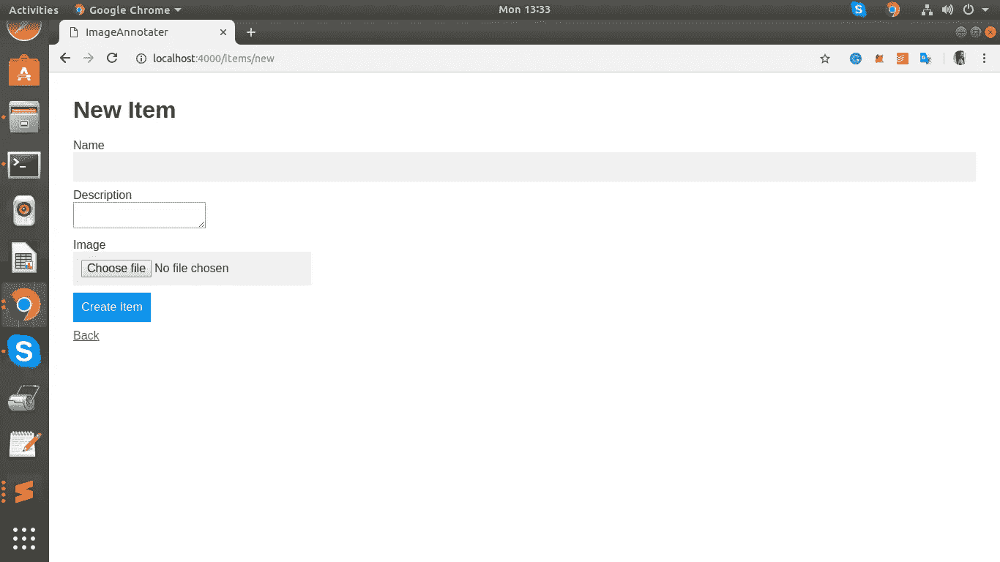
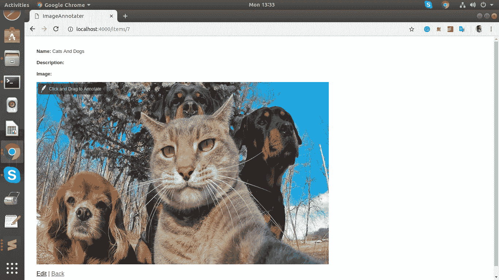
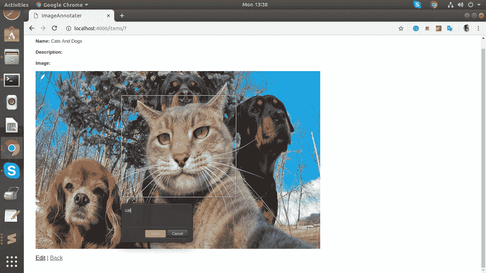
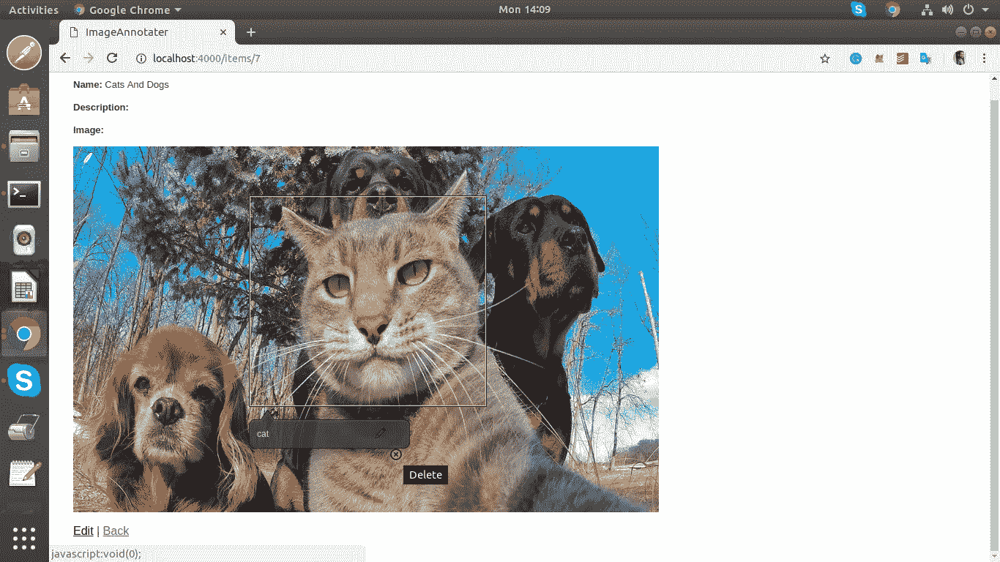
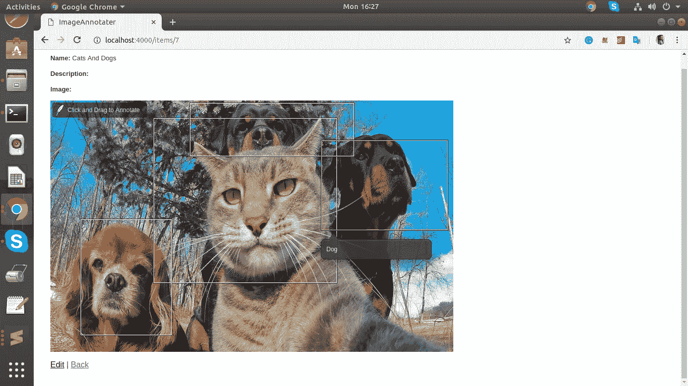

# Ruby on Rails 中使用注释库的图像注释应用程序

> 原文：<https://betterprogramming.pub/image-annotation-app-in-ruby-on-rails-using-annotorious-library-1fe4fc07fdb6>

## 构建一个应用程序，让您可以在给定的图像上标记和保存注释


礼貌:quora

图像注释是标记图像中各种对象的过程。图像注释的主要应用是生成数据，这些数据可用于训练机器学习算法。图像注释是一项主要手动完成的任务。图像标注工作现在是机器学习和人工智能不可避免的一部分，主要外包给印度和菲律宾等国家。在这一部分中，我们将构建一个图像注释应用程序，让您在给定的图像上标记和保存注释。

有很多库和工具可以让我们做图像注释，包括许多像 Labelbox 这样的定价选项，但对于这个应用程序，我们将使用一个名为 Annotorious 的免费库。

在开始开发图像注释部分之前，让我们快速看一下应用程序的后端。Annotorious 是一个 javascript 库，可以用于任何后端框架。因为我更喜欢 rails，我们将构建一个 rails 应用程序。让我们快速设置我们的应用程序和后端。

让我们创建一个新的应用程序。键入终端:

```
rails new image_annotater
```

我们的应用程序应该包含两个表，一个存储各种图像的项目表和一个存储注释的标签表。目标是在一个商品图像上创建多个标签。

在我们的项目，我们需要上传图像。为此，我们可以使用载波宝石。将以下几行添加到 GemFile 中:

```
gem ‘carrierwave’, ‘~> 0.11.2’
gem ‘mini_magick’, ‘~> 4.8’
```

我不打算讨论载波实现的细节。

让我们生成项目模型。

```
rails g model Item
```

另外，将下面一行添加到 routes.rb 中

```
resources :items
```

模型迁移必须具有以下字段:

*image _ annotater/db/migrate/20190123073338 _ create _ items . Rb*

```
class CreateItems < ActiveRecord::Migration[5.2]
 def change
   create_table :items do |t|
     t.string :name
     t.text :description
     t.string :image
     t.timestamps
   end
 end
end
```

现在让我们创建标签模型:

```
rails g model Label
```

另外，将此添加到路线中。rb:

```
resources :labels
```

这是这个应用程序中最重要的表格。由 Annotorious 创建的注释或矩形框的坐标必须保存在该模型中。因此，迁移应该如下所示:

```
class CreateLabels < ActiveRecord::Migration[5.2]
  def change
    create_table :labels do |t|
      t.string :text
      t.string :context
      t.decimal :x_value
      t.decimal :y_value
      t.decimal :width
      t.decimal :height
      t.references :item, index: true
      t.timestamps
    end
  end
end
```

我们可以看到，x 和 y 坐标，连同高度和宽度，连同文本一起被期望出现在注释中。上下文是图像的路径。我们还可以看到对一个项目的引用。这意味着一个项目或图像可以有多个标签。

项目模型必须如下所示:

/image _ annotater/app/models/item . Rb

```
class Item < ApplicationRecord
 mount_uploader :image, ImageUploader
 has_many :labels
end
```

标签模型必须是这样的:

*/image _ annotater/app/models/label . Rb*

```
class Label < ApplicationRecord
 belongs_to :item
end
```

items controller**T5 将是一个普通的 CRUD [控制器](https://github.com/amkurian/image_annotater/blob/master/app/controllers/items_controller.rb)。**

LabelsController 将是这样的:

```
class LabelsController < ApplicationController
  before_action :set_label, only: [:show, :edit, :update, :destroy] def index
    @labels = label.all
  end # GET /labels/1.json
  def show
  end def new
    @label = label.new
  end def edit
  end def create
    @label = Label.new(label_params)
    @label.save
    render(:json => {}, :status => :created)
  end def update
    respond_to do |format|
      if @label.update(label_params)
        render(:json => {}, :status => :updated)
      else
        render(:json => {}, :status => :not_created)
      end
    end
  end def destroy
    @label.destroy
    render(:json => {}, :status => :removed)
  endprivate

    def set_label
      @label = Label.find(params[:id])
    end def label_params
      params.require(:label).permit(:text, :context, :x_value, :y_value, :width, :height, :item_id)
    end
end
```

您可以看到我们的 LabelsController 具有创建、更新和删除新标签的选项。

我们的后端快完成了。让我们建立两个 ui。

第一个将是创建项目的表单。用户将能够上传图像，并从这个页面创建项目。



接下来将是一个显示页面来显示项目。此页面非常重要，因为注释(创建标签)将在此页面上完成。

```
<p>
  <strong>Name:</strong>
  <%= @item.name %>
</p><p>
  <strong>Description:</strong>
  <%= @item.description %>
</p><p>
  <strong>Image:</strong>
  <div>
  <%= image_tag(@item.image.url, size: "800x500")%>
  </div>
<%= hidden_field_tag **'**item_id**',** @item.id %></p>
```



# 不注释的实现

要在我们的应用程序上设置 Annotorious，首先，从[官方网站下载 Annotorious 的最新版本。](https://annotorious.github.io/getting-started.html)下载的 zip 中包含一个 annotor ous . min . js 文件，一个 CSS 文件夹，里面有 annotorious.css 文件。CSS 文件夹也将包含一些所需的图像文件。

如果我们在一个简单的 HTML 文件中添加注释，我们只需要在页面头添加以下几行:

```
<link type=”text/css” rel=”stylesheet” href=”css/annotorious.css” /><script type=”text/javascript” src=”annotorious.min.js”></script>
```

但是因为我们在一个 rails 应用程序上使用它，所以将文件分开，将 js 文件放在 app/assets/JavaScript 文件夹中，将 CSS 文件放在 app/assets/样式表中，将images 放在app/assets/images 中。

现在我们可以让我们的图像可注释。有两种方法可以做到这一点。注释性的 Javascript API 现在在我们的页面中可用，可以通过 anno 变量调用它

## 备选方案 1。可注释的 CSS 类

向图像标签添加一个可注释的 CSS 类。在页面加载时，Annotorious 会自动扫描您的页面，寻找带有这个类的图像，并使它们具有可注释性。

**示例:**

```

```

## 选项 2:使用 JavaScript

可注释的 Javascript API 可用于“手动”注释图像。

**示例:**

```
<script>
  function init() {
    anno.makeAnnotatable(document.getElementById('myImage'));
  }
</script>
...
<body onload="init();">
  
</body>
```

我们将使用*选项 2* 。

我们的图像位于 app/views/items/show.html.erb 中。请为其添加 id，以便我们可以唯一地识别它。

```
<%= image_tag(@item.image.url, size: "800x500", id: "annotatable")%>
```

现在在 JS 部分。添加一个函数，使 id 为' annotable '的图像可注释。

```
function init() {
   anno.makeAnnotatable(document.getElementById(‘annotatable’));
 }
```

当文档准备好时调用这个函数。

```
$( document ).ready(function() {
  init();
  function init() {
    anno.makeAnnotatable(document.getElementById('annotatable'));
    }
} 
```

现在，如果我们再次检查项目的显示页面并在图像上拖动鼠标，我们可以看到我们可以在图像上创建注释。



厉害！！

注释库为我们做了所有的工作，注释选项也完成了。但是还有两件事。

1.  从用户界面创建、更新和删除标签/注释的选项
2.  加载页面时显示项目图像上的所有标签。

创建、删除和更新标签可以由 Annotorious 提供的事件处理程序来处理。

其思想是当创建、编辑和删除注释等事件发生时，获取注释数据，并将其作为 AJAX 函数传递给 label controller**。**

下面所有的代码都必须写在我们的`init()` 函数里面。

## 创建标签

每当绘制一个注释并单击保存按钮时，我们可以在`anno` 变量上触发事件处理程序`onAnnotationCreated(annotation)` 。因此，在我们的例子中，我们可以将事件处理程序编写为:

```
anno.addHandler('onAnnotationCreated', function(annotation) {
     var text = annotation.text;
     var context = annotation.src;
     var x = annotation.shapes[0].geometry.x;
     var y = annotation.shapes[0].geometry.y;
     var width = annotation.shapes[0].geometry.width;
     var height = annotation.shapes[0].geometry.height;
     var id = $("#item_id").val();
     $.ajax({
         type: 'POST',
         url: "/labels/",
         data: {
           label :{
                 text:text,context:context,
                 x_value:x,y_value:y,width:width,
                 height:height,item_id:id
            } 
          },
       success: function(data) {}
     });
    });
```

我们可以看到如何从注释对象中提取坐标和文本，然后作为 AJAX 传递给`LabelController` **中的 Create 函数。**

## 显示所有标签

在进行更新和删除之前，我们可以使用这个选项来显示页面加载中的所有注释或标签。为此，我们需要向`ItemsController` 添加一个新函数来获取一个项目的所有标签。

```
#app/controllers/items_controller.rb
def get_labels
  labels = Item.find(params[:id]).labels
  render json: labels
end
```

在 JS 部分，我们需要调用 annotorious 的`CreateAnnotation`方法来重画所有保存的标签。可以这样做:

```
$.ajax({
        type: "POST",
        dataType: "json",
        url: "/items/get_labels",
        data: {
         id: 6
        },
        success: function(data){
         $.each(data, function() {
          var myAnnotation = {}
          $.each(this, function(k, v) {
          if(k == 'text'){
            myAnnotation["text"] = v;
          }
          if(k == 'id'){
           myAnnotation["id"] = v;
          }
          if(k == 'context'){
           myAnnotation["src"] = v;
          }
          if(k == 'x_value'){
           myAnnotation['x_value'] = v;
          }
          if(k == 'y_value'){
           myAnnotation['y_value'] = v;
          }
          if(k == 'height'){
           myAnnotation['height'] = v;
          }
          if(k == 'width'){
           myAnnotation['width'] = v;
          }
         });
         var annotation = create_annotation(myAnnotation);
         anno.addAnnotation(annotation)
        });
        }
    });create_annotation = function(myAnnotation_hash){
     var myAnnotation = {
      src : myAnnotation_hash["src"],
      text : myAnnotation_hash["text"],
      shapes : [{
          type : 'rect',
          geometry : {
            x : parseFloat(myAnnotation_hash["x_value"]),
            y: parseFloat(myAnnotation_hash["y_value"]),
            width : parseFloat(myAnnotation_hash["width"]), 
            height: parseFloat(myAnnotation_hash["height"]),
            label_id: myAnnotation_hash["id"] }
      }]
  }
     return myAnnotation;
    } 
  }
  });
```

注意，我们从数据库中创建了一个注释数据散列，并使用该散列来创建注释。另外，你可以看到，我还将标签的主键添加到注释的几何图形中，作为`label_id` **。**创建的注释作为`anno.addAnnotation(annotation)`添加到 anno 对象。

## 更新标签

要更新现有标签中的文本，请单击注释上的铅笔图标。将提示添加新文本的选项:


当我们点击编辑选项时，事件处理程序`onAnnotationUpdated(annotation)` 被触发。我们可以用这个来更新标签。

```
anno.addHandler('onAnnotationUpdated', function(annotation) { var label_id = annotation.shapes[0].geometry["label_id"];if(label_id == "" || label_id != null){
   var text = annotation.text;
   var context = annotation.src;
   var x = annotation.shapes[0].geometry.x;
   var y = annotation.shapes[0].geometry.y;
   var width = annotation.shapes[0].geometry.width;
   var height = annotation.shapes[0].geometry.height
   var item_id = $("#item_id").val();
   $.ajax({
       type: 'PUT',
       url: "/labels/"+label_id,
       data: {
        label :{
           text:text,
           context:context,
           x_value:x,
           y_value:y,
           width:width,
           height:height,
           item_id: item_id } 
       },
       success: function(data) {}
     });
     }
  });
```

## 移除标签

要删除已保存的注释，请单击注释上的 X 标记。它会触发`anno.onAnnotationRemoved` 回调**。**



```
anno.addHandler('onAnnotationRemoved', function(annotation) { var label_id = annotation.shapes[0].geometry["label_id"]; if(label_id == "" || label_id != null){
   $.ajax({
       type: 'DELETE',
       url: "/labels/"+label_id,
       data: {
       },
       success: function(data) {}
     });
     }
  });
```

就是这样。



我们现在可以创建、更新和删除标签，并在页面重新加载时检索它们。当前实现的一个缺点是，要删除或编辑已创建的标签，我们现在必须重新加载页面，因为创建是通过 AJAX 进行的。

还有许多其他的事件处理程序和函数可用在注释本中不讨论。查看他们的官方文件。

此外，许多插件在 Annotorious 中可用，[也来看看吧。创建插件是如此简单——我甚至创建了一个插件](https://annotorious.github.io/plugins.html)[来添加一个下拉菜单到注释文本字段。](https://github.com/amkurian/annotorious-autocomplete-dropdown-plugin)

我希望这有所帮助！

代号:[https://github.com/amkurian/image_annotater](https://github.com/amkurian/image_annotater)