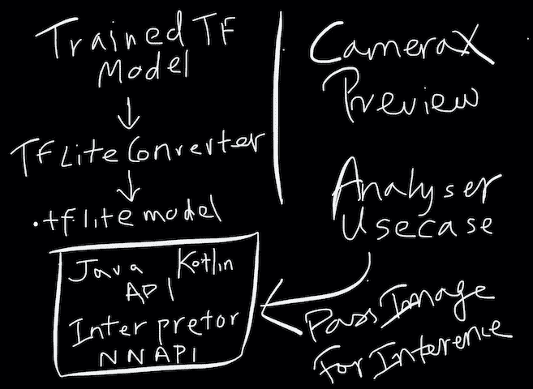
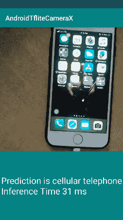

# 基于 TensorFlow Lite 和 CameraX 的 Android 图像分类

> 原文：<https://betterprogramming.pub/image-classification-on-android-with-tensorflow-lite-and-camerax-4f72e8fdca79>

## 利用 GPU 代理在边缘进行机器学习


照片由 [Garett Mizunaka](https://unsplash.com/@garett3?utm_source=medium&utm_medium=referral) 在 [Unsplash](https://unsplash.com?utm_source=medium&utm_medium=referral) 拍摄

TensorFlow Lite 是 TensorFlow Mobile 的轻量级版本。它旨在释放智能手机上的机器学习能力，同时确保模型二进制文件的大小不会太大，并且延迟较低。此外，它还支持使用神经网络 API 的硬件加速，在 GPU 的支持下，运行速度注定会提高 4 倍。

**CameraX** 是 Jetpack 支持库发布的最新相机 API。它的目的是让相机的开发变得更加容易，通过谷歌的自动化实验室测试，它努力让所有 Android 设备保持一致，Android 设备有很多。在易用性和简单性方面，CameraX 代表了 Camera 2 API 的巨大改进。

本文的目标是通过使用 TensorFlow Lite 模型处理用于图像分类的 CameraX 帧来合并相机和 ML 世界。我们将使用 Kotlin 构建一个 Android 应用程序，利用智能手机的 GPU 功能。

# CameraX:简要概述

CameraX 具有生命周期意识。因此，它消除了在`onResume`和`onPause`方法中处理状态的需要。

API 是基于用例的。目前支持的三种主要用例是:

*   **预览** —显示摄像机画面。
*   **分析** —为计算机视觉或其他机器学习相关任务处理图像。
*   **捕捉** —保存高质量图像。

此外，CameraX 还提供了**扩展**来轻松访问支持设备上的 HDR、人像和夜间模式等功能。

## 张量流 Lite 转换器

TensorFlow Lite 转换器采用 TensorFlow 模型并生成 TensorFlow Lite `[FlatBuffer](https://google.github.io/flatbuffers/)`文件。的。然后可以将 tflite 模型部署在移动或嵌入式设备上，使用张量流解释器在本地运行。

以下代码片段描述了一种将 Keras 模型转换为移动兼容的`.tflite`文件的方法:

```
from tensorflow import liteconverter = lite.TFLiteConverter.from_keras_model_file( 'model.h5')tfmodel = converter.convert()open ("model.tflite" , "wb") .write(tfmodel)
```

在接下来的部分中，我们将使用 Kotlin 通过 MobileNet TensorFlow Lite 模型演示 CameraX 的实际实现。您可以创建自己的定制训练模型，或者在[托管的预训练模型](https://www.tensorflow.org/lite/guide/hosted_models)中进行选择。

# 履行

## 在后台

流程真的很简单。我们将位图图像从 CameraX 中的分析用例传递给 TensorFlow 解释器，后者使用 MobileNet 模型和标签类对图像进行推理。下面是 CameraX 和 TensorFlow Lite 如何相互交互的图示。



## 设置

启动一个新的 Android Studio Kotlin 项目，并在应用程序的`build.gradle`文件中添加以下依赖项。

```
//CameraX
implementation 'androidx.camera:camera-core:1.0.0-alpha02'
implementation 'androidx.camera:camera-camera2:1.0.0-alpha02'// Task API
implementation "com.google.android.gms:play-services-tasks:17.0.0"

implementation 'org.tensorflow:tensorflow-lite:0.0.0-nightly'
implementation 'org.tensorflow:tensorflow-lite-gpu:0.0.0-nightly'
```

每夜 TensorFlow Lite 构建为 GPU 提供实验性支持。Google Play 服务任务 API 用于处理异步方法调用。

接下来，在 assets 目录下添加 MVP 文件、标签和`.tflite`模型文件。另外，您需要通过在`build.gradle`文件中设置下面的`aaptOptions`来确保模型没有被压缩:

```
android{
aaptOptions {
    noCompress **"tflite"** noCompress **"lite"** }
```

在您的`AndroidManifest.xml`文件中添加摄像机的必要权限:

```
<uses-permission android:name="android.permission.CAMERA" />
```

现在设置已经完成，是时候建立布局了！

## 布局

布局在`activity_main.xml`文件中定义，它由一个显示相机预览的 TextureView 和一个显示图像分类模型预测输出的 TextView 组成。

## 请求摄像机权限

在访问摄像机之前，您需要请求运行时权限。下面来自`MainActivity.kt`类的代码展示了这是如何实现的。

一旦获得许可，我们就开始拍摄！

## 设置相机使用案例

如前一节代码所示，`startCamera`是从`TextureView`上的`post`方法中调用的。这确保了只有当`TextureView`放在屏幕上时，摄像机才会启动。在`updateTransform`方法中，我们相对于设备的方向固定视图的方向。

在上面的代码中，我们做了相当多的事情。让我们逐一看一下:

*   使用`PreviewConfig.Builder`设置我们的预览用例。
*   `setOnPreviewOutputUpdateListener`是我们将相机预览的表面纹理添加到`TextureView`的地方。
*   在分析器用例中，我们将图像代理转换为位图，并将其传递给`TFClassifier`的`classify`方法。如果这看起来不合适，现在跳过它，因为我们将在下一节详细讨论`TFClassifier`类。

以下代码片段用于将 ImageProxy 转换为位图:

```
fun ImageProxy.toBitmap(): Bitmap {
    val yBuffer = *planes*[0].*buffer* // Y
    val uBuffer = *planes*[1].*buffer* // U
    val vBuffer = *planes*[2].*buffer* // V

    val ySize = yBuffer.remaining()
    val uSize = uBuffer.remaining()
    val vSize = vBuffer.remaining()

    val nv21 = ByteArray(ySize + uSize + vSize)

    yBuffer.get(nv21, 0, ySize)
    vBuffer.get(nv21, ySize, vSize)
    uBuffer.get(nv21, ySize + vSize, uSize)

    val yuvImage = YuvImage(nv21, ImageFormat.*NV21*, this.*width*, this.*height*, null)
    val out = ByteArrayOutputStream()
    yuvImage.compressToJpeg(Rect(0, 0, yuvImage.*width*, yuvImage.*height*), 100, out)
    val imageBytes = out.toByteArray()
    return BitmapFactory.decodeByteArray(imageBytes, 0, imageBytes.size)
}
```

现在是运行图像分类的时候了！让我们跳到下一部分。

# 张量流精简解释程序

TensorFlow Lite 解释器遵循以下步骤，以便根据输入返回预测。

## 1.将模型转换成字节缓冲区

我们必须从 Assets 文件夹中对模型进行内存映射，以获得一个 ByteBuffer，它最终被加载到解释器中:

```
@Throws(IOException::class)
private fun loadModelFile(assetManager: AssetManager, filename: String): ByteBuffer {
    val fileDescriptor = assetManager.openFd(filename)
    val inputStream = FileInputStream(fileDescriptor.*fileDescriptor*)
    val fileChannel = inputStream.*channel* val startOffset = fileDescriptor.*startOffset* val declaredLength = fileDescriptor.*declaredLength* return fileChannel.map(FileChannel.MapMode.*READ_ONLY*, startOffset, declaredLength)
}
```

## 2.将标签类加载到数据结构中

标签文件由来自 ImageNet 的数千个不同的类组成。我们将把这些标签加载到一个数组中。最后，解释器将根据这些标签字符串返回预测。

```
@Throws(IOException::class)
fun loadLines(context: Context, filename: String): ArrayList<String> {
    val s = Scanner(InputStreamReader(context.*assets*.open(filename)))
    val labels = ArrayList<String>()
    while (s.hasNextLine()) {
        labels.add(s.nextLine())
    }
    s.close()
    return labels
}
var labels = loadLines(context, "labels.txt")
```

## 3.初始化我们的解释器

现在我们已经有了 ByteBuffer 和标签列表，是时候初始化我们的解释器了。在下面的代码中，我们在我们的`Interpreter.Options()`方法中添加了`GPUDelegate`:

在上面的代码中，一旦模型的设置在解释器中完成，我们就检索模型的输入张量形状。这样做是为了将位图预处理成模型接受的相同形状。

`Callable`接口类似于`Runnable`，但是允许我们返回一个结果。`ExecutorService`用于管理线程池中的多个线程。

在我们的`MainActivity`的`onCreate`方法中调用了`initialize`方法，如下所示:

```
private var tfLiteClassifier: TFLiteClassifier = TFLiteClassifier(this@MainActivity)tfLiteClassifier
    .initialize()
    .addOnSuccessListener **{ }** .addOnFailureListener **{** e **->** Log.e(TAG, "Error in setting up the classifier.", e) **}**
```

## 4.预处理输入并运行推理

我们现在可以调整位图的大小来适应模型输入的形状。然后，我们将把新的位图转换成 ByteBuffer，以便执行模型:

在上面的代码中，`convertBitmapToByteBuffer`屏蔽了每个像素的 8 个最低有效位，以忽略 alpha 通道。

除了 ByteBuffer 之外，我们还为每个图像类传递一个浮点数组，在这个数组上将计算和返回预测。

## 5.计算参数最大值

最后，`getMaxResult`函数返回可信度最高的标签，如下面的代码片段所示:

```
private fun getMaxResult(result: FloatArray): Int {
    var probability = result[0]
    var index = 0
    for (i in result.*indices*) {
        if (probability < result[i]) {
            probability = result[i]
            index = i
        }
    }
    return index
}
```

由于有了`Callable`接口，在分析器用例中运行的`classifyAsync`方法通过`onSuccessListener`获得一个由预测和推断时间组成的字符串。

```
tfLiteClassifier
    .classifyAsync(bitmap)
    .addOnSuccessListener **{** resultText **->** predictedTextView?.*text* = resultText **}**
```

作为回报，我们在屏幕上显示预测标签和推断时间，如下所示:



我们应用程序的屏幕截图

## 结论

这就总结了这篇文章。我们使用 TensorFlow Lite 和 CameraX 构建了一个使用 MobileNet 的图像分类 Android 应用程序，同时利用了 GPU delegate——我们很快就得到了一个相当准确的结果。从这里开始，您可以尝试构建自己的定制 TFLite 模型，并看看它们在 CameraX 上的表现如何。CameraX 仍处于 alpha 阶段，但你已经可以用它做很多事情了。

该指南的完整源代码是[，可在此处](https://github.com/anupamchugh/AndroidTfLiteCameraX/tree/master)获得。

这一次到此为止。我希望你喜欢阅读。