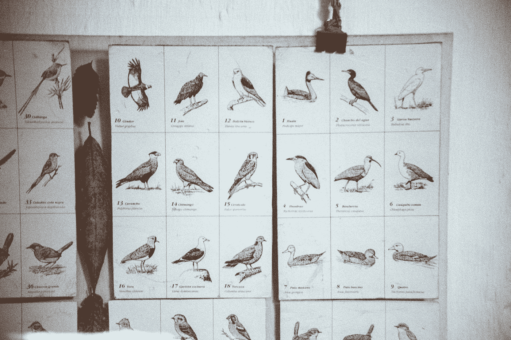
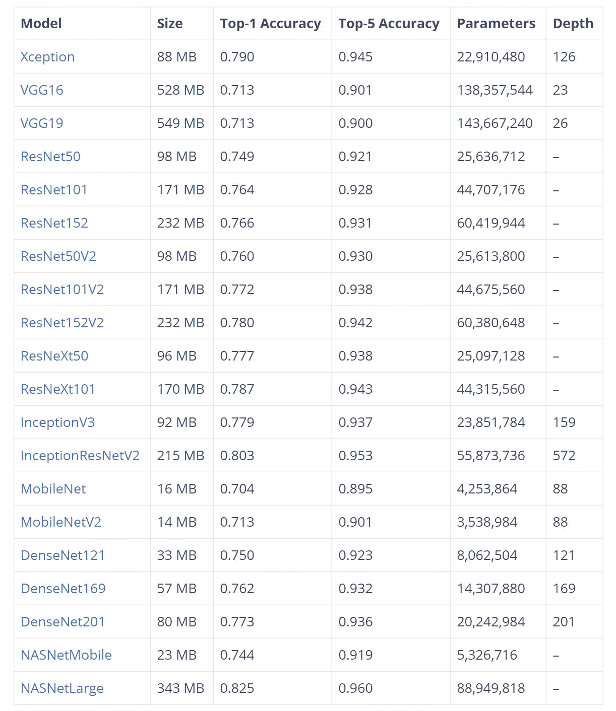
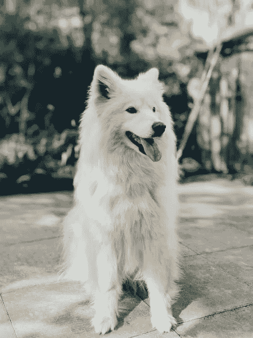

# 基于预训练模型的图像分类

> 原文：<https://betterprogramming.pub/image-classification-with-pre-trained-models-baecb2019973>

## 使用 Keras 和 TensorFlow 的预训练模型进行图像分类的实例



由[延斯·约翰森](https://unsplash.com/@jens_johnsson?utm_source=medium&utm_medium=referral)在 [Unsplash](https://unsplash.com?utm_source=medium&utm_medium=referral) 上拍摄的照片。

在之前的文章中，我们解释了如何在 TensorFlow 中应用[对象检测](https://predictivehacks.com/example-of-object-detection-in-tensorflow/)和使用 YOLO 的[对象检测。今天，我们将提供一个实际例子，说明我们如何使用“预训练的”](https://predictivehacks.com/object-detection-with-yolo/) [ImageNet](https://en.wikipedia.org/wiki/ImageNet) 模型，使用 [Keras](https://keras.io/) 进行对象检测。对于本例，我们将考虑除型号之外的[型号，但是您可以使用](https://arxiv.org/abs/1610.02357)[列表](https://keras.io/api/applications/)中的任何型号。下表显示了预训练模型的大小、它们的性能以及它们在卷积神经网络架构的参数方面的复杂性:



由[预测黑客](https://predictivehacks.com/object-detection-with-pre-trained-models-in-keras/)拍摄的照片。

# 例外图像分类

让我们把手弄脏:

我们选择的图像如下:



[雷鹏](https://unsplash.com/photos/ybHtKz5He9Y)在 [Unsplash](https://unsplash.com/) 上拍照。

我们用相应的概率得到的标签是:

```
[[('n02111889', 'Samoyed', 0.781301),
  ('n02114548', 'white_wolf', 0.124226466),
  ('n02120079', 'Arctic_fox', 0.005746077),
  ('n02111500', 'Great_Pyrenees', 0.0033085805),
  ('n02104029', 'kuvasz', 0.00311469),
  ('n02112137', 'chow', 0.0028483241),
  ('n02112018', 'Pomeranian', 0.0028328209),
  ('n02109961', 'Eskimo_dog', 0.002488005),
  ('n02106030', 'collie', 0.0016986788),
  ('n02085782', 'Japanese_spaniel', 0.0008878598),
  ('n02114367', 'timber_wolf', 0.0007279106),
  ('n02134084', 'ice_bear', 0.0007163896),
  ('n02112350', 'keeshond', 0.00068674894),
  ('n02098286', 'West_Highland_white_terrier', 0.00066097657),
  ('n02123394', 'Persian_cat', 0.0005676047),
  ('n02106166', 'Border_collie', 0.0005447453),
  ('n02105056', 'groenendael', 0.00047748425),
  ('n02099601', 'golden_retriever', 0.00039739575),
  ('n02094114', 'Norfolk_terrier', 0.0003679685),
  ('n02085936', 'Maltese_dog', 0.00032893682)]]
```

我们选择返回前 20 个最有可能检测到的对象。元组有三个元素:

*   第一个引用对象 ID。
*   第二个引用对象标签。
*   第三是指概率。

所以假设我们想得到所有概率高于 5%的对象。然后我们可以键入:

```
[tpl[1:3] for tpl in label[0] if tpl[2]>0.05]
```

我们得到了:

```
[('Samoyed', 0.781301), ('white_wolf', 0.124226466)]
```

正如我们所见，异常模型检测到`Samoyed`和`white_wolf`是图像中最有可能的对象。模型做得很好，因为我们选择的品种是萨摩耶！请随意用其他对象测试这一点。请注意，它试图检测一个对象。我们将在另一篇文章中讨论如何检测一幅图像中的多个物体！

*注意:Keras 中预先训练的模型试图在每幅图像中找出一个对象。因此，它是一种分类算法，其中它为每个对象分配一个概率，并且所有这些概率加起来为 1。也就是说，它不能在一幅图像中检测多个对象。*

感谢阅读！