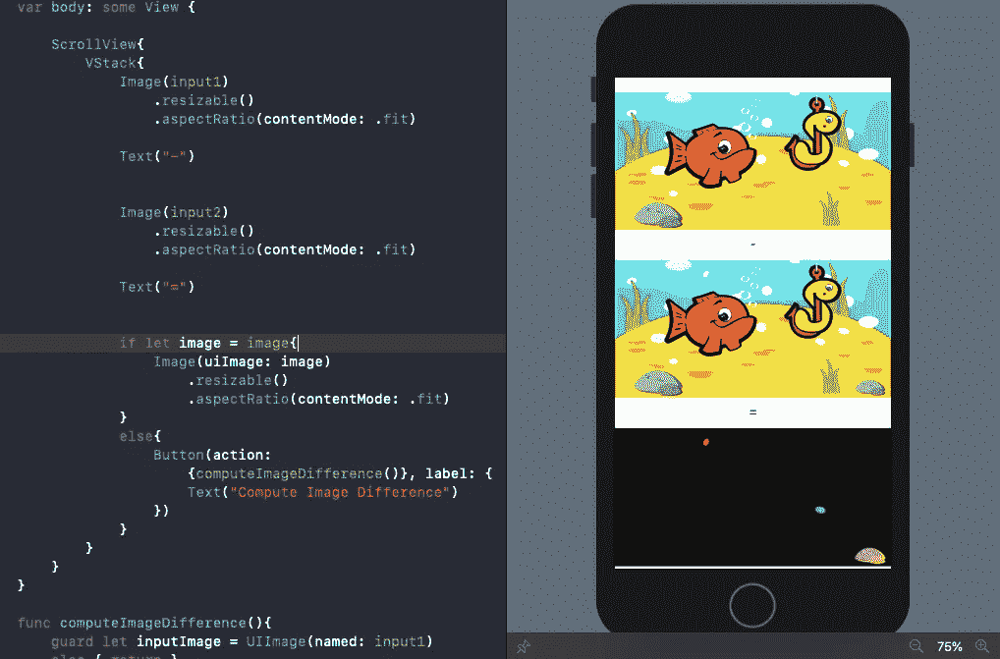
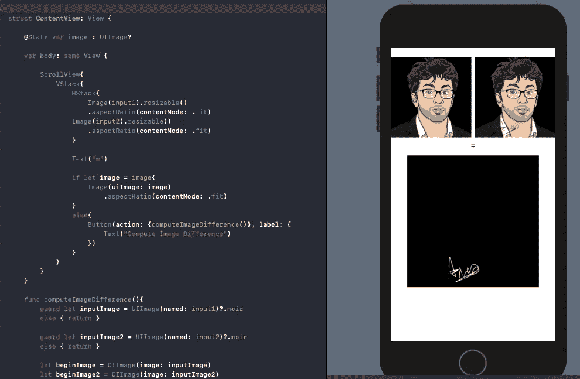
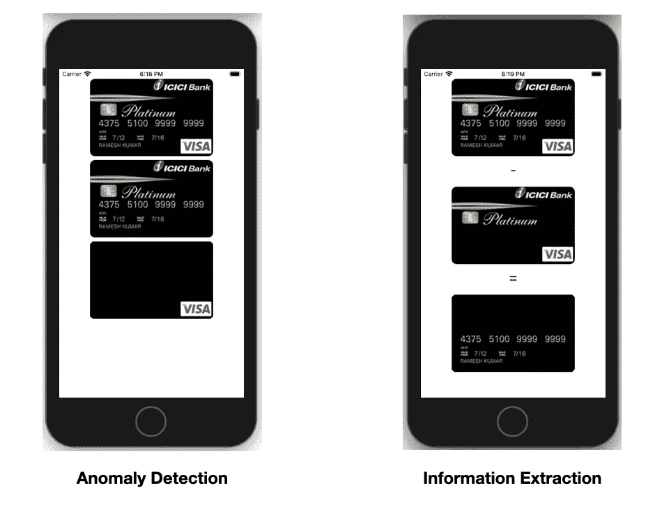

# iOS 中的异常检测—使用 SwiftUI 中的核心映像计算映像差异

> 原文：<https://betterprogramming.pub/image-difference-using-computer-vision-in-ios-14-7753b8d61e82>

## 让我们利用新的核心图像过滤器来发现图像之间的差异和异常

[Franck V.](https://unsplash.com/@franckinjapan?utm_source=medium&utm_medium=referral) 在 [Unsplash](https://unsplash.com?utm_source=medium&utm_medium=referral) 上拍摄的照片

人眼非常容易接受视觉表现。同样，计算机视觉使系统能够理解和处理图像。

核心图像和视觉是 iOS 中计算机视觉的两大支柱。在 2020 年 WWDC 奥运会期间，苹果为他们两个都推了一个信封。

iOS 14 中的核心图像现在包括几个新的内置过滤器，用于图像处理。具体来说，我们有一个`CIColorThreshold`过滤器，通过设置阈值将图像转换为黑白，还有另一个`CIColorThresholdOtsu`，它从图像的直方图中确定适当的阈值。

更重要的是，我们现在可以使用新的`CIColorAbsoluteDifference`滤镜来比较两幅图像——这是本文的重点。

在接下来的部分中，我们将探索通过分析图像之间的差异可以实现的用例。

# 绝对图像差异

这个图像处理任务包括计算两幅图像中每个像素的绝对差值，并将它们相加。

这样做，我们得到一个新的变换图像，显示了两个图像之间的变化。

在新的核心图像过滤器中，如果两个图像完全相同，我们的输出图像将是黑色的。

通过比较图像之间的色差，我们可以:

*   分析视频帧。例如，我们可以确定帧是否一致，或者任何帧中是否有阴影。
*   异常检测，用于发现肉眼可能忽略的异常值。这有助于发现图像之间的差异，例如信用卡或纸币是否缺少符号。

接下来，我们将探索几个比较两幅图像的例子。

# 核心图像过滤器:CIColorAbsoluteDifference

让我们创建一个新的 SwiftUI 应用程序来执行图像处理。

核心映像需要将输入`CIImage`(我们将从 UIImage 转换而来)设置到`CIFilter`上。随后，我们可以设置阈值(如果有的话)，并从过滤器中检索`outputImage`实例。这个`outputImage`实例基本上是一个`inputImage`的副本，然后传递给 CIContext 的函数`createCGImage`来执行转换。

`CIContext`是所有图像处理发生的地方。

## 发现 SwiftUI 中图像之间的差异

下面的例子展示了经典的“发现图像中的差异”谜题。但是有了计算机视觉。

创建了一个过滤器，我们在上面传递了两个图像。

在比较之前，我们还可以将两幅图像转换成灰度。

## 水印检测/提取

经常会遇到需要确保在图像上设置水印或徽标覆盖的任务。同样，使用`CIColorAbsoluteDifference`我们可以确定如下所示:

## 信用卡异常检测

在我们的移动应用程序中扫描信用卡并提取数字是一项相当常见的计算机视觉任务。

我们可以进一步利用上述核心图像过滤器的能力来确定信用卡的图像是否没有被篡改。此外，我们可以保留空白的参考信用卡图像，并将其与扫描图像进行比较，以仅提取数字。

以下示例显示了如何做到这两点:

作者的屏幕截图

在左侧图像中，为了使用计算机视觉全面检测是否存在异常值/异常，我们可以通过将输出图像与不透明的黑色图像进行比较来扩展上述示例。

以下是计算图像差异的完整代码:

上述 SwiftUI + CoreImage 应用程序的完整源代码可在这个 [Github 资源库](https://github.com/anupamchugh/CoreImageAbsoluteColorDiff)中获得。

# 结论

在准备数据集时，苹果的图像处理框架 CoreImage 可以方便地进行图像转换和增强。

我们讨论了 iOS 14 中可用的新滤镜`CIColorAbsoluteDifference`，它通过每个像素的颜色来比较两幅图像(不需要 OpenCV)。

这有助于发现图像中的瑕疵，从视频或数据集中确定和移除重复图像。

这一次到此为止。感谢阅读。