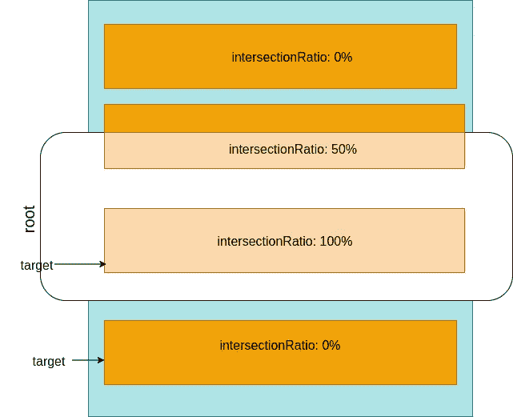
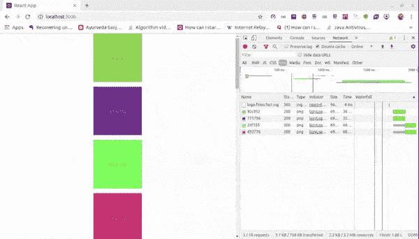

# 在 React 中使用钩子来延迟加载图像

> 原文：<https://betterprogramming.pub/image-lazy-loading-in-react-intersection-observer-a9ae912ddafe>

## 通过创建和使用一个定制的钩子:useIO，在 React 中使用 Intersection Observer 来延迟加载图像


照片由[文尼尔伦](https://unsplash.com/@wenniel?utm_source=medium&utm_medium=referral)在 [Unsplash](https://unsplash.com?utm_source=medium&utm_medium=referral) 上拍摄

图片占据了你网站的很大一部分，你管理图片的方式会对你的网页加载时间产生很大的影响。

从你的服务器一次加载所有的图片到你的客户端会让你的网站非常慢，而且在很多情况下，用户可能不会访问所有的图片。因此，在许多情况下，最好只在需要时加载图像。

我们将在这里看到如何使用`IntersectionObserver`以最简单的方式加载图像。

首先，我们将创建一个定制的`IntersectionObserver`钩子，我们称之为`useIO`，然后我们将在 React 中创建一个新的组件`(Image)`，它将帮助我们封装我们的`` JSX，并增加一些功能。

之后，我们将使用它们来编写我们的延迟加载代码。

# 交叉口观测器

[交集观察器 API](https://developer.mozilla.org/en-US/docs/Web/API/Intersection_Observer_API) 用于观察一个称为*目标*的元素何时与设备视口或称为*根*的指定元素相交。



目标元素与其根元素的相交程度就是 ***的相交比。*** 这是以 0.0 到 1.0 之间的值表示可见的目标元素的百分比，其中 0 表示 0%，1.0 表示 100%。

基本上，我们观察目标元素与根元素的交集比率。

```
const io = new IntersectionObserver(callback, options);
```

当我们不提供一个`options`对象时，使用默认选项`IntersectionObserver`，当使用默认选项时，当目标元素部分进入视图和完全离开视图时，我们的回调将被调用。

`IntersectionObserver`的`options`对象给了我们更多的控制权来控制我们的回调将如何以及何时被调用。`Options`对象有以下字段:

*   `root`:测量目标元素的交集比率的元素。根必须是目标元素的祖先。如果未指定或如果`null`，则默认为浏览器视窗。
*   `rootMargin`:围绕`root`的边距。它可以是正的，也可以是负的，收缩或增长根元素的每一边。可以具有类似于 CSS margin 属性的值，例如“`10px 20px 30px 40px"`”。默认值全为零。
*   `threshold`:0 到 1 之间的单个数值或数值数组，0 表示 0%，0.5 表示 50%，1 表示 100%。默认值为 0。该值定义了回调将被调用的交集比率。如果该值为 0，则意味着只要目标元素的单个像素进入视口，就会调用 callback。如果值是一个数组，那么对于该数组中的每个值，如果`intersectionRatio`匹配，将调用回调。

```
let options = {
  root: document.querySelector('#scrollArea'),
  rootMargin: '0px',
  threshold: [0, 0.25, 0.50, 1]
}

const io = new IntersectionObserver(callback, options);
```

在这里，每当可见度越过另一个 25%时，回调将被调用。

我们可以开始在`IntersectionObserver`实例上使用`observe`方法来观察一个元素。

类似地，为了停止观察一个元素，我们有`unobserve`方法，为了禁用整个`IntersectionObserver`，我们使用`disconnect`方法。

```
// Start Observing target
io.observe(*targetElement*)// Stop Observing target
io.unobserve(*targetElement*)// Disable entire IntersectionObserver
io.disconnect()
```

通过为多个目标元素调用`observe`方法，我们可以使用单个`IntersectionObserver`实例来观察多个元素。

回调函数接收一个`entries`参数，它是一个`IntersectionObserverEntry`对象的数组。

这个对象有许多属性，但最常用的是`intersectionRatio`，它给出了目标元素与根元素的当前交集比率。

其他一些属性是`isIntersecting`和`target`，我们将使用它们。

```
const io = new IntersectionObserver(
  entries => {
    console.log(entries);
  },
  {
    //Options 
  }
);
// Start observing an element
io.observe(element);
```

# 用途

为了使用`IntersectionObserver`，我们将创建一个自定义挂钩。这个钩子将接受一个对象作为`IntersectionObserver`的选项对象。

这个钩子将返回一个包含三个东西的数组。

1.  观察者的实例。
2.  方法来设置目标元素。
3.  条目数组，由`IntersectionObserver`提供给回调函数。

代码 1

`IntersectionObserver`是一个副作用，所以我们将把它所有的连接和断开逻辑写在`useEffect`钩子中。

这里，我们使用了 React `ref`，使用`useRef`钩子来存储`IntersectionObserver`实例，该实例被存储在 ref 的当前属性中。参见代码 1 中的`line 14`。

```
//Create a ref
const observer = useRef(null)//Assign IntersectionObserver to ref
observer.current = new IntersectionObserver(callback, options)
```

所有的目标元素都将被存储在`elements`状态，我们遍历`elements`数组，并在`useEffect`回调中为每个元素调用`observe`。

```
//calling observe
observer.current.observe(element)
```

作为参数传递给`IntersectionObserver`回调函数的所有条目都存储在`entries`状态中。我们将使用这些条目来编写我们的延迟加载逻辑。

`useIO`将返回`IntersectionObserver`实例，`setElements`设置`elements`状态，该状态是所有目标元素和`entries`的数组。

# **图像组件**

很简单的逻辑。我们将只封装`` JSX，如果`isLazy`道具被传递给我们的`Image`组件，那么它将把`lazy` `class`添加到``标签中。

道具`isLazy`将决定图像是否会被延迟加载。

代码 2

注意:您可以根据自己的需求进行修改。

# 把它放在一起

现在我们有了`Image`组件和为我们提供`entries`的`useIO`挂钩。Entries 是一个`IntersectionObserverEntry`对象的数组，它将帮助我们编写惰性加载的逻辑。

对于图片，我们将使用[这个 API](https://jsonplaceholder.typicode.com/photos) 。它返回数千个结果，但我们将只使用 15 个结果。为了进行 AJAX 调用，我们将使用 [axios](https://www.axios.com/) 。

代码 3

现在，我们将遍历我们的数据数组并生成图像。

代码 4

这里，我们提供了`isLazy`道具，它将自动在``上添加`lazy`职业，我们也在这里添加了一些样式。我们还会看到一个后备图像，直到我们的图像被加载。

我们有图像，所有我们必须延迟加载的图像都添加了`lazy`类。现在，我们将获取类名为`lazy`的所有元素，并调用`setElements`方法，这样我们就可以使用这些元素作为我们的目标元素。

代码 5

现在参见`useIO`定制挂钩的*代码 1* 。`useEffect`挂钩取决于`elements`状态。

并且，正如我们在*代码 5 中调用的`setElements`，*将触发效果运行，这反过来将我们的观察者连接到我们的目标元素，并且`ioEntries`被传递到回调，在回调中我们将设置我们的`entries`状态。

现在我们已经拥有了编写主惰性加载逻辑所需的一切，即与每个目标元素相关的条目。

代码 6

这里，我们将遍历`entries`数组，对于每个条目，我们将使用`entry.isIntersecting`检查它是否与我们的根相交。

然后，我们将使用`entry.target`获取目标 DOM 元素。之后，我们将更改它的`src`属性，我们之前将它设置为回退图像。

现在，从这里开始，所有其他事情都将由我们的浏览器来处理，比如加载图像。

但是我们需要记住的一点是，一旦图像被加载，当我们来回滚动时就没有必要再次加载它，因此，我们将从它那里移除`lazy`类，并且，我们需要停止观察那个目标元素。

注意:`isIntersecting`和`target`是`IntersectionObserverEntry`对象的属性。

# 完全码

对于`useIO`钩子和`Image`组件，我们已经分别在代码 1 和代码 2 中看到了代码。现在让我们把所有的部分放在一起，为我们的懒惰加载图像。

代码 7



只有当图像至少占可视区域的 25%时，它才会被加载

# 参考

[](https://developer.mozilla.org/en-US/docs/Web/API/Intersection_Observer_API) [## 交叉点观察器 API

### 交叉点观察器 API 提供了一种异步观察目标元素交叉点变化的方法…

developer.mozilla.org](https://developer.mozilla.org/en-US/docs/Web/API/Intersection_Observer_API) [](https://developers.google.com/web/fundamentals/performance/lazy-loading-guidance/images-and-video) [## 延迟加载图片和视频|网络基础|谷歌开发者

### 如果你的网站有大量的图片和视频，但是你不想减少任何一个，延迟加载可能只是…

developers.google.com](https://developers.google.com/web/fundamentals/performance/lazy-loading-guidance/images-and-video)