# 用 Python 和 Pillow 进行图像处理

> 原文：<https://betterprogramming.pub/image-processing-with-python-and-pillow-1394de194ae8>

## 了解如何使用 Python 和 Pillow 库处理和转换图像

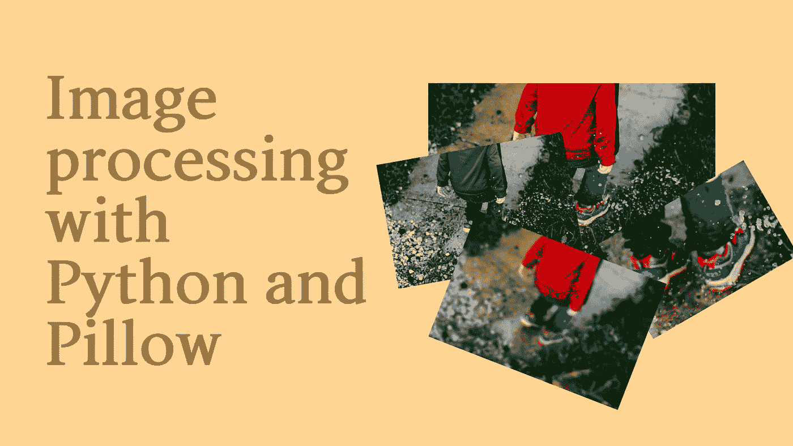

作者图片

图像处理和计算机视觉是我有空的时候经常会去做的事情。即使我做了一些人工智能和图像处理的工作，我仍然做了很多“手动”图像处理，以更好地理解我们可以用来让计算机从图像中收集信息的技术。

毕竟，图像处理是我最初开始写博客的原因，当时我的第一篇文章是“[寻找没有深度学习的道路](https://livecodestream.dev/post/finding-lanes-without-deep-learning/)”

这些都是有趣的话题(至少对我来说)。尽管如此，我从未真正写过图像操作的其他方面，比如触摸、调整大小、裁剪以及对图像的各种操作。更有甚者，完全用 Python 生成图像是一个有许多实际应用的奇妙想法，例如，为博客文章生成缩略图或构建一个像 [Canva](https://www.canva.com/) 这样的服务。

使用 Python 可以使用多个库进行图像处理，但是今天我们将使用 [Pillow](https://pillow.readthedocs.io/en/stable/) 进行处理，因为它简单并且专注于我们想要执行的任务。

# 安装和项目设置

将 Pillow 作为项目的一部分进行安装就像安装 Python 包一样简单。您需要运行以下命令:

```
python3 -m pip install --upgrade Pillow
```

对于我们的项目，我们将在 [Google Colab](https://colab.research.google.com/) 上运行 [Jupyter 笔记本](https://jupyter.org/)中的所有命令。你可以在你自己的笔记本上跟随，或者我在这里提供完整的代码。

因为我们将在 Google Colab 中安装依赖项，所以我们需要运行:

```
!python3 -m pip install --upgrade Pillow
```

最后，在我们进入代码之前，我们需要一个样例图像来工作。我选择了这张照片，但你可以使用其他任何照片。

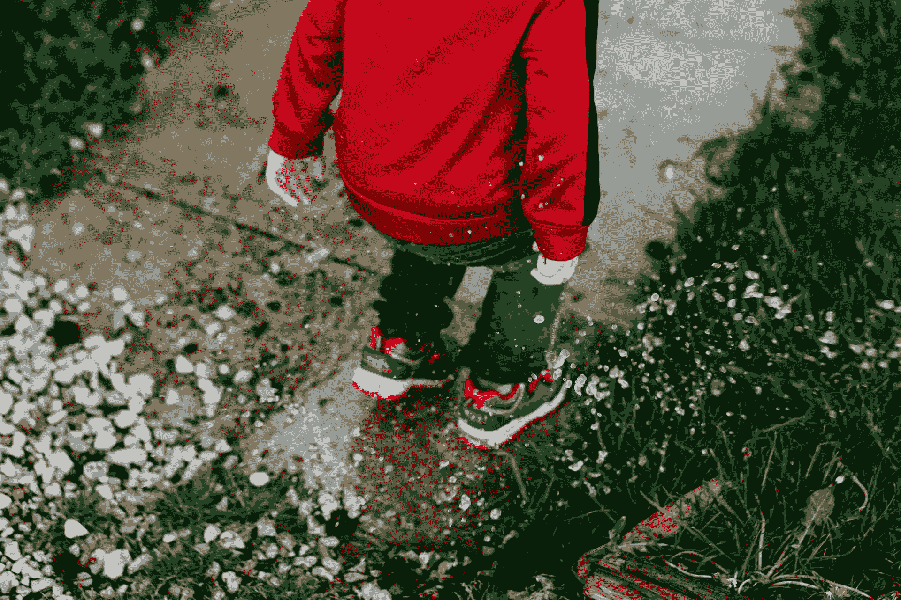

一个孩子在水中戏水的图像，这正是我的孩子喜欢做的。| [乔丹·惠特](https://unsplash.com/@jwwhitt?utm_source=unsplash&utm_medium=referral&utm_content=creditCopyText)上[下](https://unsplash.com/?utm_source=unsplash&utm_medium=referral&utm_content=creditCopyText)

由于我们将在整个教程中使用这个图像，我们将在 Google Colab 上存储一个副本。即使从网络上加载图像是可能且容易的，我们也将从系统中加载，在本例中，从 Google Colab 环境中加载。

必须考虑到，当环境被破坏时，所有上传到 Google Colab 的文件都将被删除。为此，我们将直接在笔记本中上传图像。这样，当我们运行代码时，我们可以提供我们想要处理的图像，并且当我们需要它时，它总是可用的。

为了将图像加载到 Google Colab 中，我们将插入以下代码:

```
from google.colab import files
uploaded = files.upload()original_image_name = ''
if len(uploaded.keys()) > 0:
 original_image_name = next(iter(uploaded.keys()))
 print('We will be working with the image: {}'.format(original_image_name))
else:
 raise ValueError('Please upload an image to continue')
```

`google.colab`库抽象了上传文件的所有逻辑。我们只需要考虑用户是否有效地上传了文件。如果没有，则引发一个错误或警告用户，因为将无法继续执行剩余的代码。

# 图像对象

舞台中央是代表 PIL 形象的`Image`类。对图像的所有操作都将从图像对象开始。有多种方法可以将图像加载到对象实例中。其中一些是:从文件中加载图像，作为操作的结果创建新图像，等等。

为了从文件中加载图像，我们使用了`Image`模块中的`open()`方法，将图像路径传递给它，如下所示:

```
from PIL import Imageoriginal_image = Image.open(original_image_name)
```

要查看加载的图像，我们可以用下面的代码行在单元格中显示它:

```
display(original_image)
```

> 请注意，如果您不在笔记本环境中，您可能希望使用 [Image.show()](https://pillow.readthedocs.io/en/stable/reference/Image.html#PIL.Image.Image.show) 来代替:

```
original_image.show()
```

但是这并不是`Image`物体包含的全部信息。此外，您还可以获得关于图像的一些信息，如:

```
# Output the file format
print(original_image.format)

# Output the pixel format, e.g. RGB
print(original_image.mode)

# Image size
print(original_image.size)

# Output the color palette, if any
print(original_image.palette)

# A dictionary with data associated with the image
print(original_image.info)
```

对于我们的图像，我们得到以下输出:

```
JPEG
RGB
(1920, 1282)
None
{'jfif': 257, 'jfif_version': (1, 1), 'dpi': (72, 72), 'jfif_unit': 1, 'jfif_density': (72, 72), 'progressive': 1, 'progression': 1, 'icc_profile': b'\x00\x00\x02\ ... \xff\xff'}
```

你可以对图像对象做更多的事情，并在官方文档[中了解更多。](https://pillow.readthedocs.io/en/stable/reference/Image.html)

现在我们已经加载了图像，我们可以开始对它进行修改了。

# 调整图像大小

当讨论图像操作时，最常见的是用 Python 调整图像大小。我在博客上多次遇到这个问题，在 Stack Overflow 上也到处都是，但它是一个带枕头的一行程序。

```
resized_image = original_image.resize((240, 160))
display(resized_image)
```

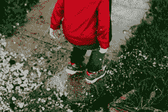

240x160 的结果图像

在上面的示例中，我们故意调整了图像的大小，保持了纵横比，但这并不是必需的，如下例所示:

```
square_image = original_image.resize((240, 240))
display(square_image)
```

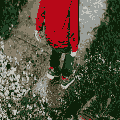

240x240 的结果图像

在本例中，生成的图像是一个 240x240 的正方形，并且图像的纵横比发生了变化。因此，图像看起来有点奇怪。

但是，如果我们想要在保持纵横比的同时调整图像的大小，而不需要手动计算新的宽度和高度，该怎么办呢？`thumbnail()`方法已经覆盖了你。

```
thumbnail_image = original_image.copy()
thumbnail_image.thumbnail((240, 240))
display(thumbnail_image)
```


240x160 的结果图像

方法`thumbnail()`的工作方式与方法`resize`不同，因为第一个方法会修改对象，而不是返回图像的新实例。出于这个原因，我们通过制作原始图像的副本，然后调用`thumbnail()`方法来启动代码示例。

该方法将生成原始图像的缩略图，具有相同的纵横比，宽度和高度不超过给定的大小。

# 种植

方法`crop()`从源图像中返回一个矩形区域。矩形或方框是一个四元组，分别表示左、上、右和下坐标。

让我们看一个例子:

```
box = (
   720, # left
   600, # top
   1300, # right
   980 # bottom
)
cropped_image = original_image.crop(box)
display(cropped_image)
```

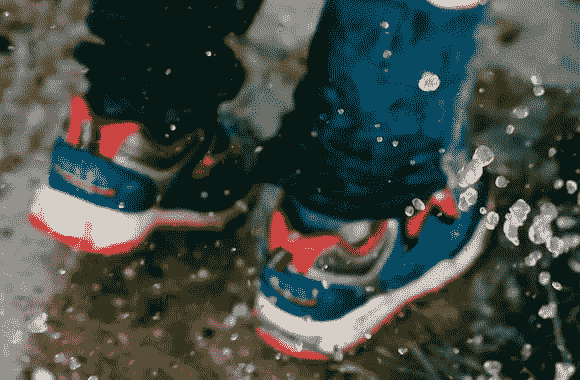

仅显示脚的裁剪图像

结果图像包含原始图像的一小部分，只显示了孩子的鞋子。

# 堆叠图像

通过堆叠图像，我们的意思是将一个图像插入到另一个中，或者将一个图像插入到另一个中。用 Pillow 做这个很容易，但是你至少需要两张图片来展示它。

在下一个例子中，我们将把我们的原始图像和裁剪后的版本(只是脚)粘贴到右下角。

```
stacked_image = original_image.copy()

position = (stacked_image.width - cropped_image.width, stacked_image.height - cropped_image.height)
stacked_image.paste(cropped_image, position)
display(stacked_image)
```

函数`paste()`改变了图像对象，而不是返回一个新的实例，所以我们首先复制原始图像，计算裁剪图像的位置，并将其粘贴到堆叠图像中。

结果如下所示:

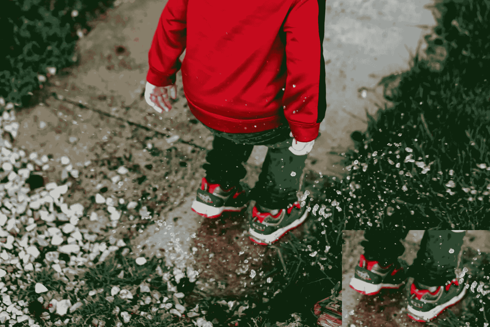

原始图像，裁剪后的图像堆叠在右下角

很酷，对吧？

# 旋转图像

Pillow 还提供了`rotate()`功能来旋转图像。该方法采用一个表示旋转度数的数值参数。此方法返回图像的新副本，而不改变原始副本。

```
rotated_image = original_image.rotate(90)
display(rotated_image)
```

以下是生成的图像:

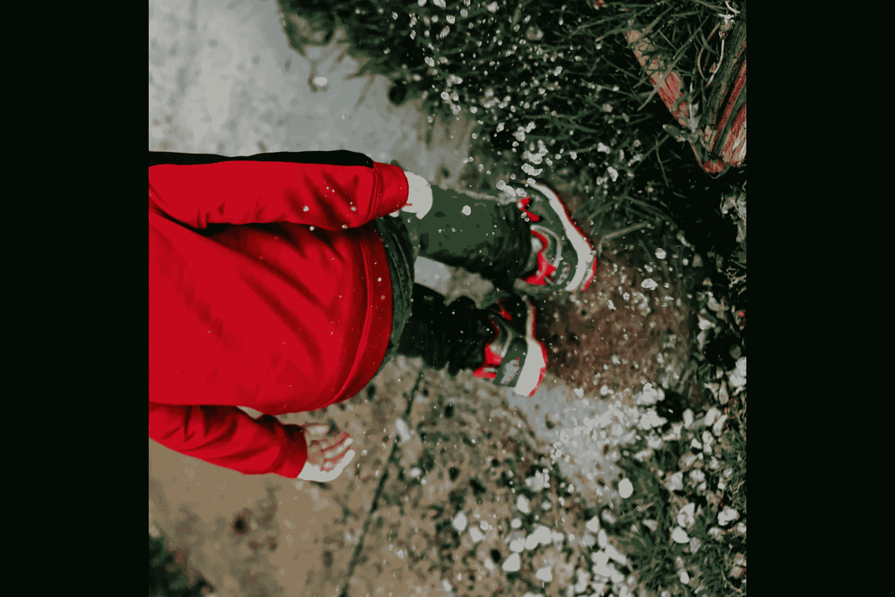

旋转 90 度的图像

请注意，默认情况下，旋转后的图像保持原始图像的尺寸。由于图像在原始帧中旋转，这可能会导致您看到黑色边框和图像被裁剪的情况。

如果您想改变这种行为，您可以使用参数`expand`设置为`True`，如下所示:

```
rotated_expanded_image = original_image.rotate(90, expand=True)
display(rotated_expanded_image)
```

生成的图像如下所示:

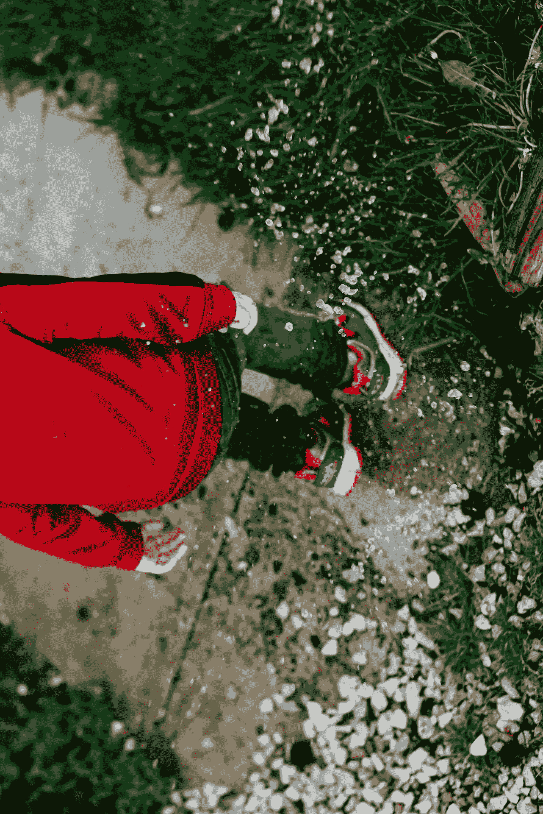

旋转并扩展图像以适合

# 调换图像

与旋转类似，Pillow 允许您使用`transpose()`方法转置图像。同样需要一个参数来表示您想要应用的移调类型。以下是可能的常数值:

*   `PIL.Image.Transpose.FLIP_LEFT_RIGHT`
*   `PIL.Image.Transpose.FLIP_TOP_BOTTOM`
*   `PIL.Image.Transpose.ROTATE_90`
*   `PIL.Image.Transpose.ROTATE_180`
*   `PIL.Image.Transpose.ROTATE_270`
*   `PIL.Image.Transpose.TRANSPOSE`
*   `PIL.Image.Transpose.TRANSVERSE`

使用 transpose，您可以翻转或旋转图像。然而，旋转角度已经预先定义，所以如果你想使用不同的角度，建议使用我们上面提到的`rotate()`功能。

此方法返回图像的新副本，而不改变原始副本。

让我们看一些例子:

```
flipped_lr_image = original_image.transpose(Image.FLIP_LEFT_RIGHT)
display(flipped_lr_image)
```

生成的图像是:

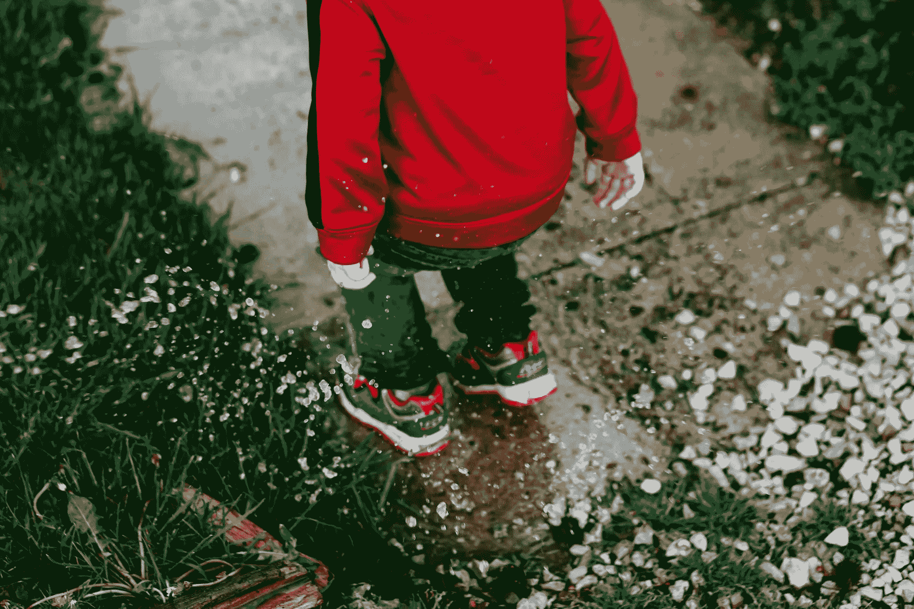

图像在 Y 轴上翻转

另一个例子:

```
flipped_lr_image = original_image.transpose(Image.FLIP_TOP_BOTTOM)
display(flipped_lr_image)
```

生成的图像是:

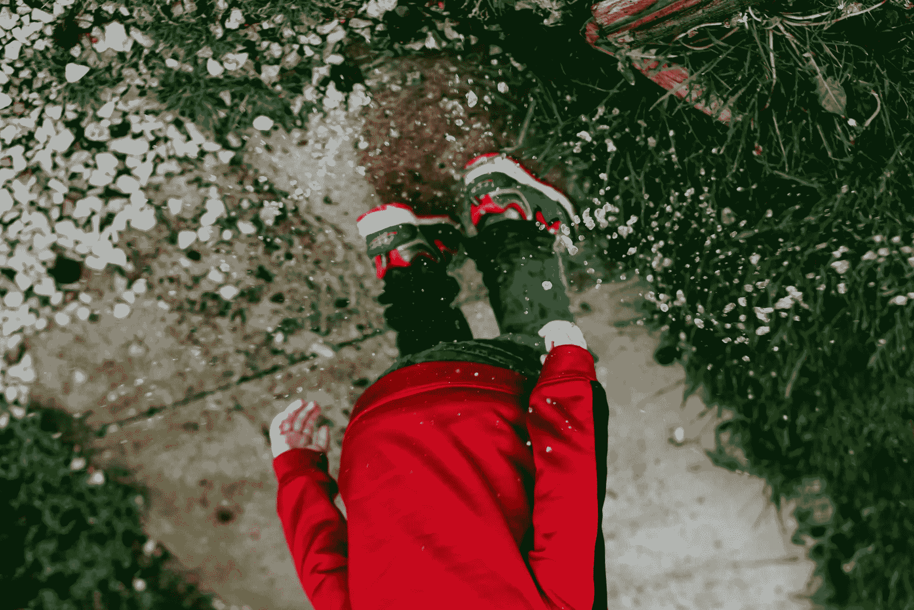

图像在 X 轴上翻转

# 在图像上绘图

Pillow 提供了转换图像的方法，您还可以使用 [ImageDraw](https://pillow.readthedocs.io/en/stable/reference/ImageDraw.html) 模块在图像上绘图。

模块允许你绘制线条、矩形、弧线、任何其他类型的不规则形状、文本、多行文本等等。

让我们来看一个加载图像并在上面随意绘制一些东西的例子:

生成的图像是:


原始图像有一个正方形、一条线和一些文本，上面写着“Hello world！”

# 颜色转换

在其他文章中，如[在没有深度学习的情况下找到车道](/post/finding-lanes-without-deep-learning/)，我们讨论了在不同颜色空间中工作以及对图像应用颜色转换以执行计算和区分模式的重要性。

为了切换图像颜色模式，我们使用函数`convert()`，它需要一个带有颜色模式的参数。对于灰度，我们使用一个相当具体的参数`L`，代表`luminance`。您也可以应用`RGB`或`CMYK`模式。

```
grayscale_image = original_image.convert('L')
display(grayscale_image)
```

以下是生成的图像:

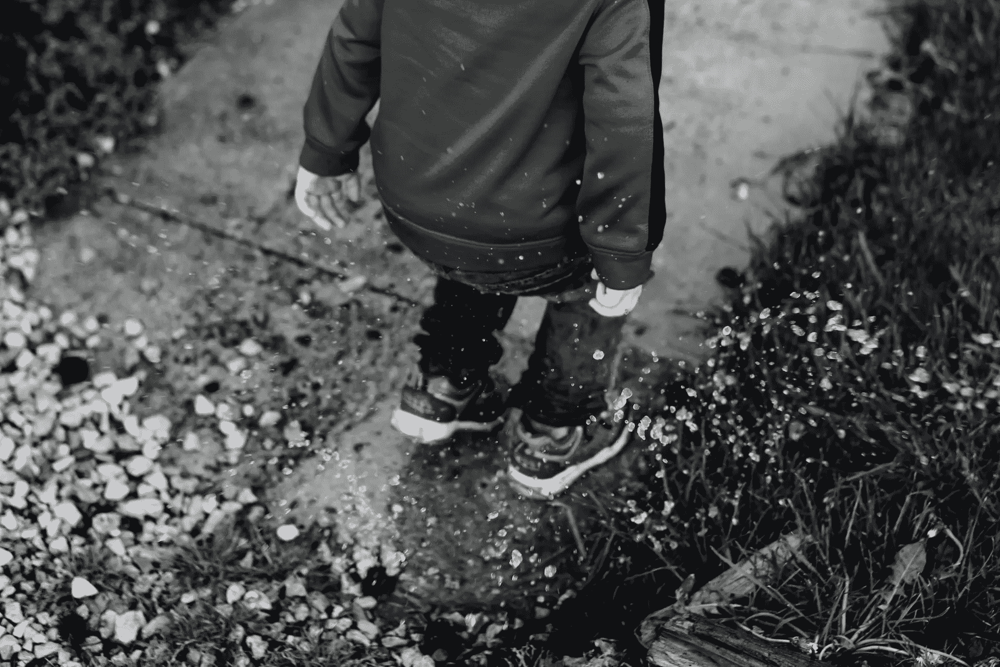

图像的灰度版本

# 模糊图像

枕头有一个强大的过滤系统，其中我们有多个选项来模糊图像。

让我们来看一个使用高斯模糊滤镜的例子:

```
from PIL import ImageFilter

blurred_image = original_image.filter(filter=ImageFilter.GaussianBlur(20))
display(blurred_image)
```

生成的图像:


使用高斯滤波器的模糊图像

检查[图像滤镜模块](https://pillow.readthedocs.io/en/stable/reference/ImageFilter.html#module-PIL.ImageFilter)以了解更多关于滤镜和不同模糊模式的信息。

# 保存图像

我们今天讨论的最后一个方法是`save()`方法，它允许您将图像对象保存到文件中。

这很简单，让我们看一个例子:

```
blurred_image.save('blurred_image.png') # save as PNG

blurred_image.save('blurred_image.jpg') # save as JPG
```

上面的例子将保存两个图像到磁盘，一个 PNG 和一个 JPG 副本。如果您正在使用 Google Colab，您会在`content`文件夹中找到这些图像。如果您正在使用本地文件，您将在当前目录中找到它们。

# 结论

本文介绍了使用 Python 和 Pillow 库的一些常见图像处理操作。

尽管我们进行了多次手术，并获得了许多乐趣，但我们还没有触及枕头提供的许多选项的表面。

如果你对图像处理感兴趣，我强烈推荐查看 [Pillow 的官方文档](https://pillow.readthedocs.io/en/stable/)。

感谢您的阅读，祝您编码愉快！