# Python 中的图像分割(下)

> 原文：<https://betterprogramming.pub/image-segmentation-python-7a838a464a84>

## 通过从训练数据集中移除背景来提高模型准确性

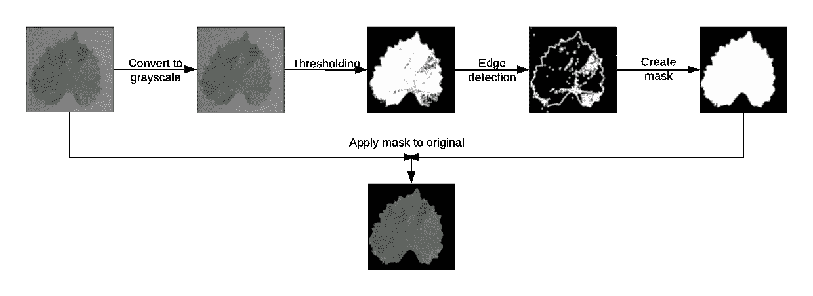

插图鸣谢:作者

*卡在付费墙后面？点击* [*此处*](https://medium.com/better-programming/image-segmentation-python-7a838a464a84?source=friends_link&sk=64fb47244786896746949ece7ae92b76) *阅读全文与我的朋友链接。*

欢迎回来！

这是关于图像分类的三部分系列的第二部分。如果您还没有阅读过本系列的第 1 部分，我建议您先阅读一下(下面的链接)。我已经详细介绍了设置环境和使用 Google Colab 中 Google Drive 的图像数据的细节。我们将在这里使用该代码的输出。

[](https://medium.com/better-programming/introduction-to-image-augmentation-in-python-1691cbf8901f) [## Python 中的图像增强简介

### 通过扩展训练数据集来防止模型过度拟合

medium.com](https://medium.com/better-programming/introduction-to-image-augmentation-in-python-1691cbf8901f) 

**图像分割**是“将一幅数字图像分割成多个片段”的过程。因为我们只关心这里的背景去除，我们将把图像分为前景和背景。

这包括五个基本步骤:

1.  将图像转换为灰度。
2.  对图像应用阈值处理。
3.  找到图像轮廓(边缘)。
4.  使用最大的轮廓创建一个遮罩。
5.  在原始图像上应用蒙版以移除背景。

我将解释和编码每一步。前进！

# 设置工作空间

*如果您已经完成了第一部分，并且一直执行到最后，您可以跳过这一部分。*

对于那些没有，只是来学习图像分割的人，我假设你知道 Colab 是如何工作的。如果您不同意，请浏览第一部分。

数据集在处[可用。这是第一部分代码的结果。在登录到您的 Google 帐户时打开链接，以便它可以在您的 Google Drive 的“与我共享”文件夹中找到。然后打开](https://drive.google.com/drive/folders/1qSSQJndVtmcTn9q_YxeIbRPNKf0lkEqM?usp=sharing) [Google Colab](http://colab.research.google.com/) ，连接到一个运行时，并把你的 Google Drive 挂载到上面:

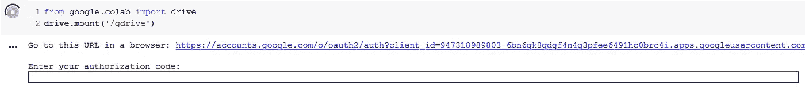

跟随 URL，选择您用来访问数据集的 Google 帐户，并向您的驱动器授予 Colab 权限。将授权码粘贴到单元格输出的文本框中，您将得到消息`Mounted at /gdrive`。

然后我们导入所有必要的库:

```
import cv2
import glob
import matplotlib.pyplot as plt
import numpy as np
from PIL import Image
import random
from tqdm.notebook import tqdmnp.random.seed(1)
```

我们的笔记本现在设置好了！

# 从驱动器读取图像

如果您正在使用本文中共享的链接中的数据，那么您的路径将是`‘/gdrive/**Shared with me**/LeafImages/color/Grape*/*.JPG’`。

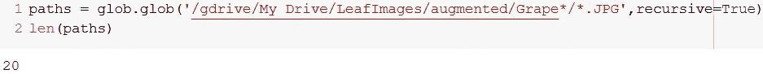

那些遵循第一部分并使用整个训练集的人应该看到 4062 条路径。

接下来，我们从路径中加载图像，并将它们保存到 NumPy 数组中:

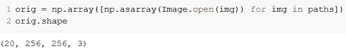

(20，256，256，3)的形状表示我们有 20 个 256x256 大小的图像，有三个颜色通道。

让我们看看这些图像是什么样子的:

```
plt.figure(figsize=(9,9))for i, img in enumerate(orig[0:16]):
    plt.subplot(4,4,i+1)
    plt.xticks([])
    plt.yticks([])
    plt.grid(False)
    plt.imshow(img)plt.suptitle("Original", fontsize=20)
plt.show()
```

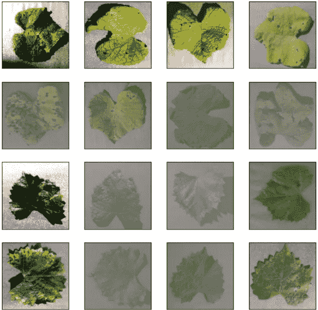

原始图像

# 灰度等级

分割的第一步是将图像转换成灰度。灰度化是从图像中移除颜色并仅通过强度来表示每个像素的过程，0 表示黑色，255 表示白色。

OpenCV 让这变得简单:

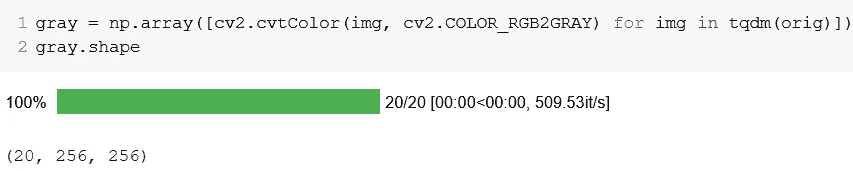

我们可以从形状中看出颜色通道已经被移除。

显示转换后的图像:

```
plt.figure(figsize=(9,9))for i, img in enumerate(gray[0:16]):
    plt.subplot(4,4,i+1)
    plt.xticks([])
    plt.yticks([])
    plt.grid(False)
    plt.imshow(cv2.cvtColor(img, cv2.COLOR_GRAY2RGB))plt.suptitle("Grayscale", fontsize=20)
plt.show()
```

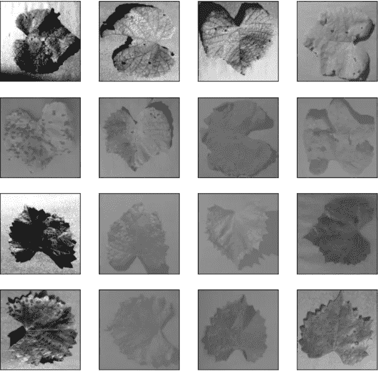

灰度图像

在第一幅图像中，我们可以看到第一个像素(左上角)是白色的，而左下角的像素是黑色的。这可以通过检查第一幅图像的像素阵列来验证:

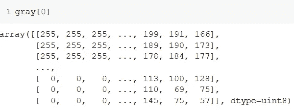

事实上，左上角的像素是白色(255)，左下角的像素是黑色(0)。

# 阈值处理

在图像处理中，阈值处理是从灰度图像创建二值图像的过程。二进制图像的像素只能有两个值，即 0(黑色)或 255(白色)。

在最简单的阈值情况下，您选择一个值作为阈值，任何高于该值的像素都变成白色(255)，而任何低于该值的像素都变成黑色(0)。查看 [OpenCV 图像阈值处理文档](https://opencv-python-tutroals.readthedocs.io/en/latest/py_tutorials/py_imgproc/py_thresholding/py_thresholding.html)了解更多类型和相关参数。

```
thresh = [cv2.threshold(img, np.mean(img), 255, cv2.THRESH_BINARY_INV)[1] for img in tqdm(gray)]
```

传递给`cv2.threshold()`的第一个参数是要转换的灰度图像，第二个是阈值，第三个是当像素超过阈值时分配给像素的值，最后是阈值类型。

`cv2.threshold()`返回两个值，第一个是使用`cv2.THRESH_OTSU`时自动计算的最佳阈值，第二个是实际的阈值对象。因为我们只关心对象，所以我们下标`[1]`来在我们的`thresh`列表中只追加第二个返回值。

你可以选择一个静态阈值，但这样就无法考虑不同照片的不同光照条件。我选择了`np.mean()`，它给出了图像像素的平均值。较亮的图像的值将大于 127.5 (255/2)，而较暗的图像的值将较小。这使您可以根据图像的光照条件来设定图像的阈值。

对于第一幅图像，阈值是 126.34，这意味着该图像比平均值稍暗。任何大于此值的像素将被转换为白色，小于此值的像素将被转换为黑色。但是等等！如果你注意到灰度图像，叶子比背景暗。如果我们应用正常的阈值，较暗的像素变成黑色，而较亮的像素变成白色。这将在叶子上应用黑色遮罩，而不是背景。为了解决这个问题，我们使用了`THRESH_BINARY_INV`方法，它反转了阈值处理过程。现在，亮度大于阈值的像素将变成黑色，亮度小于阈值的像素变成白色。

让我们看看第一个阈值图像的像素强度:

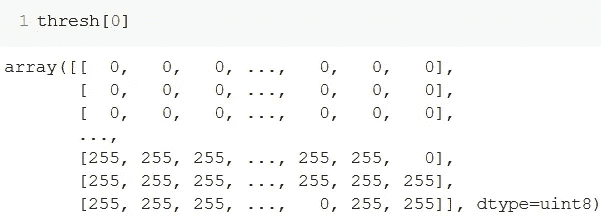

如您所见，灰度阵列中较亮的像素(顶行)现在是黑色的，而较暗的像素(底行)现在是白色的。

让我们看看阈值图像来验证:


# 边缘检测

顾名思义，边缘检测是在图像中寻找对象边界(边缘)的过程。在我们的情况下，它将是白色和黑色像素之间的边界。

OpenCV 允许您使用 [Canny 算法](https://docs.opencv.org/2.4/modules/imgproc/doc/feature_detection.html?highlight=canny)来实现这一点。

```
edges = [cv2.dilate(cv2.Canny(img, 0, 255), None) for img in tqdm(thresh)]
```

扩张是一种噪声去除技术，它有助于将边缘的断开部分连接在一起，以便它们形成连续的轮廓。在这里阅读更多关于边缘检测[中的其他噪声去除技术。你也可以用它们做实验，看看结果是否更好看。](https://opencv-python-tutroals.readthedocs.io/en/latest/py_tutorials/py_imgproc/py_morphological_ops/py_morphological_ops.html)

这里的 0 和 255 分别是下阈值和上阈值。您可以在文档中了解它们的用法。在我们的例子中，因为图像已经设定了阈值，所以这些值并不重要。

让我们绘制边缘:

```
plt.figure(figsize=(9,9))for i, edge in enumerate(edges[0:16]):
    plt.subplot(4,4,i+1)
    plt.xticks([])
    plt.yticks([])
    plt.grid(False)
    plt.imshow(cv2.cvtColor(edge, cv2.COLOR_GRAY2RGB))plt.suptitle("Edges", fontsize=20)
plt.show()
```

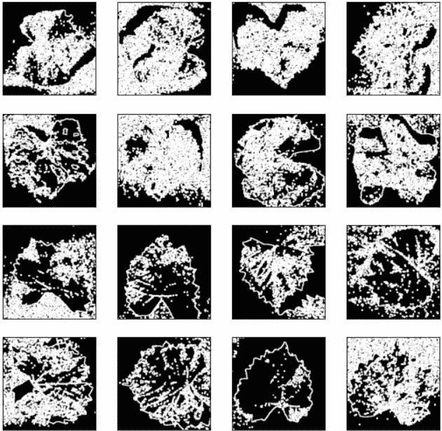

边缘检测

# 屏蔽和分段

终于来了。这涉及到相当多的步骤，所以为了容易理解，我将暂时不列出理解的内容。

遮罩是从图像创建遮罩以应用于另一个图像的过程。我们采用掩模，并将其应用于原始图像，以获得最终的分割图像。

我们想从我们的图像中掩盖背景。为此，我们首先需要找到边缘(已经完成)，然后按面积找到最大的轮廓。假设这将是前景对象的边缘。

```
cnt = sorted(cv2.findContours(img, cv2.RETR_LIST, cv2.CHAIN_APPROX_SIMPLE)[-2], key=cv2.contourArea)[-1]
```

这已经是屈指可数了——我们来解剖一下吧！

首先我们找到所有的轮廓。如果您想了解第二个和第三个参数的细节，那么[文档](https://opencv-python-tutroals.readthedocs.io/en/latest/py_tutorials/py_imgproc/py_contours/py_contours_begin/py_contours_begin.html)还是您的好朋友。这将返回图像、轮廓和轮廓层次。因为我们只需要轮廓，所以我们用`[-2]`对其下标，以检索倒数第二个返回的项目。因为我们必须找到面积最大的轮廓，所以我们将整个函数包装在`sorted()`中，并使用 cv2.contourArea 作为键。因为默认情况下 sorted 按升序排序，所以我们选择最后一个带有`[-1]`的项目，它给出了最大的轮廓。

然后我们创建一个和我们的图像`mask = np.zeros((256,256), np.uint8)`一样大小的黑色画布。我称之为“面具”，因为这将是面具后，前景已被删除。

为了生动化它，我们合并了蒙版上最大的轮廓，并用白色`cv2.drawContours(mask, [cnt], -1, 255, -1))`填充。在我们的例子中，第三个参数`-1`是要绘制的轮廓的数量。因为我们已经选择了最大的轮廓，所以您可以在这里使用 1 或-1(全部)。第二个参数是填充颜色。既然我们有单通道，想用白色填充，那就是`255`。最后是厚度。

既然一张图胜过千言万语，下面这张仓促制作的插图可以让这个过程简单一点，便于理解:

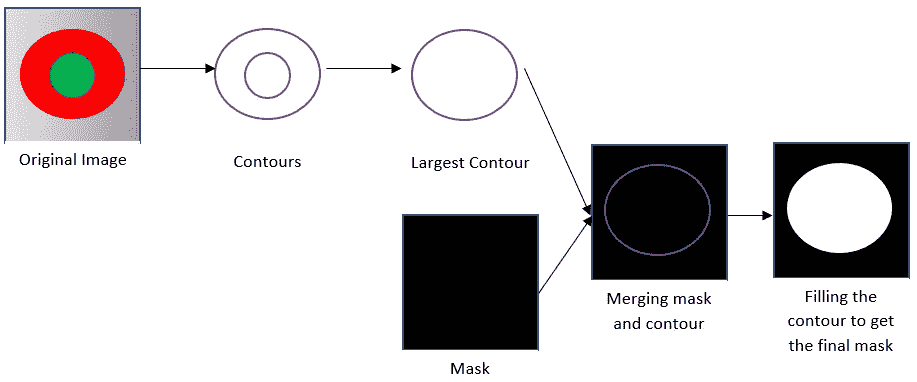

我想你可以猜到最后一步——在原图上叠加最终蒙版，有效去除背景。

这可以使用`bitwise_and`操作来完成。这个[教程](https://www.geeksforgeeks.org/arithmetic-operations-on-images-using-opencv-set-2-bitwise-operations-on-binary-images/)将帮助你理解它实际上是如何工作的。

```
dst = cv2.bitwise_and(orig, orig, mask=mask)
```

现在，我们只需将这一部分放入一个循环中，将所有的遮罩和分割图像附加到它们各自的数组中，这样我们就可以最终看到我们的工作是什么样子了:

```
masked = []
segmented = []for i, img in tqdm(enumerate(edges)):
    cnt = sorted(cv2.findContours(img, cv2.RETR_LIST, cv2.CHAIN_APPROX_SIMPLE)[-2], key=cv2.contourArea)[-1]
    mask = np.zeros((256,256), np.uint8)
    masked.append(cv2.drawContours(mask, [cnt],-1, 255, -1))
    dst = cv2.bitwise_and(orig[i], orig[i], mask=mask)
    segmented.append(cv2.cvtColor(dst, cv2.COLOR_BGR2RGB))
```

绘制遮罩:

```
plt.figure(figsize=(9,9))for i, maskimg in enumerate(masked[0:16]):
    plt.subplot(4,4,i+1)
    plt.xticks([])
    plt.yticks([])
    plt.grid(False)
    plt.imshow(maskimg, cmap='gray')plt.suptitle("Mask", fontsize=20)
plt.show()
```

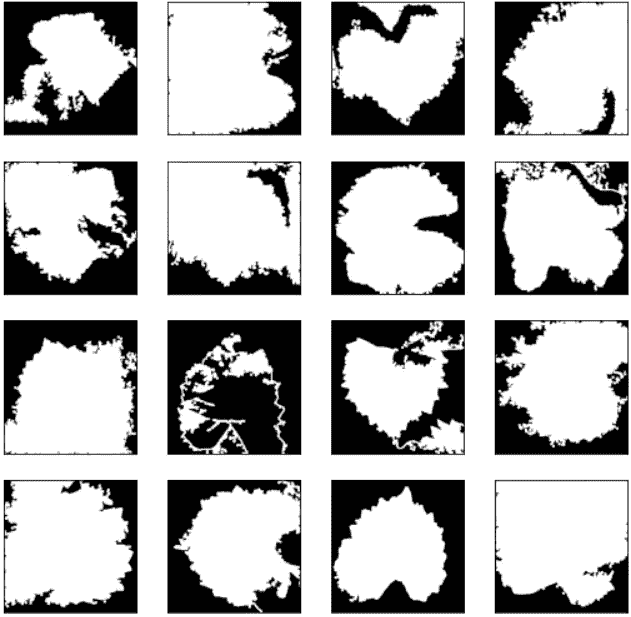

面具

以及最终的分割图像:

```
plt.figure(figsize=(9,9))for i, segimg in enumerate(segmented[0:16]):
    plt.subplot(4,4,i+1)
    plt.xticks([])
    plt.yticks([])
    plt.grid(False)
    plt.imshow(cv2.cvtColor(segimg, cv2.COLOR_BGR2RGB))plt.suptitle("Segmented", fontsize=20)
plt.show()
```

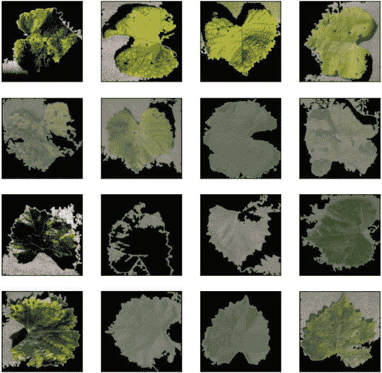

分割图像

然后我们可以最后将这些图像放在一个单独的“分段”文件夹中:

```
import osfor i, image in tqdm(enumerate(segmented)):
    directory = paths[i].rsplit('/', 3)[0] + '/segmented/' + paths[i].rsplit('/', 2)[1]+ '/'
    os.makedirs(directory, exist_ok = True)
    cv2.imwrite(directory + paths[i].rsplit('/', 2)[2], image)
```

# 期待更好的结果？

这只是对该过程的介绍——我们没有深入研究参数，因此结果远非完美。尝试找出哪一步引入了失真，并思考如何改进这一步。正如我前面所说的， [OpenCV 图像处理教程](https://docs.opencv.org/master/d2/d96/tutorial_py_table_of_contents_imgproc.html)是一个很好的起点。

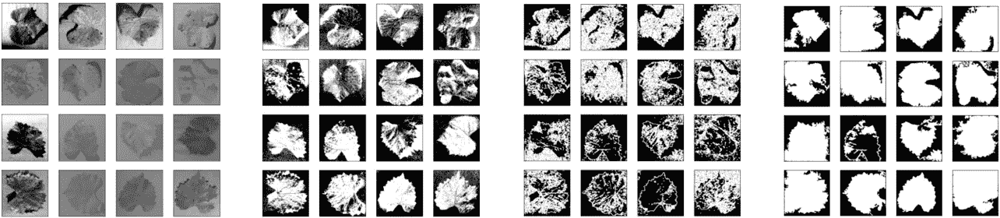

灰度>阈值>边缘>蒙版

我很想在评论中看到你的结果，并了解你是如何实现的！

# 敬请关注…

你可以在这里找到我用的[的 Colab 笔记本](https://colab.research.google.com/drive/1ZrSlb0X11eGTy9SpSJAXuSaSkSmy70VX?usp=sharing)。

三部曲的第二部到此结束。请继续关注最后一部分，我们将使用这些分割图像来训练一个非常基本的图像分类器。它的链接将在发布后添加到这里。

感谢阅读，花束和砖块欢迎！

Medium 仍然不支持向印度以外的作者支付费用。如果你喜欢我的内容，你可以给我买杯咖啡:)

[](https://www.buymeacoffee.com/siddhantsadangi) [## Siddhant Sadangi 正在 Streamlit 上创建 python 网络应用程序

### 嘿👋我刚刚在这里创建了一个页面。你现在可以给我买杯咖啡了！

www.buymeacoffee.com](https://www.buymeacoffee.com/siddhantsadangi)