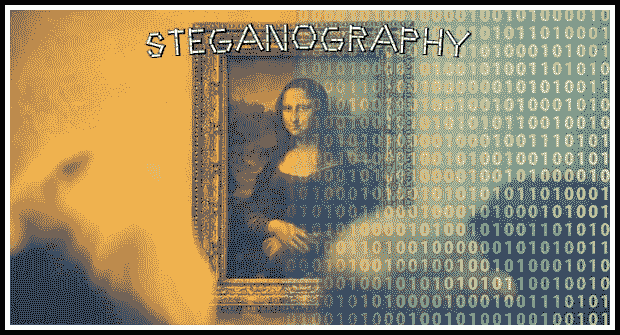
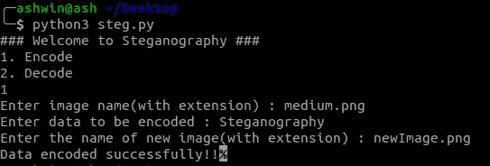
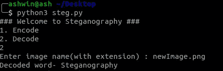

# 如何使用 Python 隐藏图像中的数据

> 原文：<https://betterprogramming.pub/image-steganography-using-python-2250896e48b9>

## 学习图像隐写术



***隐写术*** 是在任何文件中隐藏秘密数据的艺术。

秘密数据可以是任何格式的数据，如文本，甚至是文件。简而言之，隐写术的主要动机是在任何文件(通常是图像、音频或视频)中隐藏预期信息，而不实际改变文件的外观，即它应该看起来和以前一样。

在这篇博客中，我们将重点学习基于图像的隐写术，即在图像中隐藏秘密数据。

但是在深入研究之前，让我们先看看图像是由什么组成的。

1.  像素是图像的组成部分。
2.  每个像素包含三个值:(红、绿、蓝)也称为 RGB 值。
3.  每个 RGB 值的范围从 0 到 255。

这么多信息，足够入门了。

现在，让我们看看如何将数据编码和解码到我们的图像中。

# 编码

有很多算法可以用来将数据编码到图像中，事实上，你也可以自己制作一个。这个博客中使用的方法也很容易理解和实现。

算法如下:

1.  对于数据中的每个字符，取其 ASCII 值并转换为 8 位二进制[1]。
2.  一次读取三个像素，总共具有 3*3=9 个 RGB 值。前八个 RGB 值用于存储一个转换为 8 位二进制的字符。
3.  比较相应的 RGB 值和二进制数据。如果二进制数字为 1，则 RGB 值转换为奇数，否则转换为偶数。
4.  第九个值确定是否应该读取更多的像素。如果有更多的数据要读取，即编码或解码，则第九个像素变为偶数。否则，如果我们想进一步停止读取像素，那么就使它成为奇数。

重复此过程，直到所有数据都编码到图像中。

## **示例**

假设要隐藏的消息是`‘Hii’`。

消息有三个字节，因此，编码数据所需的像素是 3×3 = 9。考虑总共具有 12 个像素的 4×3 图像，这足以编码给定的数据。

```
[(27, 64, 164), (248, 244, 194), (174, 246, 250), (149, 95, 232),
(188, 156, 169), (71, 167, 127), (132, 173, 97), (113, 69, 206),
(255, 29, 213), (53, 153, 220), (246, 225, 229), (142, 82, 175)]
```

# ***第一步***

`H`的 ASCII 值是 72，它的二进制等价物是`01001000`。

# ***第二步***

读取前三个像素。

```
(27, 64, 164), (248, 244, 194), (174, 246, 250)
```

# ***第三步***

现在，将像素值更改为奇数表示 1，偶数表示 0，就像数据的二进制等效形式一样。

比如第一个二进制数字是`0`，第一个 RGB 值是`27`，需要转换成偶数，隐含`26`。

类似地，`64`被转换成`63`，因为下一个二进制数字是`1`，所以 RGB 值应该是奇数。

因此，修改后的像素是:

```
(26, 63, 164), (248, 243, 194), (174, 246, 250)
```

# ***第四步***

由于我们要编码更多的数据，最后一个值应该是偶数。同样，`i`也可以编码在这个图像中。

当通过+1 或-1 使像素值成为奇数/偶数时，应该注意二进制条件。即像素值应该大于或等于 0 并且小于或等于 255。

新图像将看起来像:

```
[(26, 63, 164), (248, 243, 194), (174, 246, 250), (148, 95, 231),
(188, 155, 168), (70, 167, 126), (132, 173, 97), (112, 69, 206),
(254, 29, 213), (53, 153, 220), (246, 225, 229), (142, 82, 175)]
```

# 解码

对于解码，我们将试图找到如何逆转以前的算法，我们用来编码数据。

1.  同样，一次读取三个像素。前 8 个 RGB 值给我们关于秘密数据的信息，第 9 个值告诉我们是否向前移动。
2.  对于前八个值，如果值为奇数，那么二进制位为`1`，否则为`0`。
3.  这些位被连接成一个字符串，每三个像素，我们得到一个字节的秘密数据，这意味着一个字符。
4.  现在，如果第九个值是偶数，那么我们继续一次读取三个像素，否则，我们停止。

## **例如**

让我们开始一次读取三个像素。

考虑我们先前编码的图像。

```
[(26, 63, 164), (248, 243, 194), (174, 246, 250), (148, 95, 231),
(188, 155, 168), (70, 167, 126), (132, 173, 97), (112, 69, 206),
(254, 29, 213), (53, 153, 220), (246, 225, 229), (142, 82, 175)]
```

# ***第一步***

我们首先读取三个像素:

```
[(26, 63, 164), (248, 243, 194), (174, 246, 250)
```

# ***第二步***

读取第一个值:`26`，为偶数，因此二进制位为`0`。同样，对于`63`，二进制位是`1`，对于`164`是`0`。这个过程一直持续到第八个 RGB 值。

# ***第三步***

在连接所有单个二进制值之后，我们最终得到二进制值:`01001000`。最终的二进制数据对应的是十进制值 72，在 ASCII 码中代表字符`H`。

# ***第四步***

由于第九个值是偶数，我们重复上述步骤。当遇到的第九个值是奇数时，我们停止。

结果，我们得到了原来的消息`Hii`。

上述算法的 Python 程序如下:

程序中使用的模块是 [PIL](https://www.pythonware.com/products/pil/) ，代表 *Python 映像库*。它让我们能够在 Python 中对图像执行操作。

# ***程序执行***



数据编码



数据解码

## ***输入图像***


medium.png

## ***输出图像***


newImage.png

# **限制**

这个程序可能无法像预期的那样处理 JPEG 图像，因为 JPEG 使用[有损压缩](https://en.wikipedia.org/wiki/Lossy_compression)，这意味着像素被修改以压缩图像并降低质量，因此会发生数据丢失。

# **参考文献**

1.  [https://www . geeks forgeeks . org/program-decimal-binary-conversion/](https://www.geeksforgeeks.org/program-decimal-binary-conversion/)
2.  [https://www.geeksforgeeks.org/working-images-python/](https://www.geeksforgeeks.org/working-images-python/)
3.  [https://dev . to/erikwhiting 88/let-s-hide-a-secret-message-in-a-image-with-python-and-opencv-1jf 5](https://dev.to/erikwhiting88/let-s-hide-a-secret-message-in-an-image-with-python-and-opencv-1jf5)
4.  这里可以找到一段代码及其依赖关系:[https://github.com/goelashwin36/image-steganography](https://github.com/goelashwin36/image-steganography)

不要忘记留下一些掌声，以防你喜欢这个博客

*我们连线吧？*

*LinkedIn:*[*https://linkedin.com/in/ashwigoel*](https://linkedin.com/in/ashwigoel)

*网址:*[*https://ashwingoel.com*](https://ashwingoel.com)

*邮件:*[*goelashwin36@gmail.com*](mailto:goelashwin36@gmail.com)