# 图像风格转换 CoreML 模型训练

> 原文：<https://betterprogramming.pub/image-style-transfer-a510edcb2aa5>

## 使用 CreateML 和 Turi Create

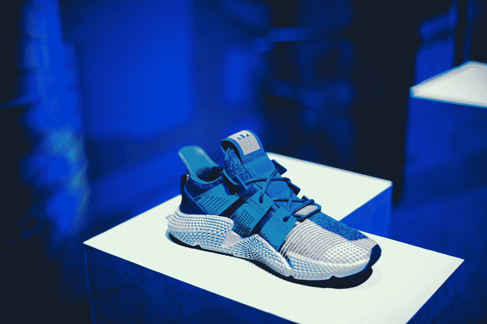

由 [Unsplash](https://unsplash.com?utm_source=medium&utm_medium=referral) 上的 [CHUTTERSNAP](https://unsplash.com/@chuttersnap?utm_source=medium&utm_medium=referral) 拍摄

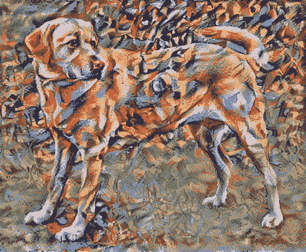

内容图像。黄色拉布拉多寻找，从维基共享精灵。许可证 CC BY-SA 3.0

给定两个图像，样式转移技术允许您在保留内容的同时将样式从一个图像转移到另一个图像。

内容图像。黄色拉布拉多寻找，从维基共享精灵。许可证 CC BY-SA 3.0

生成的图像将由第一个图像的内容(内容图像)与第二个图像的样式(样式引用)合并而成，如下所示:

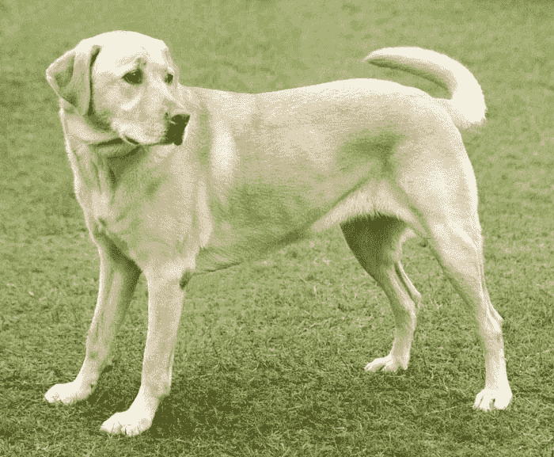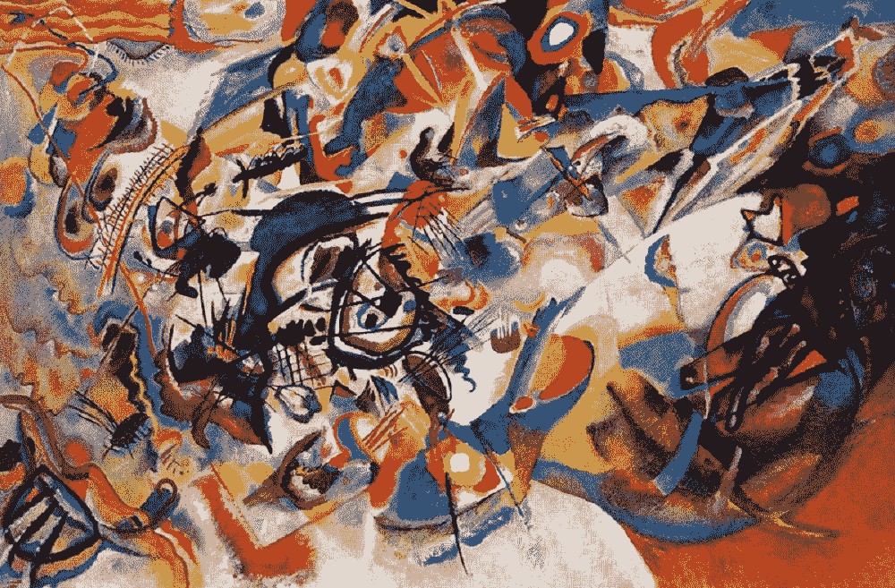

风格参考。

在本文中，我们将学习如何创建一个机器学习模型，并训练它应用风格转移技术。我们将使用两种方法，使用 CreateML 和 Turi Create。

# 创建 ML

要使用 Create ML，必须安装 Xcode。安装后，打开创建 ML，方法是从菜单栏转到 Xcode >打开开发者工具>创建 ML。

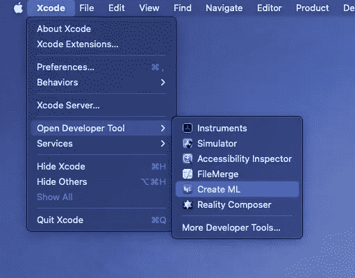

Xcode 菜单栏。

点击新建文档。从可用模板中选择“风格转换”。单击下一步。为项目选择一个名称，然后单击下一步。选择一个文件夹来保存您的项目。

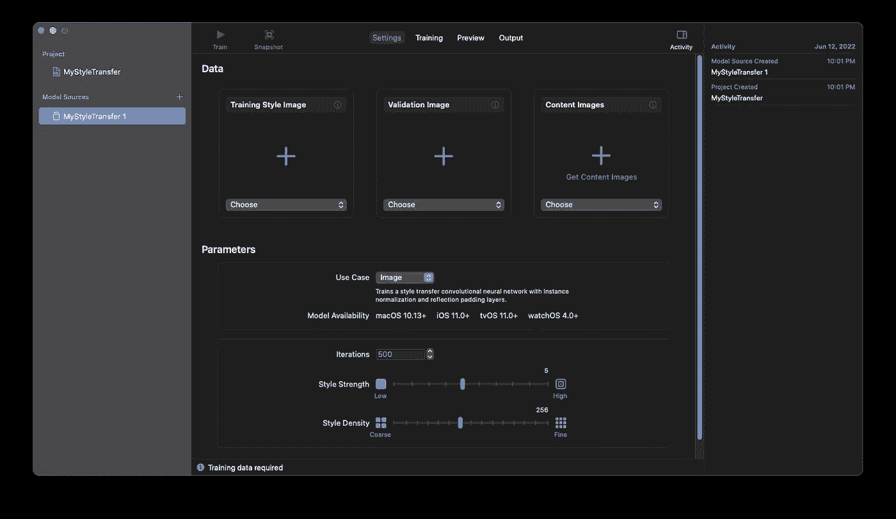

空核心 ML 样式转移项目

要创建和训练模型，您需要:

*   训练风格图像:包含要转换的风格的图像。
*   验证图像:将接收样式的图像。
*   内容图像:用于训练模型的一组示例图像。

对于内容图像，我们将使用一个图像库 [val2017](http://images.cocodataset.org/zips/val2017.zip) 。下载并解压缩文件。将图像加载到项目中。点击火车。

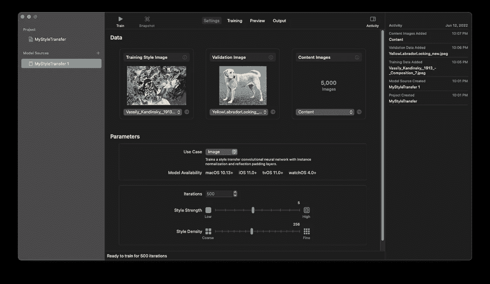

创建 ML 项目时加载的培训样式、验证和内容图像。

耐心点。培训可能需要几个小时。随着模型被训练，我们可以在我们的验证图像中跟踪结果。

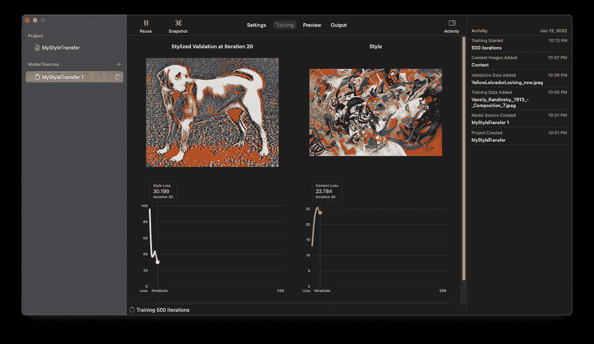

创建 ML 培训流程

# Turi 创建

我们可以使用 [Turi Create](https://github.com/apple/turicreate) 和 [Colab](https://colab.research.google.com/) 来加速样式转换模型的创建。

> “Turi Create 简化了定制机器学习模型的开发。你不必成为机器学习专家，就可以在你的应用程序中添加推荐、对象检测、图像分类、图像相似性或活动分类。”
> 
> —[https://github.com/apple/turicreate](https://github.com/apple/turicreate)
> 
> “Colaboratory，或简称为“Colab”，是谷歌研究院的产品。Colab 允许任何人通过浏览器编写和执行任意 python 代码，特别适合机器学习、数据分析和教育。从技术上来说，Colab 是一种托管的 Jupyter 笔记本服务，无需设置即可使用，同时提供对包括 GPU 在内的计算资源的免费访问。”
> 
> ——【https://research.google.com/colaboratory/faq.html 

去 Collab。在菜单栏上，转到运行时>更改运行时类型。在硬件加速器下选择 GPU。单击保存。

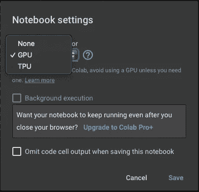

Colab 运行时类型

用下面的代码创建一个代码块。该模块将负责配置参数和下载图像数据集。

*   `image_data_set` : val2017 或 Selfie-dataset 用作内容图像。
*   `style_folder`:保存训练风格图像的文件夹。
*   `test_folder`:你的验证图片。
*   `model_name`:名称。模型和。mlmodel 文件。

将您的训练风格图像(您可以使用多个图像)和验证图像上传到您的 Colab 文件。

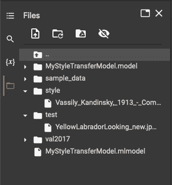

Colab 文件

用下面的内容创建第二个代码块。我们将安装 Turi Create 和 TensorFlow。

用下面的代码创建第三个块。这负责创建模型和执行训练。

应用于验证图像的训练模型的结果在训练过程结束时示出。

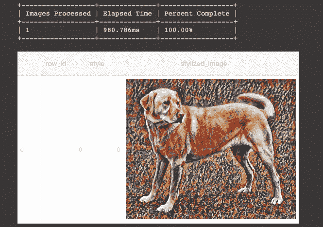

验证图像

## 结果

完整的 colab 笔记本