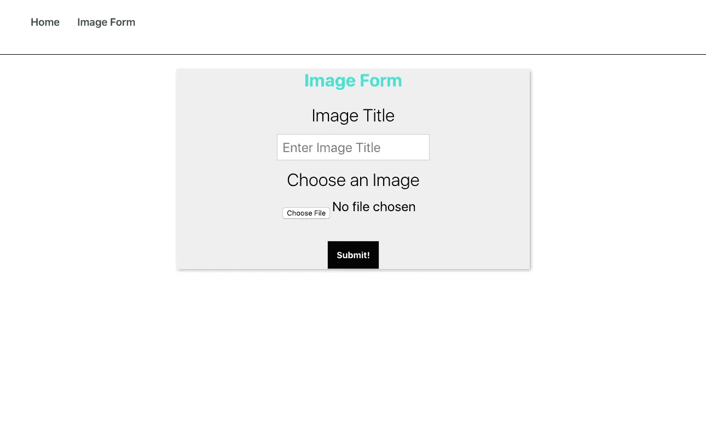
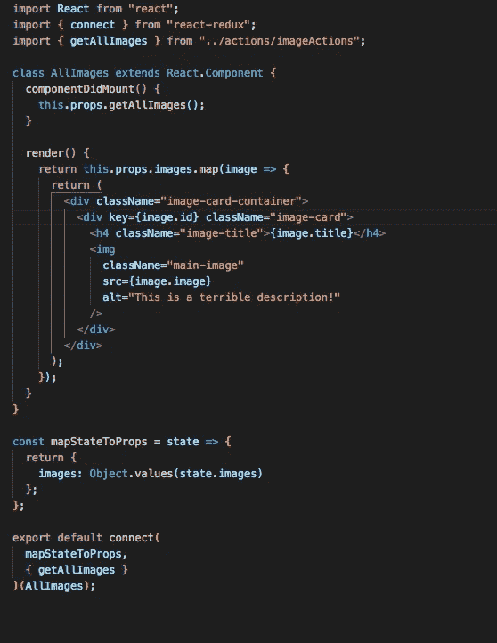

# 如何用 Cloudinary 和 MERN 上传图片，第 1 部分

> 原文：<https://betterprogramming.pub/image-upload-with-cloudinary-mern-f18812d5d023>

## 通过图片上传扩展您的应用程序


照片由 [SHTTEFAN](https://unsplash.com/@shttefan?utm_source=unsplash&utm_medium=referral&utm_content=creditCopyText) 在 [Unsplash](https://unsplash.com/s/photos/clouds?utm_source=unsplash&utm_medium=referral&utm_content=creditCopyText) 上拍摄

你有没有尝试过使用 MERN 堆栈来建立一个博客网站——或者只是一个 CRUD 网站？您是否希望将图像上传到您的应用程序，然后将上传到数据库的图像显示回客户端？

咻，真多。但是今天我将向您展示如何使用 Cloudinary 和 [Multer](https://github.com/expressjs/multer) 来实现这一点。

# **云状**

你会问，什么是云？

Cloudinary 是一种云服务，让您可以轻松地将图像上传到他们的云中，然后会返回一个 URL，我们会将它保存到我们的数据库中，并显示给客户端。

一旦我们付诸行动，就会更有意义。前往[www.cloudinary.com，](http://www.cloudinary.com)创建一个账户。完成后，请务必记下这些凭据:

`Cloud Name, API Key, API Secret`

这些将显示在您的仪表板上。我们稍后在设置后端时将需要这些。

# **创建 React 应用**

好了，让我们从创建前端开始。

为此，我们将使用 create-react-app 来引导 React starter 项目。通过使用 create-react-app，我们将不必担心设置 webpack 或 Babel(因为 create-react-app 在默认情况下会对这些进行分类)。

如果您的机器上还没有全局安装 create-react-app，您需要输入…

```
npm install -g create-react-app
```

…进入您的终端。然后在您的终端中，输入以下命令:

```
npm install create-react-app cloudinary-app
```

`cloudinary-app`将成为您项目的名称——您可以随意命名。

完成后，我们需要进入项目文件夹。为此，在终端中输入`cd cloudinary-app` 。

在项目文件夹中，在终端中输入以下命令:`npm start`。这将启动我们的开发服务器，并在您的浏览器中打开您在 localhost:3000 上的项目。

因为我们已经在前端工作了，所以让我们安装我们需要的库。我们需要 Axios 在前端向我们的后端发出`GET/POST`请求。我们还将使用 Redux(尽管这是一个小应用程序，我们可以在 React 中使用本地状态)。

我知道大多数人希望将它包含在一个更大的项目中，所以我将使用 Redux 进行状态管理。为此，请在您的终端中输入以下命令。

```
npm install axios react-redux redux redux-thunk --save
```

让我们也创建几个文件。这些不是必须的，但是为了跟随教程，它们是为了保持简单。

在`src`文件夹中，创建一个`history.js`文件，并复制以下代码:

```
import { createBrowserHistory } from “history”;export default createBrowserHistory();
```

历史文件将在每条路线中创建一个历史对象作为道具。这让我们可以完全控制浏览器历史。在我们的例子中，这有助于在一个动作之后重定向用户。

现在我们要创建的下一个文件是一个代理文件。这将使我们对服务器的 HTTP 请求更加容易。让我们首先在`src`文件夹中创建一个组件文件夹。在 components 文件夹中，创建一个`AxiosAPI.js`文件，并粘贴以下代码:

```
import axios from “axios”; export default axios.create({ baseURL: “http://localhost:5000" });
```

如果你曾经不得不发出 HTTP 请求，你知道打出长 URL 是一件痛苦的事，所以这使它变得容易得多。我们稍后将回到组件文件夹。

# **Index.js → Redux 商店设置**

现在我们来连线一下我们的 Redux 商店。

首先，让我们转到 CRA 已经生成的`Index.js`文件。在该文件中，用以下代码替换代码。Redux 存储是存储我们所有状态的地方。

```
import React from “react”;import ReactDOM from “react-dom”;import “./index.css”;import App from “./App”;import { Provider } from “react-redux”;import { createStore, applyMiddleware, compose } from “redux”;import reducers from “./reducers”;import reduxThunk from “redux-thunk”;const composeEnhancers = window.__REDUX_DEVTOOLS_EXTENSION_COMPOSE__ || compose; const store = createStore(reducers,    composeEnhancers(applyMiddleware(reduxThunk)));ReactDOM.render(<Provider store={store}>
<App />
</Provider>,document.getElementById(“root”));
```

现在，我们需要创建我们的`reducers`文件夹和`actions`文件夹。

在`src`文件夹下，创建一个`reducers`文件夹和一个`actions`文件夹。让我们首先创造我们的行动。在`actions`文件夹中，创建一个名为`imageActions.js`的新文件。在这个文件中，我们将创建我们的动作，这些动作将被发送到我们的 reducer，告诉 Redux 如何更新我们的应用程序的状态。

## **行动**

在我们创建我们的动作创建者之前，让我们创建我们的`types.js`文件。在`actions`文件夹中创建一个`types.js file`。这不是强制性的，但如果在创建动作创建器时出现了拼写错误，这样做总是一个好习惯。

翻到`imageActions.js`文件。这是我们创建`actions`文件的地方。

```
import { ADD_IMAGE, GET_IMAGES, GET_ERRORS } from “./types”;import AxiosAPI from “../components/AxiosAPI”;import history from “../history”; //ADD IMAGE export const addImage = imageData => dispatch => {
    AxiosAPI.post(“/add”, imageData).then(res => dispatch({
    type: ADD_IMAGE,
    payload: res.data
    })).catch(err => dispatch({
    type: GET_ERRORS,
    payload: err.response.data
    })); history.push(“/”);
    }; //GET ALL IMAGES export const getAllImages = () => dispatch => {
    AxiosAPI.get(“/”).then(res => dispatch({
    type: GET_IMAGES,
    payload: res.data
    })).catch(err => dispatch({
    type: GET_IMAGES,
    payload: null
       }));
    };
```

传入的`imageData`是我们稍后将在表单组件中使用的`formData`，它将是标题和图像。

# **减速器**

现在让我们设置我们的减速器。

因为这是一个小应用程序，所以我们只有一个缩减器。但是由于你们中的许多人可能正在创建更大的应用程序，所以你们很可能有不止一个 reducer，并且必须在你们的`rootReducer`文件中使用`combineReducers`。

无论如何，在我们的`reducers`文件夹中，我们可以继续创建一个`index.js`文件。Reducers 只是普通的 JavaScript 对象。

因此，在`index.js`文件中添加以下代码。如果您也使用 Redux DevTools 来查看 Redux 存储中的数据，这也会很有帮助。将以下代码复制到`imageActions.js`文件中。

```
import { ADD_IMAGE, GET_IMAGES } from “../actions/types”; const initialState = {
     images: []
      }; export default function(state = initialState, action) {
       switch (action.type) {
       case ADD_IMAGE:
       return {…state, images: [action.payload, …state.images]}; case GET_IMAGES:
     return { …state, images: action.payload };
     default:
     return state;
    }
}
```

# **组件**

让我们从表单开始，我们需要使用 connect 将我们的动作创建器连接到表单组件。

在 components 文件夹中创建一个名为`Form.js`的文件。

```
import React from “react”;import { connect } from “react-redux”;import { addImage } from “../actions/imageActions”; class Form extends React.Component {
     constructor(props) {
      super(props);
      this.state = {
      title: “”,
      image: “”
     }; this.onChangeTitle = this.onChangeTitle.bind(this);
  this.onChangeImage = this.onChangeImage.bind(this);
  this.onSubmit = this.onSubmit.bind(this);
  } onChangeTitle = e => {
   this.setState({ title: e.target.value });
   }; onChangeImage = e => {
   this.setState({ image: e.target.files[0] });
   }; onSubmit(e) {
  e.preventDefault(); let formData = new FormData();
  formData.append(“title”, this.state.title);
  formData.append(“image”, this.state.image);
  this.props.addImage(formData);

  this.setState({
  title: “”,
  image: “”
  });
 } render() {
   return (
   <div className=”form-container”>
   <form encType=”multipart/form-data” onSubmit={this.onSubmit}> 
   <h2>Image Form</h2>
   <label className=”form-label”>Image Title</label> <input 
   className=”form-input”
   placeholder=”Enter Image Title”
   type=”text”
   value={this.state.title}
   onChange={this.onChangeTitle}
   />
   <label className=”form-label”>Choose an Image</label> <input type=”file” 
  className=”form-input”
  onChange={this.onChangeImage} />
  <button type=”submit” className=”submit-btn”>Submit!</button>
  </form>
  </div>
  );
    }
  }export default connect(null,{ addImage })(Form);
```

我们在 connect 函数中使用`null`作为第一个参数的原因是因为我们没有传入任何东西。通常我们会通过`mapStateToProps`，你会在`AllImages.js`文件中看到。

这是我们的表单现在应该的样子！



在名为`AllImages.js`的组件下创建另一个文件。这个组件负责显示我们从表单发送到服务器的数据。然后，我们获取从服务器返回的数据，并将其显示在该文件中。希望这有意义。以下是`AllImages.js`的代码:



AllImages.js

我们所有的图像都存储在一个数组中。我们使用动作创建器`getAllImages`从数组中提取数据。我们通过映射数组来实现这一点，它将返回单个图像。`mapStateToProps`正如它所说的那样:将状态映射到我们可以在组件中使用的道具。

这就是我们应用程序的前端。现在我们必须设置我们的后端，这将在本文的第二部分中完成。

[查看本文第 2 部分](https://medium.com/@lawrencegthomas/how-to-upload-images-with-cloudinary-and-mern-part-2-83f8ee31b903)。

这里有一个到 GitHub 库的链接。