# 最佳 Kubernetes 安全性的图像漏洞扫描

> 原文：<https://betterprogramming.pub/image-vulnerability-scanning-for-optimal-kubernetes-security-c3ba933190ef>

## 更轻松地构建容器的防御

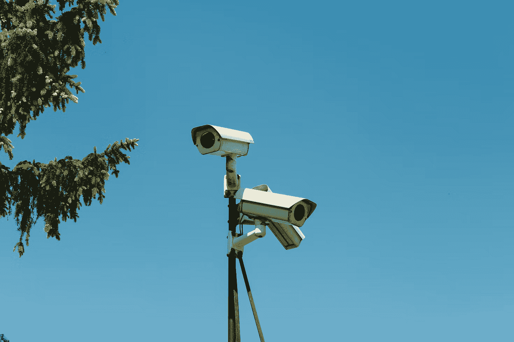

照片来自 Unsplash，作者是@jaqbovsky

安全性的很大一部分涉及集群管理，其中容器安全性在构建云的防线中至关重要。

构建容器时应该牢记最佳设计实践，比如独立于多个包，删除额外的库和函数以保持代码库最小化。对于像我这样的开发人员，我们不太熟悉安全知识，因为我们通常依赖公司安全团队或公共云的保护。

然而，RedHat 的[Kubernetes 2022 年的安全报告](https://www.redhat.com/en/blog/state-kubernetes-security-2022-1)提出了一些令人不安的问题:53%的安全事件是由于配置不当，57%的开发人员在过去 12 个月中担心工作负载安全。

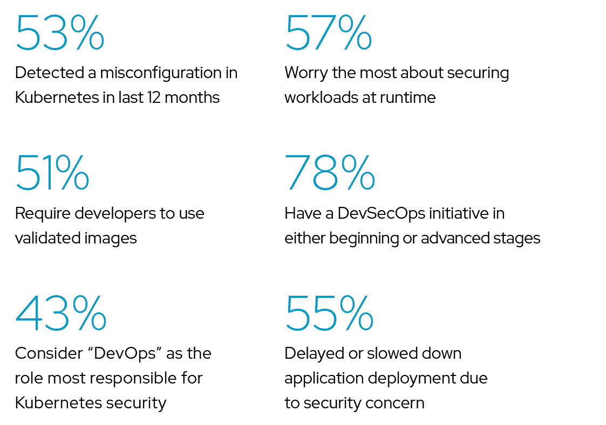

[来源](https://www.redhat.com/en/blog/state-kubernetes-security-2022-1)

是时候配备一些工具来弥补开发者的局限了。为此，我从“装备”工作负载容器和扫描映像漏洞开始。映像的不变性使我们能够轻松地将映像部署、测试和发布到其他环境，这是一个很大的优势，但也带来了潜在的风险:映像及其依赖项变得过时，无法自动更新或修补新的安全漏洞。

当我在 CNCF 社区寻找容器漏洞扫描工具时，我发现了由安全公司 Armo 推出的开源工具 Kubescape。

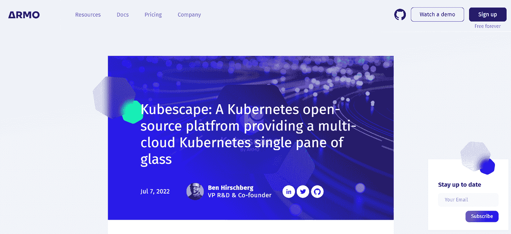

[Kubescape](https://github.com/armosec/kubescape) 通过扫描集群中的资源来检测集群漏洞，提前发现配置错误或漏洞。除了默认的 NSA 和 MITRE 之外，它还支持自定义模板。并且可以集成到像 Jenkins，CircleCI 这样的 CI/CD 工具中。至于检测结果，Kubescape 与 SAAS、CLI 和离线 CLI 配合良好，支持所有场景。

Kubescape 整合了 66 页的 Kubernetes 强化指南中的安全建议，该指南由 NSA/CISA 于 2021 年首次发布，并于 2022 年与 MITRE 等其他安全指南一起更新。

# 如何使用 Kubescape

## 装置

安装 Kubescape CLI。

```
curl -s https://raw.githubusercontent.com/armosec/kubescape/master/install.sh | /bin/bash
```

对于 Mac，也可以用 brew 安装。以下是命令:

```
$ brew tap armosec/kubescape
$ brew install kubescape
# Verify
$ kubescape -v
kubescape version v2.0.161
```

然后，在[集群](https://hub.armosec.io/docs/installation-of-armo-in-cluster)中安装 Kubescape(通过 kind 集群测试)。

```
# Create a kind cluster
kind create cluster --name kubescape-test
# Use the kind cluster
kubectl cluster-info --context kind-kubescape-test

# install helm
curl -fsSL -o get_helm.sh https://raw.githubusercontent.com/helm/helm/main/scripts/get-helm-3\; chmod 700 get_helm.sh; ./get_helm.sh

# Install Kubescape
helm repo add armo https://armosec.github.io/armo-helm/
helm upgrade --install armo  armo/armo-cluster-components -n armo-system --create-namespace --set clusterName=`kubectl config current-context` --set accountGuid=<account ID>
```

验证 Kubescape 在集群中运行良好。

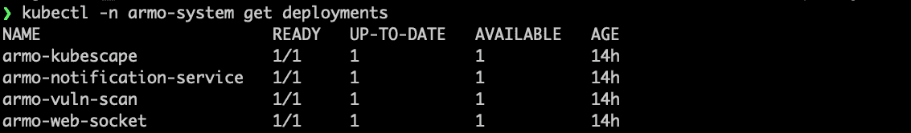

## 扫描

Kubescape 部署了一个 cronjob，默认情况下每 0:00 扫描一次集群的漏洞。

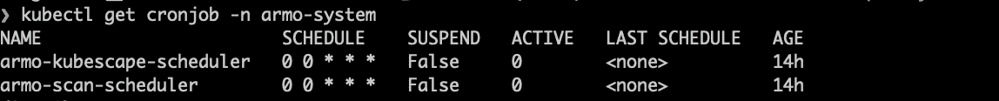

我们可以在相应的门户中看到集群和首次扫描结果。

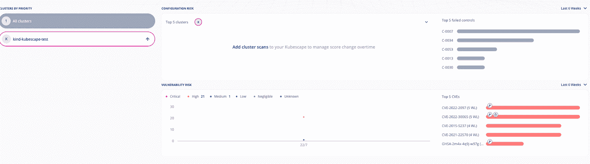

如图所示，当前集群的漏洞和违反协议的代码显示在右侧。详细信息请点击`Image Scanning`。

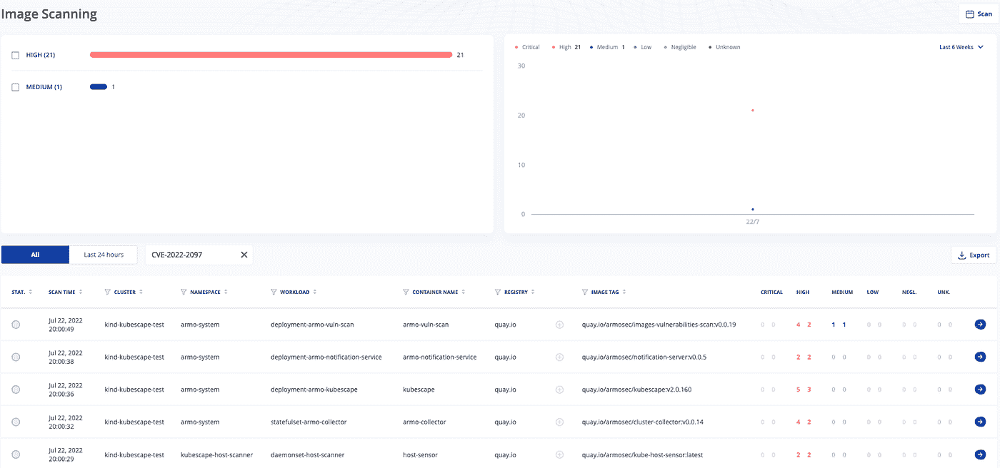

现在来看看具体吊舱的安全漏洞。单击工作负载并跳转到工作负载扫描结果。而通过点击特定的漏洞代码像`CVE-2015–5237`和`GHSA-5ffw-gxpp-mxpf`，我们可以得到更多的细节。

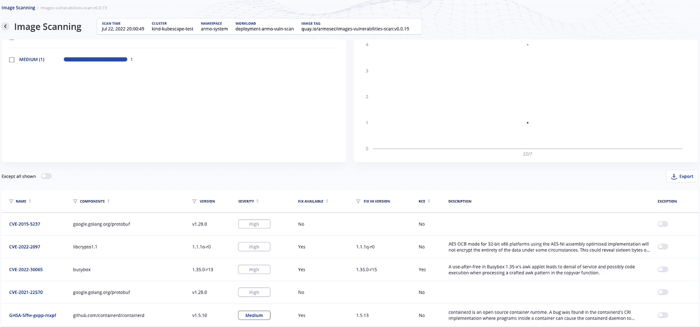

所有这些信息告诉我们如何优化我们的图像。这些漏洞大多来自内部依赖的库，已提供了修复版本。升级到与`FIX IN VERSION`匹配的版本，一切搞定。

然而，并非所有的漏洞扫描结果都是正确的。例如，一些用户将[误报](https://github.com/anchore/grype/issues/558)标记为`CVE-2015–5237`，并提供了测试方法。

# 测试我自己的 YAML

Kubescape 还支持扫描一个或多个 YAML 文件。让我们用我在到完美 Go Dockerfile 文件的[路径中创建的映像(localcache-ms)构建一个部署，并测试它。](/path-to-a-perfect-go-dockerfile-f7fe54b5c78c)

```
# Create deployment YAML
kubectl create deploy test-kubescape --image localcache-ms:v4 --dry-run --output='json' > test-kubescape-localcache.yaml
# Run kubescape scan
kubescape scan test-kubescape-localcache.yaml
```

结果表明，Kubescape 不仅检测到了映像问题，还加强了 Kubernetes 部署的配置。将它们作为一个整体来扫描是一个非常好的策略，因为容器是使用图像的地方。

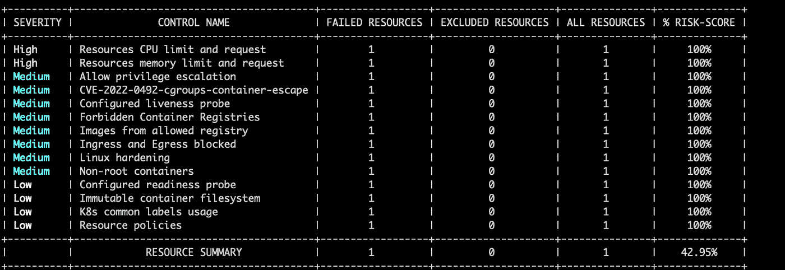

Kubescape 支持六种格式:`pretty-printer`、`json`、`junit`、`prometheus`、`pdf`和`html`，这里默认设置为`pretty-printer`。

# 在幕后

扫描包括两个主要步骤:获取风险相关信息和运行规则后返回结果。

## 风险

让我们从 kubs 逸的线下工作模式中抓取一些线索。

下载它的神器。

```
kubescape download artifacts --output ~/workspace/artifacts
```

检查信息，发现包含了多个 JSON 文件。

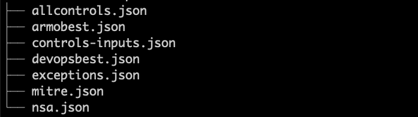

顾名思义，这些 JSON 文件对应的是相关的扫描规则，比如`mitre.json`对应的是 MITRE 相关的漏洞规则。

通过 jq，我们可以查看它包含的控件的名称和 id。

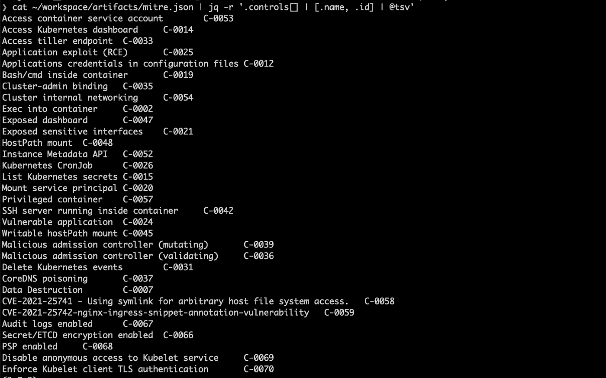

每个控件有一个或多个规则，这些规则写在 OPA [减压阀](https://www.openpolicyagent.org/docs/latest/policy-language/)中。例如，`Bash/cmd inside container C-0019`只有一个规则。

```
$ cat ~/workspace/artifacts/mitre.json | jq -r '.controls[] | select(.name=="Bash/cmd inside container")|.rules[]|.name'

rule-can-bash-cmd-inside-container
```

通过下面的命令，我们可以捕捉到`Bash/cmd inside container`的规则表达式，它主要关注相关的容器。

```
cat ~/workspace/artifacts/mitre.json | jq -r '.controls[] | select(.name=="Bash/cmd inside container")|.rules[]| .rule'
```

它调用 API 来确定是否存在包含 bash 的危险图像。


上述`listOfDangerousArtifacts`配置在`controls-inputs.json`中。

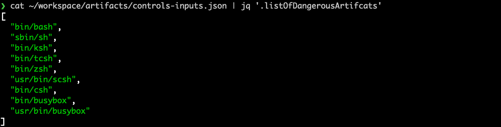

# 密码

当然，真正的验证逻辑还是在 Kubescape 的 [Go 源代码](https://github.com/armosec/kubescape/tree/master/core)里，其中有些部分还没有发布。我们抓住扫描 API 逻辑的线程就够了。

跳过“无聊”的源代码，看看流程图。

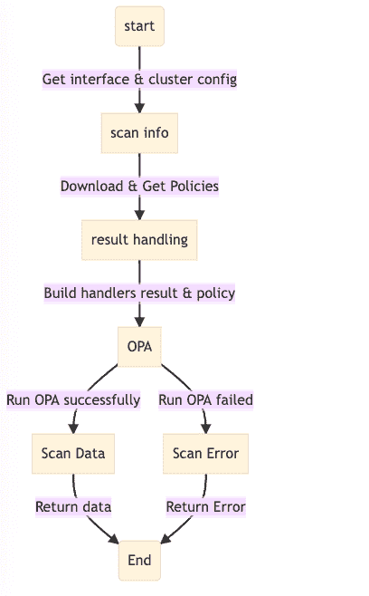

来源:作者

除了核心包之外，Kubescape 还提供了一组 REST APIs，使我们能够通过 HTTP 扫描图像。相关代码在 v1 包中，主要包括三个接口:`/v1/status`、`/v1/scan`、`/v1/results`，使用`scanID`字段获取扫描状态，创建扫描，获取扫描结果。

# 替代和比较

社区中的其他图像漏洞检测工具，如 [Kube-bench](https://github.com/aquasecurity/kube-bench) 和 [Anchore-grype](https://github.com/anchore/grype) 都像 Kubescape 一样参考来自 NSA 或 MITRE 的安全建议，返回类似的扫描结果。然而，它们只支持命令行，不像 Kubescape 那样全面，Kubescape 支持命令行检测、集群内 cronjob、SAAS、REST API、offline 等。

另一个主要区别是，Kubescape 侧重于扫描 Pod/Deploy 和图像，而一些工具只扫描图像。

还有一点要提的，但是更个人化的，我比较欣赏 Kubescape 的 UI 展示，非常直观，轻松定位漏洞细节。

# 结论

容器中的安全风险源于粗心的配置或不充分的映像强化，而这两种风险都是可以预防的。要做到这一点，我们首先需要全面的安全扫描工具，如 Kubescape，以尽早发现风险。其次，相关 DevOps 团队要对容器安全有清晰的认识，并在日常工作中遵循最佳实践。