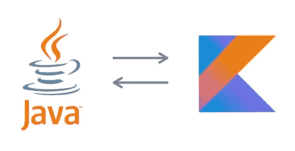

# 用 Java 可选模仿 Kotlin

> 原文：<https://betterprogramming.pub/imitating-kotlin-with-java-optional-9ab1fb8aec53>

## 从爪哇到科特林

`java.util.Optional`的用法有点像[自行车棚对话](https://en.wikipedia.org/wiki/Law_of_triviality)。它已经被广泛地写了，观点也各不相同。

从假设您想将代码迁移到 Kotlin 开始，对于您的 Java 代码来说，哪种风格是最好的可选风格？选择最类似于 [Kotlin 可空性规则](https://kotlinlang.org/docs/null-safety.html)的样式可能是有意义的。

让我们先来看看[可选](https://docs.oracle.com/en/java/javase/11/docs/api/java.base/java/util/Optional.html)(在 [Java8](https://docs.oracle.com/javase/8/docs/api/java/util/Optional.html) 中引入)是做什么的。Optional 是一个对象包装器，提供了安全使用底层对象的方法，同时避免了可怕的空指针异常[。这提供了与 Kotlin 的](https://docs.oracle.com/javase/7/docs/api/java/lang/NullPointerException.html)[可空数据类型](https://kotlinlang.org/docs/null-safety.html#nullable-types-and-non-null-types)基本相同的行为，并允许 Java 模仿 Kotlin 可空数据类型。

Java 没有的是匹配 Kotlin 的非空类型。您不能阻止将`null`赋值给变量。那么我们能做些什么呢？我们可以假设所有不是可选的东西都是非空的——理想情况下，在 ide 和编译器警告中对其进行注释来帮助我们(并且可能使用 [Lombok](https://projectlombok.org/features/NonNull) 来尽我们所能在运行时强制执行它)。

在代码中会是什么样子呢？

## Java 语言(一种计算机语言，尤用于创建网站)

注意:所有的 Java 返回类型和参数都被标记为`@Nonnull`——这意味着我们不希望在代码中看到任何`null`。反而可以用`Optional.empty()`；这是一个更明确的指示，表明不希望出现任何值，而只是缺少值。

## 科特林

对于 Java 来说，这使得到处都是可选的。当一个值可以是`null`时，使用一个可选的来包装它。这适用于返回类型、方法参数和成员变量。

通过遵循这种方法，您可以避免大多数情况下不得不编写`null`。相反，您可以使用可选类提供的方法来操作基础值。一些有用的例子:

*   如果值存在且不为空，则`ifPresent(Consumer<? super T> consumer)`执行`consumer`。
*   `map(Function<? super T, ? extends U> mapper)`使用`mapper`将基础值转换为新的类型。
*   `orElse(T other)`返回基础值，如果基础值为`null`，则返回`other`。这允许您保证检索到非空值。

在 Java [8](https://docs.oracle.com/javase/8/docs/api/java/util/Optional.html) 、 [11](https://docs.oracle.com/en/java/javase/11/docs/api/java.base/java/util/Optional.html) 和 [17](https://docs.oracle.com/en/java/javase/17/docs/api/java.base/java/util/Optional.html) 文档中可以找到更多的选项。

我曾经属于仅返回类型可选的阵营，但是在与 Kotlin 和 Swift 一起工作后，我在任何地方都变成了可选的。

## 这如何适用于集合？

在可能的情况下，当不需要区分空情况和`null`情况时，最好使用空集合而不是`null`集合。如果需要区分`null`和空集(如补丁请求)，可以使用可选的来区分集合的两种状态。

通过遵循这种方法，你的代码库将更接近 Kotlin，并且有额外的好处，可以消除大多数(如果不是全部)你可能会遇到[十亿美元错误](https://www.linkedin.com/pulse/20141126171912-7082046-tony-hoare-invention-of-the-null-reference-a-billion-dollar-mistake/)的情况。

# 特别感谢

*   蒂姆·绍恩贝格
*   阿尔瓦罗·伊巴尔根
*   [普拉得·阿什拉夫·普尔](https://medium.com/u/5668fa40d801?source=post_page-----9ab1fb8aec53--------------------------------)

# 参考

*   [科特林零安全](https://kotlinlang.org/docs/null-safety.html)
*   [Java 11 可选](https://docs.oracle.com/en/java/javase/11/docs/api/java.base/java/util/Optional.html)
*   [杰克森的 JDK8 模块](https://www.baeldung.com/jackson-optional)
*   [在 IntelliJ 中禁用选项作为参数警告](https://stackoverflow.com/questions/36166658/how-to-disable-the-optional-used-as-field-or-parameter-type-warning-in-intelli)