# 使用这些 Visual Studio 代码扩展极大地升级您的开发环境

> 原文：<https://betterprogramming.pub/immensely-upgrade-your-development-environment-with-these-visual-studio-code-extensions-9cd790478530>

## 让我们谈谈代码——Visual Studio 代码

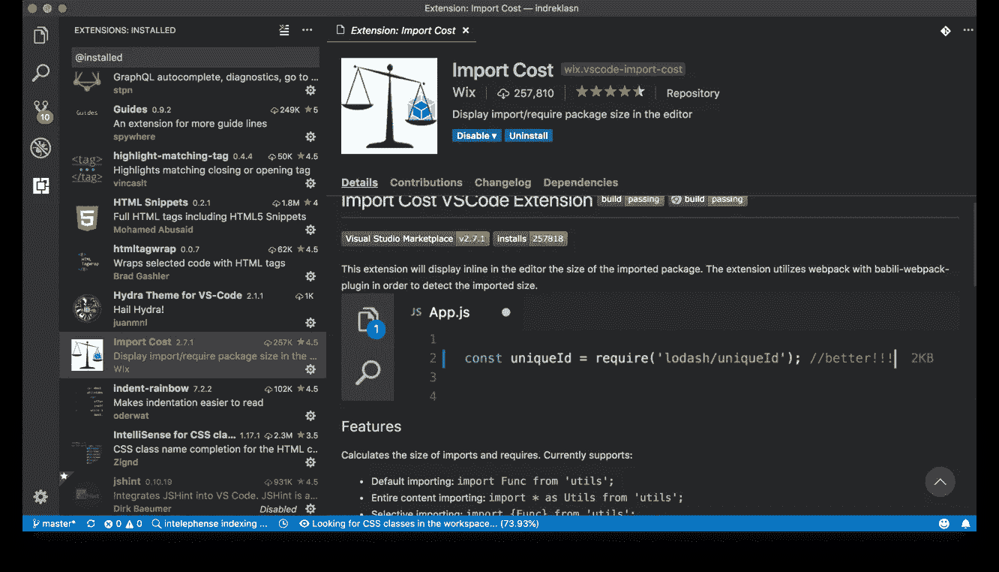

Visual Studio 代码

先说代码——[Visual Studio 代码](https://code.visualstudio.com/)。

我的一些读者要求我写一些我使用的扩展——所以我们开始吧！

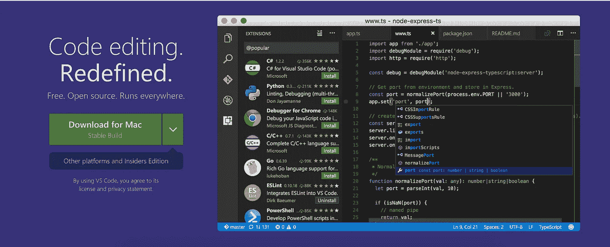

https://code.visualstudio.com/[VSC 下载链接](https://code.visualstudio.com/)

我们的 VSC 将是一只五角激光驱动的独角兽。以下是我每天使用的最有用的扩展！

如果你是 VSC 的新手，点击侧边栏底部的图标来安装扩展。

材料主题

[成为媒介会员直接支持我的工作](https://trevorlasn.medium.com/membership)。你也可以在媒体上看到所有的故事。提前感谢！

# 材料主题

Visual Studio 代码现在最宏大的主题是:

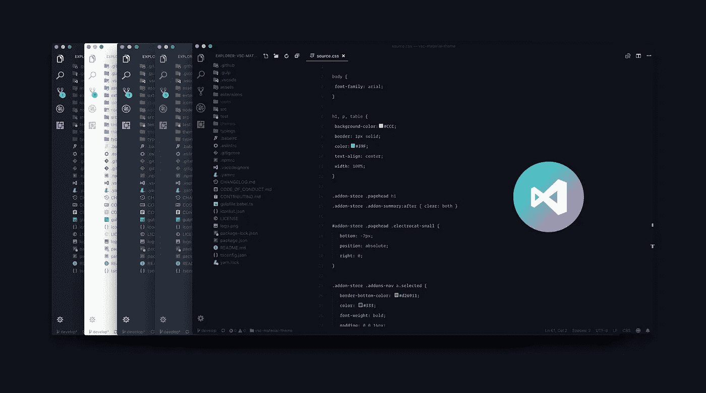

[https://marketplace.visualstudio.com/items?itemName = equinuscio . VSC-material-theme](https://marketplace.visualstudio.com/items?itemName=Equinusocio.vsc-material-theme)

# 自动导入

自动查找、分析并提供所有可用导入的代码操作和代码完成。与[打字稿](https://www.typescriptlang.org/)和 TSX 一起工作。

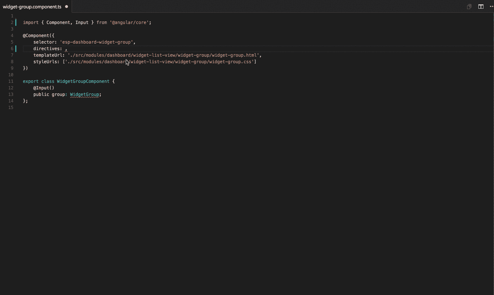

[https://marketplace.visualstudio.com/items?itemName = steoates . auto import](https://marketplace.visualstudio.com/items?itemName=steoates.autoimport)

# 进口成本

这个扩展将在编辑器中以内联方式显示导入包的大小。扩展利用 [Webpack](https://webpack.js.org/) 和 [babili-webpack-plugin](https://www.npmjs.com/package/babili-webpack-plugin) 来检测导入的尺寸。

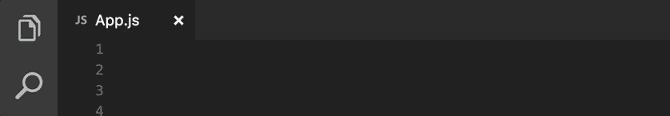

[https://marketplace.visualstudio.com/items?itemName = wix . vs code-import-cost](https://marketplace.visualstudio.com/items?itemName=wix.vscode-import-cost)

# 缩进-彩虹

一个简单的扩展，使缩进更具可读性。

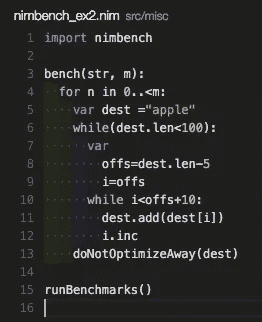

[https://marketplace.visualstudio.com/items?itemName = oder wat . indent-rainbow](https://marketplace.visualstudio.com/items?itemName=oderwat.indent-rainbow)

# HTML 中 CSS 类名的智能感知

一个 VS 代码扩展，它为 HTML `class`属性提供 CSS 类名完成，基于在您的工作区或外部文件中找到的定义，通过`link`元素引用。

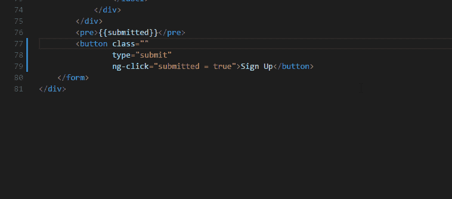

[https://marketplace.visualstudio.com/items?itemName = zig nd . html-CSS-class-completion](https://marketplace.visualstudio.com/items?itemName=Zignd.html-css-class-completion)

# SVG 查看器

预览 SVG 的简单方法。

[https://marketplace.visualstudio.com/items?itemName = cssho . vs code-SVG viewer](https://marketplace.visualstudio.com/items?itemName=cssho.vscode-svgviewer)

# 更漂亮—代码格式化程序

离不开这个！使用[更漂亮的](https://github.com/prettier/prettier)来格式化你的 JavaScript / TypeScript / CSS 的 VS 代码包。

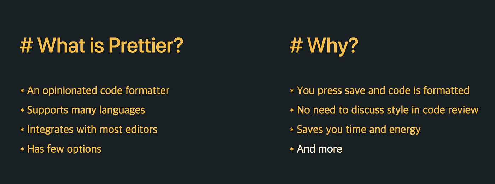

[https://marketplace.visualstudio.com/items?itemName = es benp . prettle-vs code](https://marketplace.visualstudio.com/items?itemName=esbenp.prettier-vscode)

# 反应原生工具

用于[的代码提示、调试和集成命令对原生](https://facebook.github.io/react-native/)做出反应。

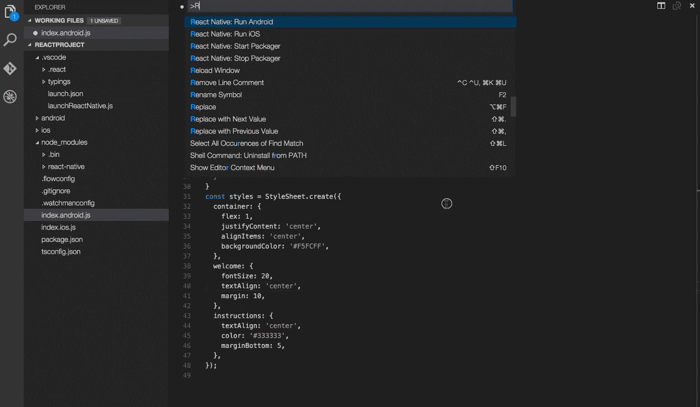

[https://marketplace.visualstudio.com/items?itemName = vs mobile . vs code-react-native](https://marketplace.visualstudio.com/items?itemName=vsmobile.vscode-react-native)

# 升华文本键映射和设置导入程序

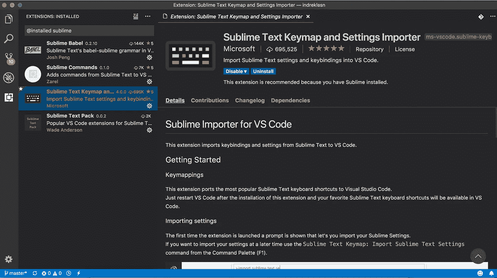

[https://marketplace.visualstudio.com/items?itemName = ms-vs code . sublime-key bindings](https://marketplace.visualstudio.com/items?itemName=ms-vscode.sublime-keybindings)

该扩展将 Visual Studio 代码绑定转换为与 ST3 相同的。旋转一下，试试这个:

`cmd ⌘ + P` — Mac

`ctrl + P` —视窗

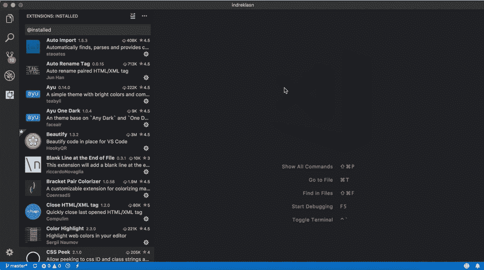

你可以进入文件，如果你在搜索前添加了`>`符号，你就可以搜索操作——比如切换内置终端、安装扩展等等。

对于我们这些习惯了 ST3 捷径的人来说，这是一个巨大的胜利。

# npm 智能感知

在导入语句中自动完成 npm 模块的 VSCode 插件。

[https://marketplace.visualstudio.com/items?itemName = Christian-Kohler . NPM-intellisense](https://marketplace.visualstudio.com/items?itemName=christian-kohler.npm-intellisense)

# Lit-html

在 JavaScript 和 TypeScript 标记的模板字符串中添加 HTML 的语法突出显示和语言支持，正如在 [lit-html](https://github.com/PolymerLabs/lit-html) 和其他框架中使用的那样。

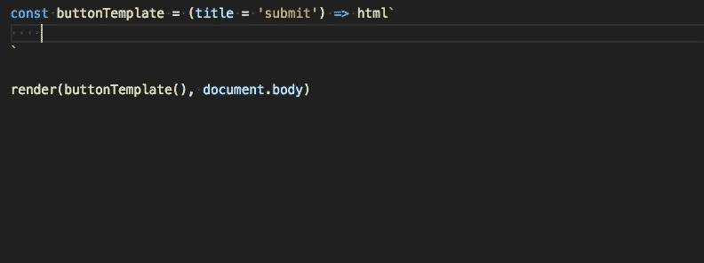

【https://marketplace.visualstudio.com/items? itemName=bierner.lit-html

# GitLens — Git 增压

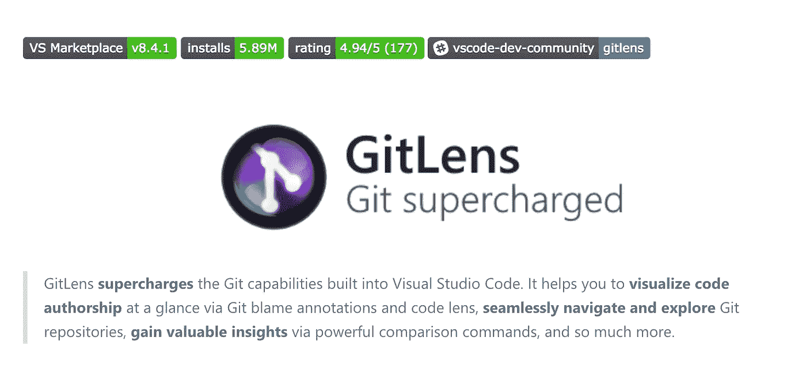

[https://marketplace.visualstudio.com/items?itemName=eamodio.gitlens](https://marketplace.visualstudio.com/items?itemName=eamodio.gitlens)

# Git 项目经理

Git 项目管理器(GPM)是一个 Microsoft VS 代码扩展，它允许您打开一个新窗口，直接从 VS 代码窗口定位 Git 存储库。

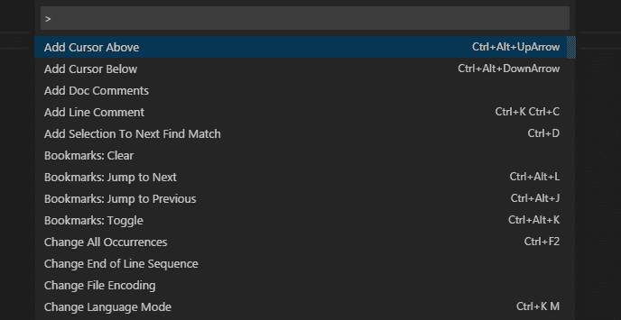

【https://marketplace.visualstudio.com/items? itemName = felipecaputo . git-项目经理

# Git 历史

查看 Git 日志或文件历史，比较分支或提交。

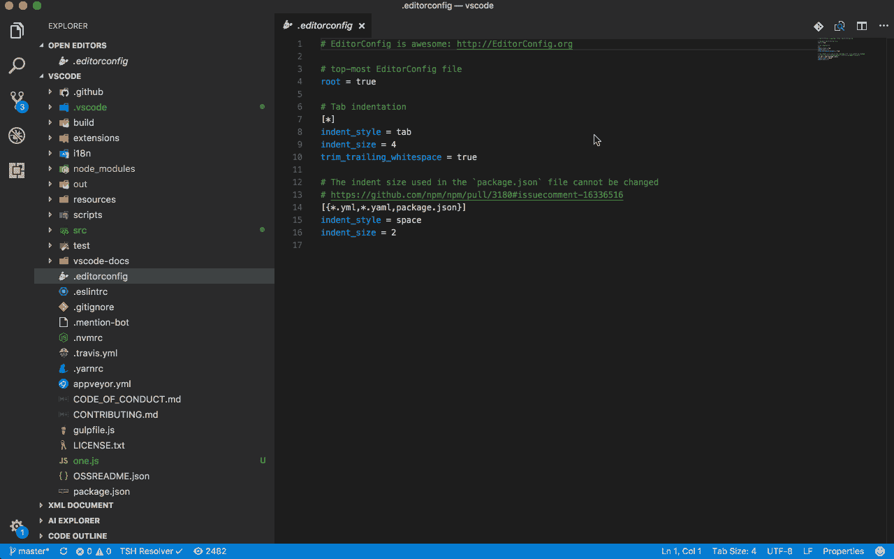

【https://marketplace.visualstudio.com/items? itemName = donjayamanne . git history

# 文件实用程序

创建、复制、移动、重命名和删除文件和目录的便捷方式。

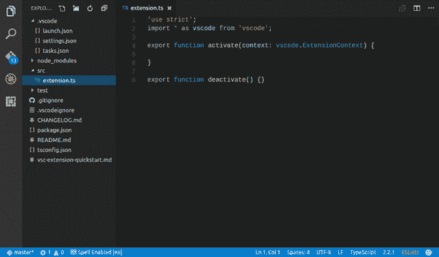

[https://marketplace.visualstudio.com/items?itemName = sleistner . vs code-fileutils](https://marketplace.visualstudio.com/items?itemName=sleistner.vscode-fileutils)

# 括号对着色机

用于匹配括号着色的可定制扩展。在处理大量回调时非常有用。

[https://marketplace.visualstudio.com/items?itemName = Coen raads . bracket-pair-colorizer](https://marketplace.visualstudio.com/items?itemName=CoenraadS.bracket-pair-colorizer)

# 彩色高光

这个扩展设计了文档中的 CSS/web 颜色。

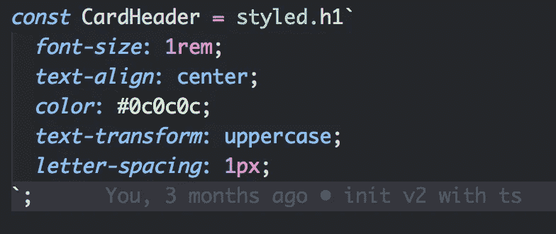

[https://marketplace.visualstudio.com/items?itemName = nau movs . color-highlight](https://marketplace.visualstudio.com/items?itemName=naumovs.color-highlight)

# CSS Peek

允许窥视 CSS ID 和类字符串作为定义，从 HTML 文件到各自的 CSS。允许查看并转到定义。

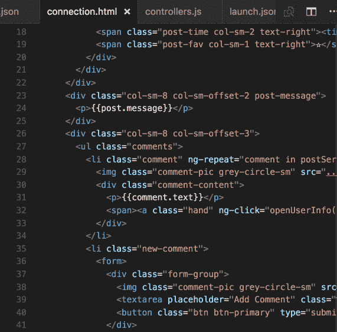

[https://marketplace.visualstudio.com/items?itemName = pranaygp . vs code-CSS-peek](https://marketplace.visualstudio.com/items?itemName=pranaygp.vscode-css-peek)

# Chrome 调试器

在 Chrome 浏览器或任何其他支持 Chrome 调试器协议的目标中调试您的 JavaScript 代码。

[https://marketplace.visualstudio.com/items?itemName = msjsdiag . debugger-for-chrome](https://marketplace.visualstudio.com/items?itemName=msjsdiag.debugger-for-chrome)

# Quokka.js

用于 JavaScript 的 Live Scratchpad(用于快速演示)。

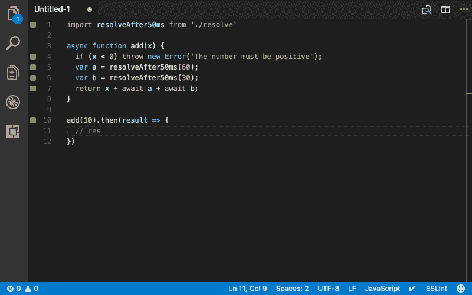

[https://marketplace.visualstudio.com/items?itemName = wallabyjs . quo kka-vs code](https://marketplace.visualstudio.com/items?itemName=WallabyJs.quokka-vscode)

# 结尾空白

突出尾部空格，瞬间删除！

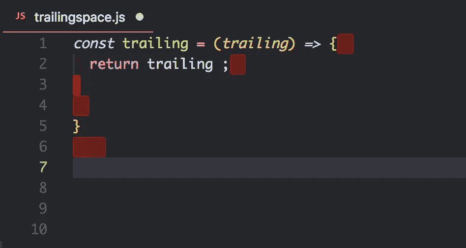

[https://marketplace.visualstudio.com/items?itemName = shard ulm 94 . trailing-spaces # user-content-installation](https://marketplace.visualstudio.com/items?itemName=shardulm94.trailing-spaces#user-content-installation)

# 打字英雄

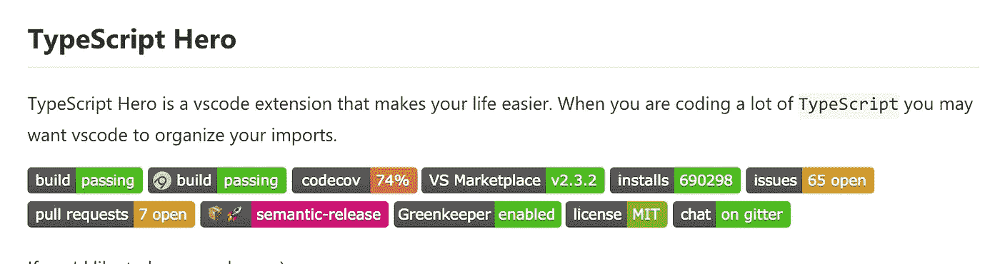

【https://marketplace.visualstudio.com/items? itemName = Rb bit . typescript-hero

# 瓦卡提时间

指标、见解和时间跟踪—从您的编程活动中自动生成。

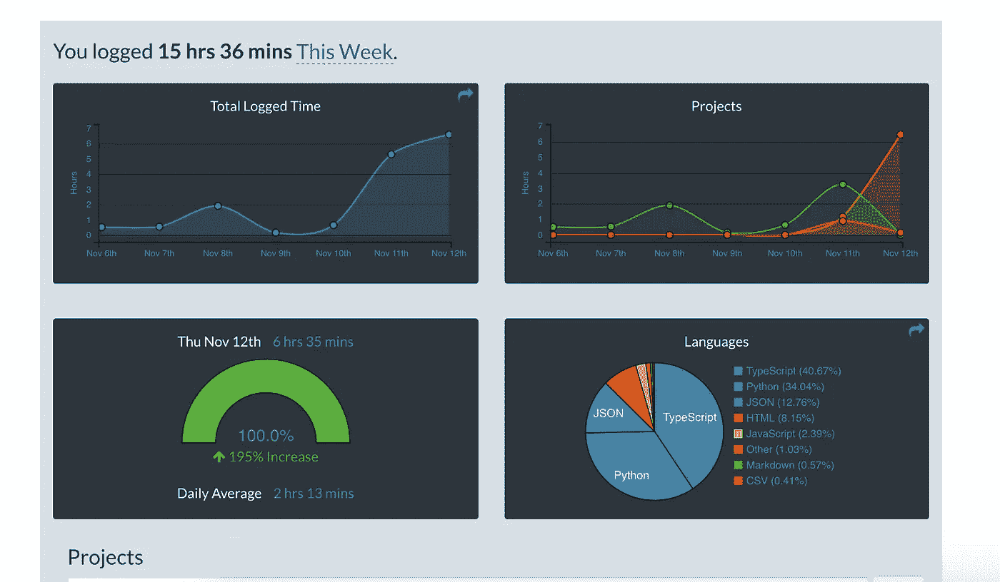

【https://marketplace.visualstudio.com/items? itemName = Waka time . vs code-Waka time

# 韦图尔

VSCode 的 Vue 工具

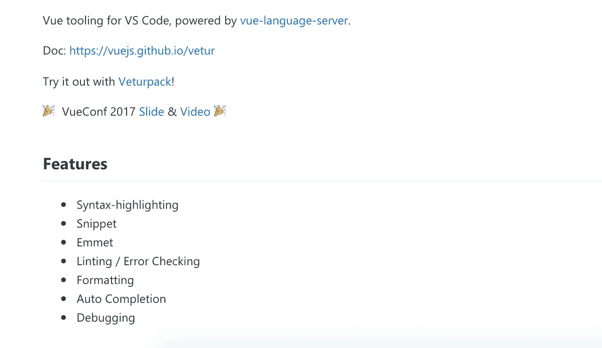

[https://marketplace.visualstudio.com/items?itemName=octref.vetur](https://marketplace.visualstudio.com/items?itemName=octref.vetur)

# 代码运行程序

运行多语言的代码段或代码文件。

[https://marketplace.visualstudio.com/items?itemName = formula Hendry . code-runner](https://marketplace.visualstudio.com/items?itemName=formulahendry.code-runner)

# PHP 智能感知

PHP 的高级自动完成和重构支持。

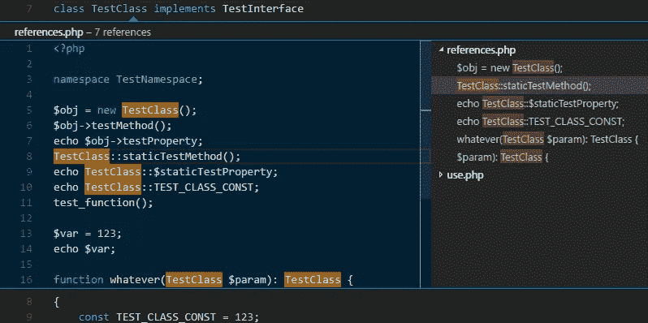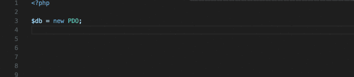

[https://marketplace.visualstudio.com/items?itemName = felixfbecker . PHP-intellisense](https://marketplace.visualstudio.com/items?itemName=felixfbecker.php-intellisense)

# 虚拟代码-图标

VS 代码的图标。

[https://marketplace.visualstudio.com/items?itemName = robertohuertasm . vs code-icons](https://marketplace.visualstudio.com/items?itemName=robertohuertasm.vscode-icons)

# 玩笑

愉快地使用脸书的笑话。

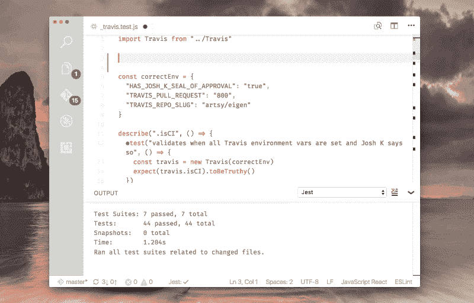

[https://marketplace.visualstudio.com/items?itemName=Orta.vscode-jest](https://marketplace.visualstudio.com/items?itemName=Orta.vscode-jest)

# React.js 代码片段

使用 ES6 语法进行 [React.js](https://reactjs.org/) 开发的代码片段。

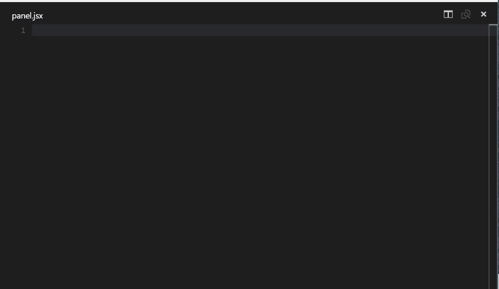

[https://marketplace.visualstudio.com/items?itemName=xabikos。反应钳](https://marketplace.visualstudio.com/items?itemName=xabikos.ReactSnippets)

如果你知道任何方便的扩展，请张贴在下面，我会把它们添加到列表中。

了解我最新内容的最好方式是通过我的[时事通讯](https://wholesomedev.substack.com/welcome)。成为第一个得到通知的人。

我的[简讯](https://wholesomedev.substack.com/welcome)。成为第一个得到通知的人。