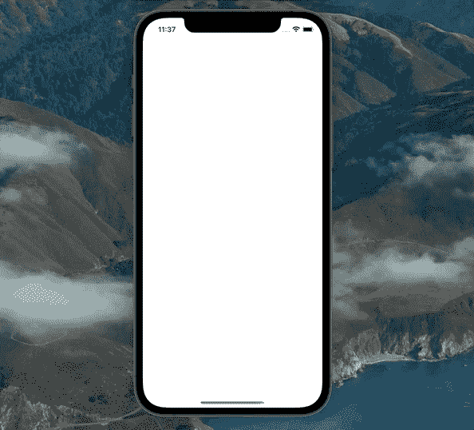
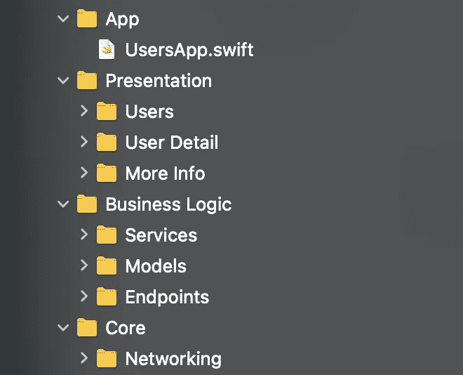
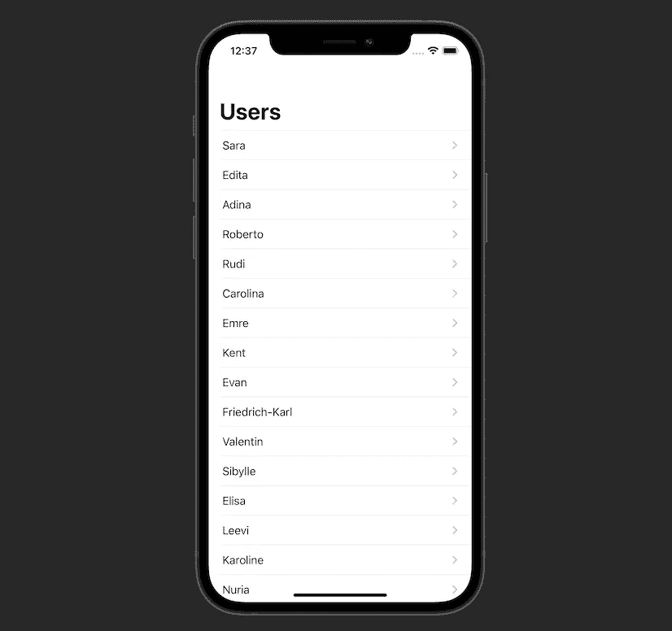
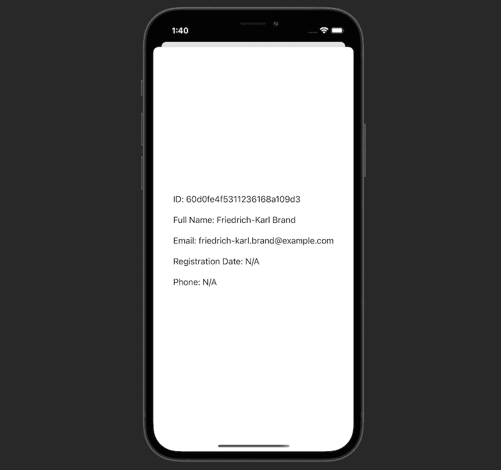

# 用 Combine 在 SwiftUI 中实现一个干净的 MVVM 架构

> 原文：<https://betterprogramming.pub/implement-a-clean-mvvm-architecture-in-swiftui-with-combine-637246fa1342>

## 利用配置器和路由器组件

[于海](https://unsplash.com/@yuhaispace?utm_source=medium&utm_medium=referral)在 [Unsplash](https://unsplash.com?utm_source=medium&utm_medium=referral) 上拍照。

在本文中，我们将学习如何在 SwiftUI 应用中实现一个反应式 MVVM 架构。我们将使用干净架构建议和单一责任原则。

该项目的源代码可以在文章的底部找到。

这是我们将要构建的示例应用程序:

我们将使用一个名为 Dummy API 的免费 REST API:

 [## 虚拟 API

### 拥有虚假数据的全周期 REST/GraphQL 生产 API 服务器，100 个用户，800 多个帖子，1000 条评论，24/7 可用…

dummyapi.io](https://dummyapi.io) 

# 我们开始吧

我们项目的结构如下所示:

以下是`Presentation`层的每个模块包含的组件:

*   `Configurator`:创建一个`View`，并为其提供一个`View Model`。
*   `View`:被动，不包含任何商业逻辑。它唯一的职责是显示 UI 元素。
*   `View Model`:通过拥有`Published`属性并将它们绑定到从`Service`接收的数据来模拟`View`的状态。
*   `Router`:负责导航相关任务。例如，它在一个特定的视图中提供了一个目的地为`View`的`NavigationLink`。

`Business Logic`层由以下组件组成:

*   `Services`:执行业务逻辑，比如获取一个`User`对象的数组，但是不包含`URLSession`这样的底层实现。他们的目标是检索 a `ViewModel`想要处理的特定对象。
*   `Models`:a`Service`为 a `View Model`获取的对象。例如，一个`Codable`结构。
*   `Endpoints`:特定的 REST API 端点。比如用于获取用户的[伪 API](https://dummyapi.io/) 端点。

`Core`层可以包含负责网络和持久性的类。它还可以包含助手扩展。

干净架构的思想是让高层总是依赖于低层，而不是相反。在我们的应用程序中，`Presentation`层依赖于`Business Logic`层，后者依赖于`Core`层。`Core`层对`Business Logic`一无所知。而`Business Logic`完全不知道`Presentation`。

事不宜迟，让我们从底层开始，深入研究实现。

# 核心

该层包含`Endpoint`结构，稍后将在业务逻辑层中用于创建特定的 REST API 基本 URL 和端点:

接下来，我们有一个`Networker`，它专门负责处理`URLSession`并返回一个包含简单`Data`或解码`Codable`模型的`Publisher`:

要了解以上网络组件实现的更多信息，请随意查看我在主题为的[文章。](/implement-a-networking-layer-using-combine-in-swift-5-8a83e3ac9bae?source=friends_link&sk=2f118f61b449ece0f90f16321b53f035)

# 业务逻辑

首先，我们需要定义[虚拟 API](https://dummyapi.io/) 特定的基本 URL:

注意，我们需要在`headers`属性中提供一个应用程序 ID。在[伪 API 网站](https://dummyapi.io)注册账号即可免费获得。

现在，我们添加端点来获取用户和具有所提供 ID 的特定用户:

现在是时候定义我们将在应用程序中使用的模型了。从虚拟 API 返回的 JSON 数据如下所示:

所以我们这样定义`Users`和`User`模型:

我提供了一个扩展来生成一个假的`User`。我们将在稍后的 SwiftUI 预览中使用它。

完成`Models`之后，是时候创建我们的`Services`了。我们需要创建的第一个负责获取一组用户和一个特定用户，并提供`id`:

正如我们所见，`UsersService`依赖于`Networker`组件，它是之前定义的`Core`层的一部分。

现在让我们添加一个类似的`Service`来获取特定用户的图片:

我们已经完成了`Business Logic`层。现在我们终于可以在`Presentation`上工作了。

# 介绍会；展示会

首先，我们要创建这个屏幕:

让我们从这个屏幕的`View Model`开始:

1.  我们有一个`Published`属性，我们的`View`将使用它来呈现一个用户数组。
2.  我们依赖于`UsersServiceProtocol`，一个业务逻辑组件。通过依赖协议而不是具体的类，我们实现了[依赖倒置](https://en.wikipedia.org/wiki/Dependency_inversion_principle)。这允许我们在需要时向`UsersViewModel`提供假服务。我们将调用服务的`getUsers(count:Int)`方法，并将结果绑定到第一步中定义的`users`属性。我们还添加了`cancellables`属性来存储未来的订阅。
3.  如果我们想要初始的`Users`数据，初始化器有一个属性。我们还可以注入一个符合`UsersServiceProtocol`的类。默认情况下，它将是`UsersService`。
4.  我们将在我们的`View`中运行`onAppear()`方法。不知道运行时会发生什么。在幕后，`UsersViewModel`将获取用户并更新`Published`属性。因此，UI 更新将被触发，我们将在屏幕上看到一个用户列表。
5.  这里，我们有一个私有的`getUsers(count: Int)`方法，一旦`View`触发了`onAppear()`方法，这个方法就会运行。

现在我们可以创建实际的`UsersView`来显示用户:

1.  我们提供了对`UsersViewModel`的依赖。
2.  我们添加一个标题为“用户”的`NavigationView`
3.  在`NavigationView`中，我们显示了一个列表，将视图模型的`users`属性作为它的数据。
4.  我们显示一个显示用户名字的`Text`。它嵌入在一个`NavigationLink`中，允许导航到`UserDetailView`，我们将在后面定义。注意，`UsersRouter`提供了这个特定动作的目的地。
5.  一旦`NavigationView`出现，我们就发信号给`UsersViewModel`。在幕后，视图模型将获取用户。

完成`View`和`View Model`之后，现在我们可以定义剩余的组件:`Configurator`和`Router`。

`UsersConfigurator`看起来很简单。它向`UsersView`提供`UsersViewModel`并返回:

我们在`UsersApp`中使用它来设置窗口的初始`View`:

现在让我们添加`UsersRouter`，它负责导航到`UserDetail`屏幕:

如果您还记得的话，我们在`UsersView`的`NavigationLink`中调用了这个方法来获得目的地`View`。在方法内部，我们调用`UserDetailConfigurator`的方法，用提供的`User`对象创建`UserDetailView`。我们将很快定义`UserDetailConfigurator`和`UserDetailView`。

太好了！`Users`模块完成。现在我们可以创建一个`UserDetail`了。

`User Detail`模块显示这个简单的屏幕:

我们从一个`UserDetailViewModel`开始:

1.  就像在`UsersViewModel`中一样，我们也有一个`Published`属性，我们的`UserDetailView`将使用它在屏幕上呈现图像。
2.  我们依赖于在`UsersView`中选择的`User`对象。
3.  类似地，我们有一个`UserPictureServiceProtocol`依赖项和`cancellables`属性。我们将使用该服务来获取用户的照片。
4.  这一次，`onAppear()`方法触发了一个图像加载操作。
5.  私有的`getAvatarData()`方法获得一个`UIImage`，并将其绑定到前面定义的`Published`属性。结果，`UserDetailView`用用户的图像更新。

我们如下实现`UserDetailView`:

1.  与`UsersView`类似，我们对`UserDetailViewModel`有依赖性。
2.  我们添加了一个`State`属性，稍后我们将使用它在屏幕上显示一个包含更多用户信息的模态表。
3.  我们添加了一个`VStack`来垂直显示内容。
4.  `Image`视图被绑定到`UserDetailViewModel`的`Published`属性。一旦获得一个`UIImage`，它将显示在`Image`视图中。
5.  添加了一个`HStack`来显示用户的名字和姓氏。
6.  我们添加了一个“获取更多信息”按钮。点击它会出现一个包含更多用户信息的表单。
7.  当我们点击它时，stateful `showingModalSheet`属性切换，这导致在步骤 8 中显示一个工作表。
8.  类似于我们在`UsersView`中所做的，我们参考`UserDetailRouter`来获得用户执行的按钮点击动作的目的地`View`。
9.  当上面的`VStack`出现在屏幕上时，我们向`UserDetailView`发出开始工作的信号。

`UserDetailConfigurator`和前面定义的`UsersConfigurator`一样简单:

如果您还记得，当我们需要导航到`UserDetailView`并且`NavigationLink`需要目的地`View`时，在`UsersRouter`中调用了`configureUserDetailView()`方法。

当用户点击“获取更多信息”按钮时，`UserDetailRouter`负责提供目的地`View`:

这个方法在`UserDetailView`的`.sheet(isPresented:content:)`方法中被调用。

现在只剩下最后一个屏幕——模态表。我提供它是为了展示我们如何执行模态表示:

`MoreInfoViewModel`仅仅依赖于`User`对象:

在`MoreInfoView`里面，我们没有什么新东西。这看起来很简单:

我们在这里所做的就是在一个`VStack`中显示四个`Text`视图。

`MoreInfoConfigurator`使用提供的`User`对象配置模块:

这个特定的模块没有导航到任何地方，所以我们这里没有`Router`。

# 资源

该项目的源代码可以在 [GitHub](https://github.com/zafarivaev/swiftui-mvvm-clean) 上获得。

# 包扎

太好了！我们已经创建了一个应用程序使用清洁 MVVM 的方法。我们还添加了`Configurator`和`Router`组件，将模块创建和导航任务排除在`View`之外。如果我们在`UserView`和`UserDetailView`中有更多的目的地点，就像在真实的项目案例中一样，`Router`类会更大。同样，如果我们需要更多的依赖来构建某个模块，`Configurator`组件将包含更多的逻辑。

要了解更多关于在 SwiftUI 应用中使用什么架构以及它们如何比较，请查看这篇由 [Alexey Naumov](https://medium.com/u/1c1a0c9cea4?source=post_page-----637246fa1342--------------------------------) 撰写的[的伟大文章](https://medium.com/swlh/clean-architecture-for-swiftui-6d6c4eb1cf6a)。

我希望这个教程对你有用。感谢阅读！