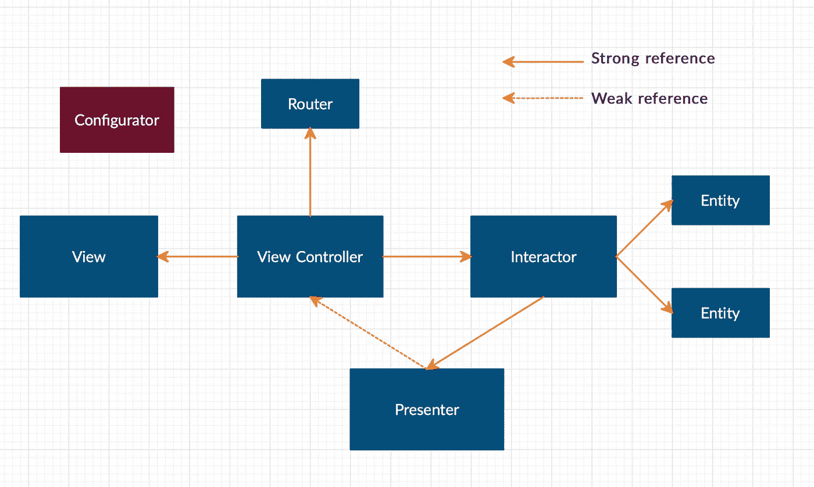
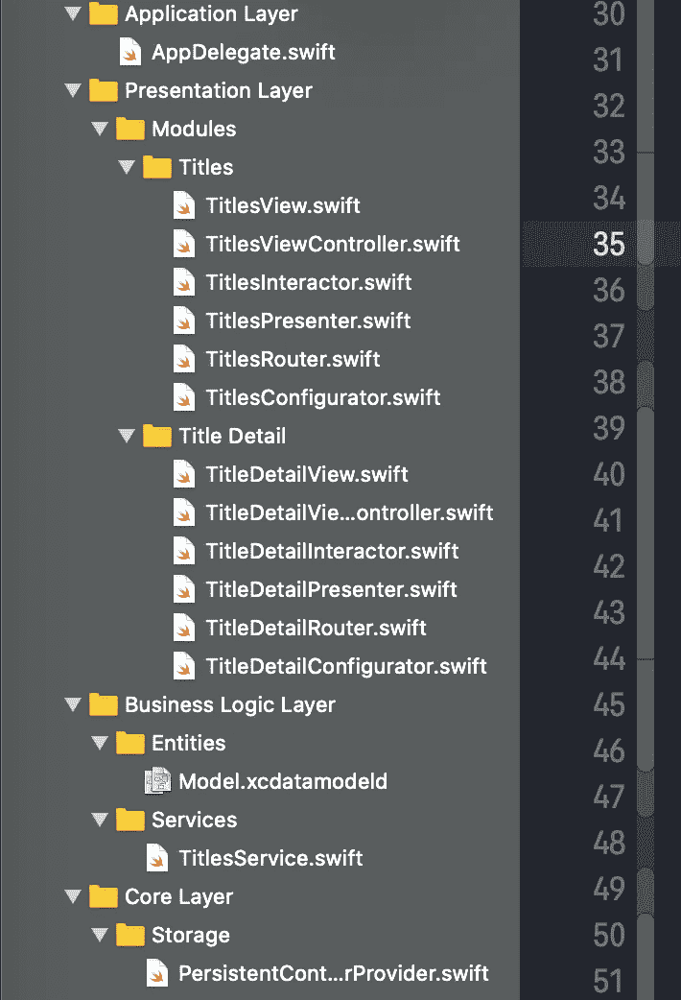
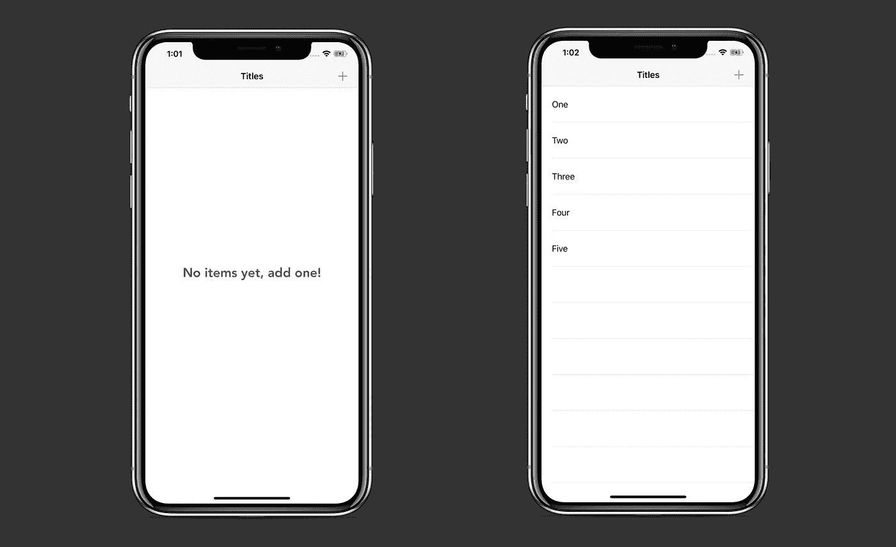
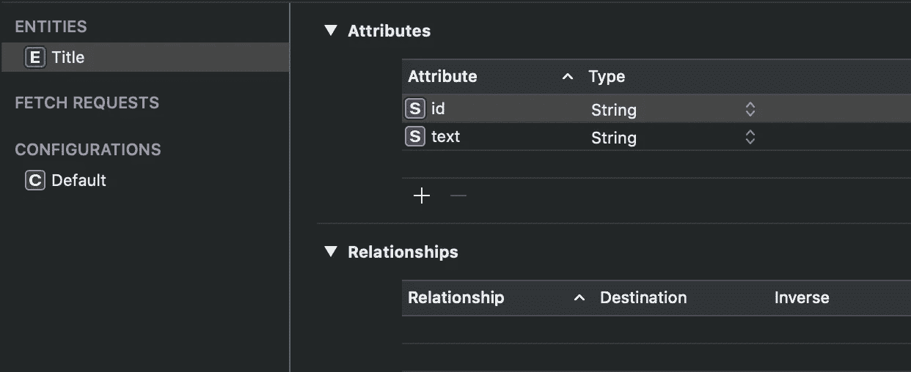
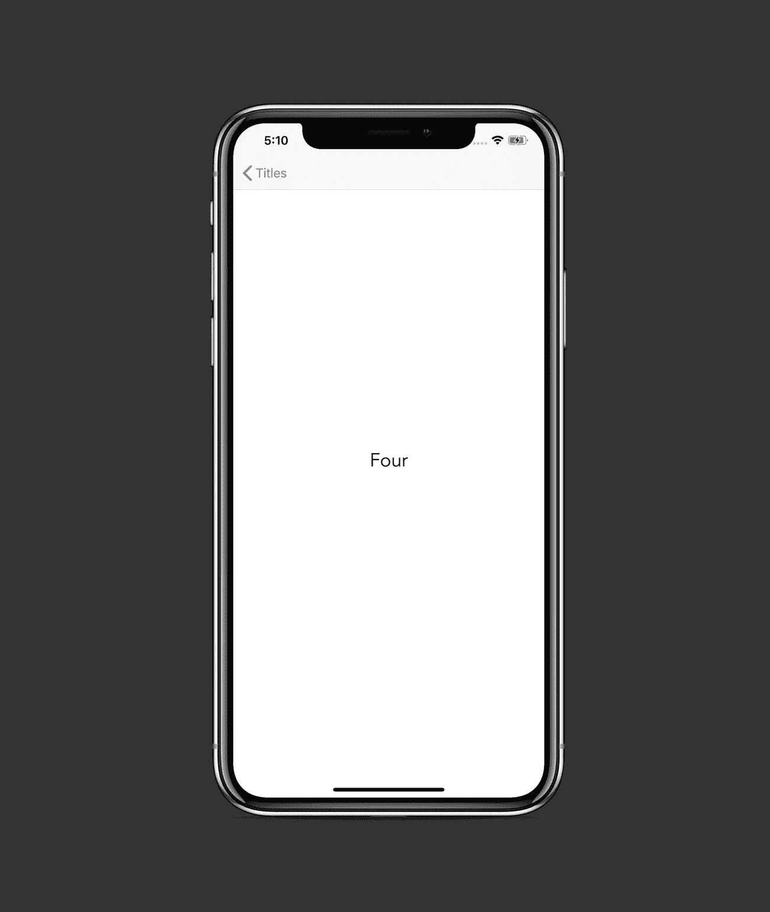

# 在 Swift 5 中实施干净的 VIP 架构

> 原文：<https://betterprogramming.pub/implement-a-clean-vip-architecture-in-swift-5-e1a27c7c92a7>

## 对 VIPER 设计模式的改进

丹尼尔·科尔派在 [Unsplash](https://unsplash.com?utm_source=medium&utm_medium=referral) 上拍摄的照片

在本文中，我们将了解如何在 Swift 中实施干净的 VIP 架构。我们将通过创建一个核心数据驱动的应用程序来做到这一点，该应用程序可以在`UITableView`中保存、删除和显示项目。它还有一个详细页面来说明我们如何在模块之间导航和传递数据。

创建 VIP 模式是为了解决 VIPER 架构的一些问题。一个问题是`Presenter` ( `P`)组件可能会变得太大——因为它负责处理 UI 动作并为视图准备数据。为了促进单一责任原则，改变了对象之间的关系。蝰蛇的`V`部分意味着`ViewController`和一个`UIView`，而 VIP 的`V`仅仅意味着`ViewController`。因此，`UIView`现在是一个独立的组件，这使得视图控制器变得更薄。

在开始之前，让我们理解 VIP 模式背后的术语。每个模块或场景通常涉及以下组件及其相应的职责:

*   `View` : 任何属于`UIView`子类的东西。它应该是可重用的，尽可能被动的。
*   `ViewController` : 为管理特定视图的行为而创建的对象。可以充当数据源或事件处理程序。调用必要的`Interactor`的方法来响应视图事件，并从`Presenter`接收原始的可表示视图的数据。
*   `Interactor`:在应用程序中执行业务逻辑，但不知道较低层的实现，如网络客户端或数据库。为此，我们依赖于知道它们并直接使用它们的服务。当一个服务的任务被执行时，`Interactor`获取结果并发送给`Presenter`。
*   `Presenter`:从交互器接收任务的结果，并将其转换成适合视图的格式。例如，它可以将复杂的核心数据对象数组转换成简单的`String`数组
*   `Router`:负责在 app 内部进行导航。通常依赖于由`Configurator`提供的`UINavigationController`。
*   `Configurator`:链接前面所有组件创建模块的对象。
*   `Entity`:普通对象，比如核心数据实体或者`Codable`模型。

看一下这个图(被指向的对象归指向的对象所有):

干净的 VIP 架构图

你可以看到在`ViewController`、`Interactor`和`Presenter`之间有一个*单向*数据流。

因此，我们有以下关系:

*   `ViewController`有一个*强*参照`View`、`Interactor`、`Router`。它符合 a `Presenter`用来发送 a `View`需要的数据的协议。
*   `Interactor`有一个*强*引用一个`Presenter`。它符合一个`View Controller`用来发送事件的协议(例如当`viewDidLoad()`方法运行时)。
*   `Presenter`有一个*弱*参照`View Controller`。它符合`Interactor`用来发送业务逻辑任务结果的协议。
*   `Router`拥有`View Controller`运行来导航到另一个模块的方法。通常，它们涉及以下模式:通过使用该模块的静态`configureModule()`方法创建另一个模块，并调用`UINavigationController`的`pushViewController`方法。

现在我们可以开始探索一个示例项目中的实现。该项目的源代码可以在文章的底部找到。

# 我们开始吧

看看我们的项目结构:

我们的应用分为四层:

*   应用层:包含`AppDelegate.swift`文件。
*   表示层:由 VIP 模块、`Titles`和`Title Detail`组成。
*   业务逻辑层:具有交互器使用的实体和服务。
*   核心层:包含业务逻辑层运行所必需的较低级别的特性。

先说`Titles`模块。

# 标题

如果有任何使用核心数据持久化的项目，该屏幕将显示一个经典的`UITableView`。否则，它会显示一个占位符标签:

## 标题核心数据对象

我们的核心数据对象叫做`Title`，有两个`String`属性:

现在让我们来看看如何配置该模块。

## 标题配置器

正如你所看到的，我们在一个静态的`configureModule()`方法中链接依赖关系。

## 应用委托

这是我们为应用程序设置初始视图控制器的方式:

初始模块已经设置好了，现在让我们实现 VIP 组件，一次一个。

## 标题视图

这只是显示了一个占位符标签和一个`UITableView`，提供了在视图控制器中使用的方便操作:

## 标题视图控制器

这负责将`TitlesView`分配给它的`view`属性。它通过充当`UITableView`数据源和事件处理器来管理`TitlesView`的行为。

我们有一个名为`TitlesPresenterOutput`的协议，它包含一些方法，当`TitlesPresenter`需要向`TitlesViewController`发送转换后的数据时，就会运行这些方法。控制器依次用接收到的数据更新视图:

我们还可以看到如何运行不同的交互器方法来响应事件的发生。例如，当用户选择一行时，我们触发交互器的`didSelectRow(at: )`方法。

## 标题互动程序

`TitlesInteractor`使用`TitlesInteractor`协议监听`TitlesViewController`事件，并调用服务来执行某项任务。然后，它将结果发送到`TitlesPresenter`:

## TitlesPresenter

`TitlesPresenter`通过从`TitlesPresenter`协议方法中的`TitlesInteractor`获取任务结果，准备适合视图的数据；

我们可以看到在`interactor(didRetrieveTitles titles: )`方法中，一个由`Title`对象组成的数组被转换成一个由`String`对象组成的数组。然后我们将这个数组发送给`TitlesViewController`，T3 更新`UITableView`。

## 标题路由器

它唯一的职责是导航到另一个模块。当用户选择一行时，`TitlesInteractor`获取一个相关的`Title`对象并将其发送给`TitlesPresenter`，后者依次获取其`id`属性并将其转发给`TitlesViewController`。然后`TitlesViewController`触发`routeToDetail(with id:)`方法，传入接收到的`id`:

完成`Titles`模块后，现在让我们快速探索`TitleDetail`。

# 标题详细信息

该模块仅在屏幕中央的`UILabel`上显示所选的`Title`:

`TitleDetail`模块的构造与`TitlesConfigurator`中的相似:

## TitleDetailConfigurator

我们知道，当我们从标题模块导航时，我们将`id`属性传递给了`TitleDetailConfigurator`的`configureModule`方法。

因此，我们将`titleId`属性发送给`TitleDetailInteractor`，以进一步加载和显示必要的`Title`对象。我们这里没有`Router`对象，因为这个屏幕不是用来导航的(我们只能使用后退按钮弹出它):

## 标题详细视图

和以前一样，这个视图是被动的——它简单地定义了它的属性，并展示了它自己的子视图:

## TitleDetailViewController

视图控制器非常简单。它所做的只是向`TitleDetailInteractor`发送事件，并最终从`TitleDetailPresenter`接收数据。然后它更新`TitleDetailView`:

## TitleDetailInteractor

交互器根据提供的`titleId`属性从核心数据中提取一个`Title`对象，然后将结果转发给`TitleDetailPresenter`:

## TitleDetailPresenter

如果在`TitleDetailInteractor`的工作过程中没有出现错误，演示者会将`Title`对象转换为`String`，然后将结果`String`转发给`TitleDetailViewController`。否则，它运行`didFailRetrieveTitle`方法，传入错误描述，`TitleDetailViewController`用它来显示警告:

我们最终在项目中实现了 VIP 架构。

# 资源

GitHub 上提供了源代码:

 [## zafarivaev/Clean-VIP-建筑

### 在 GitHub 上创建一个帐户，为 zafarivaev/Clean-VIP-Architecture 开发做贡献。

github.com](https://github.com/zafarivaev/Clean-VIP-Architecture) 

# 包扎

对不同的架构模式实现感兴趣？欢迎访问我的其他相关文章:

*   [在 Swift 5 中实施反应式 MVVM 架构](https://medium.com/better-programming/mvvm-in-swift-infinite-scrolling-and-image-loading-d47780b06e23)
*   [在 Swift 5 中实施 VIPER 架构](https://medium.com/better-programming/how-to-implement-viper-architecture-in-your-ios-app-rest-api-and-kingfisher-f494a0891c43)
*   [在 Swift 5 中实施模型-视图-展示者架构](https://medium.com/better-programming/implement-a-model-view-presenter-architecture-in-swift-5-dfa21bbb8e0b)

感谢阅读！