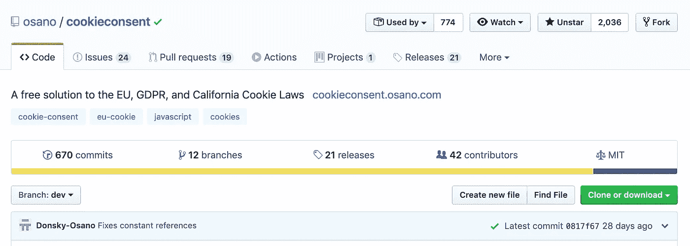
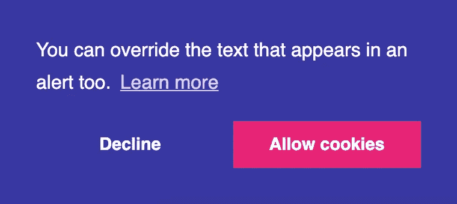
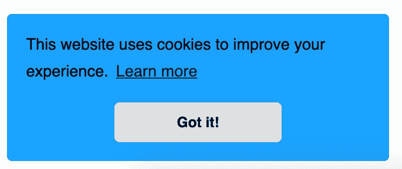

# 在五分钟内实施 Cookie 同意通知

> 原文：<https://betterprogramming.pub/implement-a-cookie-consent-notification-within-5-minutes-82c845c55487>

## 欧盟、GDPR 和加州饼干法的免费解决方案


由 [twinsfisch](https://unsplash.com/@twinsfisch?utm_source=medium&utm_medium=referral) 在 [Unsplash](https://unsplash.com?utm_source=medium&utm_medium=referral) 上拍摄

# 什么是 Cookie 许可？

Cookie 许可是一个轻量级的 JavaScript 插件，提醒用户在你的网站上使用 Cookie。



Cookie 同意 Github 页面—[https://github.com/osano/cookieconsent](https://github.com/osano/cookieconsent)

它旨在帮助您快速遵守欧盟、GDPR 和加州的饼干法。Cookie 同意对每个人来说都是快速、免费且易于使用的。

欧盟的《一般数据保护条例》(GDPR)于 2018 年生效，确立了管理个人信息收集的七项原则:

1.  合法、公平和透明
2.  目的限制
3.  数据最小化
4.  存储限制
5.  完整性和保密性(安全性)
6.  有责任

# 为什么选择 Cookie 同意？

*   它是免费和开源的——你可以自由复制、修改甚至出售 Cookie 许可协议。*参见我们的* [*执照*](https://cookieconsent.osano.com/documentation/license/) *。*
*   它是超级可配置的。只需点击几下鼠标，即可选择您自己的颜色、样式、合规类型、文本等。
*   这是目前互联网上最受欢迎的同意项目。Cookie 同意每个月在数百万个网站上被浏览超过 20 亿次。

标准的 cookie 同意通知通常是这样的。



标准 cookie 同意弹出菜单

# 装置

通过 [npm](https://www.npmjs.com/package/cookieconsent) 安装 cookie 同意:

```
npm install cookieconsent
```

或者通过[纱线](https://yarnpkg.com/en/package/cookieconsent):

```
yarn add cookieconsent
```

或者通过 CDN:

```
<script src="https://cdn.jsdelivr.net/npm/cookieconsent@3/build/cookieconsent.min.js"></script>
```

为了简单起见，我将使用 CDN。将脚本添加到您的`index.html`文件中。一旦完成，我们就可以访问`window.cookieconsent`对象了。

# 正在初始化 Cookie 同意

初始化插件非常简单。只需在`cookieconsent`对象上调用`initialise`方法。

```
window.cookieconsent.initialise({});
```

请注意，我们将一个对象作为数组传递。该对象用于配置。让我们传递主题、调色板和选项。

```
window.cookieconsent.initialise({ container: document.getElementById("cookieconsent"), palette:{ popup: { background: "#1aa3ff" }, button: { background: "#e0e0e0" }, },
  revokable: true, onStatusChange: function(status) { console.log(this.hasConsented() ? 'enable cookies' : 'disable cookies'); }, "theme": "edgeless"});
```

插入代码后，打开浏览器。您应该会看到 cookie 通知出现。


cookie 同意通知

简单明了。

在现实世界的应用程序中，我们的数据库中会有一个用户表。用户表包含一个列“`has_cookie_consent`”或类似的东西。一旦用户单击 accept，我们会将该列更改为`true`。

然后，下次用户启动我们的应用程序时，我们将获取`has_cookie_consent`值。如果它是假的，我们将显示 cookie 同意通知，如果它是真的，我们将隐藏它，因为用户已经同意这些条款。

# 安全性

为了充分保护我们的 cookies，请使用以下配置选项:

*   `cookie.domain`(字符串)
    默认:“(空字符串)
*   cookie“name”所属的 URL 路径。只能在此位置读取 cookie。
*   cookie“name”所属的域。只能在该域中读取 cookie。[cookie 域指南](http://erik.io/blog/2014/03/04/definitive-guide-to-cookie-domains/)
*   `cookie.expiryDays`(整数)
    默认: *365*
*   cookies 过期日期，以天为单位指定(指定-1 表示不过期)
*   `cookie.secure`(布尔)
    默认:*假*
*   如果 secure 为 true，则只允许通过 https 访问 cookies。

## 更改通知内容

用于 cookie 同意窗口元素的文本字符串。

`content`(对象)—使用此对象来更改 cookie 同意通知 HTML。

这看起来是这样的:

```
"content": { "header": 'Cookies used on the website!', "message": 'This website uses cookies to improve your experience.', "dismiss": 'Got it!', "allow": 'Allow cookies', "deny": 'Decline', "link": 'Learn more', "href": 'https://www.cookiesandyou.com', "close": '&#x274c;', "policy": 'Cookie Policy', "target": '_blank',}
```

下面是我们将看到的情况:



cookie 通知

参见 Codesandbox 示例[此处](https://codesandbox.io/s/goofy-poitras-i71n4)。

在这里查看插件[的完整 API 文档。](https://cookieconsent.osano.com/documentation/javascript-api/)

[](https://cookieconsent.osano.com/documentation/javascript-api/) [## JavaScript API

### Osano 的 cookie 许可插件的高级 Javascript API。配置一切，让它成为你自己的。

cookieconsent.osano.com](https://cookieconsent.osano.com/documentation/javascript-api/) 

如果你是 JavaScript 新手，想学习这门语言，我建议你从阅读书籍和构建东西开始。从“ [*一个更聪明的学习 JavaScript 的方法*](https://amzn.to/2LOkzjj) ”书*(亚马逊联盟链接)*和[开始这里有一个要构建的有趣应用的列表](https://medium.com/better-programming/the-secret-to-being-a-top-developer-is-building-things-heres-a-list-of-fun-apps-to-build-aac61ac0736c)。

感谢阅读，编码快乐！