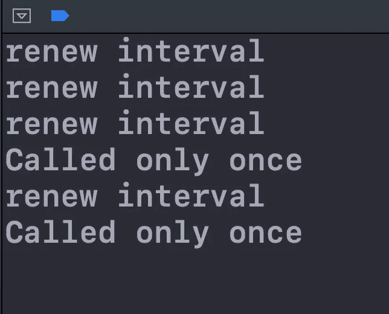

# 在 Swift 中实施去抖器

> 原文：<https://betterprogramming.pub/implement-a-debouncer-in-swift-3b5c775f90b8>

## 学会在执行过程中给方法调用一些喘息的空间

[Yura Fresh](https://unsplash.com/@mr_fresh?utm_source=medium&utm_medium=referral) 在 [Unsplash](https://unsplash.com?utm_source=medium&utm_medium=referral) 上拍摄的照片

# **什么是方法调用的反跳？**

对方法调用进行反跳可以确保该方法不会被过于频繁地执行。

例如:如果您在任何应用程序中看到一个搜索视图的基本实现，它不会为您键入的每个字符向后端发出 HTTP 调用。这将导致许多 HTTP 调用，其中大多数都是不必要的。

相反，我们使用一个叫做`Debouncer`的东西，它只在给定的时间间隔后调用一个特定的方法。对于搜索示例，如果我们有一个 0.3 秒的时间限制，那么当用户在 0.3 秒内没有键入任何内容时，将进行 HTTP 调用来获取搜索结果。如果用户没有停顿 0.3 秒就继续键入，则每次按下一个键时，时间间隔都会更新。

# 实现自定义去抖器

让我们了解一下这是如何实现的！

`Line 3`:这是去抖器的时间间隔。如果在此时间间隔内没有采取任何操作，则将调用该方法

`Line 4`:我们使用了一个计时器来确保在时间间隔结束之前方法不会被调用

`Line 6,7`:这是一个处理程序闭包，当时间间隔结束时将被调用。在这个闭包里，我们可以实现要运行的代码，或者要去抖的代码。

`Line 9`:这是一个自定义的 init，以时间间隔为参数。我们不能没有时间间隔的去抖实例

`Line 13`:更新间隔方式用于更新去抖时间间隔。如果用户在没有暂停的情况下按下十个键，时间间隔将更新十次，以确保我们正在检查从最后一次用户操作开始的时间间隔。每次调用这个方法时，我们都会创建一个新的`Timer`,它会在时间间隔结束后调用一个函数。

`Line 20`:当`Timer`完成时间间隔时，调用该方法。作为回报，我们将调用负责执行去抖代码的`handler`。

# 使用去抖器

`Line 3`:我们已经创建了一个`Debouncer`的实例，时间间隔为`0.3 seconds`。

`Line 25` : `doSomething`是我们计划去抖的方法。每次更新时间间隔时，它将打印出`renew interval`，每当在处理程序中执行该方法时，它将打印出`method executed`。

`Line 5`:我们使用`DispatchQueue`
在`viewDidLoad`中制定用户动作，在`0.1 seconds`的间隔之后，我们调用`doSomething()`方法三次。时间间隔大于`0.1 seconds`，因此将不会执行处理程序，而去抖器将更新其时间间隔三次。

然后，有一个`0.4 seconds`的暂停——大于去抖时间间隔，所以它将执行处理程序。之后，`Line 18`再次更新间隔，并在`0.3 seconds`之后执行处理程序。

输出将如下所示:

# 包扎

这是`Debouncer`的一个基本实现。有许多不同的方法来实现同一件事——如果它们满足您的要求，它们都是正确的。

你可以在 [Github](https://github.com/samarth4487/Debouncer) 上找到示例项目。