# 使用 LaunchDarkly 分四步实现功能标志

> 原文：<https://betterprogramming.pub/implement-a-feature-flag-in-4-steps-using-launchdarkly-4136ba66036d>

## 通过实现功能标志的魔力，节省金钱、时间和精力


约翰·施诺布里奇在 Unsplash[上的照片](https://unsplash.com/search/photos/computer?utm_source=unsplash&utm_medium=referral&utm_content=creditCopyText)

# 隐藏和显示新功能

实现特征标志有[多种原因；A/B 测试、产品和营销驱动的发布、基础设施迁移等等。](https://launchdarkly.com/use-cases/)

然而对我来说，特征标志消除了对失败的恐惧。这是一种担心，有人可能不喜欢我所做的，或者当它在生产中投入使用时，一些东西可能会在代码中爆炸。

通过在特性标志中实现代码更改，我可以在任何时候通过翻转仪表板上的标志来轻松地显示或隐藏新特性。

例如，当我最终选择向全世界(或者至少是几个亲密的朋友)展示新特性时，我可以放心，如果代码在生产中爆炸或者生产中的变化不像我开发时那样引人注目，我可以迅速恢复变化。

旁注:功能标志通常也被称为功能切换或开关，我甚至看到它们被称为功能翻板。

在四个步骤中，让我们看一看为一个小型个人应用程序实现一个 LaunchDarkly 特性标志是什么样子的。

# 1.快速入门(免费试用)

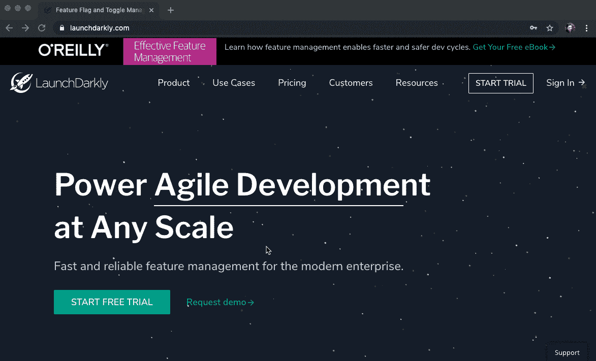

实现功能标志魔术的第一步是注册免费试用。

我只需要一个电子邮件地址和想出一个好密码的能力。我确信，如果我遇到了问题，LaunchDarkly 的支持会帮助我。

# 2.识别语言和功能


第二步是确定项目的编程语言以及我想要更新的特性。

我有一个 React 项目，为我的朋友 Bradlie 制作灵感卡片。我想把横幅改得更符合卡片的风格。我知道横幅的代码目前位于我的应用程序的顶层，`App.js`。

现在我知道我需要什么，我的应用程序是用哪种语言编写的(React)，代码在哪里。

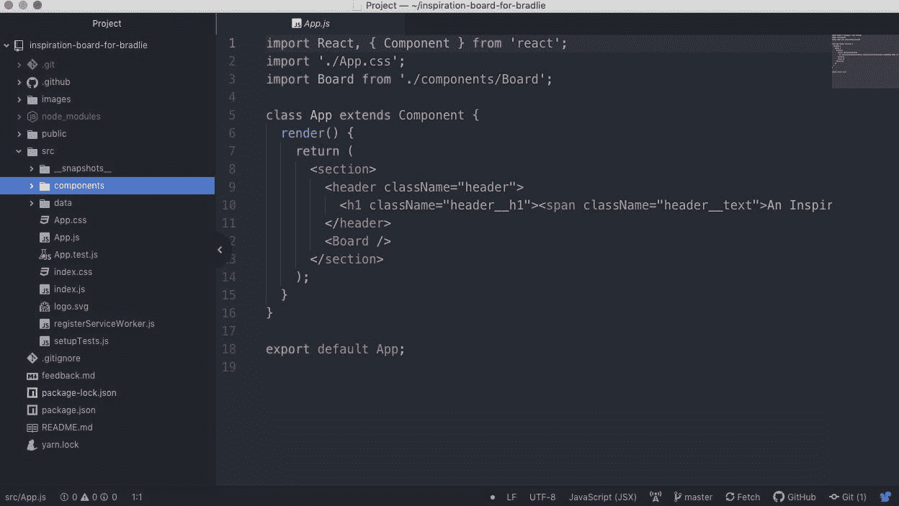

# 3.快速入门

第三步，如果你和我一样，使用 Quickstart 快速地在代码中加入一个特性标志。这不正是快速入门的目的吗？

快速启动类似于一个演示。我从来没有设置过功能标志，所以对我来说，看到功能标志在如此小的代码实现后工作是非常令人满意的。在我开始这个项目之前，我认为这是一个很棒的小介绍。

然而，现在我已经确定了我自己的要添加特性标志的项目，我只需要使用快速入门的一部分。

快速入门要求我命名功能标志并选择语言和环境。首先，我只有一个生产和测试环境，但是我可以在以后添加更多的环境。

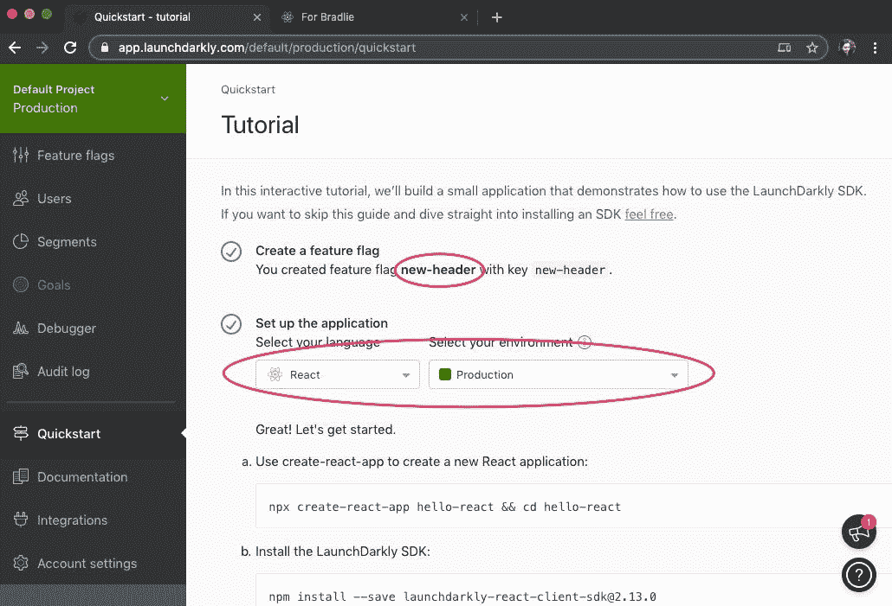

旁注:我想把这个特性命名为`awesome-new-header`，但是已经同意了`new-header`，所以我们在这里。

一旦选择了我的标志名、SDK 语言和环境，我就跳过了创建 hello-react 应用程序的步骤，直接使用我的终端安装 launch crystally SDK:

```
npm install --save launchdarkly-react-client-sdk@2.13.0
```

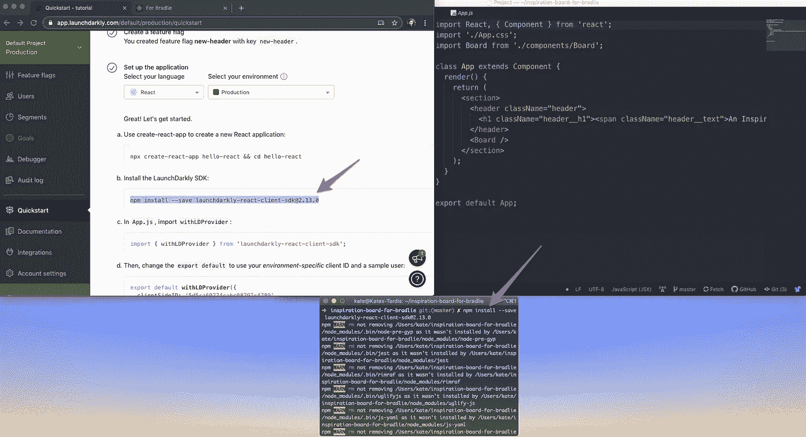

接下来是添加代码的时候了！正如快速入门所建议的，我从`App.js`开始，然后粘贴`import`和`export default...`。

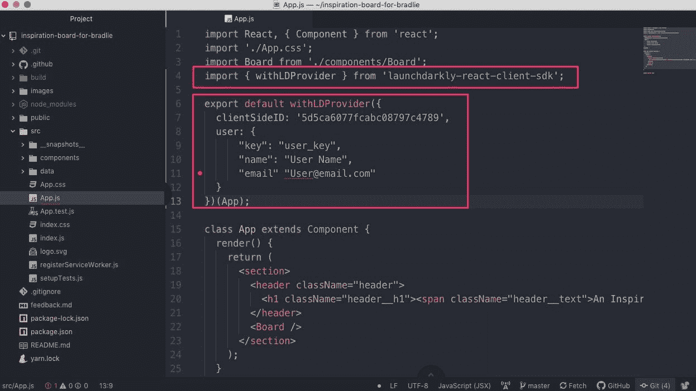

就在截图之后，我在第 11 行的`"email"`和`"User@email.com"`之间添加了一个冒号。(希望在您阅读本文时，这个问题已经在示例代码中解决了。我确实让 launch crystally support 知道了，他们很有帮助，也乐于接受反馈。)

```
"email": "User@email"
```

正如你在上面看到的，我的头代码在`App.js`中。在我看来，更有意义的做法是将标题转换成一个组件，使应用程序更整洁、更有条理。幸运的是，如果 header 是一个组件，那么使用 Quickstart 也更容易。

我还把`export default...`移到了`App.js`文件的底部。看看 App.js 漂亮的最终代码！

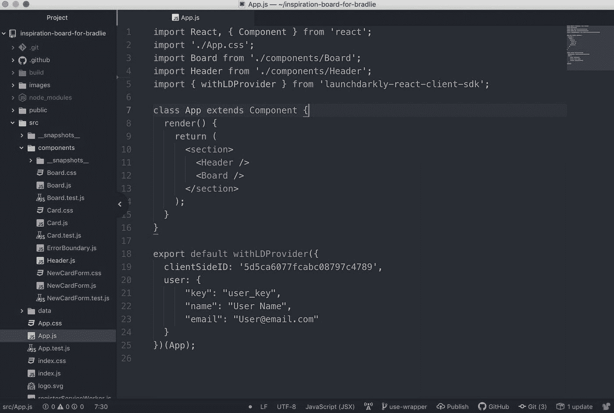

App.js 文件的最终代码

在将标题代码移动到它自己的组件中之后，是时候向新的标题组件添加特性标志了。

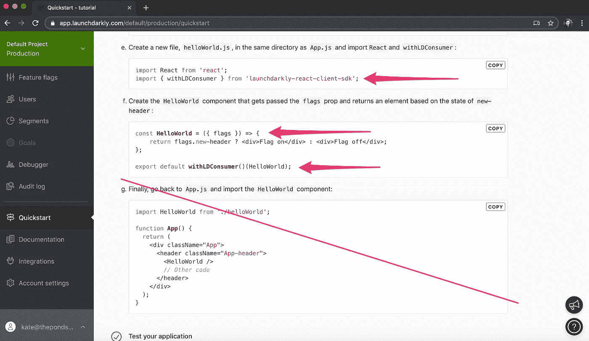

我首先将相关代码复制并粘贴到我的代码库中。(导入 launch darky`withLDConsumer`和标志本身，以及`export default...`)

然后，我用`if`块中的原始代码和`else`块中的新代码创建了一个`if statement`。最后，我有了一个非常可爱的带有特征标志的组件。

请注意，我在示例代码中发现的另一件事是，包装器返回的标志是*而不是* `new-header`，实际上是`camelCase` `newHeader`。

再一次，我让 LaunchDarkly support 知道了，他们很有帮助，也乐于接受反馈。支持工程师 Matt 甚至说有一种方法可以禁用 camel 套管。[你可以在文档中找到这些信息。](https://docs.launchdarkly.com/docs/react-sdk-reference#section-camel-casing)

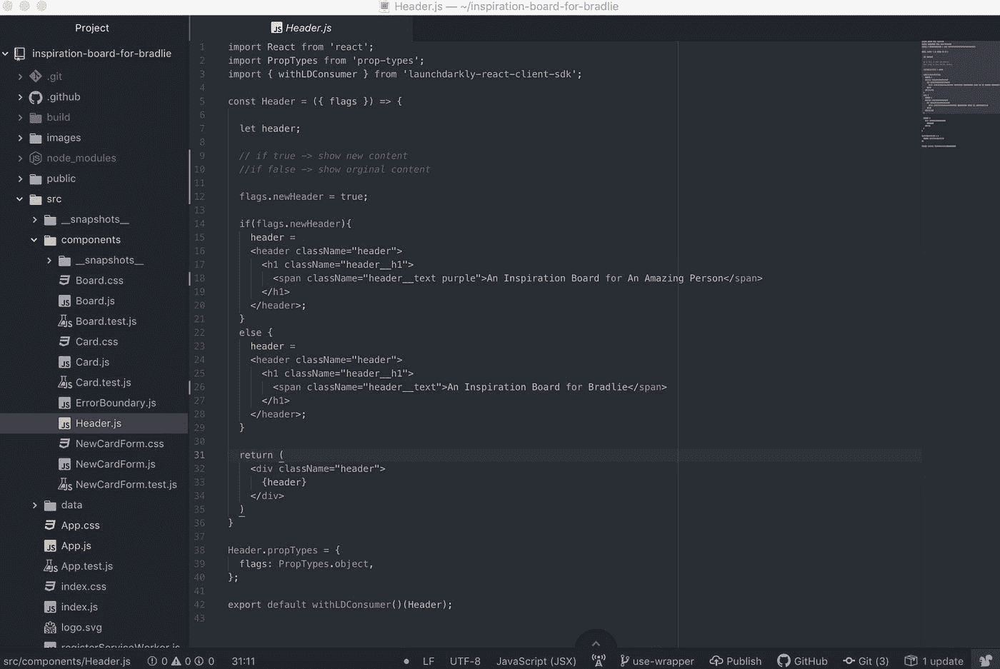

新标题组件的最终代码

在我进行开发工作时，我目前通过将它设置为`true`(第 12 行)来手动控制该标志，在将代码部署到生产环境之前，我需要删除该行。

将来，为了确保我不会引入没有删除该行的可能的人为错误，来自 launch crystally support 的 Bonnie 建议为应用程序中的项目创建一个新的开发人员[环境](https://docs.launchdarkly.com/docs/environments)。

这个新环境将可以访问相同的标志(因为标志在所有环境中是共享的)，但是标志的目标/默认规则是特定于环境的——因此您可以设置标志，以便每次为新环境返回`true`。

然后，您可以使用环境变量来确定使用哪个环境密钥(参见*帐户设置*选项卡中的密钥),这取决于您的应用是在生产环境还是开发环境中运行。

# 4.扳动开关

最后一步是使用 LaunchDarkly 仪表板控制标志。

正如你从下面精彩的截图中看到的，当*新标题标志*关闭时，原来的标题被显示出来。为了打开这个开关，我写了一条关于这个变化的消息，并且必须输入环境的名称。

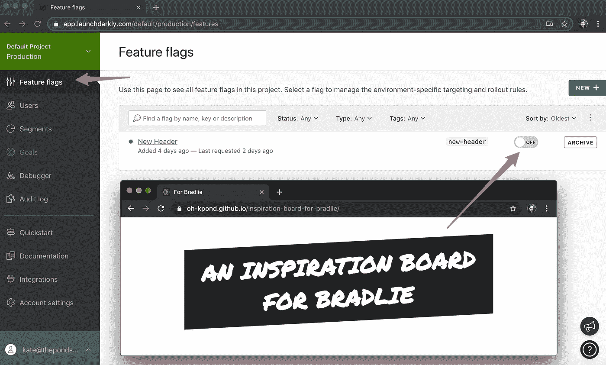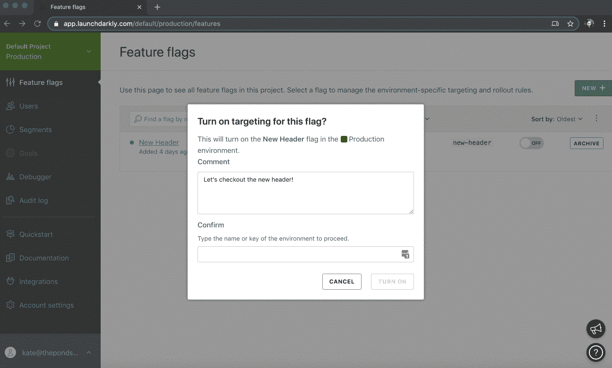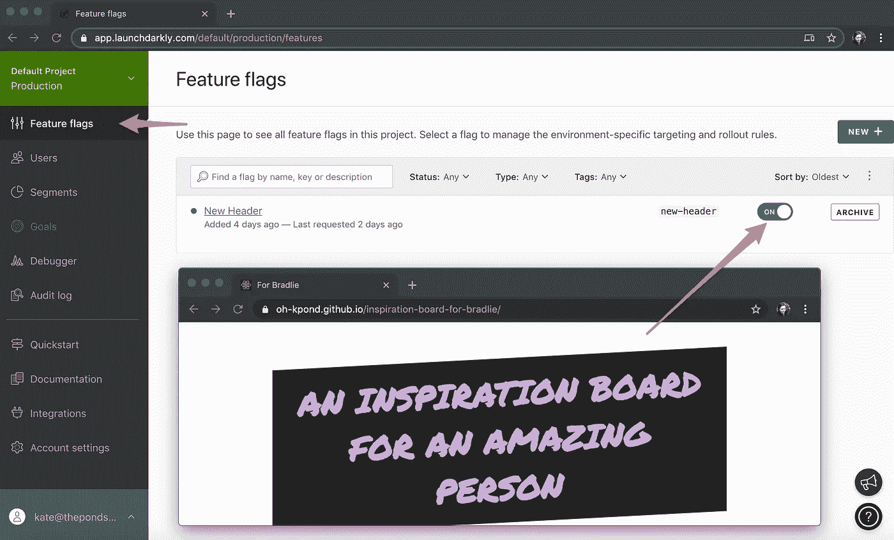

Tada！现在，我可以向我的朋友展示新的页眉，如果他们不喜欢，我可以通过翻转旗帜将其切换回来，而不必担心花费数天时间来尝试将其恢复到以前的状态。我的朋友不得不看他们不喜欢的标题的日子！

# 结论

这个特性标志的介绍是为一个很小的应用程序编写的，这个应用程序可能永远不会被部署到更大的用户群中。

然而，为拥有大量用户的更广泛的应用程序实现功能标志可以节省公司的时间、金钱和精力，以回滚在生产中不按预期方式运行的功能。

例如，当我刚开始为一家小公司编写产品代码时，对于一个新功能，有一个非常漫长的批准过程，并且在发布之前对一个功能进行了大量的测试。

为什么？因为如果在代码部署后的任何时候，发现有 bug，或者审批链中有人不喜欢它，就必须在生产中“热修复”它，有时甚至回滚。

回滚一个功能需要花费大量的时间和精力，在生产中进行“热修复”可能会有风险。

我相信，如果该公司实现了功能标志的魔力，他们本可以节省金钱、时间和精力。