# 在 Go 中用 ent 和 Gqlgen 实现一个 GraphQL 服务器

> 原文：<https://betterprogramming.pub/implement-a-graphql-server-with-ent-and-gqlgen-in-go-8840f086b8a8>

## 将静态类型的 API 与 GraphQL 集成


[ильямельниченко](https://unsplash.com/@elliotm)在 [Unsplash](https://unsplash.com/?utm_source=medium&utm_medium=referral) 上拍照。

这篇文章将带你了解如何使用`ent`和`gqlgen`实现 GraphQL 服务器。

# 回购示例

以下是最终代码库的参考:

[](https://github.com/manakuro/golang-ent-gqlgen-example) [## GitHub-manakuro/golang-ent-gqlgen-示例:Go 中带有 ent 和 gqlgen 的 GraphQL 服务器

github.com](https://github.com/manakuro/golang-ent-gqlgen-example) 

# 属国

所需的依赖关系如下:

*   Go 版本 1.17.2
*   [回音](https://github.com/labstack/echo)
*   [ent/ent](https://github.com/ent/ent)
*   [99 设计/gqlgen](https://github.com/99designs/gqlgen)

# 什么是耳鼻喉？

[ent](https://entgo.io/) 是一个面向 Go 的 ORM 框架，它使得用数据库维护应用程序变得容易，并允许我们:

*   轻松运行查询和遍历任何图形结构
*   通过代码生成使用 100%静态类型的 API
*   使用多种存储驱动程序— MySQL、PostgreSQL、SQLite 和 Gremlin
*   使用 GraphQL 和`gqlgen`

就静态类型 API 而言，`[sqlboiler](https://github.com/volatiletech/sqlboiler)`具有类似的功能，但不同之处在于`ent`是一个模式优先的工具，它从模式文件创建数据库和类型 API。`sqlboilder`是一个数据库优先的 ORM，它从数据库创建一个类型化的 API。

# 实施概述

实施的步骤如下:

*   安装依赖项
*   设置回显服务器
*   设置 ent
*   设置`gqlgen`

# 安装依赖项

这篇文章中需要一些依赖项，所以先安装它们:

```
go get github.com/labstack/echo/v4
go get github.com/labstack/echo/v4/middleware@v4.6.1
go get github.com/go-sql-driver/mysql
go install entgo.io/ent/cmd/ent
```

# 设置回显服务器

为了快速开始，我们将使用 echo 包设置一个服务器。

创建`main.go`并编写代码:

你可以在 [http://localhost:8080:](http://localhost:8080/) 看到这个页面

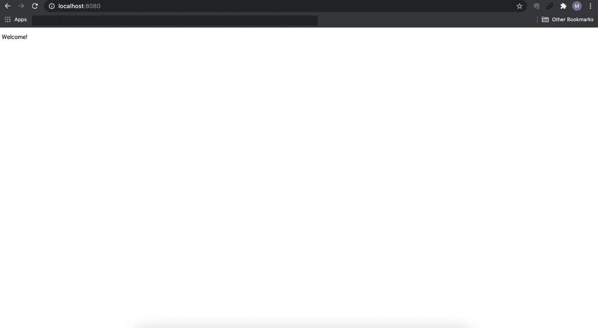

欢迎页面

# 设置 ent

接下来，我们将设置`ent`。

## 创建用户模式

在本文中，我们将在数据库中创建一个`users`表。

在此之前，我们需要创建一个名为`User`的模式文件:

```
ent init User
```

生成的文件应该如下所示:

```
ent
├── generate.go
└── schema
    └── user.go
```

`user.go`有一个包括`Fields`和`Edges`的模式:

*   `Fields` —节点的属性。这相当于数据库中的一列，像`name`、`age`和`created_at`。
*   `Edges`—实体的关系。它允许您定义每个表的关系，如`O2O`(一对一)、`O2M`(一对多)和`M2M`(多对多)

因此，我们将按如下方式设置`name`、`age`和`created_at`至`Fields`:

在添加字段之后，基于上面的模式生成资产，以便它们可以在您的项目中工作。

在根项目中运行`go generate`:

```
*go* generate ./ent
```

这将生成如下文件:

```
ent
├── client.go
├── config.go
├── context.go
├── ent.go
├── enttest
│   └── enttest.go
├── generate.go
├── hook
│   └── hook.go
├── migrate
│   ├── migrate.go
│   └── schema.go
├── mutation.go
├── predicate
│   └── predicate.go
├── runtime
│   └── runtime.go
├── runtime.go
├── schema
│   └── user.go
├── tx.go
├── user
│   ├── user.go
│   └── where.go
├── user.go
├── user_create.go
├── user_delete.go
├── user_query.go
└── user_update.go
```

这项资产包括:

*   操作表中 CRUD 的代码(`user_create.go`、`user_delete.go`、`user_query.go`和`user_update.go`)
*   SQL 的迁移包
*   实体对象
*   添加变异中间件的钩子包。
*   等等

所以基本上，有了这个资产，您就可以安全地操作带有静态类型实体的表。

## 数据库迁移

`ent`还提供数据库迁移支持，以保持项目中模式的一致性。

要运行迁移，请在应用程序的初始化中编写代码。

在`main.go`中编写迁移逻辑:

完成初始化后，可以看到`users`表已经成功创建。

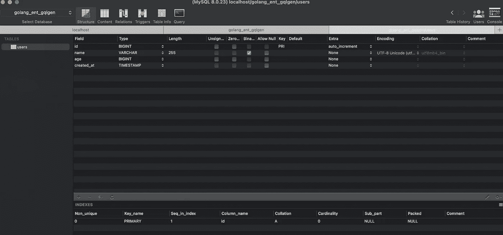

用户表

默认情况下，`field.Time`使用 MySQL 中的`TIMESTAMP`类型，其范围为`1970–01–01 00:00:01 UTC`到`2038–01–19 03:14:07 UTC`。

如果`TIMESTAMP`不适合您的应用，您可以更改为`DATETIME`类型，如下所示:

## 创建用户

现在我们已经准备好在表中创建一个用户。

如上所述，我们已经有了为表提供 CRUD API 的方法。

让我们在`ent/user_create.go`中调用`Create`:

当您向`http://localhost:8080/users`发送 POST 请求时，这将在`users`表中创建一个用户，并随后响应一个用户数据:

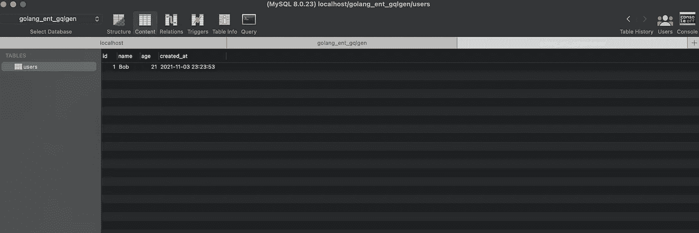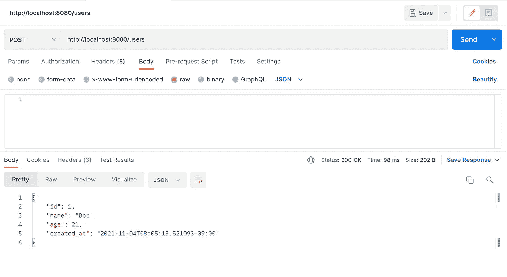

发送发布请求

## 询问用户

为了从`ent`包中获取用户数据，您可以像这样使用`Query()`:

这将响应表中的所有用户:

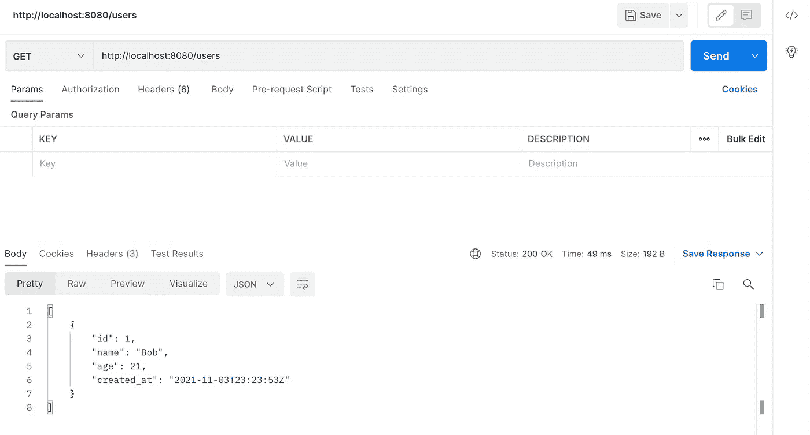

所有用户

您可以使用`Select`功能选择部分对象，如下所示:

`age`字段被排除在响应之外，如下所示:

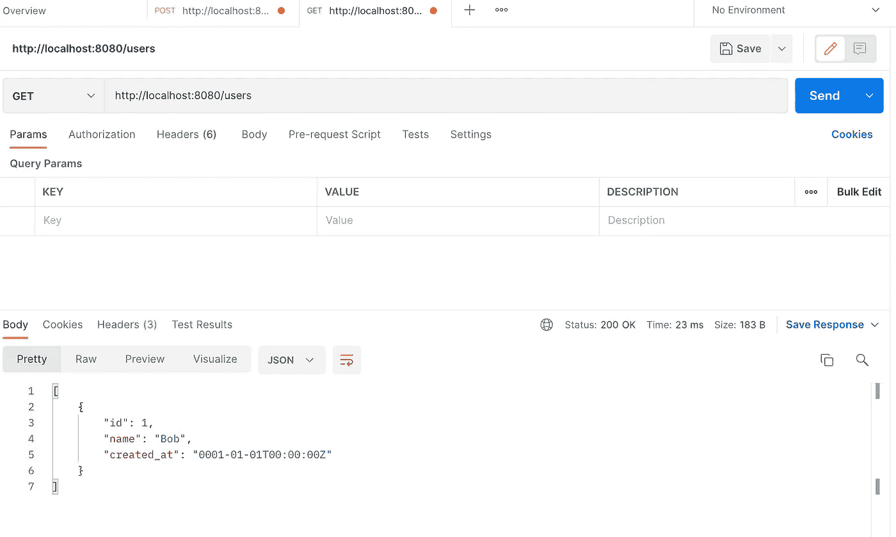

也可以这样使用`Where`:

`Only`函数返回一个用户实体，当没有找到用户实体时，返回一个`NotFoundError`。

当 SQL 返回多个用户时:

```
us, err := client.User.
   Query().
   Where(user.AgeEQ(21)).
   Only(c.Request().Context())
```

`ent`会警告记录不是单个的。

```
user not singular
```

## 创建边

接下来，我们将创建另一个实体，并在模式中声明该实体的边缘。

首先，让我们创建一个名为`Article`的实体。

```
ent init Artcile
```

并且会在 schema 文件夹下生成`article.go`。

```
ent
├── schema
│   ├── article.go
│   └── user.go
```

然后，我们将添加一些字段，如下所示:

让我们假设`User`可以有多篇文章，而一篇文章只有一个用户，所以关系是一个`one-to-many`。

因此，让我们创建一条从`User`到`Artcie`的边。

首先，将`articles`边添加到`ent/schema/user.go`中的`User`模式:

并运行它:

```
go generate ./ent
```

当您运行服务器时，您可以看到已经创建了`articles`表:

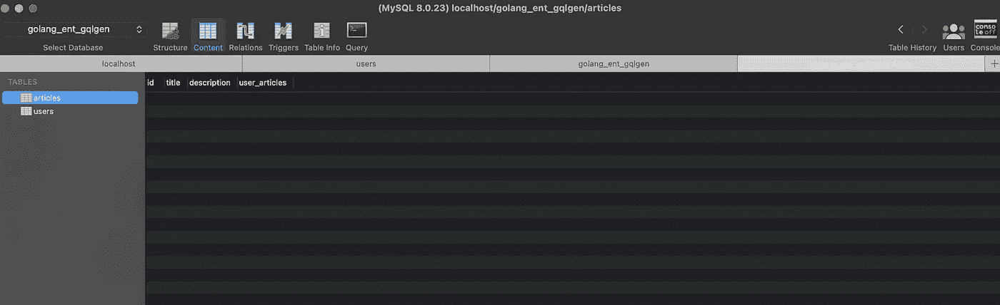

文章表

因此，让我们创建一篇文章并将其添加到`User`中。

我们继续使用`main.go`中的`/users`端点，并把一些代码写成这样:

`AddArticles`函数已经通过在模式中添加一条边而生成，所以我们可以用它来给用户添加文章。

向`[http://localhost:8080/users](http://localhost:8080/users,)`发送请求后，可以看到记录已经创建:

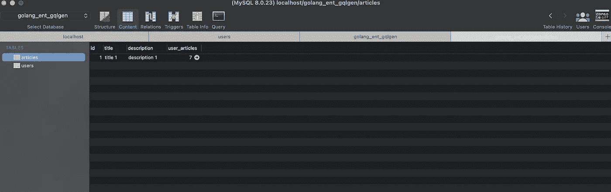

文章

## 反向边缘

现在我们可以通过`User`实体访问`Article`，但是在某些情况下你想从`Article`获取用户。为了实现这一点，`ent`提供了`edge.From`功能。

因此，让我们在`ent/schema/artcile.go`的`Article`模式中添加一个名为`users`的反向边:

因为除了`Article`之外，`User`模式可能有不止一个引用，所以`Ref`方法描述了用户模式的哪个边缘被引用。

并运行生成:

```
go generate ./ent
```

因此，让我们从一个文章实体中查询一个用户:

在控制台日志中，您可以看到实际执行的 SQL:

```
SELECT DISTINCT 
 `users`.`id`, 
 `users`.`name`, 
 `users`.`age`, 
 `users`.`created_at` 
FROM 
 `users` 
JOIN 
 (SELECT `articles`.`user_articles` FROM `articles` WHERE `articles`.`id` = ?) AS `t1` 
ON 
 `users`.`id` = `t1`.`user_articles` 
LIMIT 2 args=[1]
```

并且这样响应一个用户数据:

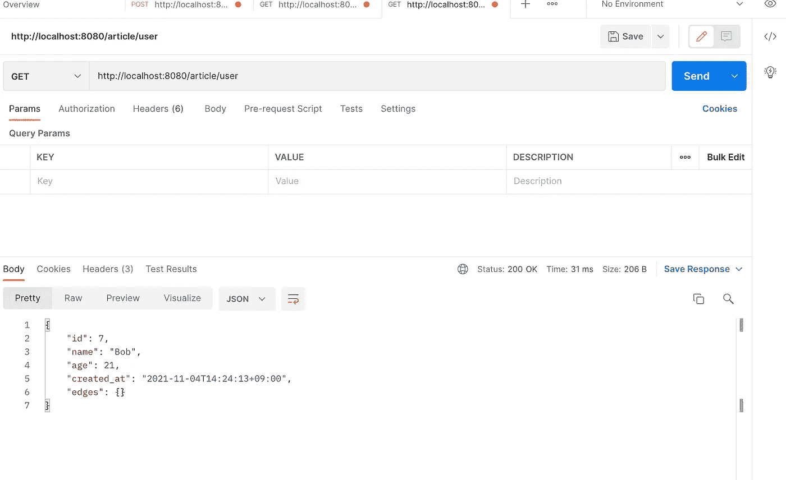

## 急切装载

`ent`提供通过`Eager loading`查询实体及其关联的能力。

急切加载允许我们查询多个关联。例如，我们可以将用户数据包含在这样的文章中:

响应包括`edges`中的文章数据:

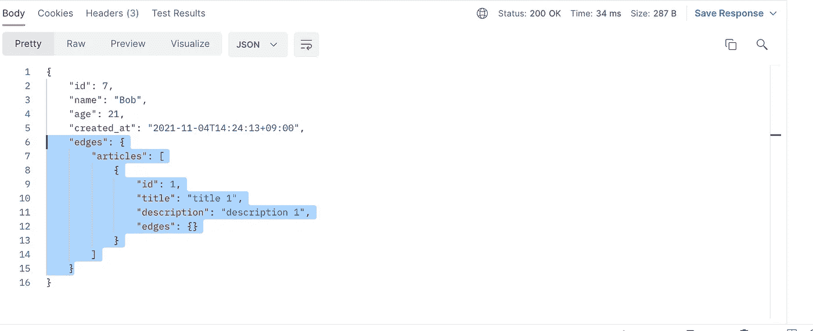

执行的日志如下:

```
SELECT DISTINCT 
 `users`.`id`, 
 `users`.`name`, 
 `users`.`age`, 
 `users`.`created_at` 
FROM 
 `users` 
WHERE 
 `users`.`id` = ? 
LIMIT 
 2
args=[7]SELECT DISTINCT 
 `articles`.`id`, 
 `articles`.`title`, 
 `articles`.`description`, 
 `articles`.`user_articles` 
FROM 
 `articles` 
WHERE 
 `user_articles` 
IN (?) 
args=[7]
```

## 自定义外键列

创建边时，`ent`默认会自动生成一个外键列。

例如，在创建`Article`时，`ent`已经创建了`user_articles`列作为外键。


为了自定义名称，您可以像这样在`ent/schema/user.go`中使用`[StorageKey](https://entgo.io/docs/schema-edges/#storagekey)`:

并运行`go generate ./ent`，会将`user_id`列添加到`articles`表中:

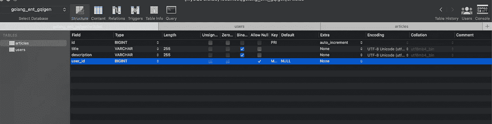

文章表

*注意:ent 默认使外键*[](https://github.com/ent/ent/blob/master/entc/gen/graph.go#L459)**为空。* [*PR*](https://github.com/ent/ent/pull/1703) *合并后，可以根据需要边设置* `*NOT NULL*` *为外键。**

# *设置 GraphQL*

*接下来，我们将使用`gqlgen`将`ent`连接到 GraphQL。*

## *设置 gqlgen*

*首先，让我们安装 gqlgen:*

```
*go get github.com/99designs/gqlgen*
```

*要安装程序包，请运行以下命令:*

```
*go run github.com/99designs/gqlgen init*
```

*这将在根项目下生成以下布局:*

```
*├── gqlgen.yml
├── graph
│   ├── generated
│   │   └── generated.go
│   ├── model
│   │   └── models_gen.go
│   ├── resolver.go
│   ├── schema.graphqls
│   └── schema.resolvers.go*
```

*   *`gqlgen.yml` —控制生成文件的配置文件*
*   *`graph/generated` —运行时包(自动生成)*
*   *`model/models_gen.go` —所有图形模型的包(自动生成)*
*   *`resolver.go` —图形解析器的根*
*   *`schema.graphqls` —您可以随意定制的模式文件*
*   *`schema.resolvers.go` —解析器实现(自动生成)*

*`gqlgen.yml`需要修改为 ent，所以粘贴代码:*

*`autobind`在`ent`文件夹中寻找任何匹配的类型名。在这种情况下，`ent.User`将在解析器中使用。*

*接下来，我们将把`schema.graphqls`改为`user.graphqls`，并放入一些代码，如下所示:*

*并移除现有的解析器，`schema.resolvers.go`:*

```
*rm -r ./graph/schema.resolvers.go*
```

*运行`gqlgen`代码生成:*

```
*go run github.com/99designs/gqlgen*
```

*因此，项目目录应该如下所示:*

```
*graph
├── generated
│   └── generated.go
├── model
│   └── models_gen.go
├── resolver.go
├── user.graphqls
└── user.resolvers.go*
```

## *将 ent 连接到 gqlgen*

*和 GraphQL 扩展用于`ent`:*

```
*go get entgo.io/contrib/entgql*
```

*为了在 ent 项目中使用`gqlgen`,需要对我们的项目启用 ent 扩展。*

*为此，创建一个名为`ent/entc.go`的新文件，并添加以下代码:*

*然后，打开`ent/generate.go`文件，将代码改为:*

```
*package ent

//***go:generate*** go run -mod=mod entc.go*
```

*运行 codegen:*

```
*go generate ./ent*
```

*因此，通过运行这个命令，[一些附加组件](https://entgo.io/docs/graphql/#node-api)将被添加到我们的项目中。*

*最后，为了在`gelgen`解析器中使用`ent.Client`，打开`graph/resolver.go`并将其作为附加依赖项传递给模式:*

# *运行 GraphQL 服务器*

*现在我们已经准备好运行 GraphQL 服务器了。*

*让我们修改`main.go`来配置 GraphQL 服务器。*

*并打开`http://localhost:8080/playground`:*

*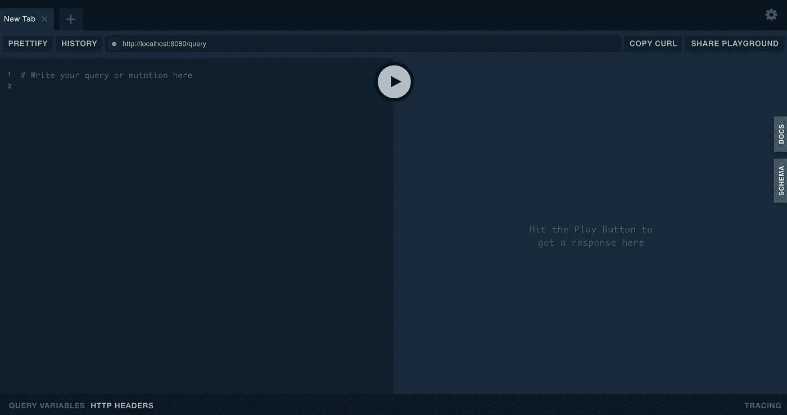*

*操场*

## *查询用户*

*由于用户的解析器尚未实现，因此我们在`graph/user.resolvers.go`中添加解析器:*

*在操场上运行查询，它应该会返回用户数据:*

*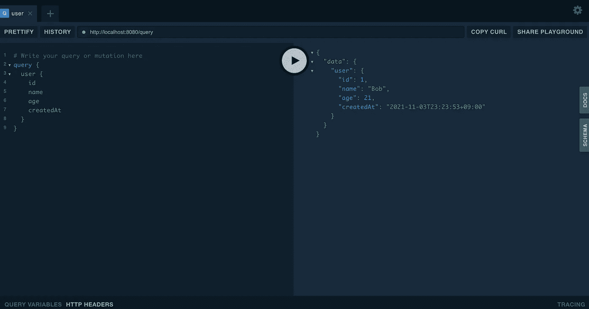*

*操场*

# *结论*

*就是这样！我们已经使用`ent`和`gqlgen`包实现了一个 GraphQL 服务器。如你所见，`ent`为我们的数据库提供了一个真正有用的强类型 API。*

*[Gorm](https://github.com/go-gorm/gorm) 已经成为 Go 的标准 orm 工具，并提供了一个全功能的包。在静态类型方面，gorm 采用接口，内部使用反射，所以有时会丢失类型，出现运行时错误。*

*另一方面，`ent`使用 codegen 来生成类型和 API，以便在编译时通知我们可能的错误。*

*如果您需要使用静态类型的 API 和 GraphQL 集成，ent 将是您的选择之一。*