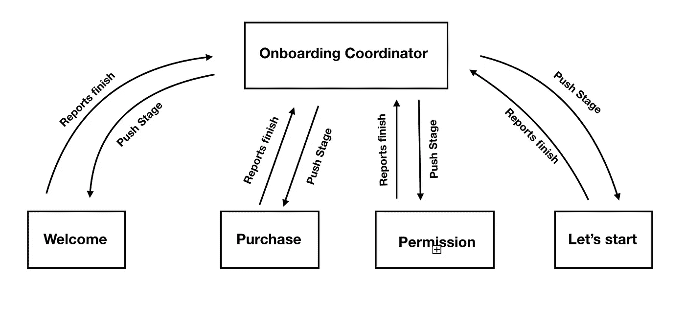

# 如何在您的应用中实现出色的入职架构

> 原文：<https://betterprogramming.pub/implement-a-great-onboarding-architecture-in-your-app-aa447cba2ef9>

## 简化用户入职流程的方法

乔恩·泰森在 [Unsplash](https://unsplash.com/) 上的照片

# 什么是入职培训？

应用入门阶段是用户第一次接触你的应用，学习如何使用它，并进行第一次设置，这样他们就可以开始享受你的创作了。

对于我们开发人员来说，这不是小事——我们已经习惯了当每个屏幕决定下一个打开的屏幕是什么时的架构。在入职培训中，下一个屏幕上的逻辑与当前屏幕无关。这就是它在我们的项目中与众不同的原因。

# 我们想从入职流程中获得什么？

当然，只要用户点击 next 按钮，我们就可以推送一个新的视图控制器，但是使用这种方法，我们可能会遇到几个问题:

1.  每个屏幕必须知道下一个屏幕，它必须感觉像一个链表。如果我们想改变屏幕的顺序呢？如果一个新的开发人员想要了解入职流程，该怎么办？他们必须逐个 VC 地寻找`navigationController?.push` 命令吗？因此，我们想要的是**流程中的每个组件都完全独立**，不与任何其他组件相连。
2.  遵循上一点，我们希望能够**改变组件的顺序**。我们可能想要 A/B 测试它，或者只是看看不同的订单是否对我们更好。
3.  有时，流程中有些阶段对某些用户来说不一定相关，所以我们希望**在这里插入一些逻辑**。有时，我们希望跳过某些组件，或者为不同的用户添加组件。
4.  因为这是应用程序的一个敏感部分，我们也是出色的开发者，我们想为整个过程编写单元测试。
5.  我们不想将我们的逻辑分散在不同的特性类中。相反，我们希望将其集中在一个类中来管理整个逻辑。
6.  我们可能想要**跟踪用户进程。**例如，我们可能希望恢复状态，以防用户在过程中杀死应用程序。这样，他们就不需要再从头开始入职流程了。

# **创建入职协调员**

**注:**这只是一个关于如何实现上述问题的体面解决方案的建议。

首先，我们需要创建一个 singleton 来管理您的入职。你可以称之为协调者、路由器、管理者、服务者——这都没关系。关键是这个协调器将是唯一知道组件顺序的对象。它也将是你的应用程序中唯一包含接下来要显示什么的逻辑的部分。

协调器可以有一个导航控制器的引用，这样它可以在需要时推送下一个组件。

最佳实践是创建一个 enum 来描述入职阶段:

onboarding coordinator 需要保存两个值——阶段列表(实际上是枚举列表)和表示 onboarding 中当前用户位置的指针。该值可以在以后的恢复中保持不变。

# 创建协调器和组件之间的通信协议

当 onboarding 开始时，协调者可以决定分配一个新组件并将其推入堆栈:

当当前组件完成时，它通知协调器。然后，协调器执行其逻辑，将当前用户位置移动到下一个阶段，并根据当前用户位置将下一个视图控制器推送到屏幕。

# **更好地支持 A/B 测试**

首先，简单介绍一下什么是 A/B 测试。A/B 测试是一个随机的实验，有几种不同的用户体验。在此测试过程中，您可以从收入、留存率或您选择的任何其他指标方面比较您的应用性能。这样，您可以优化您的产品以获得最佳效果。

当处理入职时，A/B 测试可能至关重要。没有一个好的协调者，实施起来几乎是不可能的。

例如，假设我们有一个照片应用程序，我们的入职流程包含几个组件，包括照片库的权限、教程、推送通知权限屏幕和应用内购买屏幕。

我们不确定应用内购买屏幕应该是第一个还是最后一个，所以我们创建了两个组。A 组先看到购买屏幕，B 组最后看到购买屏幕。

只有四行代码，我们现在可以支持两种不同的入职流程。当我们有管理过程的东西时，这是我们几乎免费得到的另一件事。

# **编写单元测试**

所以，协调员也可以帮助我们编写单元测试！我们需要做的就是注入组件列表，这被称为 nextStage 方法，然后查看结果。

现在我们有了一个逻辑，我们可以模拟所有需要的数据并测试它。在我们的测试中，不需要接触视图控制器。

# **结论**

入职是你的应用程序中非常重要的一部分。没有路由器/协调器/服务，随着时间的推移，优化、测试和维护您的应用程序将是不可能的。使用上面提到的原则可以为你打下基础。