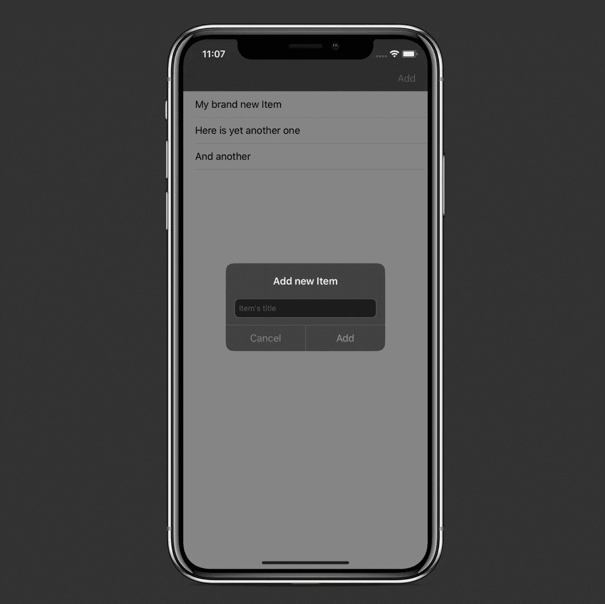
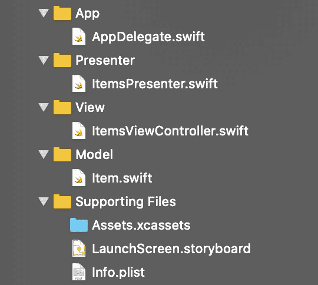

# 在 Swift 5 中实施模型-视图-演示者架构

> 原文：<https://betterprogramming.pub/implement-a-model-view-presenter-architecture-in-swift-5-dfa21bbb8e0b>

## 使用领域数据库作为业务逻辑层

由[马克-奥利维尔·乔多因](https://unsplash.com/@marcojodoin?utm_source=medium&utm_medium=referral)在 [Unsplash](https://unsplash.com?utm_source=medium&utm_medium=referral) 上拍摄的照片

在本文中，我们将学习如何在 iOS 应用程序中实现模型-视图-展示者(MVP)设计模式。

示例项目是一个简单的应用程序，允许您向列表中添加项目，在`UITableView`中显示它们，并使用[领域数据库](https://github.com/realm/realm-cocoa)对它们执行`Create`、`Read`和`Delete`操作。

该项目的源代码可在 GitHub 上获得[。](https://github.com/zafarivaev/MVP-Demo)

# 项目结构

项目的根分为三个文件夹:`App`、`Presenter`和`View`。你还会发现`Supporting Files`。

简而言之，这就是 MVP 中每个组件的职责:

*   `Model`是演示者使用的普通对象。在我们的例子中，它只是一个带有`title`属性的`Item`。
*   `Presenter`独立于 UIKit。它接收来自视图的消息，并执行所有业务逻辑。完成作业后，它为视图准备数据，以合适的格式显示。
*   `View`包含视图控制器和 XIB 文件(如果有的话),它本身并不做太多事情。它的职责是将事件发送给演示者并等待结果。得到结果后，如果需要，它会自我更新。

清楚了这一点，让我们在实践中探索 MVP 架构。

# 模型

这里我们定义了一个简单的领域`Object`和一个`title`属性:

# 视角

首先，我们应该定义我们的`ItemsView`协议，而`ItemsViewController`将遵循该协议。这里，我们定义了我们的`ItemsPresenter`将根据特定业务逻辑任务的结果向`ItemsViewController`发送数据的方法:

现在让我们使`ItemsViewController`符合`ItemsView`协议:

我们将在定义了`Presenter`之后更新这个文件，这正是我们现在要做的。

# 提出者

让我们定义一下`ItemsPresenter`将遵循的`ItemsViewPresenter`协议。在它里面，我们指定一个初始化器作为参数传入`ItemsView`。

我们还提供了`ItemsViewController`将触发的事件方法:

现在，我们可以实现`ItemsPresenter`:

请注意，我们将 view 声明为一个`weak`属性以避免保留周期— `View`应该拥有`Presenter`，并且`Presenter`应该能够通过其`weak`与`View`对话(不要太强！)财产。这里，我们也声明私有的`items`和`realm`属性。

# 最后润色

最后，让我们通过调用其中的`ItemsPresenter`方法来更新我们的`ItemsViewController`:

现在剩下的就是将`view`与`presenter`钩住，并将`rootViewController`放入`AppDelegate.swift`内的`window`:

我们已经成功地用一个领域数据库实现了一个 MVP 架构。

# 包扎

有了 MVP，我们在应用程序中有了明确的分工。现在，`UIViewController`子类对`Model`一无所知，所有的业务逻辑都在一个`Presenter`内部实现。建议你看一下[这篇文章](https://medium.com/ios-os-x-development/ios-architecture-patterns-ecba4c38de52)，我发现在学习 MVP 的时候真的很有帮助。

如果你对不同的建筑模式感到好奇，请随意查看我的其他相关作品:

 [## 新 MVC:单一责任原则和委托

### 苹果的模型视图控制器，终于做对了

medium.com](https://medium.com/better-programming/this-is-how-you-implement-mvc-architecture-in-2020-b39d65b4212f)  [## 反应式 MVVM 和协调模式做对了

### 使用 Swift 5、RxSwift 和 RxDataSources

medium.com](https://medium.com/better-programming/reactive-mvvm-and-the-coordinator-pattern-done-right-88248baf8ca5)  [## 在 Swift 5 中实施面向服务的架构

### 为什么只用 MVC/MVVM/蝰蛇还不够

medium.com](https://medium.com/better-programming/implement-a-service-oriented-architecture-in-swift-5-fc70b8117616)  [## 如何使用 Swift 5 在您的 iOS 应用中实现 VIPER 架构

### 使用方便的 Xcode 模板和参考报告

medium.com](https://medium.com/better-programming/how-to-implement-viper-architecture-in-your-ios-app-rest-api-and-kingfisher-f494a0891c43) 

非常感谢您的阅读！