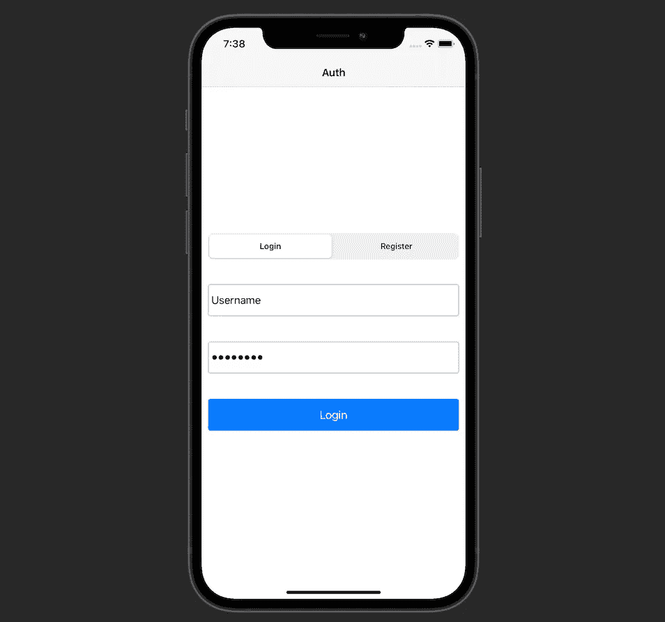
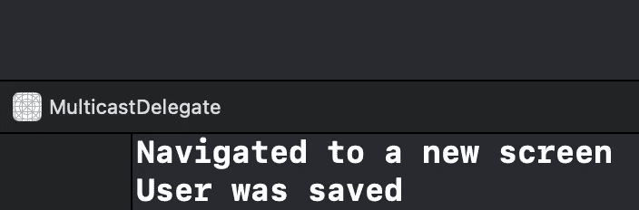

# 在 Swift 5 中实施组播委托设计模式

> 原文：<https://betterprogramming.pub/implement-a-multicast-delegate-design-pattern-in-swift-5-72079d695cfe>

## 通知几个对象，而不是一个

照片由[谢尔盖·佐尔金](https://unsplash.com/@szolkin?utm_source=medium&utm_medium=referral)在 [Unsplash](https://unsplash.com?utm_source=medium&utm_medium=referral) 拍摄

在本文中，我们将学习如何实现多播代理设计模式。我们将通过创建一个可重用的`MulticastDelegate`类并在 Xcode 项目中使用它来实现。该项目的源代码可以在文章的底部找到。

# 我们开始吧

我们从一个简单的屏幕开始，显示一个分段控件、两个文本字段和一个按钮。该屏幕如下所示:

我们的任务是根据用户是尝试登录还是注册来导航到某个屏幕。我们还想持久化用户的数据。

目前,`AuthView`中的代码如下所示:

1.  我们定义了`AuthDelegate`协议，稍后我们将使用它来通知其他类关于`AuthView`中发生的事件。
2.  在初始化器中，我们添加了一个堆栈视图，并设置了所需的约束。
3.  当我们改变分段控件的值时，`segmentedControlHandler`将被调用。这里，我们根据控件的值来设置`mode`。
4.  当我们点击按钮时会调用`actionButtonHandler`。稍后我们将更新它来触发委托的方法。
5.  前面提到的`Mode`是一个简单的枚举，它有两种可能的情况:`login`和`register`。根据`mode`，我们设置按钮的标题。

现在，让我们用下面的代码探索一下`AuthViewController`以及`AuthView`是如何添加到其中的:

1.  `Coordinator`将负责导航任务。稍后我们将看到如何使用它。
2.  一旦我们登录或注册一个新用户，`Storage`将持久化`User`对象。
3.  `AuthView`被创建为属性并添加到`loadView()`方法内的视图控制器中。

太好了，我们的 UI 准备好了。现在我们需要使`Storage`和`Coordinator`成为`AuthView`的代表成为可能。一旦我们点击`AuthView`内的按钮，`Coordinator`将导航到相应的屏幕，`Storage`将保存用户。

# 多播代理

让我们创建一个通用的`MulticastDelegate`类，如下所示:

1.  我们创建一个`Wrapper`类来包装每个委托，并保存对它的`weak`引用。这样做是为了防止滞留循环。
2.  我们将一组`Wrapper`对象设为私有。同时," real" `delegates`属性被创建为包含非零值的数组。
3.  我们使用`add(delegate: T)`方法向数组添加一个新的委托。
4.  类似地，通过使用`remove(delegate: T)`方法，我们删除了一个委托。
5.  当我们需要通知每个代表一个事件时，就会调用`invokeForEachDelegate(_ handler: (T) -> ())`。

实现了一个多播委托，现在是时候在`AuthView`和`AuthViewController`中使用它了。

先来更新一下`AuthView`:

在这里，我们执行以下操作:

1.  增加`multicastAuthDelegate`并提供`AuthDelegate`作为类型。
2.  在`actionButtonHandler(_ sender: UIButton)`中，我们称`MulticastDelegate`的`invokeForEachDelegate`方法。我们添加的每个委托都将调用`AuthDelegate`的`actionButtonTapped`方法。

接下来，我们需要更新`AuthViewController`中的代码:

正如我们所看到的，在`viewDidLoad()`中，我们添加了`Coordinator`和`Storage`作为代理。

现在，当用户点击按钮时，两个代理都将执行他们的工作。这就是`Coordinator`任务的样子:

1.  它依赖于`UINavigationController`来执行导航任务。
2.  在`AuthDelegate`的`actionButtonTapped`方法中，当`Mode`是`.login`时，我们导航到`HomeViewController`。否则，我们将`AcceptTermsViewController`推到导航堆栈上。

`Storage`只是将`User`结构保存在`UserDefaults`中(注意，在实际项目中，密码和其他敏感信息应该保存在安全的存储中，比如 Keychain)。代码如下:

如果我们构建并运行应用程序，然后尝试登录，我们将看到两位代表都按照预期完成了工作。

# 资源

源代码可以在 [GitHub](https://github.com/zafarivaev/multicast-delegate-swift) 上获得。感谢阅读！