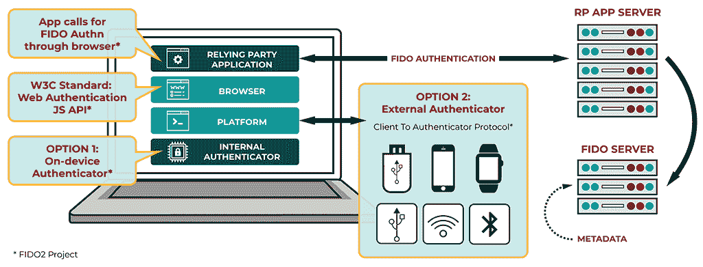
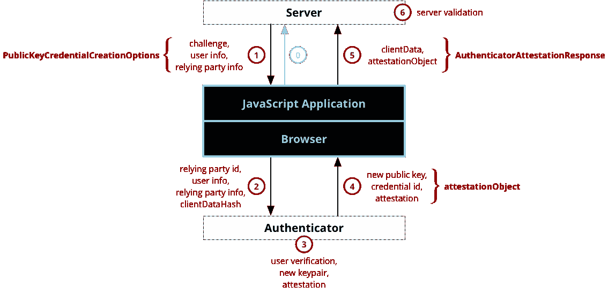
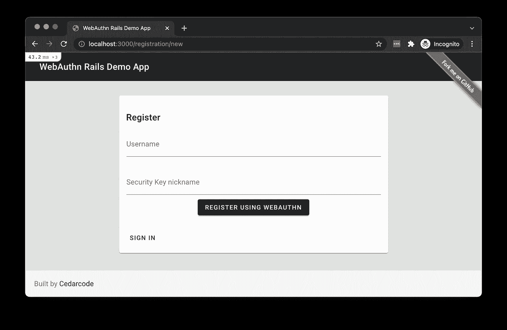
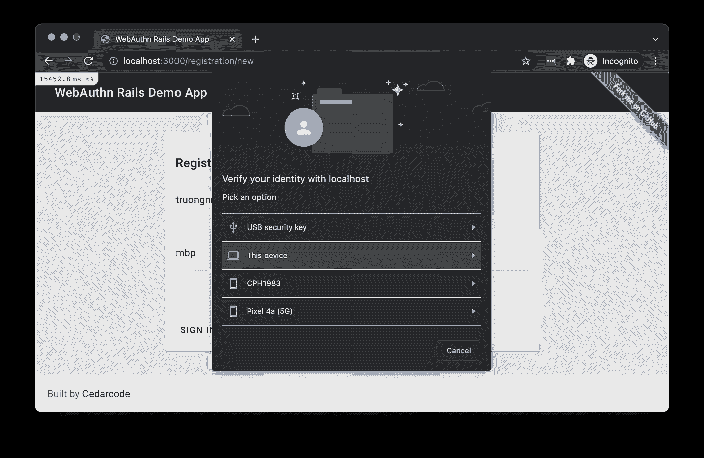
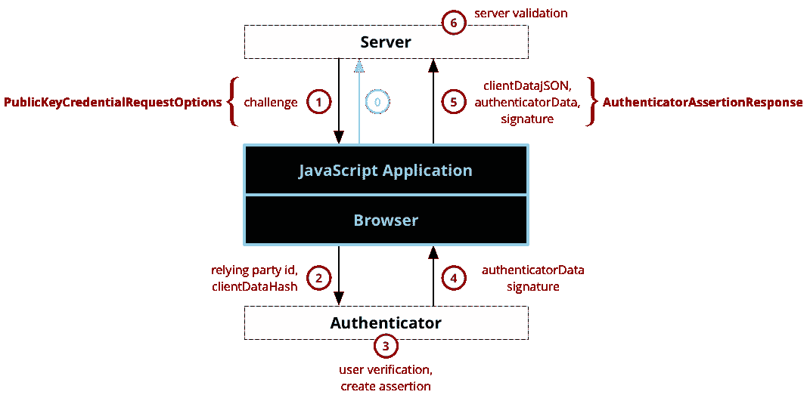
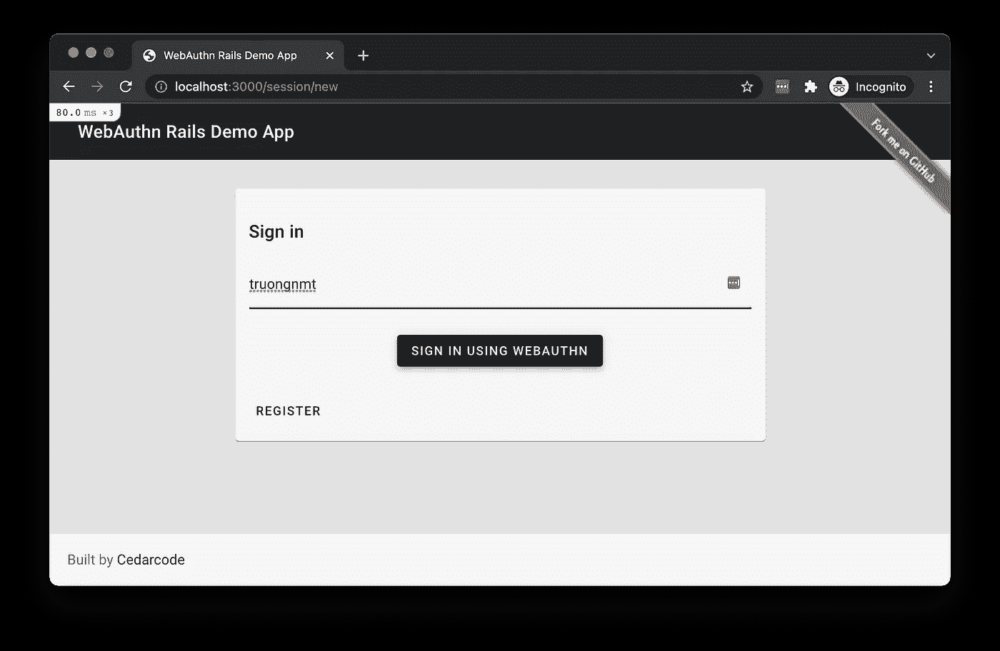
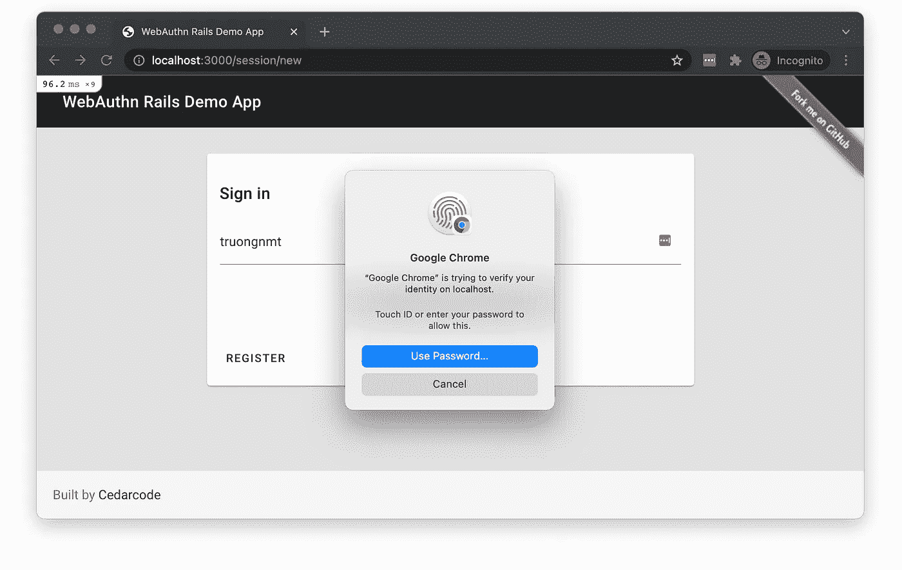
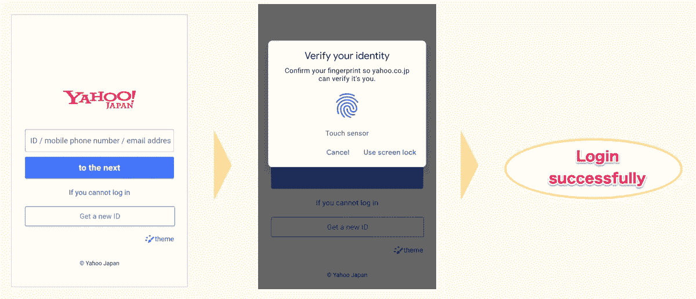
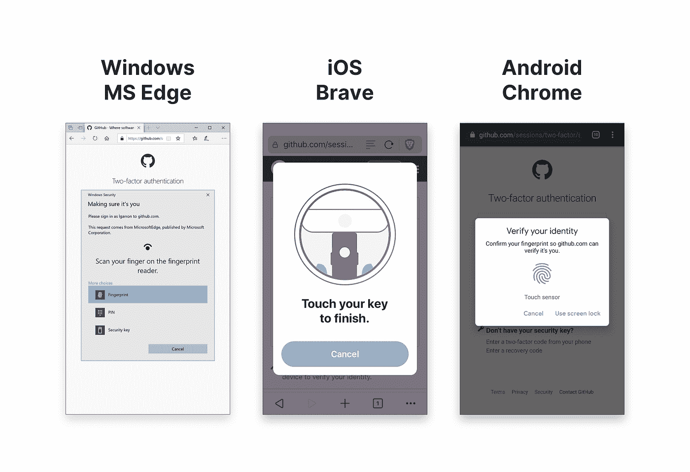
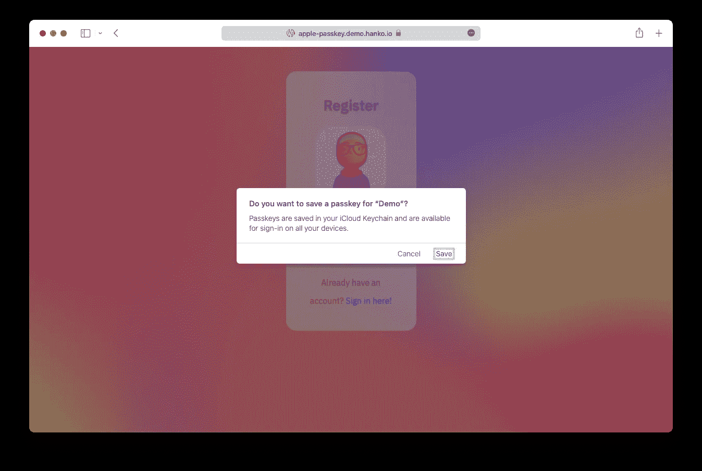

# 用 WebAuthn 实现无密码认证应用

> 原文：<https://betterprogramming.pub/implement-a-passwordless-authentication-app-with-webauthn-aa3635d5d943>

## 通过本实践教程了解无密码身份验证机制


在 [Unsplash](https://unsplash.com?utm_source=medium&utm_medium=referral) 上[注册](https://unsplash.com/@theregisti?utm_source=medium&utm_medium=referral)的照片

在本文中，让我们通过构建 FIDO2 服务器并学习如何使用 WebAuthn API 与它交互来实现无密码认证应用程序。此外，在实现无密码身份验证机制时，探索一些技巧和资源。

# FIDO2、WebAuthn 和 CTAP

FIDO2 由 W3C 的 Web 认证规范(WebAuthn)和 FIDO 联盟的客户端到认证者协议(CTAP)组成。依赖方(RP 的缩写，在我们的例子中是我们的应用程序)将使用 WebAuthn API 与 Authenticator 进行交互，以创建和管理公钥/私钥。一个全功能的无密码认证系统包括:

1.  RP 应用服务器和 FIDO 服务器。
    (可单独建造或组合建造)
2.  调用 WebAuthn API 的前端 RP 应用程序
3.  可以运行 WebAuthn API 的兼容浏览器。
4.  兼容 FIDO2 的认证器。



图片来自 FIDO Alliance

关于其他 FIDO 规范的更多细节，FIDO 诞生的背景，请看我以前的文章。[FIDO web authn pass less:我们去香蕉吧！](https://levelup.gitconnected.com/fido-webauthn-passwordless-lets-go-bananas-b58106a762f0)

看上面的图片，我们需要实现的只有 2 件事:

1.  RP 应用服务器和 FIDO 服务器。
2.  调用 WebAuthn API 的前端 RP 应用程序

由于 FIDO Alliance，最困难的部分已经完成，他们与平台提供商、设备制造商合作，在认证器中实现 CTAP 协议，并将其公开给 WebAuthn API，因此我们只需在浏览器中调用简单的函数。

# 想先试试吗？

这是我们的演示网站，看看吧，四处玩玩~[https://webauthn.cedarcode.com](https://webauthn.cedarcode.com/)

# 履行

对于 FIDO 服务器，我们可以通过使用开源库或使用其他方的现有解决方案来自己构建它。就我个人而言，我会使用 Rails，因为它实现起来更快。在本文中，我将使用 [webauthn-ruby](https://github.com/cedarcode/webauthn-ruby) 用于 FIDO 服务器，使用 [webauthn-json](https://github.com/github/webauthn-json) 用于调用 WebAuthn API。

这里是我们的应用程序[web authn-rails-demo-app](https://github.com/cedarcode/webauthn-rails-demo-app)的存储库。

## 准备好

打开 Gemfile 并添加`webauthn-ruby` gem，然后运行`bundle`进行安装。

```
gem 'webauthn'
```

接下来，打开 webauthn 配置`config/initializers/webauthn.rb`，并将`config.origin`更改为您的应用程序域。

## 登记



图片来自 Mozilla

步骤 0(不在上图中)是用户输入他们的用户名和认证者的昵称。在用户点击“使用 WebAuthn 注册”之后，它将调用一个 POST 请求到端点`/registration`。



在`[RegistrationsController#create](https://github.com/cedarcode/webauthn-rails-demo-app/blob/d9b73e20a7272e8d9f7a26c48ec49e5100295939/app/controllers/registrations_controller.rb#L7-L28)`控制器中，我们将准备`PublicKeyCredentialCreationOptions`发送给 JavaScript 应用程序。

下面是第 16 行的响应:

*   `challenge`:FIDO 服务器生成的随机字符串，用于维护步骤 1 和步骤 5 之间的状态完整性。该角色与 OAuth 中的`state`参数相同。
*   `timeout`:用户与认证者交互的超时值。
*   `rp`:关于 RP 的信息。`rp.name`为必填项。
*   `user`:用户信息。
*   `user.id`:服务器生成的标识符，不是 PII(例如:电子邮件、用户名)。为了确保安全操作，必须基于该 id 成员而不是 displayName 或 Name 成员做出身份验证和授权决定。
*   `user.name` `user.displayName`:用户名称，仅用于显示。
*   `pubKeyCredParams`:服务器支持的签名算法列表。欲望的顺序是自上而下的。该算法名称在 [IANA COSE 算法注册中心注册。](https://www.iana.org/assignments/cose/cose.xhtml)例如:`-7: ES256`，`-257: RS256`

FIDO 可以指定的其他选项有:

```
 ...
  "attestation": "none",
  "authenticatorSelection": {
    "authenticatorAttachment": "platform",
    "userVerification": "required"
  },
  ...
```

*   `attestation`:表示 FIDO 服务器将如何从认证者处接收凭证。它就像一个证书。可能的值有:`direct indirect none`。通常，这被设置为无。通常不需要请求证明，除非合规性需要(例如，银行、企业或政府)。有关 FIDO [认证](https://fidoalliance.org/fido-technotes-the-truth-about-attestation)的更多信息。
*   `authenticatorSelection` : FIDO 服务器对认证器的偏好
*   `authenticatorSelection.authenticatorAttachment`:过滤可用授权码。如果你想要一个认证器连接到设备，使用`platform`。对于漫游授权码，使用`cross-platform`。
*   `authenticatorSelection.userVerification`:确定认证者本地用户验证是`required`、`preferred`还是`discouraged`。

接下来，JavaScript 应用程序接收[new _ registration _ controller . JS](https://github.com/cedarcode/webauthn-rails-demo-app/blob/d9b73e20a7272e8d9f7a26c48ec49e5100295939/app/javascript/controllers/new_registration_controller.js#L19)中的 JSON，并调用 [credential.js](https://github.com/cedarcode/webauthn-rails-demo-app/blob/d9b73e20a7272e8d9f7a26c48ec49e5100295939/app/javascript/credential.js#L35) 中的`webauthn-json` JS 库。

`webauthn-json` js 库接收 JSON，填充其他需要的参数并创建`PublicKeyCredentialCreationOptions`，然后调用 WebAuthn API `navigator.credentials.create()`。这是我们图表中的第二步。然后，浏览器将要求用户选择验证器，如果需要，将执行本地用户验证(步骤 3)。



假设认证者能够验证用户，成功创建新的密钥对…，然后认证者将`attestationObject`返回给浏览器(步骤 4)，然后 WebAuthn API 创建`AuthenticatorAttestationResponse`，我们的 JS 代码[在回调](https://github.com/cedarcode/webauthn-rails-demo-app/blob/d9b73e20a7272e8d9f7a26c48ec49e5100295939/app/javascript/credential.js#L13-L32)中将此响应发送给 FIDO 服务器。响应如下所示:

*   `rawId`:标识公钥的唯一 ID。
*   `id` : base64url 编码版本的`rawId`
*   `type`:始终固定在`public-key`
*   `response.clientDataJSON`:用 base64url 编码的 JSON 对象，该内容将被添加到`attestationObject`中的`authData`中，并由认证者签名。我们可以解码来查看信息。认证者将密钥对与域绑定，只有这个注册的域能够使用密钥对。这就是它对网络钓鱼的强大抵抗力。

```
{
  "type": "webauthn.create",
  "challenge": "Wj4vWoL1BeG0PB8iJTKMfvLH8rBt3CA6PfM4QBIyKmU",
  "origin": "http://localhost:3000",
  "crossOrigin": false
}
```

*   `response.attestationObject` : CBOR 编码和 base64url 编码，就像证书一样。关于`attestationObject`结构的更多细节: [W3C 文档](https://www.w3.org/TR/webauthn/#fig-attStructs)。

接下来，在步骤 6 中，我们的 FIDO 服务器接收`AuthenticatorAttestationResponse`，验证挑战以确保它是一个有效的请求，同时`webauthn-ruby` gem 在内部验证证明(如果需要)。假设一切都是正确的，将会创建一个带有公钥、id 和其他相关信息但没有秘密的用户帐户。
[注册 _ 控制器. rb](https://github.com/cedarcode/webauthn-rails-demo-app/blob/d9b73e20a7272e8d9f7a26c48ec49e5100295939/app/controllers/registrations_controller.rb#L30-L57)

## 为帐户注册更多安全密钥


注册后，用户登录。他们可以向自己的帐户添加更多的安全密钥。点击“添加安全密钥”按钮时，将向`/credentials`发出 POST 请求。然后重复我们的注册图中的步骤 1 至步骤 6，唯一的一点不同是 FIDO 服务器在第 8 行指定了一个名为`exclude`的附加参数，这意味着来自同一用户的所有先前注册的授权码都将被拒绝。
[凭据 _controller.rb](https://github.com/cedarcode/webauthn-rails-demo-app/blob/d9b73e20a7272e8d9f7a26c48ec49e5100295939/app/controllers/credentials_controller.rb#L4-L18)

## 证明



图片来自 Mozilla

步骤 0(不在上图中)是当用户注销时，在表单中填写用户名并单击“使用 WebAuthn 登录”。然后，将向`/session`发出 POST 请求。



这导致了第一步，在`[sessions_controller.rb](https://github.com/cedarcode/webauthn-rails-demo-app/blob/d9b73e20a7272e8d9f7a26c48ec49e5100295939/app/controllers/sessions_controller.rb#L7-L23)`中，我们准备传递给 Javascript 端的选项。

第 11 行的 JSON 如下所示:

我们已经熟悉了其他字段，这次登录时，唯一的不同是我们有了`allowCredentials`,这意味着 FIDO 服务器只允许通过指定其 id 来使用以前注册的授权码。例如，上面的 id `Abn91…`就是我们在`AuthenticatorAttestationResponse`(注册步骤 5)中收到的同一个公钥 id。

接下来，JavaScript 应用程序在[new _ session _ controller . JS](https://github.com/cedarcode/webauthn-rails-demo-app/blob/d9b73e20a7272e8d9f7a26c48ec49e5100295939/app/javascript/controllers/new_session_controller.js#L9-L14)中接收上述 JSON，并调用 [credential.js](https://github.com/cedarcode/webauthn-rails-demo-app/blob/d9b73e20a7272e8d9f7a26c48ec49e5100295939/app/javascript/credential.js#L44-L52) 中的`webauthn-json` JS 库。

`webauthn-json` js 库接收 JSON，填充其他需要的参数并创建`PublicKeyCredentialRequestOptions`，然后调用 WebAuthn API `navigator.credentials.get()`。这是我们图表中的第二步。然后，浏览器将要求用户仅选择已注册的认证器，如果需要，将执行本地用户验证(步骤 3)。



假设验证者能够验证用户，成功创建断言…，然后验证者将`authenticatorData`、`signature`返回给浏览器(步骤 4)，然后 WebAuthn API 创建`AuthenticatorAssertionResponse`，我们的 JS 代码[在回调](https://github.com/cedarcode/webauthn-rails-demo-app/blob/d9b73e20a7272e8d9f7a26c48ec49e5100295939/app/javascript/credential.js#L13-L32)中将此响应发送给 FIDO 服务器。响应如下所示:

*   `response.authenticatorData` : CBOR 编码，base64url 编码，与`attestationObject`结构相同。
*   `response.userHandle` : user.id (id 在`id name displayName`中)
*   `response.clientDataJSON`:一个用 base64url 编码的 JSON 对象，该内容将被添加到`authenticatorData`中的`authData`中，并由认证者签名。我们可以解码来查看信息。

```
{
  "type": "webauthn.get",
  "challenge": "pW3wrtt7b65n5ehxWbVpb8vGml9EGn9yXXTcuBzXI7E",
  "origin": "http://localhost:3000",
  "crossOrigin": false
}
```

接下来，在步骤 6 中，我们的 FIDO 服务器接收`AuthenticatorAssertionResponse`，验证挑战以确保它是一个有效的请求，验证`sign_count`，同时`webauthn-ruby` gem 在内部验证断言(如果需要)。假设一切都是正确的，用户`sign_count`值将被更新，用户将登录。
[sessions _ controller . Rb](https://github.com/cedarcode/webauthn-rails-demo-app/blob/d9b73e20a7272e8d9f7a26c48ec49e5100295939/app/controllers/sessions_controller.rb#L25-L50)

## 验证证明和断言

我简单解释的一部分是验证证明(当注册时)和验证断言(当认证时)。这个验证逻辑是由`webauthn-ruby` gem 内部完成的。每个认证器都有自己的验证方式，实现起来非常复杂和耗时，所以我们应该把这项工作留给库。

如果你想阅读更多关于这个主题的内容，我推荐这篇文章: [WebAuthn/FIDO2:验证断言响应](https://medium.com/@herrjemand/verifying-fido2-responses-4691288c8770)作者阿克曼·塞维多夫

唷，一下子覆盖所有流量是相当困难的。😅
如果到目前为止你还在遵循教程，给自己一点掌声吧！！👏👏👏👏👏

# 其他考虑

## 实施 FIDO2 用于无密码还是 2FA 还是两者都用？

在为您的应用程序实现 FIDO2 时，有两种使用情形。您可以实现无密码身份验证流程(如本教程中的示例)或实现 2FA 方法(注册 FIDO2 兼容的安全密钥)。

对于无密码方法，UX 得到了很大的提高，但我们需要考虑恢复方法。我们仍然必须提供替代的登录方法，如密码，或在电子邮件中发送恢复链接，或发送短信。如果用户设置了一个弱密码，无论无密码是否开启，他们的帐户仍然会被泄露。使用电子邮件或 SMS 等恢复方法，最终，用户将需要电子邮件提供商的密码，并且 SMS 文本消息并不总是 100%可信的，因此不是每个用户都会设置电话号码。无论 FIDO2 强安全级别如何，这都会将整个帐户的安全级别降低到帐户恢复方法的安全级别。虽然无密码不会提高安全级别，但这样做还是有好处的，可以提高整体 UX。

例如:雅虎日本，[纽拉布](https://nulab.com/ja/blog/nulab/webauthn_demo/)



图片来自雅虎日本——使用生物认证登录

第二种方法是将 FIDO 实现为 2FA 方法，而不是 TOTP。FIDO 设置过程比 TOTP 快得多，也简单得多。但是，为了将 FIDO 设置为 2FA，仍需要将 TOTP 配置为帐户恢复方法。

例如:Github、Twitter



图片来自 Github

第一种方法非常适合 B2C 应用程序。对于正常用户来说，通常不在乎设置 2FA。我们可以使用密码计量栏，敦促用户设置强密码，然后设置 FIDO 以方便登录。

第二种方法适用于 B2B 应用程序，这通常更容易实施 2FA，并且用户已经习惯了 2FA 流程。

## 密码=(已同步)WebAuthn 凭据(WIP)

如前所述，无论 FIDO2 强安全级别如何，整个帐户的安全级别都可以降低到帐户恢复方法的安全级别。我们需要考虑如何做账户回收。

在 WWDC21 上，苹果推出了一项新的“iCloud 钥匙串中的 Passkeys”功能。基本上，所有的 WebAuthn 凭证在所有的苹果设备上都是同步的。因此，如果用户丢失了之前注册为验证者的设备，只要他们可以访问他们的 Apple 帐户，他们就可以访问存储在 iCloud Keychain 中的所有凭据。



直到现在，只有苹果公司推出了这一功能。个人听说其他平台也会在 2022 年末发布同样的功能。

## 用户存在与用户验证

来自 [Yubico](https://developers.yubico.com/WebAuthn/WebAuthn_Developer_Guide/User_Presence_vs_User_Verification.html) 的这篇文章很好地解释了这一点。注册和身份验证都需要以下一项或两项:

*   用户存在:这个最基本的配置只不过是一个 FIDO2 调用，提示用户触摸安全密钥或以某种方式与验证者交互。
*   用户验证:FIDO2 调用，其中验证器验证用户是否被授权使用验证器，并向 RP 发送用户验证是否成功的信号。

用户**验证**用于确保向服务认证的人实际上是他们为了该服务而声称的人。用户验证可以采取各种形式，例如密码、PIN、指纹、公钥证书等。重点是将一个用户与任何其他用户区分开，即唯一地识别用户。

使用用户**存在**，目的不是识别用户，而是确保用户实际存在并控制认证者。

每种类型的使用案例:

*   用户在场适用于第二因素身份验证(2FA)
*   不建议对 2FA 进行用户验证，因为用户已经输入了通过网络发送给服务器的共享密码
*   用户验证适用于无密码场景和多因素身份验证(MFA ),因为它将“您拥有的东西”和“您是什么”/“您知道的东西”结合在一个手势中。

## FIDO 桌面认证器 UX 指南

FIDO UX 指南是一套最佳实践，旨在帮助服务提供商鼓励他们的客户在桌面环境中使用 FIDO 身份验证登录。这些指南旨在加速 FIDO 实施过程中的决策制定，并规定在用户从了解 FIDO 到注册和随后登录的整个过程中应向其提供哪些信息和控制。

你可以在这里阅读关于 FIDO UX 指南:
【https://fidoalliance.org/ux-guidelines/ux-guideline-pdf/】T2

听听 FIDO 联盟成员对 UX 在 FIDO 实施中的重要性的看法。

# 其他语言库和资源

在本文中，作为一个例子，我使用 Rails 并使用`[webauthn-ruby](https://github.com/cedarcode/webauthn-ruby)`构建一个 FIDO 服务器。其他编程语言的开源库见 [webauthn.io](https://webauthn.io/) 或 [AwesomeWebAuthn](https://bit.ly/AwesomeWebAuthn) 。

如果想使用其他方的现有解决方案，可以看看 [FIDO 联盟官方页面](https://fidoalliance.org/certification/fido-certified-products/)。

# 结论

这是一篇很长的文章，很抱歉😅。我希望你已经学到了一些东西，如果你有问题，随时留下评论。💪

因此，我们已经介绍了如何实现无密码认证应用程序，并逐步了解代码如何运行。我们还讨论了实施 FIDO 的方式、用户存在和用户验证的区别、UX 的最佳实践，并探索了其他相关资源。

# 参考

*   [Web 认证 API](https://developer.mozilla.org/en-US/docs/Web/API/Web_Authentication_API)(developer.mozilla.org)
*   [Web 认证:用于访问第 3 级公钥证书的 API](https://www.w3.org/TR/2021/WD-webauthn-3-20210427/)(www.w3.org)
*   [Yahoo! JAPANでの生体認証の取り組み（FIDO2サーバーの仕組みについて）](https://techblog.yahoo.co.jp/advent-calendar-2018/webauthn/) (techblog.yahoo.co.jp)
*   (engineering.mercari.com)webauthnことはじめ

*感谢您阅读这篇文章！如果你有任何问题，请留言。如果你觉得这篇文章有帮助，请按住鼓掌按钮，让其他人也能发现。请务必在下面注册我的时事通讯，或者在 Medium 上关注我，以获得更多类似的文章。* ☝️👏 😄