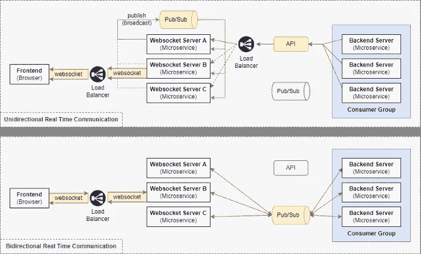
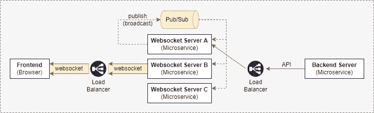
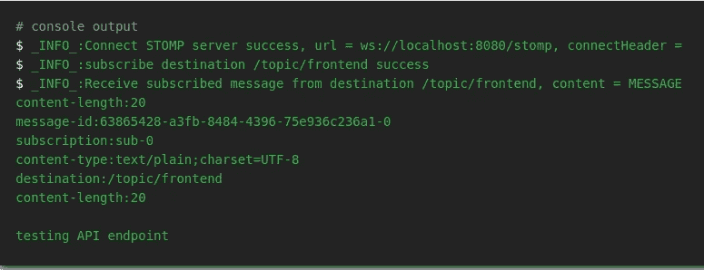
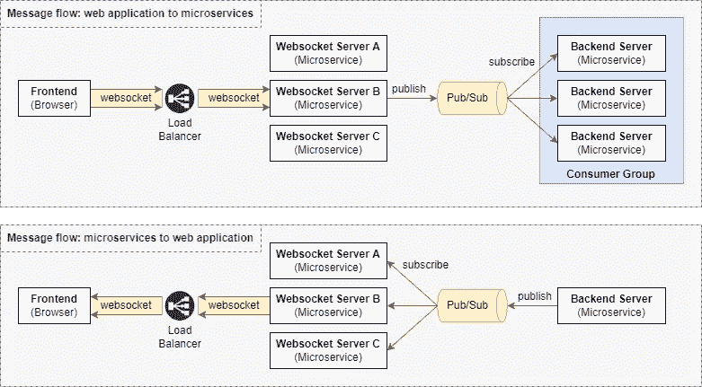
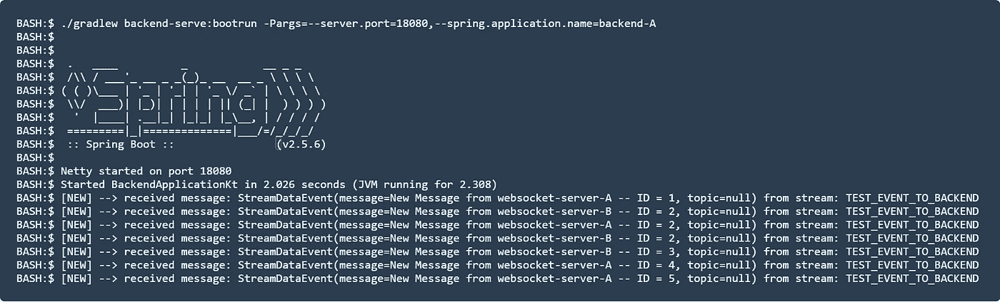
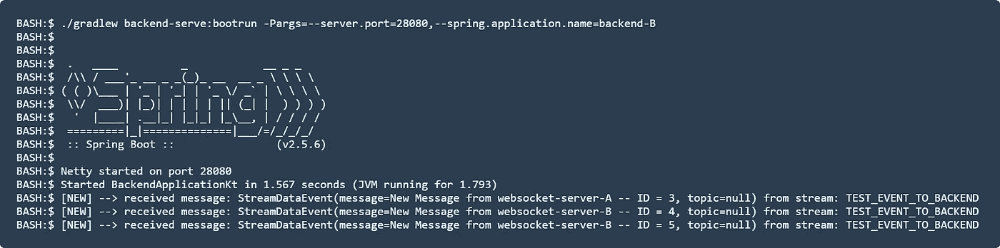
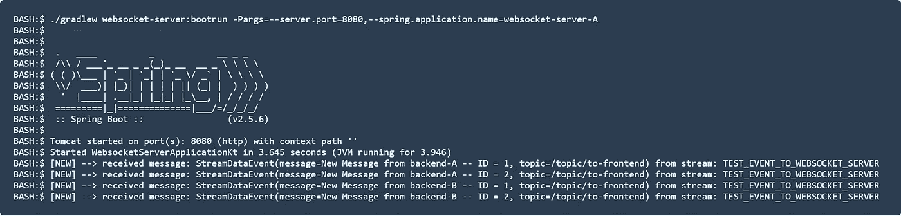
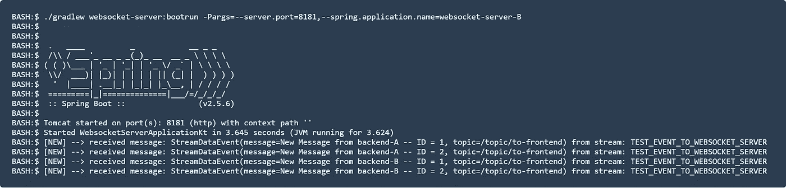
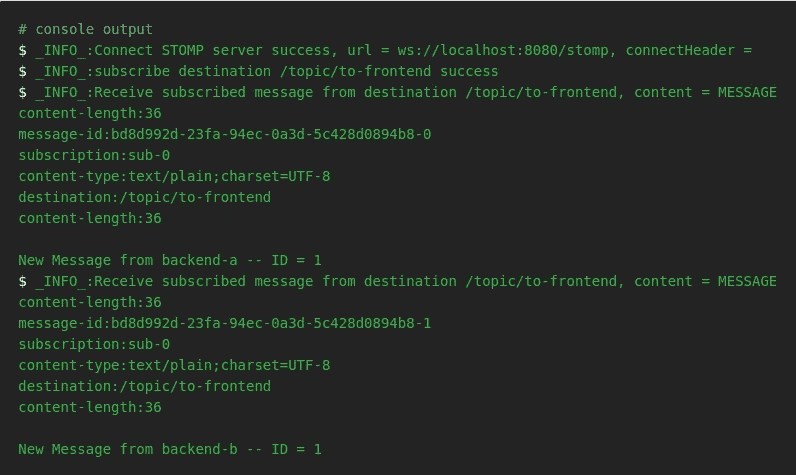

# 使用 Spring Boot、Redis 发布/订阅和 Redis 流实现可伸缩的 WebSocket 服务器

> 原文：<https://betterprogramming.pub/implement-a-scalable-websocket-server-with-spring-boot-redis-pub-sub-and-redis-streams-b6b8cc08767f>

## 使用 Spring Boot、Redis 发布/订阅和 Redis 流水平扩展 WebSocket 服务器


安德里亚斯·瓦格纳在 [Unsplash](https://unsplash.com/@waguluz_?utm_source=unsplash&utm_medium=referral&utm_content=creditCopyText) 上拍摄的照片

这是我的[上一篇关于水平扩展 WebSocket 服务器的设计考虑的文章](/design-considerations-for-scaling-websocket-server-horizontally-with-a-publish-subscribe-pattern-fe6de9988400)的后续。

在本文中，我将详细介绍如何使用 Redis 发布/订阅和 Redis 流来实现这一点。

[](https://github.com/bkjam/websocket-microservice) [## GitHub-bkjam/websocket-微服务:实时 web socket 微服务探索…

### Websocket 微服务用于前端和后端实时通信的探索

github.com](https://github.com/bkjam/websocket-microservice) 

# 我的 WebSocket 服务器系列

*   01: [在微服务架构中构建 WebSocket 服务器](https://medium.com/@kbryan1008/building-a-websocket-server-in-a-microservice-architecture-50c6c6432e2b)
*   02: [使用发布-订阅模式水平扩展 WebSocket 服务器的设计考虑](/design-considerations-for-scaling-websocket-server-horizontally-with-a-publish-subscribe-pattern-fe6de9988400)
*   03:使用 Spring Boot、Redis 发布/订阅和 Redis 流实现可伸缩的 WebSocket 服务器
*   04:待定

# 快速回顾



使用发布-订阅模式在微服务架构中扩展 WebSocket 服务器的完整设计

在上一篇文章中，我们指出了水平扩展 WebSocket 服务器和后端微服务时会出现的两个问题:

*   问题#1:负载平衡器导致的消息丢失
*   问题#2:由于多个订户而导致重复的消息处理

解决方案是将带有消费者团体概念的发布-订阅消息传递模式应用到架构设计中。有关更多信息，请参考[上一篇文章](/design-considerations-for-scaling-websocket-server-horizontally-with-a-publish-subscribe-pattern-fe6de9988400)。

# 我们开始吧

继续使用 Spring Boot、Stomp、Redis 发布/订阅和 Redis 流构建一个可伸缩的 WebSocket 服务器。

## **步骤 1:构建 WebSocket 服务器**

按照我上一篇文章中的[步骤 1 和 2，使用 Spring Boot 和 STOMP 消息协议初始化一个 WebSocket 服务器。](https://medium.com/@kbryan1008/building-a-websocket-server-in-a-microservice-architecture-50c6c6432e2b)

## **第二步:启动 Redis 服务器**

为了快速设置，使用 docker 在本地运行 Redis 服务器。

```
docker run --name redis -p 6379:6379 -d redis
```

## **步骤 3:配置与 Redis 服务器的连接**

将以下配置添加到 WebSocket 服务器的`application.yml`文件中，以连接到 Redis 服务器。

```
# application.yml
spring.redis:
    host: localhost
    port: 6379
```

# **步骤 4:实现单向实时通信的发布/订阅(广播信道)**



使用 API 和发布/订阅(广播)的单向实时通信设计

在第 4 步中，我们将为后端微服务和 web 应用程序(前端)之间的单向实时通信创建 API。WebSocket 服务器通过 API 从后端微服务接收消息，并使用 Redis Pub/Sub 将消息广播到所有 WebSocket 服务器实例。然后，通过建立的 WebSocket 连接将消息转发给 web 应用程序。

## **步骤 4.1:创建 BroadcastEvent 类**

`BroadcastEvent`是一个自定义对象，用于将消息从 WebSocket 服务器的一个实例广播到 WebSocket 服务器的所有实例。

## **步骤 4.2:配置 Redis 发布/订阅—reactivedistemplate**

`ReactiveRedisTemplate`是一个助手类，它简化了 Redis 数据访问代码。在我们的配置中，我们发布/订阅值`BroadcastEvent`，并使用`Jackson2JsonRedisSerializer`来执行值的自动序列化/反序列化。

## **步骤 4.3:配置 Redis 发布/订阅广播服务**

`RedisBroadcastService`包含发布和订阅定制频道的逻辑(`BROADCAST-CHANNEL`)。这是从 WebSocket 服务器的一个实例向 WebSocket 服务器的所有实例广播消息的通道。

每当 WebSocket 服务器收到来自`BROADCAST-CHANNEL`的消息时，该消息就会被转发到已经与它建立了 WebSocket 连接的 web 应用程序(前端)。

***注意*** *:* `*@PostConstruct*` *是一个 Spring 注释，允许我们将自定义动作附加到 bean 创建中，并且这些方法只运行一次。在我们的例子中，我们订阅了关于 bean 创建的* `*BROADCAST-CHANNEL*` *。*

## **步骤 4.4:创建 API 端点**

下面的代码创建了一个带有 POST 请求端点的 REST 控制器，该端点接收一个请求体`NewMessageRequest`。`topic`是客户端(前端)订阅的 STOMP 目的地，`message`是字符串格式的实际消息。

API 请求将被广播到 WebSocket 服务器的所有实例，如上面步骤 4.3 中所配置的。

## **步骤 4.5:通过 API 测试单向实时通信**

启动 WebSocket 服务器，使用 [jiangxy](https://github.com/jiangxy/websocket-debug-tool) 开发的 [WebSocket 调试工具](https://bkjam.github.io/websocket-debug-tool/)通过 STOMP 协议连接到 WebSocket 服务器`ws://localhost:8080/stomp`。连接后，配置 WebSocket 调试器工具来订阅主题`/topic/frontend`。

接下来，使用下面的 curl 命令向 WebSocket 服务器发送 HTTP POST 请求:

```
curl -X POST -d '{"topic": "/topic/frontend", "message": "testing API endpoint" }' -H 'Content-Type: application/json' localhost:8080/api/notification
```

WebSocket 调试器工具应该具有如下所示的输出:



WebSocket 调试器工具的输出屏幕截图

这说明我们已经成功地用 Redis Pub/Sub 配置了 WebSocket 服务器，实现了后端微服务和 web 应用(前端)之间可伸缩的单向实时通信。

## **第五步:与消费群体实现双向实时沟通的发布/订阅**



使用发布/订阅和消费群进行双向实时通信的设计

在第 5 步中，我们将使用 Redis 流作为我们的发布/订阅系统，用于后端微服务和 web 应用程序(前端)之间的双向实时通信。我们不使用 Redis 发布/订阅，因为它不支持消费者群体的概念。

## **步骤 5.1:创建 StreamDataEvent 类**

`StreamDataEvent`是用于订阅者和发布者之间数据交换的自定义对象。`message`是字符串格式的实际消息，而`topic`是 WebSocket 服务器知道将消息发送到哪个 STOMP 目的地的必填字段。

## **步骤 5.2: WebSocket 服务器——实现 Redis 流消费者**

消费者使用 Redis 流中的消息，并通过已建立的 WebSocket 连接将消息转发给所有 web 应用程序(前端)。

***注意:*** *不需要广播消息，因为所有 WebSocket 服务器实例都会从 Redis 流接收消息。*

## **步骤 5.3: WebSocket 服务器——实现 Redis 流配置**

以下代码包含订阅 Redis 流的配置，其中消息将由我们在步骤 5.2 中配置的`RedisStreamConsumer`处理。

这里，我们配置 WebSocket 服务器来监听由键`TEST_EVENT_TO_WEBSOCKET_SERVER`标识的流。您可以根据您的使用情况创建更多订阅。

## **步骤 5.4: WebSocket 服务器—实现 Redis 流生成器**

生产者提供了一个方法`publishEvent`，用于将数据发布到 Redis 流。在我们的示例中，有一个调度作业，它使用关键字`TEST_EVENT_TO_BACKEND`定期(在 WebSocket 服务器启动后每五秒或十秒)发布到 Redis 流。

## **步骤 5.5: WebSocket 服务器——实现 WebSocket 配置**

创建一个`Controller`，它处理来自 web 应用程序(前端)的消息，这些消息被发送到带有前缀`/app`的 WebSocket 服务器。在下面的例子中，发送到`/app/test`的消息将被转发(发布)到关键字`TEST_EVENT_TO_BACKEND`处的 Redis 流。

***注意*** *:不需要将消息广播到所有 WebSocket 实例，因为发布到 Redis 流已经确保所有后端微服务都接收到消息。有关更多详细信息，请参考步骤 5 中的图表。*

## **步骤 5.6:后端微服务——实现 Redis 流消费者**

类似地，在样本后端微服务中，实现 Redis 流消费者。

## **步骤 5.6:后端微服务——实现 Redis 流配置**

这里的配置类似于 WebSocket 服务器的配置。唯一的区别是我们添加了消费者组(`CONSUMER_GROUP`)，这确保了只有一个后端微服务实例将消费来自 Redis 流的数据。

为了使配置工作，我们必须首先使用下面的命令在 Redis 中为流`TEST_EVENT_TO_BACKEND`手动创建消费者组。

***注意*** *:也可以使用代码来实现这一点，但是为了简单起见，我将使用 Redis CLI 命令。*

```
docker exec redis redis-cli XGROUP CREATE TEST_EVENT_TO_BACKEND CONSUMER_GROUP $ MKSTREAM
```

## **步骤 5.7:后端微服务——实现 Redis 流生成器**

生产者配置类似于 WebSocket 服务器配置。

*请注意，微服务有一个定期发布到 Redis 流的计划作业，作为我们示例的一部分，该消息被精心设计为发送到目的地主题为* `*/topic/to-frontend*` *的 web 应用程序(前端)。*

## **步骤 5.8:通过发布/订阅测试双向实时通信**

我们已经配置了 WebSocket 服务器和样本后端微服务。让我们使用我们在两个`RedisStreamProducer`中所做的预定数据发布配置来测试来自 Redis 流的数据的发布和订阅。

启动 WebSocket 服务器的两个实例和样本后端微服务的两个实例。您应该注意到输出日志与下面的类似。



后端微服务的输出日志(实例 A)



后端微服务的输出日志(实例 B)



WebSocket 服务器的输出日志(实例 A)



WebSocket 的输出日志(实例 B)

如果您要使用 [WebSocket 调试器工具](https://bkjam.github.io/websocket-debug-tool/)连接到 WebSocket 服务器并订阅主题`/topic/to-frontend`，您应该会看到以下日志:



WebSocket 调试器工具的输出日志(前端)

这表明我们已经成功地用 Redis 流配置了 WebSocket 服务器，用于后端微服务和 web 应用程序(前端)之间可伸缩的双向实时通信。

# 摘要

就是这样！你可以在 G itHub 上找到[示例代码。我的实现并不完美，但目的是让您了解如何使用发布-订阅消息传递模式在微服务架构中轻松扩展 WebSocket 服务器。](https://github.com/bkjam/websocket-microservice/tree/main/02-scaling-websocket-server)

*感谢阅读到最后。我希望你能从这篇文章中学到一些新的东西。敬请期待下一期，学习愉快！*