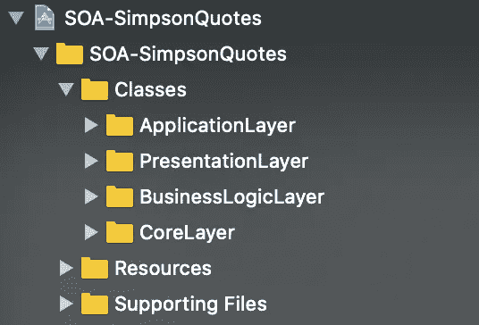

# 在 Swift 5 中实施面向服务的架构

> 原文：<https://betterprogramming.pub/implement-a-service-oriented-architecture-in-swift-5-fc70b8117616>

## 为什么只用 MVC/MVVM/蝰蛇还不够

照片由[丘特尔斯纳普](https://unsplash.com/@chuttersnap?utm_source=medium&utm_medium=referral)在 [Unsplash](https://unsplash.com?utm_source=medium&utm_medium=referral) 上拍摄

# 介绍

为什么仅仅用 [MVC](https://medium.com/better-programming/this-is-how-you-implement-mvc-architecture-in-2020-b39d65b4212f) 、 [MVVM](https://medium.com/better-programming/reactive-mvvm-and-the-coordinator-pattern-done-right-88248baf8ca5) 、 [MVP](https://medium.com/better-programming/implement-a-model-view-presenter-architecture-in-swift-5-dfa21bbb8e0b) ，或者[蝰蛇](https://medium.com/better-programming/how-to-implement-viper-architecture-in-your-ios-app-rest-api-and-kingfisher-f494a0891c43)还不够？这些架构模式只处理应用程序的高层(UI)。但是通常，您还必须实现网络管理器、API 客户端、数据源、持久性容器等等。面向服务的体系结构通过构建高层和低层实现之间的交互，使您的生活更加轻松。

在本文中，我将向您展示如何实现面向服务的架构(SOA)。我是通过使用我为我的 [VIPER 片段](https://medium.com/better-programming/how-to-implement-viper-architecture-in-your-ios-app-rest-api-and-kingfisher-f494a0891c43)创建的一个[演示应用](https://github.com/zafarivaev/VIPER-Demo-App)并根据 SOA 建议重构它来做到这一点的。

该项目的源代码可在 GitHub 上获得[。](https://github.com/zafarivaev/SOA-Demo-App)

# 项目结构

项目的根分为三个文件夹:`Classes`、`Resources`和`Supporting Files`。`Resources`文件夹包含`Assets.xcassets`、*、T30，`Supporting Files`文件夹包含`LaunchScreen.storyboard`和`Info.plist`。*

如您所见，在`Classes`中，我们有以下文件夹:

*   `ApplicationLayer` 文件夹包含了`AppDelegate.swift`文件
*   `PresentationLayer`文件夹有两个 VIPER 模块:`Quotes`和`QuoteDetail`
*   `BusinessLogicLayer` 文件夹包含`Services`和`Entities`【也就是 MV(X)中的*车型*
*   `Services` 文件夹有三个我们在 app 中使用的服务:`QuoteService`，从 API 中获取报价；`KingfisherService`，从 URL 获取图像数据；以及`ImageDataService`，其从该数据生成图像
*   `CoreLayer`文件夹包含我们使用服务需要的所有助手文件:`ApiUrls`、请求配置器和网络客户机

# 定义服务

首先，我们需要提供一个服务的基本功能，它将在未来被特定的服务所子类化:

## **Service.swift**

每个服务必须有一个唯一的`serviceName`和一个`register()`方法。

通过使用`ServiceRegistryImplementation`，我们将在`AppDelegate.swift`中注册我们的服务。

完成基本实现后，现在我们准备为我们的应用程序定义特定的服务。

# 报价服务

该服务负责从 API 获取报价。

我们是这样定义的:

## QuoteService.swift

在`QuoteService`的`extension`中，我们实现了实际的组网:

# 翠鸟服务

该服务负责从 URL 获取图像数据。

其定义与`QuoteService`类似:

在`KingfisherService`的`extension`中，我们实现图像数据下载:

# 图像数据服务

`ImageDataService`给定`Data`时提供一个`UIImage`。

是的，没有惊喜。我们使用类似的实现:

在扩展中实现的数据到图像的转换:

# 注册服务

为了在应用程序中使用服务，我们在`AppDelegate`中定义了一个`ServiceRegistryImplementation`:

## **AppDelegate.swift**

# 使用服务

让我们看看如何使用`QuoteService`来获取要在`QuotesViewController`中显示的报价列表:

如果您不熟悉 [VIPER 架构](https://medium.com/better-programming/how-to-implement-viper-architecture-in-your-ios-app-rest-api-and-kingfisher-f494a0891c43)，只需知道`QuotesInteractor`通过将`QuoteService`作为依赖项传递并调用其`getQuotes`方法来处理与报价屏幕相关的所有业务逻辑。如果你遵循 MVC 架构，或者在 [MVVM](https://medium.com/better-programming/reactive-mvvm-and-the-coordinator-pattern-done-right-88248baf8ca5) 的情况下遵循`ViewModel`，你可以在`UIViewController`中调用相同的方法。

类似地，这就是我们如何使用`KingfisherService`在`QuotesDetailViewController`中显示角色的图像:

`ImageDataService`的用法也很简单，但与 VIPER 有些细微差别:

在 VIPER 中，`Presenter`负责从`Interactor`接收业务操作的结果，将其准备成 UI 可显示的格式，并将其转发给`ViewController` ——它实现了`InteractorToPresenterQuoteDetailProtocol`。

# 包扎

如果您对其他人如何实现面向服务的架构感到好奇，可以考虑查看这些资源:[Swift 中的 SOA](https://itnext.io/service-oriented-architecture-in-swift-362dc454fc09)， [SOA-Services](https://github.com/mvalentiner/SOA-Services) 。

如果你对不同的建筑模式感到好奇，请随意查看我的其他相关作品:

 [## 反应式 MVVM 和协调模式做对了

### 使用 Swift 5、RxSwift 和 RxDataSources

medium.com](https://medium.com/better-programming/reactive-mvvm-and-the-coordinator-pattern-done-right-88248baf8ca5)  [## 如何使用 Swift 5 在您的 iOS 应用中实现 VIPER 架构

### 使用方便的 Xcode 模板和参考报告

medium.com](https://medium.com/better-programming/how-to-implement-viper-architecture-in-your-ios-app-rest-api-and-kingfisher-f494a0891c43)  [## 新 MVC:单一责任原则和委托

### 苹果的模型视图控制器，终于做对了

medium.com](https://medium.com/better-programming/this-is-how-you-implement-mvc-architecture-in-2020-b39d65b4212f)  [## 在 Swift 5 中实施模型-视图-演示者架构

### 使用领域数据库作为业务逻辑层

medium.com](https://medium.com/better-programming/implement-a-model-view-presenter-architecture-in-swift-5-dfa21bbb8e0b) 

非常感谢您的阅读！