# 使用 Node.js 应用程序实现 Auth0

> 原文：<https://betterprogramming.pub/implement-auth0-with-nodejs-442d44da2d0f>

## 将身份验证构建到您的节点应用程序中

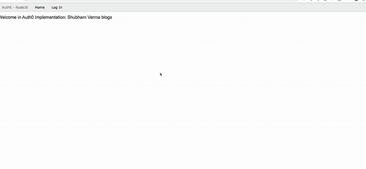

快照:auth0 的完整旅程

# 什么是 Auth0？

Auth0 是第三方工具，提供身份验证和授权服务。它提供了身份验证和授权的构建块，使您无需成为安全专家就能保护您的应用程序。可以将 Auth0 集成到任何 Node.js app 中。

要用 Node.js 实现 Auth0，首先你需要[在 Auth0 上创建一个账户](https://auth0.auth0.com/login?state=g6Fo2SBoUDRvY2tWWXJOX29VT0NBQUNEaGJKZEV2VFBsa213ZaN0aWTZIHpITFl0WGNNZG1vaURmTXNDMGRPUE9CdG40YTdraXVwo2NpZNkgU0IzME9XMVMxVmxyWmdqWVdxWkc2NEFRNU5qRm8xd20&client=SB30OW1S1VlrZgjYWqZG64AQ5NjFo1wm&protocol=oauth2&audience=https%3A%2F%2Fauth0.auth0.com%2Fuserinfo&response_type=code&redirect_uri=https%3A%2F%2Fauth0.com%2Fdocs%2Fauth%2Fcallback&scope=openid%20profile%20email)。然后，[登录](https://auth0.auth0.com/login?state=g6Fo2SBoUDRvY2tWWXJOX29VT0NBQUNEaGJKZEV2VFBsa213ZaN0aWTZIHpITFl0WGNNZG1vaURmTXNDMGRPUE9CdG40YTdraXVwo2NpZNkgU0IzME9XMVMxVmxyWmdqWVdxWkc2NEFRNU5qRm8xd20&client=SB30OW1S1VlrZgjYWqZG64AQ5NjFo1wm&protocol=oauth2&audience=https%3A%2F%2Fauth0.auth0.com%2Fuserinfo&response_type=code&redirect_uri=https%3A%2F%2Fauth0.com%2Fdocs%2Fauth%2Fcallback&scope=openid%20profile%20email)。

# 步骤 1:获取 Auth0 应用程序密钥

现在我们需要在 Auth0 上做一些配置，就这么做吧。当你注册 Auth0 时，一个新的应用程序已经为你创建了——或者你也可以创建一个新的。我们需要以下信息:

*   域密钥
*   客户 ID 密钥
*   客户端密钥

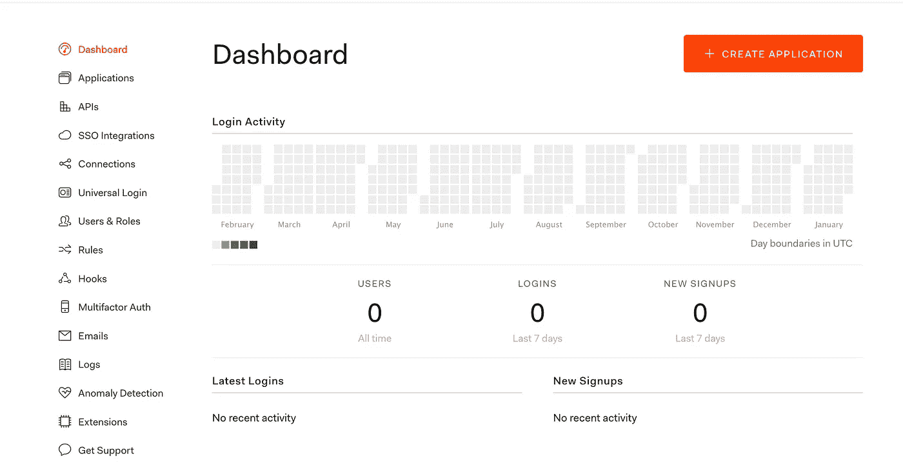

快照:Auth0 仪表板

现在获取应用程序密钥并保存在某个地方:进入应用程序>默认应用程序>设置。

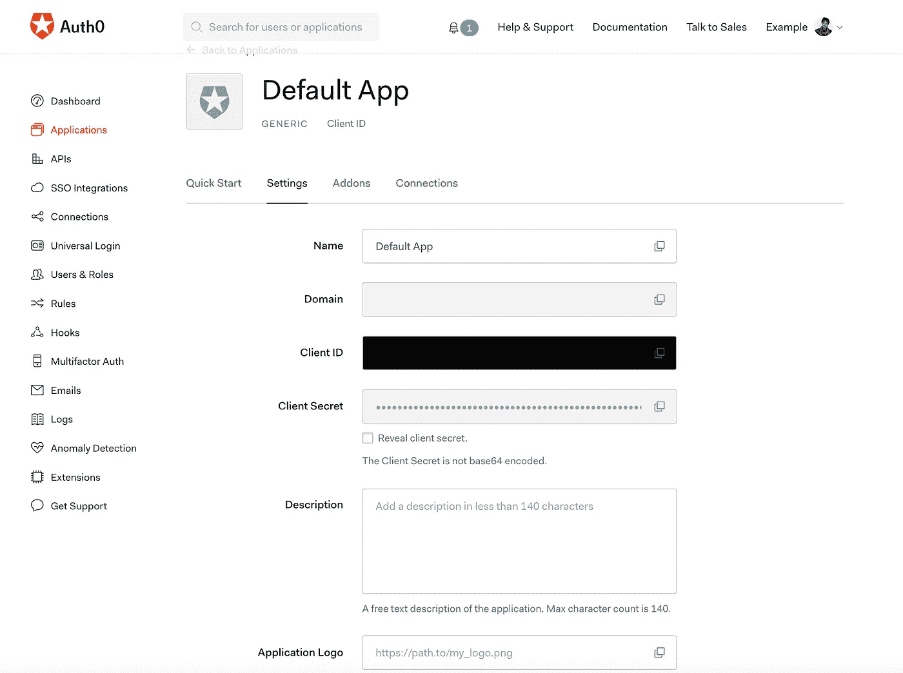

快照:复制密钥

复制域、客户端 ID 和客户端密码。它们将用于我们的节点应用程序。

# **步骤 2:在您的 Auth0 应用中配置回调 URL**

*回调 URL* 是应用程序中的一个 URL，Auth0 在认证后将用户重定向到这个 URL。

要添加此功能，请进入应用程序>默认应用程序>设置，然后在允许的回拨 URL 框中输入`http://localhost:3000/callback`。


快照:允许的回调 URL 框

# **步骤 3:在您的 Auth0 应用中配置注销 URL**

*注销 URL* 是应用程序中的一个 URL，用户从授权服务器注销后，Auth0 可以返回到这个 URL。这在`returnTo`查询参数中指定。

要添加此功能，请进入应用程序>默认应用程序>设置，然后在允许的注销网址框中输入`http://localhost:3000`。

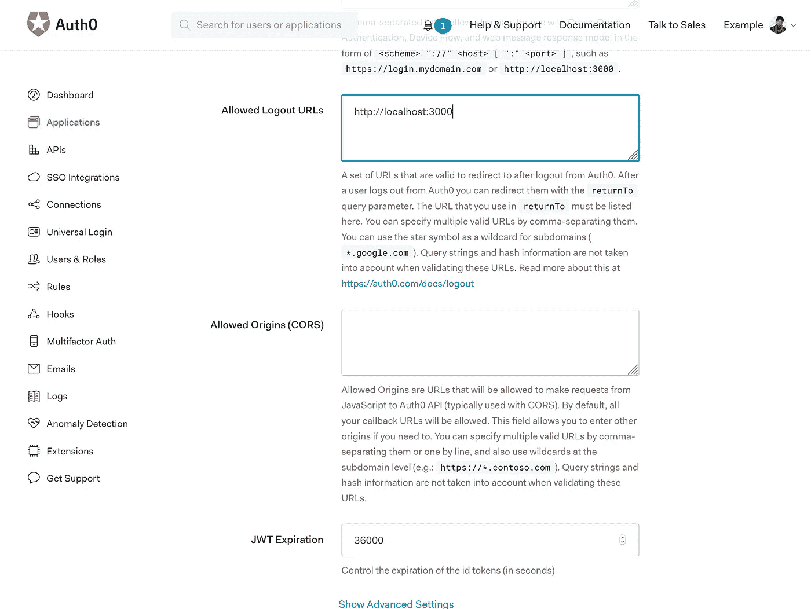

快照:允许的注销 URL 框

# 步骤 4:现在点击保存更改

您需要保存您现在所做的更改。

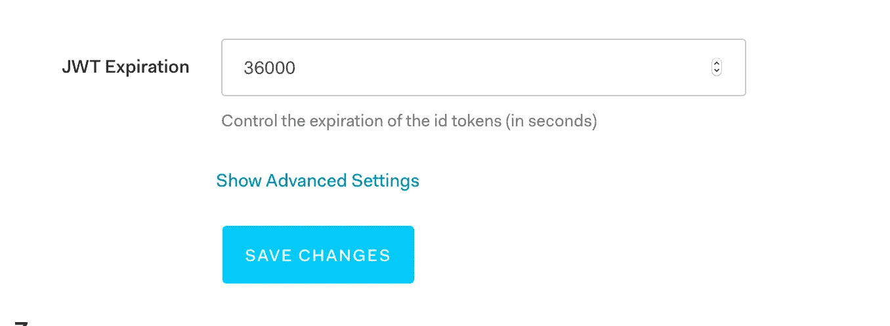

快照:保存更改

# 步骤 5:现在让我们创建一个 Node.js 服务器

为此，创建一个名为`auth0`的文件夹，并创建一个名为`app.js`的文件。将下面的代码粘贴到`app.js`中:

```
**var** express = require('express');
**var** path = require('path');
**var** logger = require('morgan');
**var** cookieParser = require('cookie-parser');
**var** flash = require('connect-flash');
**const** app = express();app.get('/test',(req,res,next)**=>**{
 res.send({message:"Server is on"});
})*// View engine setup* app.set('views', path.join(__dirname, 'views'));
app.set('view engine', 'pug');app.use(logger('dev'));
app.use(cookieParser());
app.use(express.static(path.join(__dirname, 'public')));
app.use(flash());*// Handle auth failure error messages* app.use(**function** (req, res, next) {
  **const** err = new Error('Not Found');
  err.status = 404;
  next(err);
});app.use(**function** (err, req, res, next) {
  res.status(err.status || 500);
  res.send({message: err.message,error: {} });
});app.listen(8080,()**=>**{
console.log("Server is runnig on port 8080");
});module.exports = app;
```

现在打开终端，转到`app.js`位置。运行命令:

```
npm install express cookie-parser connect-flash morgan
```

成功运行上面的命令后，使用下面的命令运行`app.js`文件:

```
node app.js
```

您可以看到输出如下:

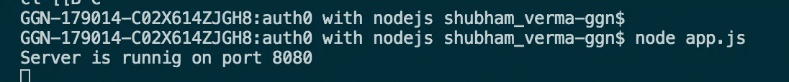

快照:Node app.js

此外，您可以通过在浏览器中点击以下 API 来测试您的服务器:

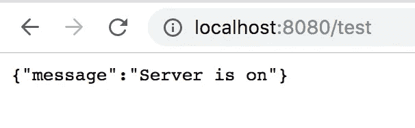

快照:服务器打开

如果你能看到上面的消息，这意味着你的服务器正在运行。

# 现在让我们用 Auth0 配置 Node.js 应用程序

## 1:创建。环境文件

创建。env 文件，并粘贴以下代码。替换`YOUR_CLIENT_ID`、`YOUR_DOMAIN`和`YOUR_CLIENT_SECRET`的实际值。

。环境:

```
AUTH0_CLIENT_ID=YOUR_CLIENT_ID
AUTH0_DOMAIN=YOUR_DOMAIN
AUTH0_CLIENT_SECRET=YOUR_CLIENT_SECRET
```

## **2。安装依赖项以支持 Auth0**

我们需要安装依赖项。为此，请运行以下命令:

```
npm install passport passport-auth0 express-session dotenv pug --save
```

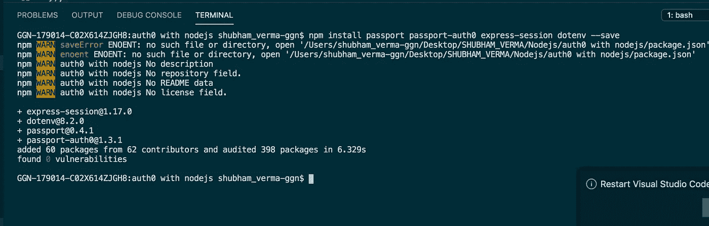

快照:`npm install passport passport-auth0 express-session dotenv` 帕格 `--save`

## **3。将以下代码添加到您的 app.js 文件**

```
var session = require('express-session');

// config express-session
var sess = {
  secret: 'CHANGE THIS TO A RANDOM SECRET',
  cookie: {},
  resave: false,
  saveUninitialized: true
};

if (app.get('env') === 'production') {
  // Use secure cookies in production (requires SSL/TLS)
  sess.cookie.secure = true;

  // Uncomment the line below if your application is behind a proxy (like on Heroku)
  // or if you're encountering the error message:
  // "Unable to verify authorization request state"
  // app.set('trust proxy', 1);
}

app.use(session(sess));
```

## 4.添加 Passport 代码和应用程序设置

```
// Load environment variables from .env
var dotenv = require('dotenv');
dotenv.config();

// Load Passport
var passport = require('passport');
var Auth0Strategy = require('passport-auth0');

// Configure Passport to use Auth0
var strategy = new Auth0Strategy(
  {
    domain: process.env.AUTH0_DOMAIN,
    clientID: process.env.AUTH0_CLIENT_ID,
    clientSecret: process.env.AUTH0_CLIENT_SECRET,
    callbackURL:
      process.env.AUTH0_CALLBACK_URL || 'http://localhost:3000/callback'
  },
  function (accessToken, refreshToken, extraParams, profile, done) {
    // accessToken is the token to call Auth0 API (not needed in the most cases)
    // extraParams.id_token has the JSON Web Token
    // profile has all the information from the user
    return done(null, profile);
  }
);

passport.use(strategy);
app.use(passport.initialize());
app.use(passport.session());
```

请确保在应用 Express 中间件(`app.use(session(sess)`)后，这最后两个命令在您的代码中。

现在，添加上述代码后，您的最终`app.js`文件将如下所示:

```
**var** express = require('express');
**var** path = require('path');
**var** logger = require('morgan');
**var** cookieParser = require('cookie-parser');
**var** session = require('express-session');
**var** dotenv = require('dotenv');
**var** passport = require('passport');
**var** Auth0Strategy = require('passport-auth0');
**var** flash = require('connect-flash');dotenv.config();*// Configure Passport to use Auth0* **var** strategy = new Auth0Strategy({
  domain: process.env.AUTH0_DOMAIN,
  clientID: process.env.AUTH0_CLIENT_ID,
  clientSecret: process.env.AUTH0_CLIENT_SECRET,
  callbackURL:
    process.env.AUTH0_CALLBACK_URL || 'http://localhost:3000/callback'
  },**function** (accessToken, refreshToken, extraParams, profile, done) {
  return done(null, profile);
});passport.use(strategy);*// You can use this section to keep a smaller payload* passport.serializeUser(**function** (user, done) {
  done(null, user);
});passport.deserializeUser(**function** (user, done) {
  done(null, user);
});**const** app = express();
app.get('/test', (req, res, next) **=>** {
  res.send({ message: "Server is on" });
})*// View engine setup* app.set('views', path.join(__dirname, 'views'));
app.set('view engine', 'pug');
app.use(logger('dev'));
app.use(cookieParser());*// config express-session* **var** sess = {
 secret: 'CHANGE THIS SECRET',
 cookie: {},
 resave: false,
 saveUninitialized: true
};app.use(session(sess));
app.use(passport.initialize());
app.use(passport.session());
app.use(express.static(path.join(__dirname, 'public')));
app.use(flash());app.use(**function** (err, req, res, next) {
  res.status(err.status || 500);|
  res.send({message: err.message,error: err});
});app.listen(8080, () **=>** {
  console.log("Server is runnig on port 8080");
});
module.exports = app; 
```

# 步骤 6:现在我们需要创建 API 登录

现在我们需要创建 API:`/login`。现在我们将在根目录下创建一个名为`routes`的文件夹，其中包含以下文件:

*   `routes/auth.js`处理认证
*   `routes/index.js`服务主页

让我们在`routes`文件夹中创建一个名为`auth.js`的文件，并粘贴以下代码:

## auth.js:

```
*// routes/auth.js* **var** express = require('express');
**var** router = express.Router();
**var** passport = require('passport');
**var** dotenv = require('dotenv');
dotenv.config();*// Perform the login, after login Auth0 will redirect to callback*router.get('/login', passport.authenticate('auth0', {
scope: 'openid email profile'}), **function** (req, res) {
  res.redirect('/');
});
module.exports = router; 
```

# 步骤 7:创建一个服务于主页的索引路径:

为此，在`routes`文件夹中创建一个名为`index.js`的文件，并粘贴以下代码:

```
*// routes/index.js* **var** express = require('express');
**var** router = express.Router();*/* GET home page. */*router.get('/', **function** (req, res, next) {
 res.render('layout', { title: 'Auth0 Webapp sample Nodejs' });|
});
module.exports = router;
```

# 步骤 8:将路线添加到 app.js 文件中

将以下代码粘贴到您的`app.js`文件中:

```
var authRouter = require('./routes/auth');
var indexRouter = require('./routes/index');

app.use('/', authRouter);
app.use('/', indexRouter); 
```

添加上述代码后，您的最终`app.js`文件将如下所示:

```
**var** express = require('express');
**var** path = require('path');
**var** logger = require('morgan');
**var** cookieParser = require('cookie-parser');
**var** session = require('express-session');
**var** dotenv = require('dotenv');
**var** passport = require('passport');
**var** Auth0Strategy = require('passport-auth0');
**var** flash = require('connect-flash');
**var** authRouter = require('./routes/auth');
**var** indexRouter = require('./routes/index');
dotenv.config();*// Configure Passport to use Auth0* **var** strategy = new Auth0Strategy(
{
 domain: process.env.AUTH0_DOMAIN,
 clientID: process.env.AUTH0_CLIENT_ID,
 clientSecret: process.env.AUTH0_CLIENT_SECRET,
 callbackURL:process.env.AUTH0_CALLBACK_URL || 'http://localhost:3000/callback'
},
**function** (accessToken, refreshToken, extraParams, profile, done) {
 return done(null, profile);
});passport.use(strategy);*// You can use this section to keep a smaller payload* passport.serializeUser(**function** (user, done) {
 done(null, user);
});passport.deserializeUser(**function** (user, done) {
 done(null, user);
});**const** app = express();
app.get('/test', (req, res, next) **=>** {
 res.send({ message: "Server is on" });|
})*// View engine setup* app.set('views', path.join(__dirname, 'views'));
app.set('view engine', 'pug');
app.use(logger('dev'));
app.use(cookieParser());*// config express-session* **var** sess = {
 secret: 'CHANGE THIS SECRET',
 cookie: {},
 resave: false,
 saveUninitialized: true
};app.use(session(sess));
app.use(passport.initialize());
app.use(passport.session());
app.use(express.static(path.join(__dirname, 'public')));
app.use(flash());app.use('/', authRouter);
app.use('/', indexRouter);app.use(**function** (err, req, res, next) {
 res.status(err.status || 500);
 res.send({message: err.message,error: err});
});app.listen(8080, () **=>** {
 console.log("Server is runnig on port 8080");
});module.exports = app;
```

# 步骤 9:为主页创建视图:

为此，在根位置创建一个名为`views`的文件夹，并创建一个名为`layout.pug`的文件。粘贴以下代码:

```
doctype html
html
 head
  title= title
  link(rel='stylesheet', href='/stylesheets/style.css')
  link(rel='stylesheet', href='https://www.w3schools.com/w3css/4/w3.css')
  link(rel='shortcut icon', href='//cdn2.auth0.com/styleguide/latest/lib/logos/img/favicon.png') 

 body
   nav.w3-bar.w3-border.w3-light-grey( role="navigation" )
   .w3-bar-item.w3-text-grey Auth0 - NodeJS
   a(href="/").w3-bar-item.w3-button Home
   a(id="qsLoginBtn" href="/login").w3-bar-item.w3-button Log In
 **block** content
h4 Welcome in Auth0 Implementation: Shubham Verma blogs
```

让我们看一下快照:

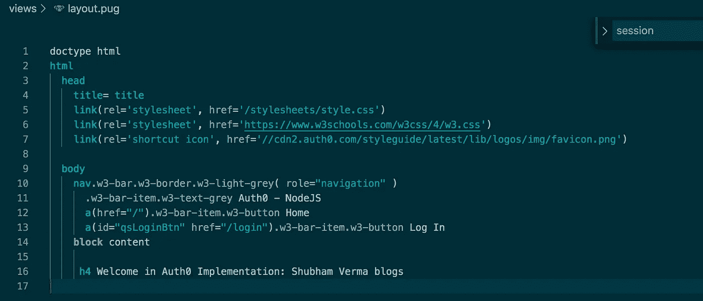

快照:`layout.pug`

# 第 10 步:运行应用程序，看看结果:

现在您已经完成了编码，是时候使用下面的命令运行`app.js`文件了:

```
node app.js
```

您可以看到输出是:


快照:Node app.js

现在打开浏览器，输入网址`localhost:8080`。并查看页面:

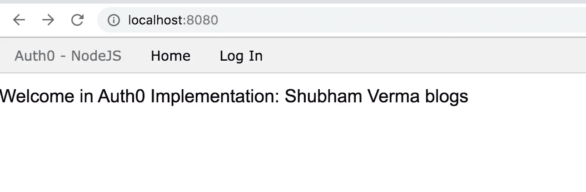

快照:本地主机:8080

现在点击登录，看看神奇之处。您可以看到显示的 Auth0 登录页面。

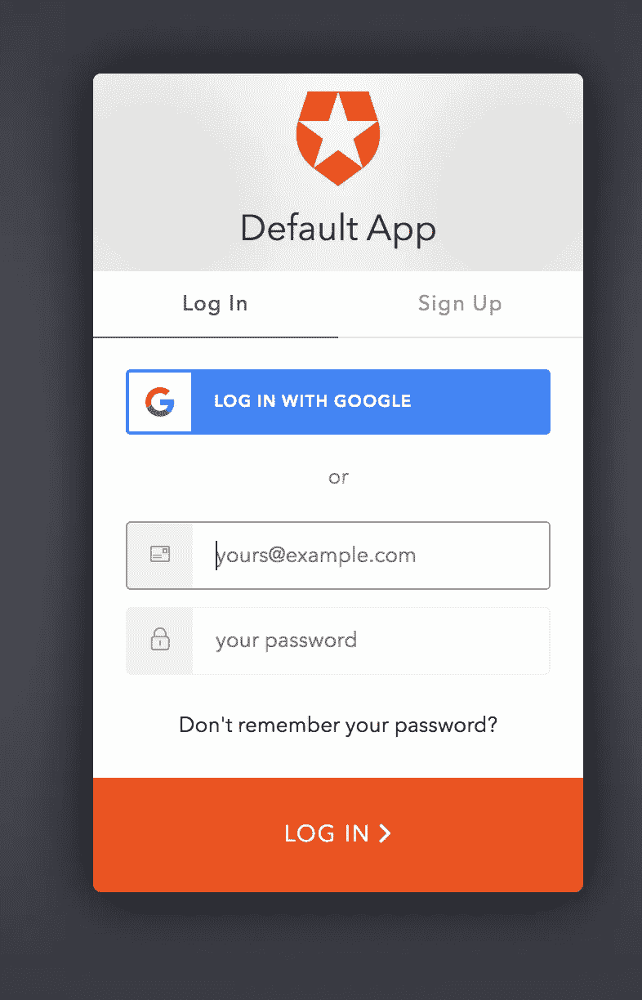

快照:验证 0 登录页面

让我们在下面的 GIF 中看到组合的结果:


快照:Auth0 的完整旅程

恭喜你。现在我们已经用 Node.js 实现了 Auth0。

要了解 Node.js 的更多信息，[请阅读](https://medium.com/@svsh227/every-nodejs-developer-should-read-these-articles-f29032441a31) this。

感谢阅读！