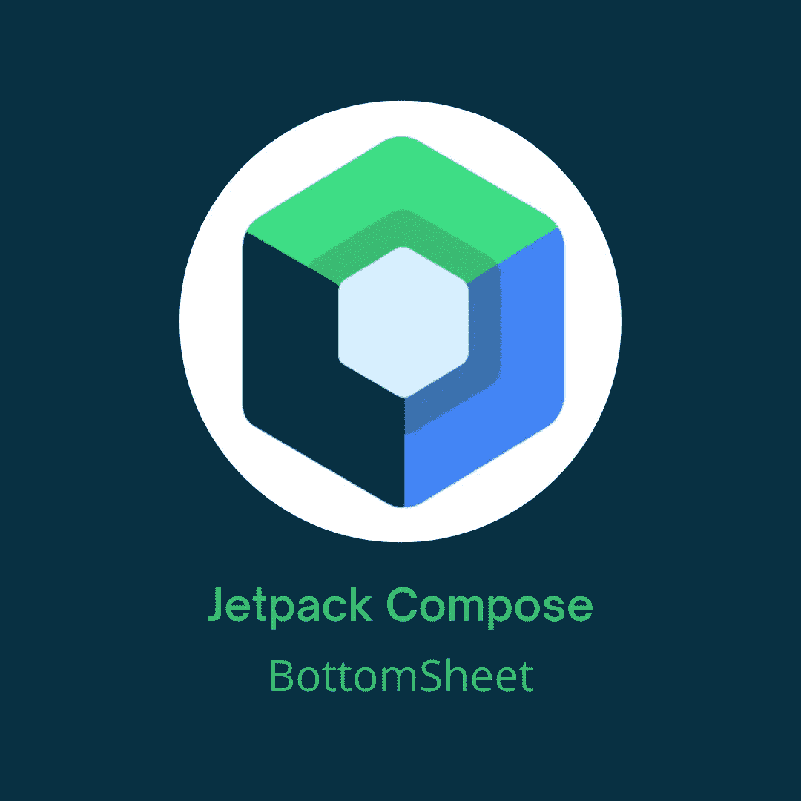

# 在 Jetpack Compose 中实现底部表单

> 原文：<https://betterprogramming.pub/implement-bottom-sheet-in-jetpack-compose-d6472e8eaf2e>

## 开发人员的简短指南



本图中使用的 Jetpack Compose 徽标是由 Google 创建的官方徽标

Jetpack Compose 给我们带来了这么多好东西。与 XML 相比，使用 UI 只是一种乐趣。它带给我们的一个东西是实现底层表的开箱即用的方法。不需要包括任何依赖性。一切都已经在那里了。

> 模态底部表单提供了一组选项，同时阻止了与屏幕其他部分的交互。它们是内联菜单和简单对话框的替代品，为内容、图标和动作提供了额外的空间。”根据[官方文件](https://developer.android.com/reference/kotlin/androidx/compose/material/package-summary#ModalBottomSheetLayout(kotlin.Function1,androidx.compose.ui.Modifier,androidx.compose.material.ModalBottomSheetState,androidx.compose.ui.graphics.Shape,androidx.compose.ui.unit.Dp,androidx.compose.ui.graphics.Color,androidx.compose.ui.graphics.Color,androidx.compose.ui.graphics.Color,kotlin.Function0))

我们将使用`ModalBottomSheetLayout`,它有自己的状态，我们需要记住。所以让我们继续吧。

首先，我们要创建`sheetState`:

有三个`ModalBottomSheetValues`:

*   `Hidden`
*   `Expanded`
*   `HalfExpanded`

前两个已经足够描述了。`HalfExpanded`将只显示底层的一半，只有当底层的高度超过屏幕高度的 50%时，此状态才被激活。

`confirmStateChange`是一个可选的回调函数，用于确认或否决待定的状态更改。有了这样的值，我们就阻止了`HalfExpanded`底部板材值。

不要忘记添加`@OptIn(ExperimentalMaterialApi::class)`，因为这一切都还在试验阶段。

接下来，我们现在可以实现`ModalBottomSheetLayout`并在其内容中放置整个屏幕。我们的屏幕将如下所示:

正如我们所见，我们将屏幕组件放在了`ModalBottomSheetLayout`的内容中。此外，我们将`sheetState`作为参数传递。
`BackHandler`是处理系统后退按钮按下的效果。第一个参数是当它被启用时，第二个参数是当系统后退按钮被按下时它应该做什么。

在这种情况下，我们只想隐藏底部的工作表，如果它被显示并且系统返回按钮被按下。

`Column`内的`Button`正在显示和隐藏底层板材。`sheetState.show()`将以动画形式显示底层，而`sheetState.hide()`将以动画形式隐藏底层。

这里我们需要看到的最后一件事是`BottomSheet`可组合:

这是一个填充了一些文本的非常简单的列。你想放什么都可以。

如果你想让一些按钮做一些事情，你只需要通过回调与主组件进行通信。

这是一个非常简单的逻辑，但是知道它非常有用。这里需要注意的是，显示和隐藏底部工作表的逻辑放在 UI 中，但是应该由`ViewModel`来处理。这有点超出了本文的范围，因为我只是想展示如何创建一个底层表。

这就是本文的全部内容。我希望你喜欢它！

你可以在[我的 GitHub repo](https://github.com/Giga99/MediumRepos) 中找到所有的源代码。

```
**Want to Connect?**[GitHub](https://github.com/Giga99)
[LinkedIn](https://www.linkedin.com/in/igor-stevanovic/)
[Twitter](https://twitter.com/igor_s1999)
[Portfolio website](https://giga99.github.io/portfolio-website/)
```

如果您想了解如何在 Jetpack Compose 中请求权限，请阅读以下文章:

[](/implement-horizontal-and-vertical-viewpager-in-jetpack-compose-a7a91f2ac746) [## 在 Jetpack Compose 中实现水平和垂直 ViewPager

### 在 Jetpack 撰写中实现 ViewPager

better 编程. pub](/implement-horizontal-and-vertical-viewpager-in-jetpack-compose-a7a91f2ac746) [](/jetpack-compose-request-permissions-in-two-ways-fd81c4a702c) [## 在 Jetpack Compose 中请求权限的两种方法

### 在 Jetpack Compose 中请求权限的最佳方式

better 编程. pub](/jetpack-compose-request-permissions-in-two-ways-fd81c4a702c)