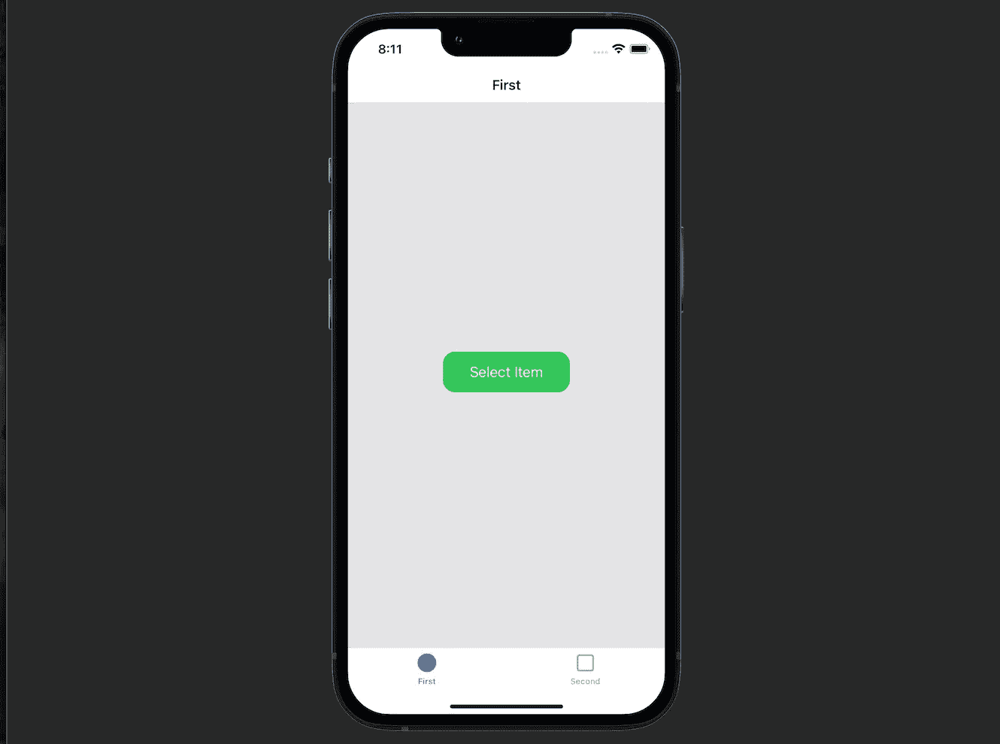
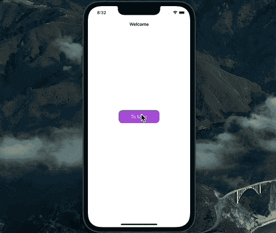

# 使用 Combine 实现协调器设计模式

> 原文：<https://betterprogramming.pub/implement-coordinator-design-pattern-using-combine-eed5008dafb1>

## 被动地在屏幕间导航和传递数据

照片由 [Linus Mimietz](https://unsplash.com/@linusmimietz?utm_source=medium&utm_medium=referral) 在 [Unsplash](https://unsplash.com?utm_source=medium&utm_medium=referral) 上拍摄

本文将学习如何创建一个可重用的`Coordinator`库，它将负责你的 iOS 应用程序内部的导航。

简而言之，在本教程结束时，您将会学到以下内容:

*   什么是`Coordinator`设计模式
*   如何使用`Combine`让`Coordinator`无功而返？

完成的包及其示例应用程序可以在文章的底部找到。

# 我们开始吧

在我们开始开发框架之前，你应该知道`Coordinator`设计模式帮助我们将导航相关的逻辑从视图控制器中移出。因此，视图控制器对协调器有很强的依赖性，而协调器对视图控制器的依赖性很弱。`View`当一个动作发生时，控制器触发必要的导航方法，例如，如果用户点击一个按钮。

不同的团队更喜欢`view`控制器和`coordinator`之间的不同关系。有些将`Coordinator`属性放在视图模型或演示者中，而有些则放在视图控制器中。在本教程中，我们将遵循后一种方法，因为示例应用程序不会复杂到包含其他实体，如视图模型或演示者。

事不宜迟，让我们深入研究代码。

# 创建库

首先，我们创建一个`Coordinator.swift`文件并添加一个通用的`Coordinator`类:

`CoordinationResult`是将在两个特定协调器之间传递的类型的占位符。当不需要传递值时，我们将使用`Void`作为类型。在本教程的后面，我们将看到如何在屏幕之间传递自定义对象。

现在，让我们添加两个方法，这两个方法将是启动协调器工作和导航到其他协调器的核心:

这里我们添加了`coordinate<T>(to coordinator: Coordinator<T>)`方法，它将简单地调用我们想要导航到的协调器的`start()`方法。

`start()`方法包含了一个`fatalError()`，因为我们设计了这个`Coordinator`类作为子类而不是原样使用。换句话说，每一个具体的`Coordinator`都必须提供自己的`start()`方法的实现。

在这两种方法中，我们都返回`AnyPublisher<T, Never>`，它表示被导航到的协调器的输出。稍后我们将看到如何使用它来传递数据。

框架完成后，现在让我们使用我们在示例应用程序中创建的内容。

# 利用图书馆

我们的目标是涵盖这些用例:

*   显示一个欢迎页面，然后点击按钮，用标签栏显示主流程。
*   在主流程中呈现一个`view`控制器，然后将数据传递回呈现视图控制器。

首先我们需要创建一个`AppCoordinator`，它将负责为`UIWindow`设置`rootViewController`。下面是实现这一点的代码:

以下是我们在这里取得的成果:

1.  在应用程序的`UIWindow`上添加一个`unowned`依赖项。
2.  提供一个初始化器。
3.  通过创建一个`UINavigationController`并将其设置为窗口的`rootViewController`来实现`start()`方法。然后，坐标到我们接下来要实现的`WelcomeCoordinator`。

现在，让我们使用`SceneDelegate`中的`AppCoordinator`来启动我们的应用程序流程，如下所示:

1.  我们在`SceneDelegate`中添加了对`AppCoordinator`的强烈依赖。
2.  在`scene(_scene:willConnectTo:...)`方法中，用`UIWindow`初始化`AppCoordinator`。最后，开始协调员的工作。

现在设置已经完成，让我们继续欢迎页面。我们有一个简单的`WelcomeViewController`，它在屏幕中央显示一个按钮。代码如下:

1.  我们添加了对尚未实现的`WelcomeCoordinator`的依赖。
2.  在`viewDidLoad()`中，我们启动了绑定和 UI 设置方法。
3.  在`bindButtonToCoordinator()`方法中，我们为按钮点击创建一个发布者，在每个发布者上我们触发协调者的`navigateToMain()`方法。
4.  我们以标准的方式创建和布局一个`UIButton`。

现在让我们实施`WelcomeCoordinator`:

1.  我们在`UINavigationController`上创建了一个`unowned`依赖。
2.  在`start()`方法中，我们创建了`WelcomeViewController`并将其推送到之前创建的`navigationController`的堆栈中。因为我们不传递数据，所以我们返回一个`Empty` publisher。
3.  `navigateToMain()`方法由`WelcomeViewController`用来启动主流程。在这里，我们创建一个`MainCoordinator`并对其进行协调。我们现在将实现`MainCoordinator`。

欢迎页面完成后，让我们用选项卡栏实现主流程。首先，让我们创建一个名为`MainTabBarController`的`UITabBarController`子类:

因为它还没有任何逻辑，所以它唯一的责任就是让`MainCoordinator`继续运行。你在上面看到的`AppTabBarController`继承只是一个简单的类，它提供了选项卡栏控制器的基本外观。

接下来，让我们创建实际的`MainCoordinator`:

1.  像以前一样，我们创建一个属性`navigationController`。
2.  在`start()`方法中，我们创建两个`UINavigationController`并赋予它们一个`UITabBarItem`。
3.  接下来，我们初始化`MainTabBarController`并设置它的`modalPresentationStyle`和`viewControllers`属性。
4.  我们将初始化的`MainTabBarController`呈现在`navigationController`上。因此，在用户点击欢迎屏幕内的按钮后，会出现`MainTabBarController`。
5.  初始化两个协调器`FirstCoordinator`和`SecondCoordinator`。
6.  与每个协调者协调，因为他们都代表标签栏控制器的屏幕。
7.  最后，返回一个`Empty`发布者，因为我们还没有传递数据。

这是上述步骤的结果:

既然显示了主流程，让我们来处理数据传递逻辑。为此，我们有了`FirstCoordinator`和`ItemsCoordinator`。我们的目标是当用户点击“选择项目”按钮时呈现一个项目列表。一旦物品被选中，`ItemsViewController`将解散，物品将被`FirstViewController`接收。

在我们创建`ItemsCoordinator`之前，让我们看看`FirstCoordinator`是如何实现的:

1.  就像以前一样，我们依靠`UINavigationController`。
2.  `start()`方法负责在屏幕上显示`FirstViewController`。由于我们没有将数据从`FirstViewController`传递到任何其他地方，这又导致了`Empty` publisher。
3.  `presentItems()`负责导航至项目屏幕。正如我们所见，该方法返回一个包含一个`ItemsCoordinationResult`的`Publisher`。简而言之，这意味着当我们在项目屏幕上选择一个项目时，`FirstCoordinator`将通过这个发布者获得一个值。一旦收到该值，Items 屏幕将被关闭。

在`FirstViewController`中，我们在点击一个按钮后触发这个方法。然后，我们观察并处理 Items 屏幕关闭后的结果:

为了看看这个`ItemsCoordinationResult`是什么样子，我们继续看`ItemsCoordinator`的实现:

1.  `ItemsCoordinationResult`是一个包含`item(String)`事例的枚举。简而言之，这个枚举表示项目屏幕的可能输出。如果除了条目选择之外还有更多选项，我们要做的就是在枚举中添加另一个 case。
2.  现在，因为我们确实在传递数据，所以我们指定`ItemsCoordinationResult`作为协调器的数据类型。
3.  我们像以前一样依靠`UINavigationController`。此外，我们还提供了一个`PassthroughSubject`和`view`控制器，一旦选择了一个项目，控制器就会启动。
4.  在`start()`方法中，我们显示了 ItemsViewController。我们还返回先前创建的`PassthroughSubject`，因为这是向呈现协调器发送事件流的方式。

这就是整个示例应用程序的工作方式(为简单起见，所选项目将打印在控制台中):

# 资源

可以在 [GitHub](https://github.com/zafarivaev/ReactiveCoordinator-Combine) 上访问现成的 Swift 包。

# 包扎

我们已经看到了`Coordinator`设计模式如何使应用程序内部的导航更加结构化。如果您想了解更多关于该模式的标准实现，我建议您看看这篇文章:

 [## 利用 Swift 5 中的协调器设计模式

### 隔离您的视图控制器，使它们更易于测试和重用

better 编程. pub](/leverage-the-coordinator-design-pattern-in-swift-5-cd5bb9e78e12) 

感谢阅读！