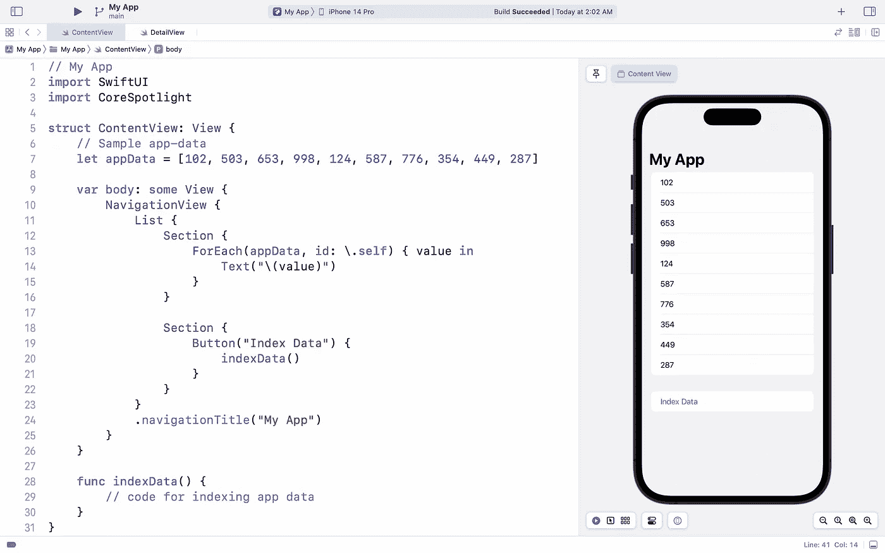
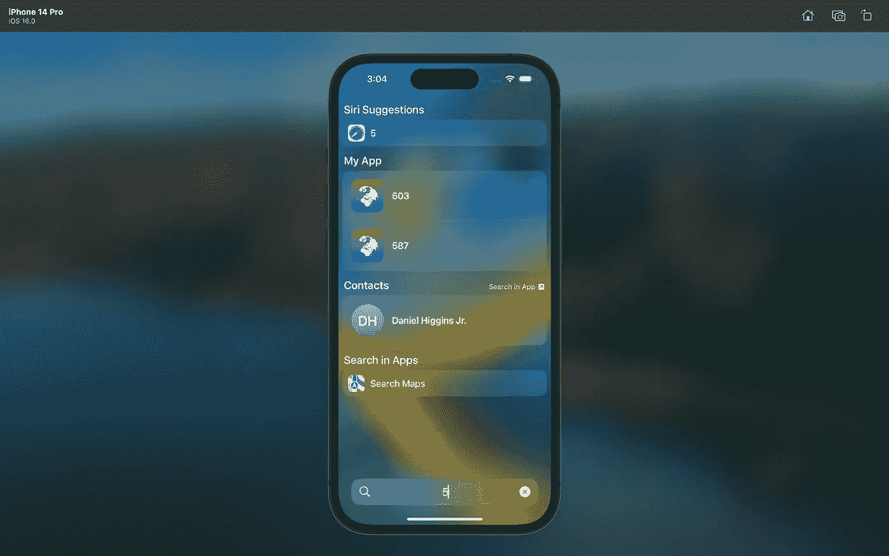
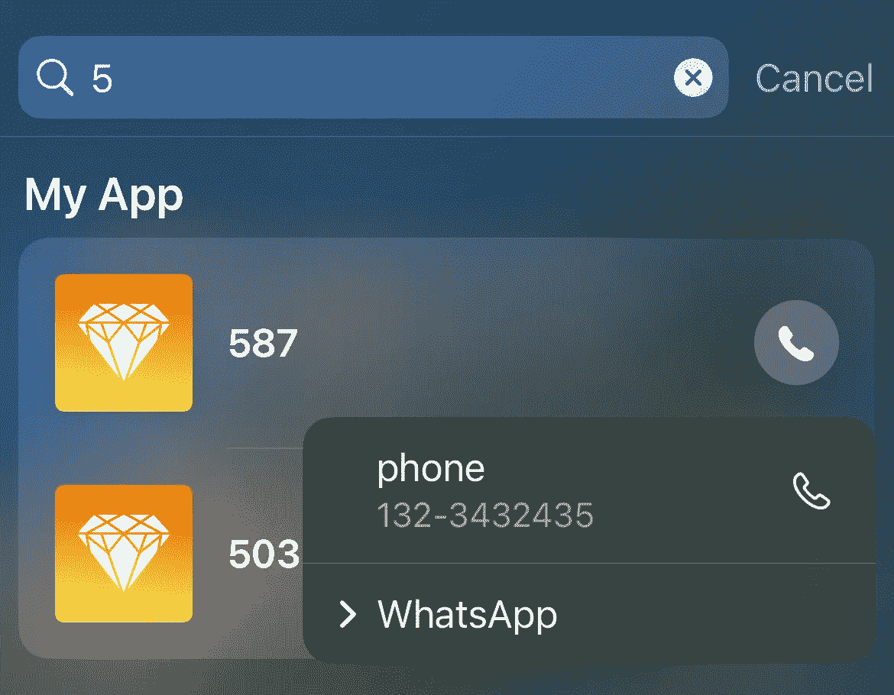

# 在 SwiftUI 应用中实施 Core Spotlight

> 原文：<https://betterprogramming.pub/implement-core-spotlight-in-a-swiftui-app-859cb703f55d>

## 第 1 部分，共 2 部分


马库斯·温克勒在 [Unsplash](https://unsplash.com/s/photos/magnifying-glass?utm_source=unsplash&utm_medium=referral&utm_content=creditCopyText) 上的照片

Spotlight 是苹果设备上功能强大的搜索系统，我们都喜欢使用它来从我们最喜爱的应用程序中快速找到我们的内容，并与它们进行互动。

通过使用 [Core Spotlight API](https://developer.apple.com/documentation/corespotlight) ，您的应用程序还可以利用这一强大的搜索引擎的力量，使其内容可以快速轻松地访问(以及更多)。在 Spotlight 上发布你的应用程序内容不仅能给用户带来很好的体验，还能立即增加你的应用程序的多样性。

这个由两部分组成的系列是一个全面而简单的指南，将帮助您使用 SwiftUI 应用程序中的核心 Spotlight API，在苹果设备上充分利用 Spotlight search 的强大功能。

在第 1 部分中，我们将介绍一些基本内容，包括:

1.  索引:在 Spotlight 搜索中显示您的应用数据
2.  删除:从 Spotlight 搜索中移除您的应用数据
3.  处理:处理用户在 Spotlight 搜索项目上的点击

在第 2 部分的后面，我们将讨论一些高级主题，包括 spotlight 搜索结果的自定义操作、自定义预览、继续应用内搜索等等。

> 请注意:本文不是为了使用 Core Spotlight 来索引核心数据项。如果这是您的使用案例，我建议您观看本课程:

 [## 在 Spotlight 中展示应用数据- WWDC21 -视频-苹果开发者

### 在 Spotlight 中，只需两行代码，即可了解核心数据如何从您的应用中呈现数据。学习如何…

developer.apple.com](https://developer.apple.com/videos/play/wwdc2021/10098/) 

现在让我们开始吧！

# 1)索引:在 Spotlight 搜索中显示你的应用数据

让我们从一个新的示例项目开始。

*   首先，要使用核心 Spotlight API，我们需要导入它:

```
**import** CoreSpotlight
```

*   接下来，让我们定义一些将在应用程序和 Spotlight 搜索中显示的示例应用程序数据。您的代码看起来会像这样:

```
**import** SwiftUI
**import** CoreSpotlight**struct** ContentView: View {
    // Sample app-data
    **let** appData = [102, 503, 653, 998, 124, 587, 776, 354, 449, 287] **var** body: **some** View {
    }
}
```

*   现在，让我们创建一个基本的 UI，在列表中显示我们的应用程序数据。我们还将创建一个索引数据的按钮。



我们的基础工作已经就绪。然而，如果你点击“索引数据”按钮，什么也不会发生，因为`indexData()`方法现在是空的。现在是时候编写代码来索引我们的数据并自动显示在 Spotlight 搜索中了！

为了索引数据，Core Spotlight 使用一个名为`CSSearchableItem`的特殊对象。我们的 app-data 是一个由 10 个元素组成的数组，因此要对它们进行索引，我们必须创建 10 个相应的 CSSearchableItems。所以，让我们从为它创建一个数组开始。

```
**func** indexData() {
    **var** searchableItems = [CSSearchableItem]()
}
```

我们通过设置特定元素的属性来控制在 Spotlight search 中显示哪些数据。这也是使用一个名为`CSSearchableItemAttributeSet`的专用对象来完成的。一个基本的实现是:

```
appData.forEach {
    **let** attributeSet = CSSearchableItemAttributeSet(contentType: .content)
    attributeSet.displayName = $0.description
}
```

最后，我们使用这个属性集来创建`CSSearchableItem`对象，附加到我们之前定义的数组，最后提交它进行索引。瞧，我们完成了！

所以最后，`indexData()`方法看起来会像这样:

虽然大部分都很简单，但我想再解释一下`CSSearchableItem`对象的创建。

`CSSearchableItem`初始化器有三个参数:

1.  `uniqueIdentifier`:用于给被索引的元素一个唯一的 id。虽然这是一个可选属性，但建议您设置它，因为它还用于通过标识项目来处理用户交互。
2.  `domainIdentifier`:用于以有意义的方式对数据进行分组。例如:一个音乐应用程序可能会使用域 id，如“歌曲”、“专辑”等。虽然这是一个可选属性，但通常建议设置它。
3.  `attributeSet`:我们传递我们在这里创建的`CSSearchableItemAttributeSet`对象。

我们在 Spotlight search 中索引应用程序数据的代码现在已经可以使用了。如果我们点击“索引数据”按钮，然后在 Spotlight 中搜索，我们应该能够在结果中看到我们索引的应用程序内容:



我们可以使用属性集来改变我们的应用程序在 Spotlight 中显示的数据。例如，如果我们设置我们的`attributeSet`的`thumbnailData`和`phoneNumbers`属性，搜索结果看起来像:



# 2.删除:从 Spotlight 搜索中移除您的应用数据

从 Spotlight index 中删除/移除应用数据相当简单:

```
**func** deleteData() {
  CSSearchableIndex.default()
    .deleteSearchableItems(withDomainIdentifiers: ["sample"])
}
```

如果你开始在 Xcode 中输入代码，你会意识到(由于自动完成)有多种方法可以删除可搜索的项目。

上面是一个例子，您可以删除一组特定的域标识符的可搜索项目。由于我们在索引时使用了相同的域标识符(“sample”)，这将删除我们的示例应用程序中所有被索引的项目。

# 3.处理:处理用户在 Spotlight 搜索项目上的点击

每当用户点击你的应用程序的 Spotlight 搜索结果时，系统会通过`NSUserActivity`通知这一点以及一些有用的信息。

为了让你的应用程序获得相关的 NSUserActivity，SwiftUI 有一个名为`onContinueUserActivity`的修饰符。像这样把它应用到你的主视图上:

```
.onContinueUserActivity(CSSearchableItemActionType, perform: handleSpotlight)
```

`CSSearchableItemActionType`是核心 Spotlight API 的一部分(因此确保导入它)。这确保了`handleSpotlight`方法只接收 Spotlight 交互的 NSUserActivity。

> 额外提示:要获得多个用户活动，您将使用相应的键多次应用此修改器。

现在让我们看看`handleSpotlight`方法包含了什么:

使用您在这里接收的 NSUserActivity 对象，您可以检索您在索引数据时创建`CSSearchableItem`对象时传递的`uniqueIdentifier`。

通过这种方式，你可以识别点击的元素，然后根据你的应用程序的用例来处理它。

在附带的 [GitHub 项目](https://github.com/yugantarjain/Core-Spotlight-in-SwiftUI-Part-1)中，实现了导航到所选元素的详细视图的最常见处理场景，供您参考。

感谢您的阅读！我希望你觉得这篇文章有用、简单、有趣。