# 使用 JavaScript、CSS 和第三方库实现黑暗模式

> 原文：<https://betterprogramming.pub/implement-dark-mode-using-javascript-css-and-third-party-libraries-50e27817c790>

## 介绍黑暗模式和多种实施方法


图片来源:作者

就网页设计而言，[亮暗配色方案](https://en.wikipedia.org/wiki/Light-on-dark_color_scheme)(也称为*黑色模式*、*深色模式*、*深色主题*或*夜间模式*)是一种在深色背景上使用浅色文本、图标和 UI 元素的配色方案。

相反的配色方案称为*暗亮配色方案*、*灯光模式*或*灯光主题*。

电脑屏幕从黑暗模式开始，模仿当时使用的阴极射线管。当在 WYSIWYG(所见即所得)文字处理器中引入光模式来模拟纸上的墨迹时，skeuomorphic 方法开始流行。很快，轻型模式成为了标准。

自 2015 年以来，尤其是最近几年，黑暗模式获得了很大的吸引力。

用户选择黑暗模式的原因有很多:

*   节能:黑暗模式下的灯光显示需要更少的能量。
*   眼睛保护:科学表明，从长远来看，负极性(暗模式)对眼睛的伤害小于亮模式。
*   美学关注:对于某些 UI 设计来说，深色模式是时髦的。

嗯，我们不会放弃光模式。事实上，大多数电子设备仍然默认有灯光模式。光模式是 skeuomorphic 方法，它在强(太阳)光下读得更好。

黑暗模式是一种选择。在一个复杂的前端 UI 中，为了[可访问性](https://medium.com/better-programming/10-steps-to-building-web-applications-with-accessibility-a11y-81cd2c1dd499)和可用性，必须支持黑暗模式。

# 系统偏好设置的媒体查询

`[prefers-color-scheme](https://developer.mozilla.org/en-US/docs/Web/CSS/@media/prefers-color-scheme)`是一项 CSS 媒体功能，用于检测用户是否请求系统使用亮模式或暗模式。

*   `no-preference`:表示用户通知系统没有首选模式。这是默认值。
*   `light`:表示用户通知系统首选灯光模式。
*   `dark`:表示用户通知系统首选黑暗模式。

由于大多数系统都是为轻型模式设计的，因此它可能不需要出现在媒体查询中。

这里有一个 HTML 文件显示`Hello, World!`

该页面在浏览器上显示如下:

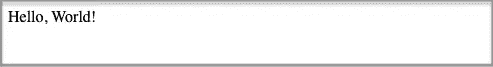

我们添加了针对黑暗模式的媒体查询:

第 8 - 13 行设置黑暗模式的颜色。

在上面的代码中，为了简单起见，使用了黑色背景和白色文本。

在实际应用中，通常会用到`off white`和`off black`。`Off white`是各种颜色的总称，与纯白只有细微差别。同样，`off black`是各种与纯黑只有细微差别的色调的统称。

前往 Mac 系统偏好设置将外观更改为深色模式。

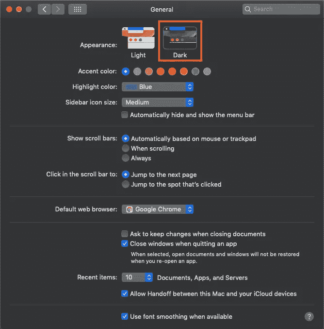

该页面在浏览器上显示如下:

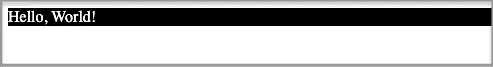

糟糕，我们忘了把主体背景设为黑色。由于亮模式是默认模式，暗模式需要处理更多的事情来覆盖默认设置。

解决方法如下:

第 8 - 10 行将主体背景设置为黑色。

现在我们看到了正确的黑暗模式:


从上面的代码中我们有什么可以改进的吗？

是的。我们可以只在`body`上设置黑暗模式 CSS，因为`div`将从它的上级继承`background`和`color`。

# JavaScript 代码跟踪系统偏好设置

`[matchMedia()](https://developer.mozilla.org/en-US/docs/Web/API/Window/matchMedia)`是窗口的接口方法。它返回一个新的`[MediaQueryList](https://developer.mozilla.org/en-US/docs/Web/API/MediaQueryList)`对象，然后可以用它来确定`document`是否匹配媒体查询字符串。它还侦听媒体查询更改。

由于我们已经将 Mac 系统偏好设置设置为黑暗模式，`matchMedia()`返回以下值:

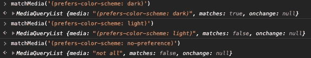

或者，我们可以使用 JavaScript 来支持亮暗两种模式。

JavaScript 代码可以在头部或身体。建议放在头部。对于本文，我们将它留在正文中，以作一些改变。

第 11 行检查媒体查询。

第 12 - 15 行定义了一个基于系统偏好设置颜色主题的函数。这个函数在第 16 行被调用。每当颜色模式改变时，颜色主题将由第 17 行重置。

好吧，与其直接改变风格，推荐的方法是添加或删除一个关于黑暗主题的类。

如果是系统偏好设置中的黑暗模式，则`dark`类被添加到`body`(第 20 行)。否则，从`body`中移除`dark`类(第 22 行)。

# 本地存储中特定于站点的首选项

我们已经了解了如何根据系统偏好设置切换颜色模式。如果用户想要覆盖某个站点的系统首选项，该怎么办？

在这种情况下，常见的方法是将用户的偏好保存在本地存储中。如果首选项在本地存储中，那么将在主体中添加一个特定的类来显示首选的颜色主题。

在前面的例子中，我们从`matchMedia`中得到`colorScheme`:

```
const colorScheme = matchMedia('(prefers-color-scheme: dark)');
```

相反，我们可以从`localStorage`那里得到它:

```
const colorScheme = localStorage.getItem("prefers-color-scheme");
```

另外，我们可以使用`localStorage`和`matchMedia`的组合:

```
const colorScheme = localStorage.getItem("prefers-color-scheme") 
  || matchMedia('(prefers-color-scheme: dark)');
```

## 黑暗模式切换

[dark-mode-toggle](https://github.com/GoogleChromeLabs/dark-mode-toggle) 是一个第三方库，它是一个自定义元素，可以在网站上启用颜色切换。它从本地存储器中读取`dark-mode-toggle`属性，并相应地设置模式。如果未设置`dark-mode-toggle`属性，则遵循系统首选项。

以下是用户自定义的灯光模式。您可以选择是否将设置保存在本地存储中。

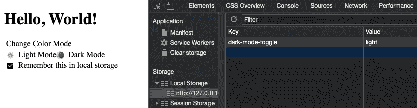

如果取消选中`Remember this in local storage`，则`dark-mode-toggle`属性将从本地存储中删除。

以下是用户自定义的黑暗模式。

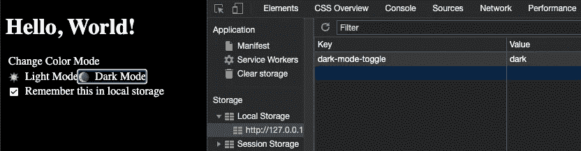

以下是 HTML 代码:

第 8 - 12 行定义了光照模式的样式文件。

第 13 - 17 行定义了黑暗模式的样式文件。

第 18 - 21 行导入黑暗模式切换。

第 25 - 32 行使用了黑暗模式切换组件，以及彩色模式开关。如果外观在第 28 行被定义为`toggle`，它将只显示所选择的模式。

以下是光照模式的样式文件。

下面是黑暗模式的样式文件。

## 黑暗模式

[darkmode-js](https://github.com/sandoche/Darkmode.js) 是一个第三方库，是一个简单的给网站添加黑暗模式的方法。它使用 CSS `mix-blend-mode`将元素的内容与其父元素和背景混合。它从本地存储器中读取`darkmode`属性，并相应地设置模式。如果未设置`darkmode`属性，则遵循系统首选项。

以下是用户自定义的灯光模式。你点击右下角的点，选择将被保存到本地存储。

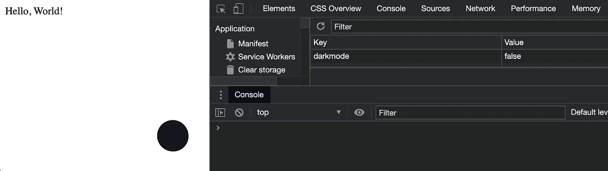

以下是用户自定义的黑暗模式。

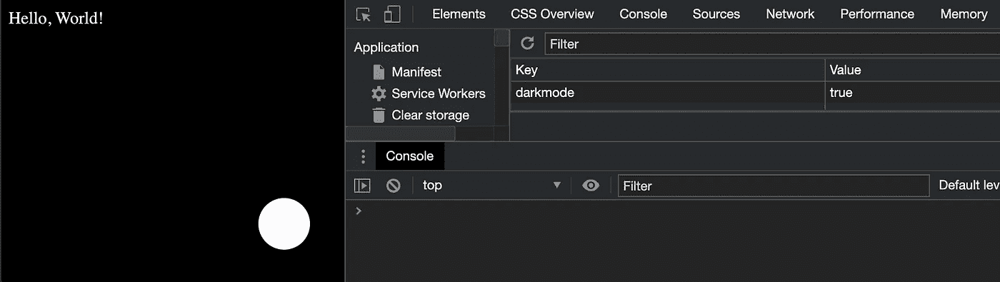

当颜色模式改变时，它具有某种动画，这由下面的视频剪辑捕获。

以下是 HTML 代码:

第 7 行导入 darkmode-js。

第 12 行显示了控件小部件。

从字面上看，它是一行代码。难怪 darkmode-js 被 npm trends 评为更受欢迎的 JavaScript 解决方案。

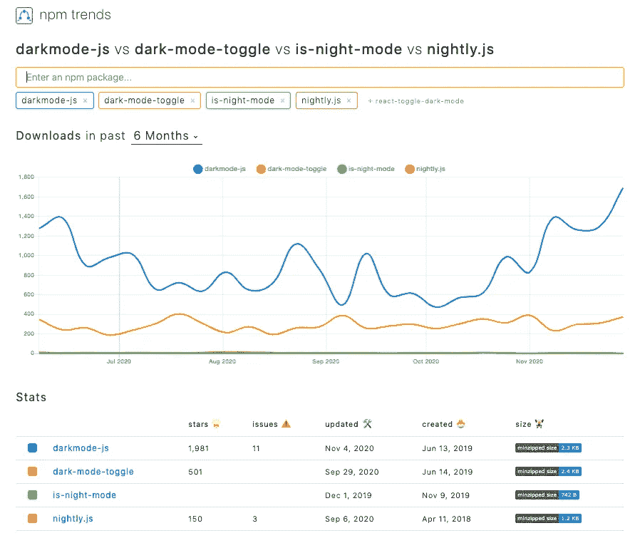

## 其他 JavaScript 库

*   [is-night-mode](https://github.com/itsabdessalam/is-night-mode) :这是一个库，根据当前时间、本地存储属性或系统偏好来检查是否是黑暗模式。
*   [nightly.js](https://github.com/Fcmam5/nightly.js) :这是一个基于系统偏好设置黑暗模式的库。它支持用户选择，但尚未将用户设置放入本地存储。

## 使用标记模式挂钩

有一个流行的 React 实现: [use-dark-mode](https://github.com/donavon/use-dark-mode) 。

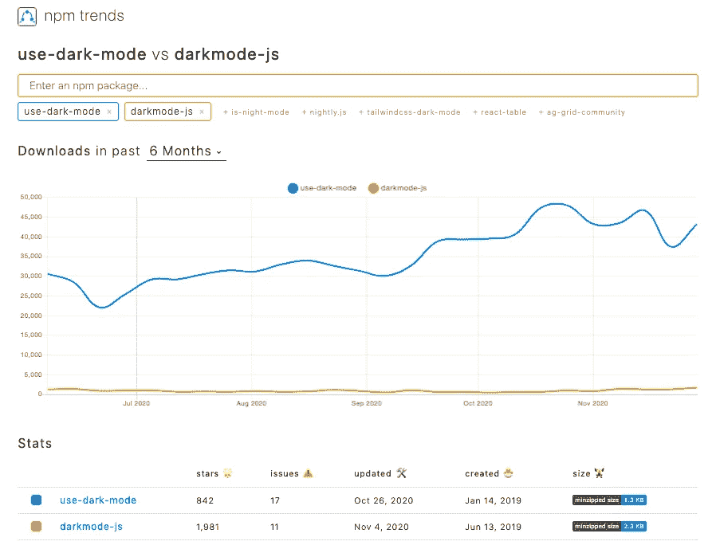

`useDarkMode`是一个自定义的 React 钩子，帮助实现黑暗模式。颜色主题存储在本地存储中。属性名称是可配置的，默认名称是`darkMode`。

下面是自定义灯光模式，其中车身配置了`light-mode`类。

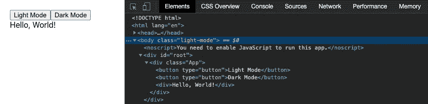

下面是自定义黑暗模式，车身配置了`dark-mode`级。

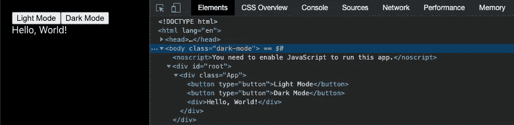

我们已经在一个 [Create React App](https://medium.com/better-programming/10-fun-facts-about-create-react-app-eb7124aa3785) 环境中嵌入了这个例子。

```
npx create-react-app my-app
```

安装`use-dark-mode`:

```
npm i use-dark-mode
```

我们可以在`package.json`的`[dependencies](https://medium.com/better-programming/package-jsons-dependencies-in-depth-a1f0637a3129)`中看到新包装:

```
"devDependencies": {
  "use-dark-mode": "^2.3.1"
}
```

这是修改过的`src/App.js`:

这是修改过的`src/App.css`:

这个解决方案不检查系统偏好，但是可以通过`[matchMedia()](https://developer.mozilla.org/en-US/docs/Web/API/Window/matchMedia)`实现。

# 结论

我们已经介绍了如何使用 JavaScript、CSS 和第三方库实现黑暗模式。

为了所有的好处和乐趣，你想试试黑暗模式吗？

还有其他的 CSS 方法，比如[风格组件](https://medium.com/better-programming/styled-components-a-css-in-js-approach-755f6a196c42)，Tailwind CSS 等等。他们以自己的方式启用对黑暗模式的支持。

享受美丽的黑暗吧！

感谢阅读。我希望这有所帮助。你可以在这里看到我的其他媒体出版物[。](https://medium.com/@jenniferfubook/jennifer-fus-web-development-publications-1a887e4454af)