# 在 Swift 中实施 Firebase 推送通知

> 原文：<https://betterprogramming.pub/implement-firebase-push-notifications-in-swift-1c5f4460a28>

## 推送通知是提高应用内外用户参与度的最佳工具

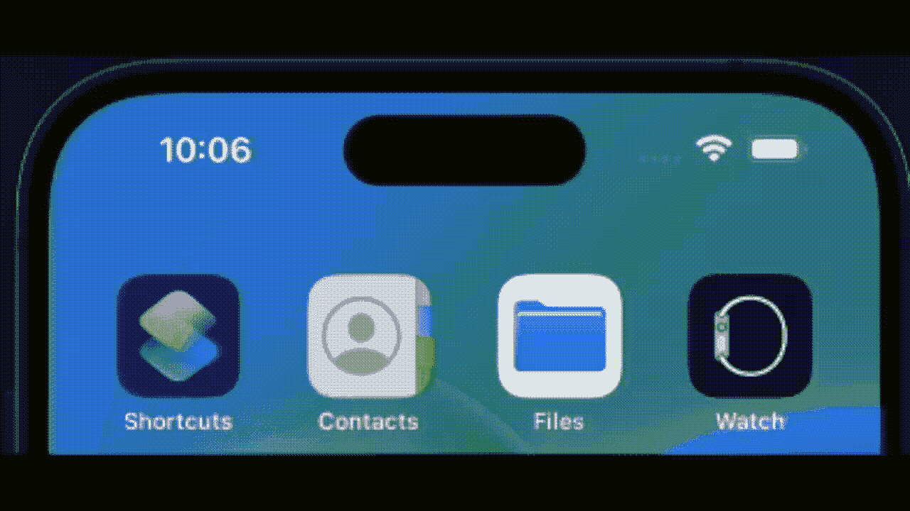

推送通知是一种常用工具，可以增加和推动应用内外的用户参与度。它们最适合用于向您的用户传达与他们的帐户或他们创建的正在交互的内容相关的有价值的更新。

当涉及到让你的应用程序的用户访问用户的设备权限时，通常很难打动他们。他们希望被推销这样做的优势，因此用户第一次启动应用程序时出现大量设备许可请求是一种糟糕的体验，往往会导致大量拒绝。这可能会在解释价值主张之前就把用户赶走。

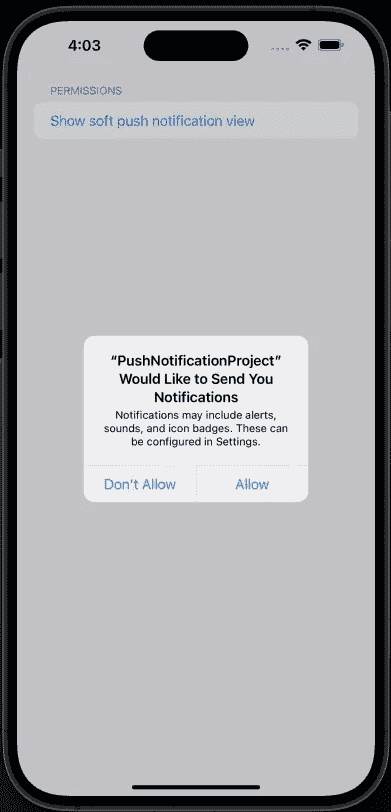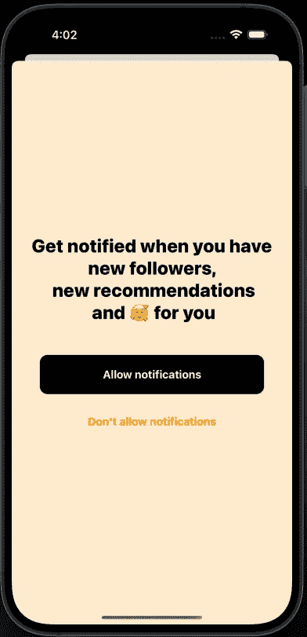

左图:系统权限请求—右图:软权限请求

软权限可以更好地向用户解释您的请求的优势，这更有可能导致您的权限请求获得批准的预期结果。另外，另一个好处是你可以在你认为合适的时候提出你的软许可请求。

相比之下，常规系统权限只能显示一次。如果一个用户拒绝了你的请求，那就是了。你必须鼓励他们在系统设置应用程序中导航到你的应用程序部分，增加一个更不和谐的流程，因为它完全把用户带出你的应用程序。我们将在后面讨论它的实现。

就发送你的推送通知所需的系统而言，特别是对于单人应用开发者来说，Google 的 Firebase 为你的应用的推送通知需求提供了一个很好的起点。主要优势在于文档和界面，因为它是一个使用良好、设计良好的平台。如果你遇到困难，还有很多其他的指南和教程。我在大多数项目中使用 Firebase，在这些项目中，我希望获得更高级的特性，但又不想在设置上花费太多时间。

# **先决条件**

不幸的是，由于苹果和 Firebase 付费层背后的推送通知功能的性质，本指南有几个先决条件。

*   Xcode
*   苹果开发者许可证(付费)。
*   Firebase 帐户与使用 Blaze Plan 设置的项目。

第一步是创建或打开您的 Xcode 项目，并向您的应用程序目标添加推送通知权限。

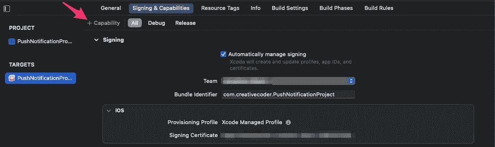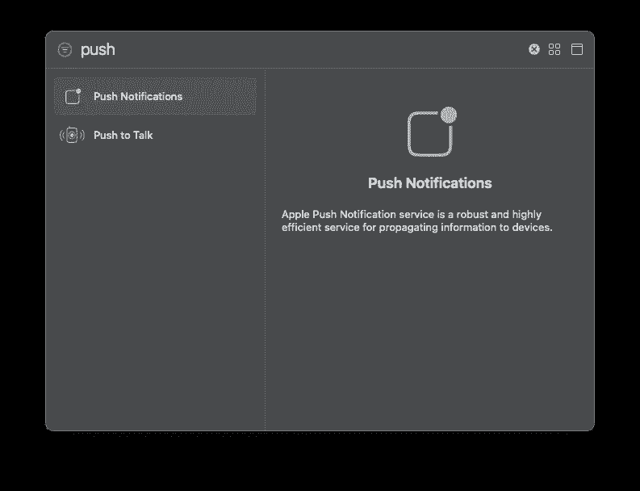

完成后，我们需要登录到`developer.apple.com`并创建我们的 APNs 密钥。您只能在您的帐户上创建两个密钥，因此我倾向于将一个命名为“暂存 APNs 密钥”，而将另一个命名为“生产 APNs 密钥”，这样可以清楚地知道哪个是哪个。

创建密钥后，下载并将其存储在安全的地方。您只能下载. p8 文件一次，因此在多个项目中重复使用相同的键时，让它可用非常重要。一种选择可能是将它存储在私有的 GitHub 存储库中，这样，如果将来需要重新创建密钥，您可以随时访问和更新它们。

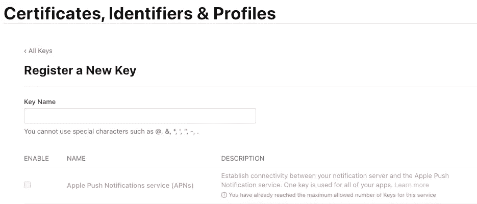

现在这一步已经完成，您已经下载了您的密钥文件，我们可以转移到 Firebase。

按照仪表板提示创建新的 Firebase 项目，输入适当的名称并完成安装向导。

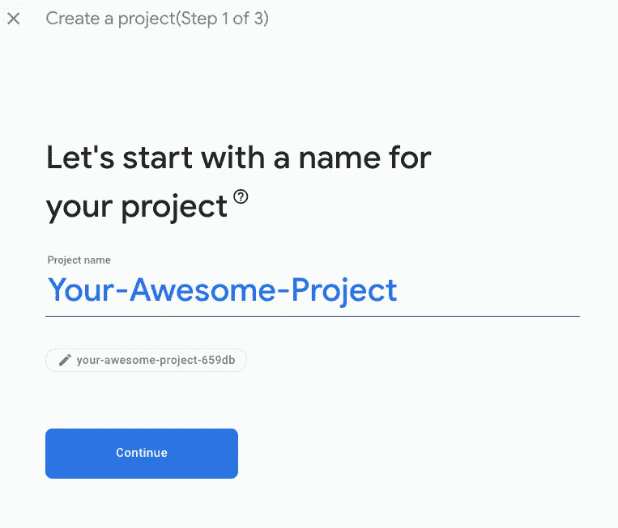

完成后，花点时间熟悉一下 Firebase 仪表板。当你准备好了，是时候升级到火焰计划了。你可能会注意到，它提到“通知”是这两个计划的一部分，但它指的是“应用内消息”功能，只有当你的用户积极使用你的应用程序时才有效。

升级到火焰计划并不像看起来那么可怕。您仍然可以在付费之前访问免费等级限制，并且等级对于大多数项目来说已经足够慷慨了(我还没有在我的任何项目中超过免费等级)。

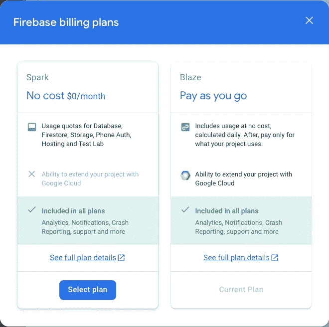

一旦您在 blaze plan 上设置好并添加了您的 iOS 项目，请在“云消息-> APNs 身份验证密钥”下导航到您的项目设置。这是您上传在 Apple developer dashboard 上创建的文件的地方。您可能需要两条信息:密钥 ID，可以在您下载的 APNs 密钥的文件名中找到；团队 ID，可以在您的 Xcode 项目或 Apple developer dashboard 上的描述文件菜单中找到。

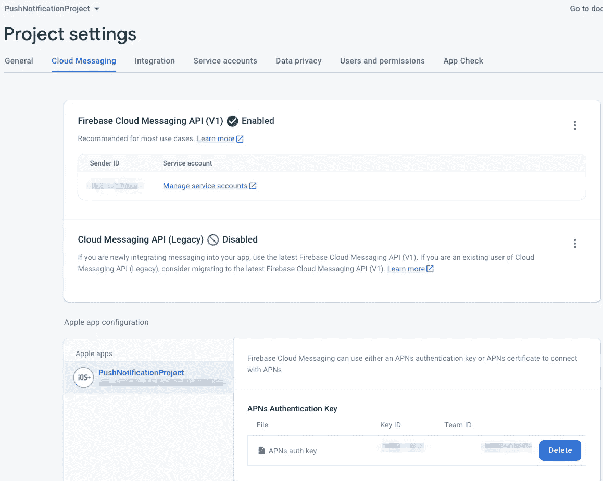

我不知道我弄模糊的东西是否是机密——但也许最好这样处理

我想我们终于准备好跳到 Xcode 了。向您的项目添加 Firebase 超出了本指南的范围，但是如果您还没有，这里有一个很好的指南:[https://firebase.google.com/docs/ios/setup](https://firebase.google.com/docs/ios/setup)

我将使用 SwiftUI 项目作为起点来编写本指南，因为它涵盖了诸如添加 UIKit 项目中已经存在的 AppDelegate 之类的方面。

我们的起点是`{AppName}App.swift`文件，SwiftUI 项目的主要入口点，我们需要添加一行代码来配置您即将创建的 AppDelegate。

1.  `@UIApplicationDelegateAdaptor`是一个可以添加到 AppDelegate 类型的协议，允许它符合并实现为推送通知设置项目所必需的委托方法。你很快就会看到，我们将使用它来确保我们的 SwiftUI 应用程序可以使用`didFinishLaunching`方法和特定于通知的功能。

让我们继续创建`AppDelegate`，创建一个名为`AppDelegate`的新 Swift 文件—该文件将执行几个动作:

1.  它通过调用`FirebaseApp.configure()`来初始化 Firebase——这必须在使用任何其他 Firebase 服务之前完成。
2.  初始化我们的`PushNotificationManager`
3.  将自己设置为一个`UNUserNotificationCenter`代理来处理传入的推送通知。
4.  它调用`registerForRemoteNotifications`，通过向苹果推送通知服务注册应用程序/设备，并返回我们将用于从 Firebase 发送推送通知的设备令牌，为应用程序接收推送通知做准备。

正如您在上面看到的，整个文件保持得非常小。我们不需要很多复杂的逻辑来设置推送通知的应用程序。只是屈指可数的几行。唯一剩下的部分是处理推送通知许可的实际请求，我们可以完全在我们的`PushNotificationManager`中完成。

由于我们希望开发一个系统，在启动时不提示用户接受或拒绝任何权限，我们可以将该功能移动到一个管理器类，该类将处理呈现请求对话框，或者如果用户之前拒绝了设置应用，则将用户定向到设置应用。

让我们来分解一下经理类:

1.  我们将管理器设置为`FirebaseMessaging`的委托，实现协议和`didReceiveRegistrationToken`方法。
2.  我们有一个请求推送通知授权的函数，它接受一个完成处理程序。我们还从迭代当前通知设置开始，以确定设备的当前`authorizationStatus`。
3.  我们希望具体处理一些情况，`.denied`正如它所暗示的，用户已经拒绝了推送通知权限，因此我们希望确保首先我们可以获得设置 URL，应用程序可以实际打开该 URL，最后—在主线程上，将用户推至设备设置应用程序并进入我们的应用程序部分，以便他们可以手动启用权限。通常情况下，你会希望用一个警告来处理这个问题，让用户选择被发送到设置应用程序，而不是这种自动将他们发送到那里的方法。然而，对于本教程，直接的方法是好的。
4.  在正常流程中，设备状态是`.notDetermined`,所以我们按照预期处理它，并提交推送通知许可的硬请求，在其闭包内调用完成处理程序。
5.  如果一个用户已经授予了权限，并且这个函数再次被触发，只需立即调用完成处理程序。
6.  最后，我们的委托方法，作为这个方法接收的令牌，是一个可选的字符串。添加了一个 guard 语句，以确保我们在继续之前有一个值，并使用下面将描述的令牌管理器类将其存储在用户默认值中。

用于保持用户当前访问令牌同步的令牌管理器非常简单。这是一个单例类，它有一个计算变量来设置和获取来自`UserDefaults`的字符串。

现在来看一下 UI/UX，并在 SwiftUI 中处理软权限。下面是一个简单的菜单，使用列表、部分、组和几个按钮来触发软权限弹出窗口。当在真实设备上运行此代码时，这也可以触发您的设备接收推送通知。

上面的代码将产生以下简单的用户界面:

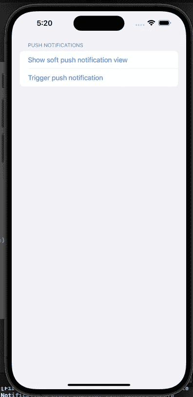

这很好，但是我们的软弹出窗口在哪里？接下来就是这个了。代码如下:

对于这个简单的软权限实现，我试图保持它的通用性，因此很容易获取代码片段，更改文本和颜色以匹配您的风格，并且您已经得到了一个看起来不错的软权限弹出窗口。

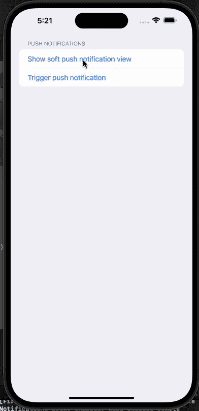

就发展而言，我们还有一点路要走。还有一个神秘的`UserManager`还没有创建，触发我们的推送通知呢？我们会谈到这一点。同时，让我们测试一下当前的实现。

您可以使用一个`payload.apns`文件和以下内容在模拟器上测试推送通知，以确保权限正常工作。该文件的内容看起来非常类似于用于构建实际推送通知的数据结构，而且它们非常类似，只是增加了`“Simulator Target Bundle”: “{YOUR_BUNDLE_ID_HERE}”,`。

要使用这个文件，只需将它拖放到您的模拟器上。如果您接受了推送通知权限，您应该会看到通知看起来像真的一样。

现在来看最后一个本地 iOS 文件，UserManager。该文件将处理与用户相关的服务器相关的交互。它将让用户匿名登录 Firebase，在 Firestore 集合中创建一个名为“user”的文档，其中包含匿名用户的设备令牌，并在 Firestore 集合中创建一个名为“trigger”的文档向“Trigger”传递匿名用户的 ID，并在创建该文档时向该用户的设备触发推送通知。

现在到服务器端。

[按照本指南](https://firebase.google.com/docs/functions/get-started)创建一个 JavaScript 或 TypeScript 函数文件，部署到您的 Firebase 项目中。

当用户在`trigger`集合中创建新条目时触发推送通知。你需要写一个 Firebase 云函数，如下图所示。它执行一些操作:

*   触发器文档是用唯一的 ID 创建的。它包含一条信息，作为单个用户创建触发条目的用户的`userId`应该能够触发他们想要的功能。
*   我们使用 userId 从“user”集合中获取配置文件和通知令牌，该集合是在用户登录应用程序时匿名创建的。
*   构造一个通知有效负载，它包含标题和主体
*   一个函数`sendToDevice`被调用来传递令牌和有效负载，它触发推送通知被发送到用户的设备。

将这个函数部署到 Firebase 项目之后，运行应用程序，并将其安装到测试设备上。您应该会开始收到推送通知。🎊

下面是我用来创建这个测试项目的安全规则:

我在建立一个新项目并让我的云函数与 Firebase 云消息传递对话时看到的一个常见错误通过使用以下 StackOverflow 链接得到了解决:

 [## 尝试对 FCM 服务器进行身份验证时出错

### 默认情况下，Firebase 使用 Firebase 云消息 api (V1 ),因此您需要使用此 API 而不是传统 API 来…

stackoverflow.com](https://stackoverflow.com/questions/57767439/an-error-occurred-when-trying-to-authenticate-to-the-fcm-servers) 

我知道这是一个漫长的过程，所以如果你已经做到了这一步，干得好！我希望这有助于你学习新的东西。

如果您对本指南有任何问题，请发表评论或通过 [LinkedIn](https://www.linkedin.com/in/jonathonalbert/) 联系我。我很乐意帮助完善这个指南，增加额外的细节和清晰度，使这个相当复杂的话题更容易理解。