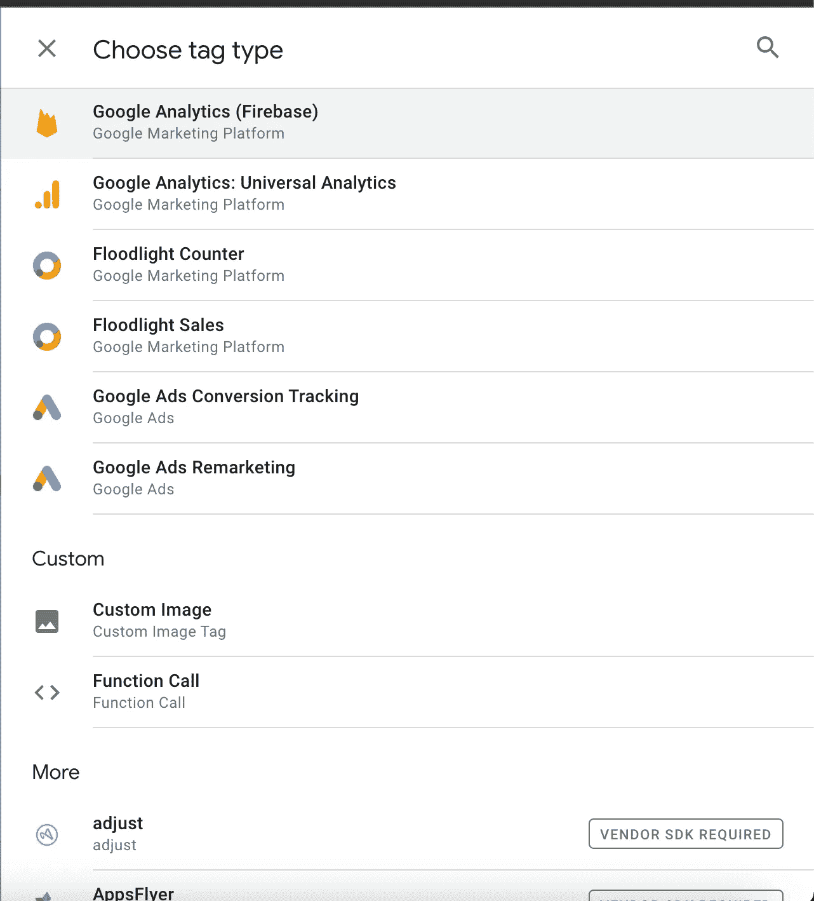

# 在 React Native 中实现 Google Tag Manager (GTM)

> 原文：<https://betterprogramming.pub/implement-google-tag-manager-gtm-in-react-native-c7b6d44a0fcd>

## 了解如何将 GTM 与其他第三方分析相集成

Pawel Czerwinski 在 [Unsplash](https://unsplash.com?utm_source=medium&utm_medium=referral) 上的照片

分析是安装在应用程序中的重要内容之一，因此我们可以改进我们的功能，或者通过了解用户的行为来建立一个对用户重要的功能。很难找到的一个资源是在 react native apps 中实现 google tag manager。

在本文中，我将解释如何在 react native apps 中实现 google tag manager，并将其与 [Amplitude](https://amplitude.com/) 集成，作为如何与其他第三方分析集成的示例。

# GTM 在移动领域的工作方式

GTM 如何在移动应用中工作的一般流程

为了利用 GTM，我们需要 firebase analytics 来调用发送事件和参数的函数。GTM 不会从移动应用程序收集数据分析。GTM 的角色是组织来自应用程序的分析流量，以便与其他第三方分析整合。流量由 JSON 文件组织，该文件包含将分析数据发送到何处以及如何发送的映射。JSON 文件将在第一次安装时下载，并放在应用程序的特定路径中。下一次在 GTM 仪表板中有更新时，GTM 已经有了一个为所有用户设备分发和更新 JSON 文件的机制。

# 先决条件

*   安装 firebase analytics。你可以使用[react-native-firebase analytics](https://rnfirebase.io/)。按照链接中的说明进行安装。
*   在此创建一个谷歌标签管理员账户
*   配置谷歌标签管理器容器。你可以跟着[到这里](https://support.google.com/tagmanager/answer/6103696#CreatingAnAccount)

# 安装谷歌标签管理器的步骤

GTM 仍然不支持 react-native 的 SDK。所以安装会在各个原生代码中完成，iOS 和 Android。

*   安装谷歌标签管理依赖，并把容器文件在 android 中。遵循本指令
*   安装谷歌标签管理器依赖项，并将容器文件放入 iOS。遵循本指令。

# 与其他第三方分析集成的步骤(例如:振幅)

要与其他第三方分析应用程序集成的标签类型列表

在 GTM 仪表板中创建标签时会发生集成。当您单击导航抽屉标签>按钮新建>单击标签配置时，会出现一个您可以集成的第三方分析应用程序列表。有些需要 SDK 安装，有些不需要。如果您找不到任何想要集成的分析应用程序，您总是可以通过在本机代码中创建自定义提供程序(触发时要调用的函数的代码)来进行自己的集成，然后在仪表板中创建自定义的`Function Call`标记，将代码函数的路径放在`Class Path`中，并定义想要发送的数据的键值。

带有标签类型函数调用的标签配置

关于`class path`的几点建议

*   对于 android，`Class Path`是您的自定义提供程序文件的路径。例如，如果你在这个路径下创建文件``android/app/src/main/java/com/yourapp/GTMAmplitudeProvider.java`，`Class Path`应该是`com.yourapp.GTMAmplitudeProvider`
*   对于 iOS `Class Path`，只需输入文件名. m，那么对于`GTMAmplitudeProvider.m`，只需输入`GTMAmplitudeProvider`

振幅有一个固有的 SDK。但是为了利用 GTM，我们应该安装本地 SDK，因为要管理的流量是从本地代码引用的(在 android 或 iOS 中)。在本文中，我只向您展示了如何创建自定义提供程序的一般想法，而没有进一步解释当您想要使用分析包时如何初始化实例，因为它在所有第三方分析包之间有所不同，只需遵循文档即可。

下面是与 android 集成的步骤

*   用[安装振幅本指令为 android](https://developers.amplitude.com/docs/android#sdk-installation) 安装依赖项，添加权限，并初始化。
*   在此路径`android/app/src/main/java/com/yourapp`中创建提供者 java 文件，例如`GTMAmplitudeProvider`。
*   一般来说，第一个被调用的函数是`execute`，输入参数`map`是在 dashboard 中创建标签时定义的对象键值。

下面是与 iOS 集成的步骤

*   使用本指令安装振幅，使用 Cocoapod 进行安装和初始化。
*   使用 Xcode IDE 创建文件`GTMAmplitudeProvider.h`和`GTMAmplitudeProvider.m`

在安装了本机依赖项并创建了自定义提供程序之后，尝试使用 javascript 中的 firebase analytics 创建一个事件，并创建使用我们刚刚创建的自定义提供程序的标记。就是这样！

# 提示和技巧

*   当您与其他第三方分析应用程序集成时，您必须知道的第一件事是调用什么函数来调用发送分析。一些应用程序需要你在发送数据之前先创建一个类对象，一些应用程序需要你调用精确的函数来进行精确的事件跟踪(例如:需要调用函数`trackPurchase`来跟踪购买)
*   如果您使用自定义提供程序，在 Android Studio 或 Xcode 中编码会更容易，因为我们将在这里编写本机代码，并且那些 IDE 支持自动导入，如果我们的代码中有一些错误，会进行标记。
*   你可以随时`console.log`调试一切。在 android java 中，你可以使用`Log.d`，在 iOS 中，你可以使用`NSLog`。要查看日志，我更喜欢使用 flipper，这样你就不需要从多个应用程序中查看日志。
*   当您集成新的第三方应用程序时，用最新版本更新您代码中的容器 JSON。
*   对于其他第三方分析应用程序，如果您想要使用一些必须在 javascript 端调用的函数，请检查软件包是否已经安装了本机依赖项。如果您需要访问本机依赖项，也许您必须强制手动安装，以便您可以从本机代码访问它。
*   您可以通过在前面的路径中创建一个类似于`GTMClass`的文件夹并将所有自定义提供程序放在那里来更好地组织。
*   您可以通过为一个第三方应用程序创建一个提供程序来组织提供程序文件(例如:提供程序包含 trackEvent、trackUserProperties)，或者为第三方应用程序的一个功能创建一个提供程序(例如:提供程序仅包含 trackEvent)。

# 充当故障检修员

*   当您的 CustomProvider 文件被触发时没有被调用，可能是容器 JSON 没有更新或者在您使用[预览模式](https://developers.google.com/tag-platform/tag-manager/android/v5#preview_container)时更新失败。你可以查看设备日志(我更喜欢使用 flipper)