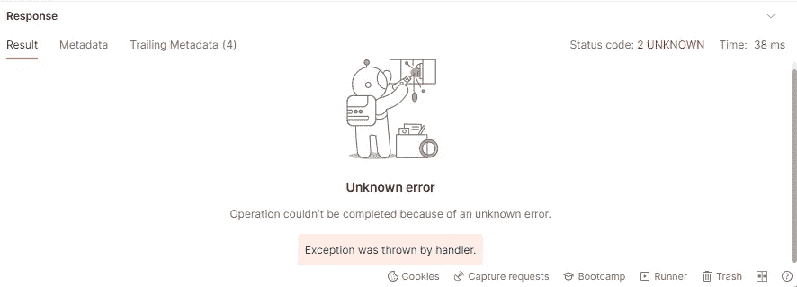

# 在 ASP 中实现 gRpc 全局异常处理程序。网

> 原文：<https://betterprogramming.pub/implement-grpc-global-exception-handler-in-asp-net-e371fb35b7b7>

## 这个例子展示了 gRpc 中一元服务器句柄中的 gRpc 全局异常处理程序。

多梅尼科·洛亚在 [Unsplash](https://unsplash.com?utm_source=medium&utm_medium=referral) 上拍摄的照片

在微服务中，我们有两种方式与其他内部服务集成。

第一种方式是请求-响应模式，这是最著名的。

请求-响应模式的优点是客户端可以立即从其他内部服务获得响应，无论是查看数据还是数据操作结果。

第二种方式是消息模式；生产者将数据排队到队列中(像 Kafka 一样)，消费者将从队列中接收数据。

在系统设计中，什么时候使用请求-响应模式，什么时候使用消息模式？

在接下来的几篇文章中，我会对此进行更多的解释。

我们的内部系统使用 gRpc 与其他内部服务集成，以实现请求-响应模式。

这个模式中的问题是，我们如何知道响应是成功还是失败？

这种模式中的响应有两种失败情况；一个是网络错误，另一个是商业错误。

为了区分响应，我们在 API 响应中制定了一种格式。

响应密钥具有代码、消息和数据；下面的 JSON 就是一个例子。

*   代码:表示您的操作是否成功；如果没有，会给出相应的错误代码。
*   消息:API 想告诉你的一些错误消息。
*   数据:您需要来自服务的数据。

# web API 中的全局异常处理程序

如果我们想在 web API 中处理全局异常，我们编写一个中间件，捕捉特定的域异常，并重写响应体。

首先，我们创建一个域异常类。

域异常有两个属性，即代码和消息。

域异常

如果我们的域逻辑发生异常，比如 order not found 或 store not found，我们抛出域异常。

域应用服务

最后一步是创建一个中间件来处理域异常。

全局异常处理程序中间件将捕获域异常，并用域异常中的代码和消息将响应体重写为我们的规范格式。

全局异常处理中间件

# gRpc 上的解决方案是否相同？

gRpc 请求也通过全局异常处理器中间件。

让我们看看如果不从全局异常处理程序中间件中排除 gRpc 请求会发生什么。

糟糕，我们收到状态代码 2 未知响应。

该解决方案在 web API 上工作，在 gRpc 上完全不可用。

# gRpc 中的全局异常处理程序

正如你所看到的，我们重写了 JSON 主体，以适应 web API 的格式。

但是在 gRpc 中，我们不能像 web API 那样使用中间件来处理异常。

所以我们需要用另一种方式来处理这件事。

让我们使用 Grpc。处理异常的拦截器。

创建一个 Grpc 全局异常处理程序拦截器，如下所示。

将拦截器注册到 gRpc 服务器管道。

gRpc 响应体是一个具体类型；当我们捕捉到异常时，我们不能像 web API 那样重写 JSON 主体。

我们必须向响应返回一个特定的类。

所以我们使用反射来映射到泛型类型。

# 如果全局异常处理中间件和 gRpc 全局异常处理拦截器同时存在，是否有效？

答案是肯定的。

但是只有一种方法可以成功捕获异常。

原因是中间件和拦截器的顺序。

web API 请求不会通过 gRpc 拦截器。

因此中间件将捕获 web API 请求抛出的异常。

gRpc 请求不仅要通过中间件，还要通过拦截器。

请求的顺序是中间件第一，gRpc 拦截器最后。

因此拦截器将捕获 gRpc 请求抛出的异常，而不是将它们转发给中间件。

在接下来的几篇文章中，我将说明中间件和拦截器在 ASP.NET 的顺序。

# 结论

这个例子展示了 gRpc 中一元服务器句柄中的 gRpc 全局异常处理程序。

如果你使用客户端流或服务器流，你需要在额外处理那些方法。

只需覆盖其他服务器句柄方法。

希望这个方案能解决你的问题。