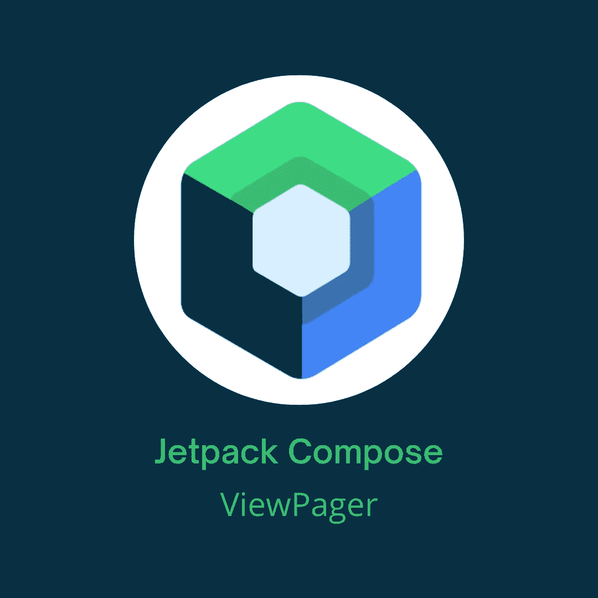

# 在 Jetpack Compose 中实现水平和垂直 ViewPager

> 原文：<https://betterprogramming.pub/implement-horizontal-and-vertical-viewpager-in-jetpack-compose-a7a91f2ac746>

## 在 Jetpack 撰写中实现 ViewPager



这张图片中使用的 Jetpack Compose 徽标是由 Google 创建的官方徽标

在 Jetpack Compose 中，默认情况下我们没有像`ViewPager`这样可以使用的东西，但是我们有一个解决方案。我们要用`Accompanist Pager library`。首先，我们要将依赖关系添加到应用程序级的`build.gradle`文件中:

```
implementation "com.google.accompanist:accompanist-pager:0.23.1"
```

**注:**撰写本文时，0.23.1 是最新的稳定版本。检查是否有更新的版本。

> "为 Jetpack 编写提供分页布局的库。如果你以前用过安卓的`[ViewPager](https://developer.android.com/reference/kotlin/androidx/viewpager/widget/ViewPager)`，它也有类似的属性。”根据[寻呼机官方文档](https://google.github.io/accompanist/pager/)

## 水平寻呼机

`HorizontalPager`是可组合的，内容水平排序并显示为页面。我们将创建一个名为`HorizontalPagerContent`的数据类，它将表示水平页面内容。

```
data class HorizontalPagerContent(
    val title: String,
    val subtitle: String,
    val description: String
)
```

下一步是创建将在此寻呼机中显示的项目列表:

```
fun createItems() = *listOf*(
    HorizontalPagerContent(title = "Title1", subtitle = "Subtitle1", description = "Description1"),
    HorizontalPagerContent(title = "Title2", subtitle = "Subtitle2", description = "Description2"),
    HorizontalPagerContent(title = "Title3", subtitle = "Subtitle3", description = "Description3"),
    HorizontalPagerContent(title = "Title4", subtitle = "Subtitle4", description = "Description4"),
    HorizontalPagerContent(title = "Title5", subtitle = "Subtitle5", description = "Description5")
)
```

这是一个简单的函数，返回一个`HorizontalPagerContent`项的列表。`HorizontalPager`有两个强制参数，它们是`count: Int`和`content: @Composable PagerScope.(page: Int) -> Unit`，其他参数都是可选的，还有很多类似的:`modifier`、`reverseLayout`、`verticalAlignment`等等。我没有提到的一个非常有用的可选参数是代表页面状态的`state: PagerState`。您可以使用该状态来获取当前页面、页数，并滚动到我们将在示例中显示的特定页面。因此，我们的主要可组合组件将如下所示:

**注意:**我们需要添加`ExperimentalPermissionsApi`注释，因为库中所有的 API 仍然是实验性的。

首先，我们创建`items`和`pagerState`，并将它们都传递给`HorizontalPager`。`content` composable 返回当前页面的索引，我们可以用它从列表中获取条目并加载数据。在我们的主 composable 的末尾，我们可以看到一个按钮，当按下时，会滚动到第三页。根据你的需要，你可以使用`animateScrollToPage`或者`scrollToPage`来滚动，但是这两个都需要在`Coroutine`内部调用。两者的区别在于`animateScrollToPage`滚动流畅。

接下来我们要添加的是`indicators`和`tabs`。为此，我们需要添加一个新的伴奏库:

```
implementation "com.google.accompanist:accompanist-pager-indicators:0.23.1"
```

**注:**撰写本文时，0.23.1 是最新的稳定版本。检查是否有更新的版本。

添加指标很简单，我们只需要添加`HorizontalPagerIndicator`并通过`pagerState`即可。例如，它看起来像这样:

```
*HorizontalPagerIndicator*(
    pagerState = pagerState,
    modifier = Modifier
        .*align*(Alignment.CenterHorizontally)
        .*padding*(16.*dp*),
)
```

不错吧？现在让我们添加选项卡，我们将创建一个名为`HorizontalTabs`的新的可组合组件，在该可组合组件中，我们将使用`Accompanist Pager Indicator`库中的`TabRow`和`Tab` 。这个可组合组件将如下所示:

`TabRow`有两个强制参数`selectedTabIndex: Int`和`tabs: @Composable () -> Unit`。此处使用参数`indicator`来激活标签空间内的指示器绘图，而指示器不会从一个标签跳到另一个标签。在可组合的内部，我们只是传递标签的外观。我们正在使用这个库中的可组合`Tab`，它有强制参数:`selected: Boolean`、`onClick: () -> Unit`和`content: @Composable ColumnScope.() -> Unit`。当点击任何一个标签时，我们可以平滑地滚动到它。

那就是`HorizontalPager`和围绕它使用的主要特性。现在我们要实现`VerticalPager`。

## 垂直寻呼机

`VerticalPager`是可组合的，内容垂直排序并显示为页面。

实现`VerticalPager`和实现`HorizontalPager`基本是一回事。

你只需要用`VerticalPager`代替`HorizontalPager`，对于指标你用`VerticalPagerIndicator`代替`HorizontalPagerIndicator`。其他都一样。所以它看起来像这样:

这就是这篇文章的全部内容，希望你喜欢！
你可以在[我的 GitHub repo](https://github.com/Giga99/MediumRepos) 中找到所有的源代码。

```
Connect with me on:
[Github](https://github.com/Giga99)
[LinkedIn](https://www.linkedin.com/in/igor-stevanovic/)
[Twitter](https://twitter.com/igor_s1999)
[Portfolio website](https://giga99.github.io/portfolio-website/)
```

如果您想了解如何在 Jetpack Compose 中请求权限，请阅读这篇文章:

[](/jetpack-compose-request-permissions-in-two-ways-fd81c4a702c) [## 在 Jetpack Compose 中请求权限的两种方法

### 在 Jetpack Compose 中请求权限的最佳方式

better 编程. pub](/jetpack-compose-request-permissions-in-two-ways-fd81c4a702c) 

# 资源

[](https://google.github.io/accompanist/pager/) [## 向导伴奏者

### 为 Jetpack Compose 提供分页布局的库。如果你以前用过安卓的，它有类似的…

google.github.io](https://google.github.io/accompanist/pager/)