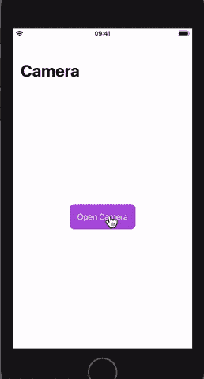
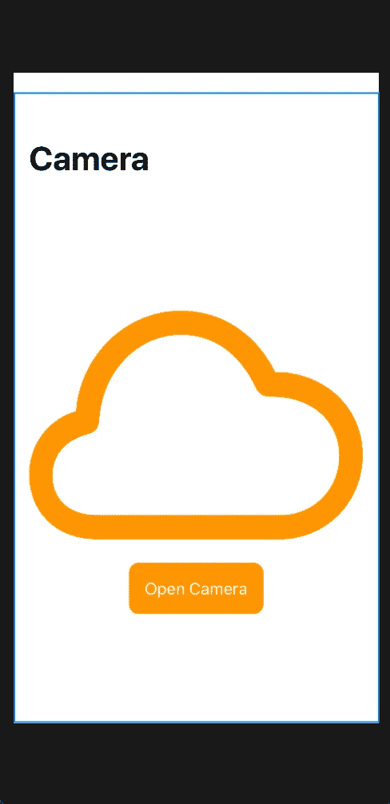

# 在 SwiftUI 中实现 ImagePicker

> 原文：<https://betterprogramming.pub/implement-imagepicker-using-swiftui-7f2a28caaf9c>

## 从您的图库中选择或拍照，一切尽在 SwiftUI 中



# 第一步。如何创建您的 SwiftUI 项目

在 Xcode 中，进入文件→新建→项目→单视图 App →下一步→选择用户界面→ SwiftUI →下一步→选择你想要的项目位置→完成。

# 第二步。内容视图. swift

默认的`SwiftUI(ContentView)` 文件会出现以下代码:

```
**import** SwiftUI
**struct** ContentView: View {**var** body: **some** View {
    Text(”Hello World!”)
  }
}**struct** ContentView_Previews: PreviewProvider { **static** **var** previews: **some** View {
     ContentView()
   }
}
```

在右边，您可以看到 UI 的预览。

如果看不到预览，进入*调整编辑器*选项，选择*画布*(或按`option+CMD+enter` ) *。* 之后，确保画布正在显示 UI 预览。


# 第三步。创建用户界面

在`ContentView`体内我们将做以下事情:

1.  定义`NavigationView`，给`navigationBarTitle`。
2.  定义`VStack`。
3.  在`VStack`中，我们必须定义一个`Image`来显示选中的图像和一个`Button`。点击此按钮，我们将打开`ImagePicker`。

因此，我们的代码看起来会像这样:

```
**import** SwiftUI**struct** Demo: View {
   **var** body: **some** View {
      //MARK: **Step 1: Define the NavigationView and give the      navigationBarTitle** NavigationView{
          //MARK: **Step 2: Define the VStack** VStack {
             //MARK: **Define the Image** Image(systemName: “cloud”)
                .resizable()
                .scaledToFit()
                .padding()
                .foregroundColor(Color.orange)

             //MARK: **Define the Button** Button(“Open Camera”){
                //Button Action Goes here
             }.padding()
              .foregroundColor(Color.white)
              .background(Color.orange)
              .cornerRadius(10)
       }
        .navigationBarTitle(Text(“Camera”))
     }
   }
}**struct** Demo_Previews: PreviewProvider {
   **static** **var** previews: **some** View {
       Demo()
   }
}
```



现在我们完成了我们的 UI。接下来，我们要实现`UIImagePickerController`。

# 第四步。创建一个`UIImagePickerController`

现在的问题是:“你打算怎么展示一个`UIImagePickerController`？”因此，为了显示一个`UIImagePickerController`，我们将使用`UIViewControllerRepresentable`协议。

```
**struct** ImagePicker : UIViewControllerRepresentable {}
```

现在，我们必须实现协议方法，它们是`updateUIViewController`、`makeCoordinator`和`makeUIViewController`。

```
**func** updateUIViewController(**_** uiViewController: UIImagePickerController, context: UIViewControllerRepresentableContext<ImagePicker>) 
{
   //Update UIViewcontrolleer Method
}**func** makeCoordinator(){//Make Coordinator which will commnicate with the    ImagePickerViewController
}**func** makeUIViewController(context: UIViewControllerRepresentableContext<ImagePicker>)
{
   // Create UIViewController which we will display inside the View of the UIViewControllerRepresentable}
```

既然我们已经实现了协议`UIViewControllerRepresentable`的所有方法，让我们在`makeUIViewController`方法中创建一个`ImagePickerViewController`。

```
**func** makeUIViewController(context: UIViewControllerRepresentableContext<ImagePicker>) -> UIImagePickerController 
{
   **let** picker = UIImagePickerController()
   picker.delegate = context.coordinator
   **return** picker
}
```

# 第五步。创建图像拾取器协调器

现在我们必须创建一个协调器，它可以在`UIViewControllerRepresentable`和`ImagePickerViewController`委托方法之间进行通信。

因此，我们将创建一个新的类`ImagePickerCordinator`，它将实现协议`UINavigationControllerDelegate`和`UIImagePickerControllerDelegate`，并将实现这些协议所需的方法。

`ImagePickerCordinator`看起来会像这样:

```
**class** ImagePickerCordinator : NSObject, UINavigationControllerDelegate, UIImagePickerControllerDelegate{**var** image      : Image?//Selected Image
   **func** imagePickerController(**_** picker: UIImagePickerController, didFinishPickingMediaWithInfo info: [UIImagePickerController.InfoKey : **Any**]) {**let** uiImage = info[UIImagePickerController.InfoKey.originalImage]    **as**! UIImage
   image = Image(uiImage: uiImage)
   }//Image selection got cancel
   **func** imagePickerControllerDidCancel(**_** picker:      UIImagePickerController) {
   }
}
```

现在，如果用户选择了一张图片，我们必须通知我们的`ContentView`显示选中的图片。

为此，我们将使用`@Binding`和`@State`的概念。我们将创建两个名为`image`和`isShown`的`Binding`变量，因此现在我们的`ImagePickerCordinator`将如下所示:

```
**class** ImagePickerCordinator : NSObject, UINavigationControllerDelegate, UIImagePickerControllerDelegate{@Binding **var** isShown : Bool
@Binding **var** image : Image?**init**(isShown : Binding<Bool>, image: Binding<Image?>) {
      _isShown = isShown
      _image = image
   }//Selected Image
   **func** imagePickerController(**_** picker: UIImagePickerController, didFinishPickingMediaWithInfo info: [UIImagePickerController.InfoKey : **Any**]) {**let** uiImage = info[UIImagePickerController.InfoKey.originalImage]   **as**! UIImageimage = Image(uiImage: uiImage)
   isShown = **false**}//Image selection got cancel
   **func** imagePickerControllerDidCancel(**_** picker: UIImagePickerController) {
   isShown = **false** }}
```

既然我们的协调者已经准备好进行交流，让我们对`UIViewControllerRepresentable` `makeCoordinator()`函数进行修改。

```
**func** makeCoordinator() -> ImagePickerCordinator {
   **return** ImagePickerCordinator(isShown: $isShown, image: $image)
}
```

为了传递`ImagePickerCordinator`中的`binding`变量，我们将在`UIViewControllerRepresentable`中创建这两个变量。现在`UIViewControllerRepresentable`文件看起来会像这样:

```
**struct** ImagePicker : UIViewControllerRepresentable { @Binding **var** isShown : Bool
   @Binding **var** image : Image?**func** updateUIViewController(**_** uiViewController: UIImagePickerController, context: UIViewControllerRepresentableContext<ImagePicker>) {}**func** makeCoordinator() -> ImagePickerCordinator {
      **return** ImagePickerCordinator(isShown: $isShown, image: $image)
   }**func** makeUIViewController(context: UIViewControllerRepresentableContext<ImagePicker>) -> UIImagePickerController {**let** picker = UIImagePickerController()
      picker.delegate = context.coordinator
      **return** picker
   }
}
```

# 第六步。创建照片捕捉视图

每当用户点击`ContentView`中的`Button`时，我们希望在表单或模态中显示一个`imagePicker`。

为此，我们必须创建一个新的`CustomView`，我们可以将其命名为`PhotoCaptureView`，它将被称为`ImagePicker`。它是一个`UIViewControllerRepresentable`，所以看起来像这样:

```
**import** SwiftUI**struct** PhotoCaptureView: View { @Binding **var** showImagePicker : Bool
   @Binding **var** image : Image?

   **var** body: **some** View {
      ImagePicker(isShown: $showImagePicker, image: $image)
   }
}**struct** PhotoCaptureView_Previews: PreviewProvider {
   **static** **var** previews: **some** View {
      PhotoCaptureView(showImagePicker: .constant(**false**), image:  .constant(Image(“”)))
   }
}
```

# 最后一步 7。在 ContentView 中实现 ImagePicker

在`contentView`内部，我们只需要创建两个`@State`变量，命名为`showImagePicker`和`image`。这将创建一个`sheet`或`modal`并调用`CustomView`，即`PhotoCaptureView`，因此我们的`ContentView`代码将如下所示:

```
**import** SwiftUI**struct** ContentView: View {
   @State **private** **var** showImagePicker : Bool = **false** @State **private** **var** image : Image? = **nil

   var** body: **some** View {
      NavigationView{
        VStack {
          image?.resizable().scaledToFit()
          Button(“Open Camera”){
          **self**.showImagePicker = **true** }.padding()
        .foregroundColor(Color.white)
        .background(Color.purple)
        .cornerRadius(10)
   }.sheet(isPresented: **self**.$showImagePicker)
     {
        PhotoCaptureView(showImagePicker: **self**.$showImagePicker, image: **self**.$image)
      }
       .navigationBarTitle(Text(“Camera”))
    }
  }
}**struct** ContentView_Previews: PreviewProvider {
   **static** **var** previews: **some** View {
      ContentView()
   }
}
```

# 最终产品

最终的代码将如下所示:

在 [GitHub](https://github.com/rathodmayur93/ImagePickerSwiftUI) 上找到这个项目。