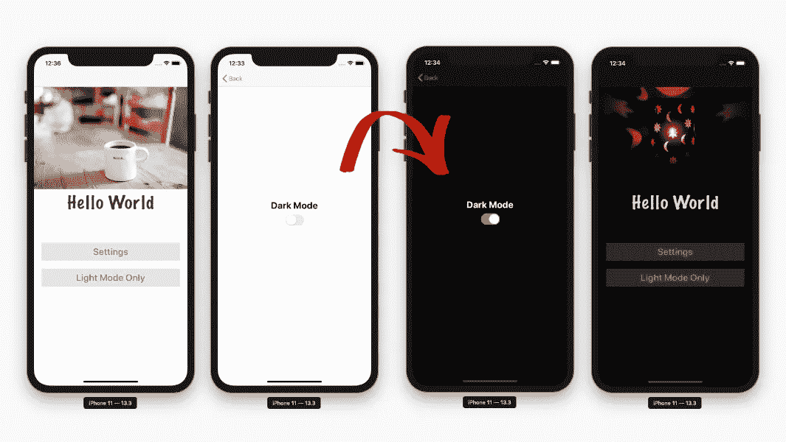
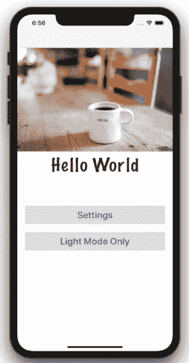
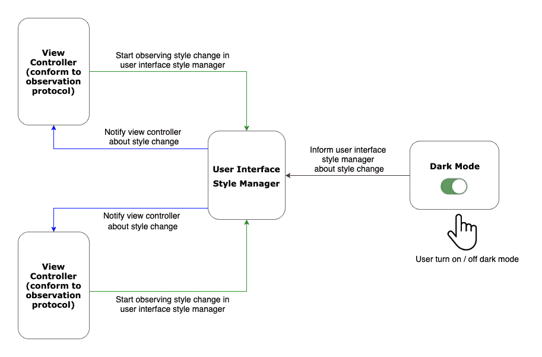
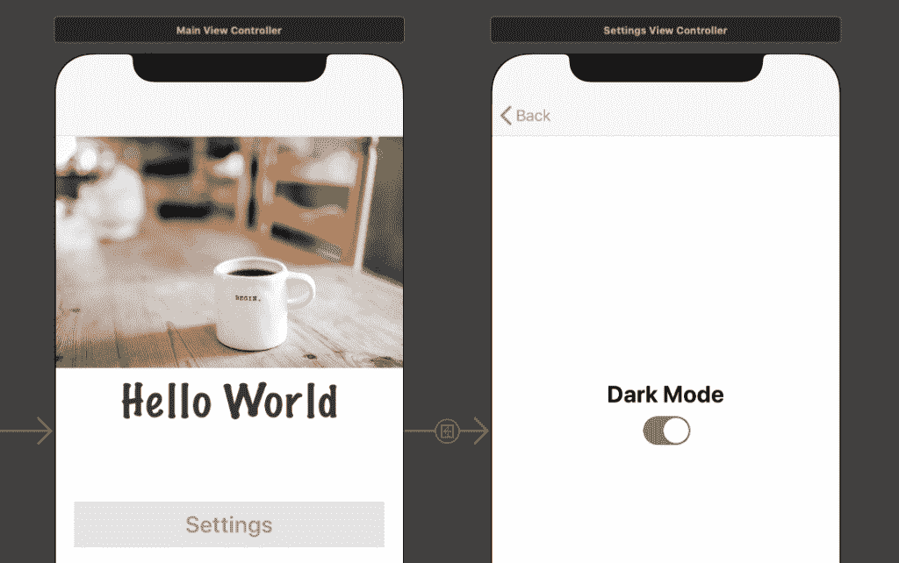
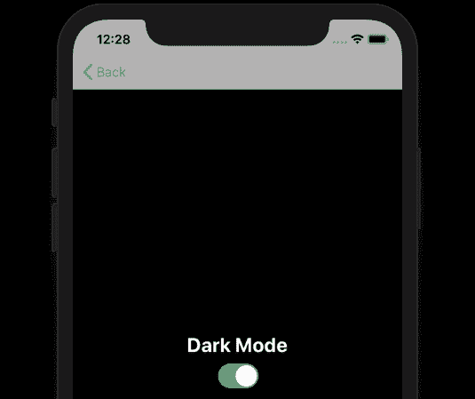
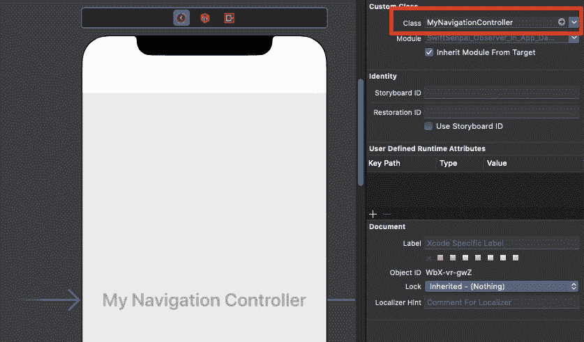
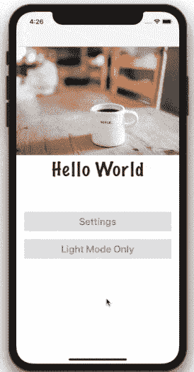

# 使用 Swift 观察协议实施应用内黑暗模式

> 原文：<https://betterprogramming.pub/implement-in-app-dark-mode-using-swift-observation-protocols-7f1e960d4f7e>

## 覆盖 iOS 系统范围的用户界面风格，变得容易



在 iOS 13 中，苹果向全世界推出了黑暗模式。要启用黑暗模式，您必须使用设备上的*设置*应用程序，并在系统范围内启用该功能。

但是，如果不是遵循系统级的黑暗模式设置，而是希望您的应用程序有自己独立的黑暗模式设置，该怎么办？这可以实现吗？当然有一种方法，我将在本文中向您展示如何实现。

为了更好地理解我们在这篇文章中想要达到的目的，请看下面的动画 GIF。



应用内黑暗模式设置

在这篇文章中，我不会深究在 iOS 中采用黑暗模式时你应该知道什么。如果想了解更多，可以看看这篇[文章](https://swiftsenpai.com/design/what-a-designer-need-to-know-about-ios-dark-mode/)。

相反，我将关注如何使用面向协议的方法来实现上面 GIF 中展示的内容。说了这么多，我们开始吧。

# 整体架构

如上所述，我们将使用 Swift 观察协议来实现应用内黑暗模式。下图展示了我们的示例应用程序的整体架构。



示例应用程序整体架构

在我们的示例应用程序中，我们将有两个主要组件负责跟踪和更新用户界面风格。

## **用户界面风格管理器**

*   跟踪应用程序当前的用户界面风格。
*   跟踪所有的用户界面风格观察者。
*   负责在界面风格改变时通知所有观察者。

## **用户界面风格观察者**

*   在用户界面样式管理器中观察界面样式变化的协议。
*   负责在用户界面风格改变时更新视图外观。

这里的想法是使所有视图控制器符合用户界面风格观察者协议，以便每当用户在示例应用程序中打开/关闭黑暗模式时，用户界面风格管理器将被更新，并将通知所有观察视图控制器相应地改变它们的视图外观。

# 实现用户界面样式管理器

由于用户界面样式管理器是一个集中式组件，在示例应用程序的整个生命周期中我们只需要一个，所以我们将使它成为一个单例结构。

下面是`UserInterfaceStyleManager`结构最初的样子。

1.  通过创建一个静态共享实例并将其初始化器设置为 private 来创建一个`UserInterfaceStyleManager`单例。
2.  `currentStyle`是一个私有变量，用于跟踪当前的用户界面风格。这里，我们从`UserDefaults`获得它的初始值。
3.  创建公共函数`updateUserInterfaceStyle(_:)`来允许应用程序的其他组件，在我们的例子中，这将是`UISwitch`，通知我们的`UserInterfaceStyleManager`关于用户界面风格的改变。

为了在`currentStyle`发生变化时通知所有的观察者，我们的`UserInterfaceStyleManager`需要引用所有的观察者。

这里，我们将使用字典来跟踪所有的观察者。此外，我们将添加两个公共函数，使我们能够从`UserInterfaceStyleManager`添加和删除观察者。

1.  `observers`是一个字典，记录所有添加的观察点。请注意，观察者是作为弱引用添加到字典中的，这是为了避免发生保留循环(稍后将详细介绍)。此外，我们使用观察者的`ObjectIdentifier`作为字典键。
2.  一个公共函数，使其他组件能够向`UserInterfaceStyleManager`添加观察者。
3.  一个公共函数，允许其他组件从`UserInterfaceStyleManager`中移除观察者。

您可能会注意到在上面的代码片段中使用了`UserInterfaceStyleObserver`和`WeakStyleObserver`。

`UserInterfaceStyleObserver`是我们尚未实现的观察协议，我们将在稍后讨论。现在，我们来看看`WeakStyleObserver`。

`WeakStyleObserver`是一种包装器类型，它用弱引用跟踪`UserInterfaceStyleObserver`实例。

我们需要这样做的原因是 Swift 中的字典总是有对它们的元素的强引用，这可能会引入保留循环并导致内存泄漏。

下面是`WeakStyleObserver`的实现。

最后，我们将向`currentStyle`变量添加一个属性观察者，这样当`currentStyle`的值改变时`UserInterfaceStyleManager`将执行一个动作。

上面代码片段中的`styleDidChanged()`函数将遍历观察者的字典，并通知每个观察者用户界面样式的变化。

我们将暂时让`for-loop`的身体空着。一旦我们实现了`UserInterfaceStyleObserver`，我们将回到这个话题。

# 实现用户界面样式观察器

下面的代码片段显示了`UserInterfaceStyleObserver`协议的定义。

这里，我们将`UserInterfaceStyleObserver`定义为一个类专用协议。

这是因为我们在`UserInterfaceStyleManager`中使用`ObjectIdentifier`作为`observers`字典的键，而`ObjectIdentifier`只是一个支持类对象。

因此，我们将不得不使`UserInterfaceStyleObserver`成为一个类专用协议，这样只有类才能符合该协议。

`UserInterfaceStyleObserver`的功能相当简单。它只包含两个功能。

1.  负责向`UserInterfaceStyleManager`添加观察者的功能。
2.  当用户界面样式改变时触发的功能。因此，这个函数会在需要的时候改变视图的外观。

接下来，我们将使`UIViewController`符合`UserInterfaceStyleObserver`协议并实现这两个功能。

我们将使用 iOS 13 中引入的新属性`UIViewController`—`[overrideUserInterfaceStyle](https://developer.apple.com/documentation/uikit/uiviewcontroller/3238087-overrideuserinterfacestyle)`来控制视图控制器的外观。

该属性使我们能够覆盖系统用户界面样式，并强制视图控制器遵循我们想要的外观。

要强制视图控制器始终以黑暗模式显示，我们可以如下操作:

```
overrideUserInterfaceStyle = .dark
```

记住这一点，我们现在可以开始实现`UIViewController`的`UserInterfaceStyleObserver`功能。

在`startObserving(_:)`函数中，我们将视图控制器注册为`UserInterfaceStyleManager`的观察者。之后，我们将设置视图控制器的`overrideUserInterfaceStyle`值。

每当`UserInterfaceStyleManager`的`currentStyle`发生变化时，就会触发`userInterfaceStyleManager(_:didChangeStyle:)`功能，因此，这是设置`overrideUserInterfaceStyle`值的最佳位置，这样当用户界面风格发生变化时，视图控制器的外观也会随之更新。

注意，我们也在`userInterfaceStyleManager(_:didChangeStyle:)`函数内部调用`setNeedsStatusBarAppearanceUpdate()`。这是为了确保状态栏外观将始终遵循当前的用户界面样式。

两个功能都实现后，`UserInterfaceStyleObserver`现在可以与`UserInterfaceStyleManager`集成了。

# 重新访问用户界面样式管理器

这是我们开始将`UserInterfaceStyleObserver`与示例应用程序的视图控制器集成之前需要做的最后一点工作。

我们将从我们离开的地方继续，实现`UserInterfaceStyleManager`的`styleDidChanged()`函数。

在`styleDidChanged()`函数中，我们将遍历每一个观察者并触发其`userInterfaceStyleManager(_:didChangeStyle:)`来通知观察者用户界面风格的变化。

请注意，在遍历所有观察器的同时，我们也借此机会清理所有已被释放的观察器。

至此，我们的示例应用程序的两个核心组件已经启动并运行。现在，我们可以将它们与示例应用程序的视图控制器集成起来。

# 与视图控制器集成

这就是乐趣的开始！

我们终于可以看到我们的`UserInterfaceStyleManager`和`UserInterfaceStyleObserver`在行动。下面是我们将要使用的两个视图控制器— `MainViewController`和`SettingsViewController`。



主视图控制器和设置视图控制器

我们需要做的第一件事是连接`SettingsViewController`中的`UISwitch`并实现它的*值已更改的*事件方法。

1.  我们需要在`darkModeSwitch`的状态上反映当前的用户界面风格，因此，我们将基于`UserInterfaceStyleManager`的`currentStyle`值来设置`darkModeSwitch`的状态。
2.  每次用户触发`darkModeSwitch`，我们都会在`UserDefaults`中跟踪它的状态。
3.  根据`darkModeSwitch`的状态更新`UserInterfaceStyleManager`的基地。

接下来，我们将让`MainViewController`和`SettingsViewController`都成为`UserInterfaceStyleManager`的观察者。我们需要做的是为两个视图控制器调用`viewDidLoad()`中的`startObserving(_:)`函数。

就是这样！现在，`MainViewController`和`SettingsViewController`都会在`UserInterfaceStyleManager`变化时更新外观。

# 但是等等…

如果到目前为止您已经阅读了整篇文章，那么您可能已经注意到，除了导航栏之外，所有内容都工作正常。即使我们在示例应用程序中打开了黑暗模式，它仍然处于明亮模式。



导航条仍处于亮灯模式

原因是导航控制器没有观察到`UserInterfaceStyleManager`。由于`UINavigationController`也是`UIViewController`的子类，这个问题的解决方案非常简单，你只需要:

*   创建`UINavigationController`的子类，调用`viewDidLoad()`中的`startObserving(_:)`函数。

*   将子类指定为 storyboard 中导航控制器的自定义类。



将自定义类分配给导航控制器

如果您尝试构建并再次运行您的示例应用程序，您应该能够在切换`UISwitch`状态时看到导航栏外观被更新。

# 更进一步

到目前为止，应用内黑暗模式的实现被认为已经完成*。通过使用我们讨论的概念，我们可以轻松地将任何视图控制器添加到示例应用程序中，并使其支持应用程序内黑暗模式。*

*然而，我们不会就此止步。*

*如果参考苹果的[文档](https://developer.apple.com/documentation/uikit/uiview/3238086-overrideuserinterfacestyle)，`overrideUserInterfaceStyle`也是一个`UIView`的实例属性。这意味着我们可以通过改进我们的`UserInterfaceStyleObserver`来进一步支持`UIView`。*

*为了展示一个支持应用内黑暗模式的`UIView`,我们将创建一个仅支持光照模式的视图控制器，其中包含一个支持应用内黑暗模式的子视图。下面的动画 GIF 展示了我们接下来要实现的目标。*

**

*UIView 的应用内黑暗模式*

*首先，我们必须通过遵守`UserInterfaceStyleObserver`协议来扩展`UIView`类。*

*`startObserving(_:)`和`userInterfaceStyleManager(_:didChangeStyle:)`的实现与`UIViewController`的实现非常相似。*

*接下来，我们将创建`UIView`的子类，并在`draw(_:)`中调用`startObserving(_:)`。*

*就是这样，你做了自定义`UIView`支持应用内黑暗模式。现在，将自定义的`UIView`添加到仅灯光模式的视图控制器中，以查看它的运行情况。*

# *最后但并不是最不重要的*

*我已经将完整的样本项目上传到了 GitHub。请随意下载并使用它。*

*我希望这篇文章能让你很好地理解如何使用面向协议的编程方式实现应用内黑暗模式。*

*如果你想了解更多关于在你的 iOS 应用中采用黑暗模式的信息，请查看以下两篇文章:*

*   *[设计师与开发者合作时需要了解的 iOS 黑暗模式](https://swiftsenpai.com/design/what-a-designer-need-to-know-about-ios-dark-mode/)。*
*   *[如何在你的 iOS App 中采用黑暗模式](https://www.fivestars.blog/code/ios-dark-mode-how-to.html)。*

*如果您想了解更多关于观察协议设计模式的知识，请看这篇文章:*

*   *[Swift 中的观察员](https://www.swiftbysundell.com/articles/observers-in-swift-part-1/)。*

# *结论*

*如果你有任何问题或想法，请随时给我留言。我希望这对你有所帮助！*

*感谢阅读和快乐编码。*