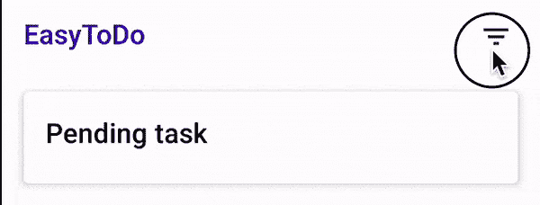
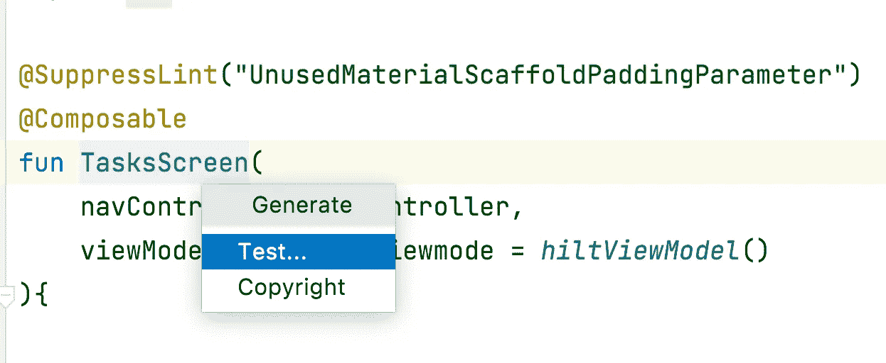
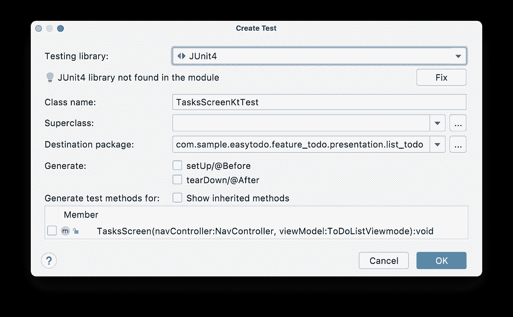
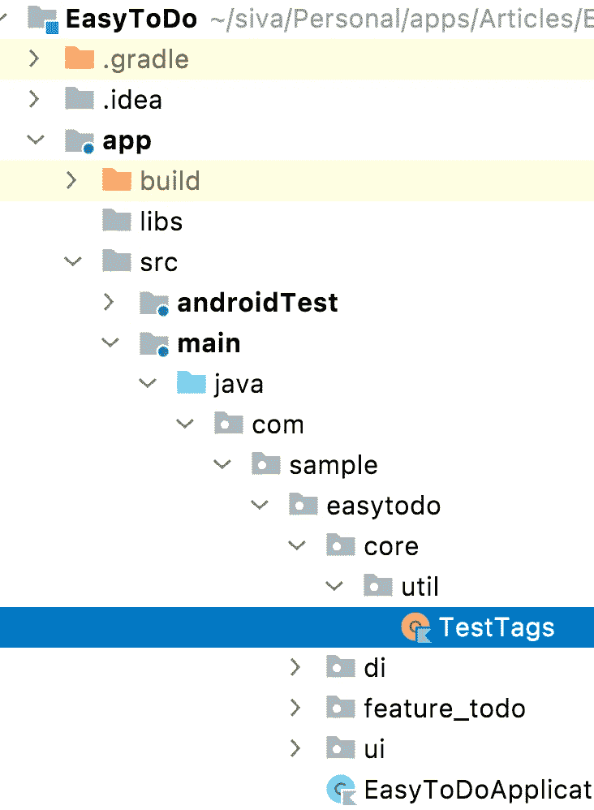
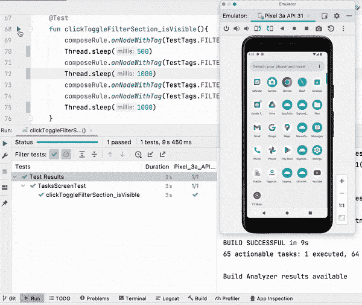
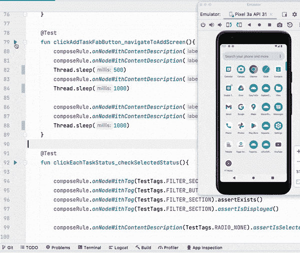
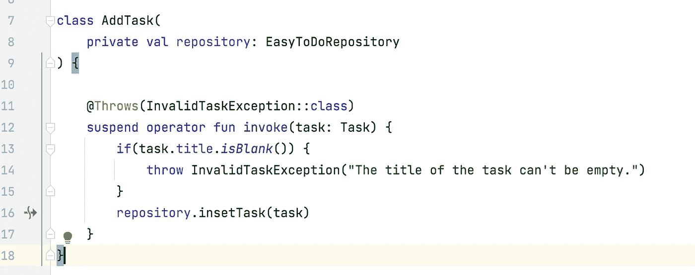
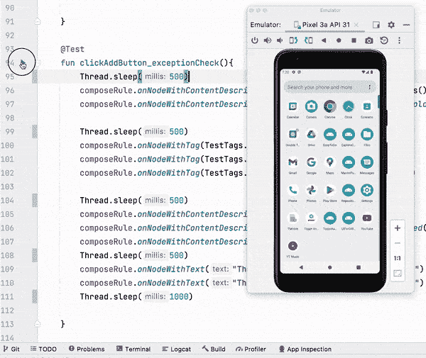

# 在 Jetpack Compose Android 应用程序中实现集成测试

> 原文：<https://betterprogramming.pub/implement-integration-tests-in-jetpack-compose-android-apps-de4efd0cfa8d>

## Android 测试深度指南


照片由[印尼 UX](https://unsplash.com/@uxindo?utm_source=medium&utm_medium=referral)在 [Unsplash](https://unsplash.com?utm_source=medium&utm_medium=referral) 上拍摄

在本系列的第一部分中，我们已经介绍了用单元测试测试业务逻辑。在本文中，我们将测试 EasyTODO 应用程序的各种特性，比如过滤器部分可见性切换、屏幕间导航、错误案例验证等。，使用集成测试。

集成测试位于单元测试之上。它们用于测试两个类或组件如何一起工作。这些类可以是任何东西，比如单击一个过滤器按钮在屏幕上显示过滤器部分。与单元测试不同，集成测试涉及 android 组件，因此我们需要一个物理设备或仿真器来执行它们。

涉及 Android 组件使得设置集成测试变得有点复杂，比如定制测试运行器、刀柄测试设置等。我们将在接下来的几节中一步一步地介绍所有这些内容:

*   [Android 第 1 部分中的测试:单元测试](https://sgkantamani.medium.com/testing-in-android-part-1-unit-tests-de6cbc118fe3)
*   Android 测试第 2 部分:集成测试— **你在这里**

# 刀柄设置

理论说够了。让我们从编写集成测试的依赖注入设置开始。

## 希尔特斯特鲁纳

当我们使用 Hilt 库进行依赖注入时，我们需要创建一个使用`HiltTestApplication`而不是常规`className`的自定义`AndroidJUnitRunner`。

在`androidTest`内的根包下创建一个定制的 Kotlin 类`HiltTestRunner`。用 AndroidJUnitRunner 扩展该类并覆盖`newApplication`。在 return 语句中，用`HiltTestApplication`类名替换`className` 。看一看:

接下来，我们需要在`defaultConfig`节点下的 gradle 文件中配置`HiltTestRunner`。看一看:

## TestAppModule

现在我们已经配置了`HiltTestRunner`，下一步是创建`TestAppModule`，实际手柄的测试版本`AppModule`，我们在其中配置像房间数据库、存储库、用例等依赖项。

问题是，我们为什么需要`TestAppModule`？答案很简单，我们不希望测试中出现真正的数据库或实际的 API 调用。假设在`TestAppModule`中，我们可以返回内存中的房间数据库，这样会更快。为了在测试中灵活地使用假的或轻量级的数据源，我们需要`TestAppModule`。

> 注意:即使你使用真正的刀柄`*AppModule*`没有任何错误，测试也会运行。

既然我们知道了为什么我们需要创建`TestAppModule`，让我们从编码部分开始。除了房间内存数据库之外，在我们的例子中也是一样的。看一看:

# 创建测试用例并声明规则

下一步是创建测试用例。让我们挑选过滤器部分的可见性变化。看一看:



内部发生的情况是，我们用事件`TasksEvent.ToggleFilterSection`调用`ToDoListViewmode`类中的`onEvent`函数，我们将更新在`TasksScreen` compose 函数中观察到的状态，以切换过滤器部分的可见性。所以我们测试这两个类的交互。

理论说够了。让我们创建测试用例；这类似于我们在第 1 部分中创建单元测试的方式。首先，导航到该类，然后将光标放在类名上，并按下`control + return` (macOS)。这将触发一个弹出窗口，允许我们选择测试选项。看一看:



这将把您带到创建测试弹出窗口，在这里我们可以配置名称、路径、测试库等。看一看:



如果观察目的包，目的包无非就是将要创建测试用例的路径，Android Studio 在 Android 测试包下创建测试用例，包结构和主包一样。完成后，点击“确定”按钮。

接下来，我们需要用`HiltAndroidTest`和`@UninstallModules(AppModule::class).`来注释这个类

*   `HiltAndroidTest`:用于标记需要注入的 Android 模拟器测试的注释。
*   `UninstallModules(AppModule::class)`:基本上，`AppModule`和`TestAppModule`公开了相同的依赖关系，这会导致冲突，所以我们在这里告诉 hilt 不要使用`AppModule`类。

看一看:

```
**@HiltAndroidTest
@UninstallModules(AppModule::class)**
class TasksScreenTest {}
```

# 创建规则

这里我们需要两个规则:`HiltAndroidRule`和`createAndroidComposeRule`。

*   Hilt 的 TestRule 可以与 JVM 或仪器测试一起使用。此规则是必需的。没有这个测试规则，将不会创建`Dagger` 组件。
*   `createAndroidComposeRule`:为给定的 activity 类提供特定于 android 的`createComposeRule`实现的工厂方法。`createComposeRule`用于测试一个合成函数。

我们需要确保`HiltAndroidRule`在`createAndroidComposeRule`之前执行，因此我们需要指定执行顺序，如下所示:

接下来，我们需要编写设置函数，其中需要触发刀柄规则上的注入函数(完成匕首注入)。这应该在执行任何测试之前完成。看一下代码:

仅此而已。我们已经完成了集成测试的手柄和合成设置。

# 用组合规则探索节点标识

在编写实际的测试用例之前，我们需要学习一个概念，就是获取屏幕上视图的引用，类似于`findViewById`。

这里包括两件事情:我们寻找视图的方式和我们用来寻找视图引用的度量标准。幸运的是，Compose UI test library 提供了多种简单的方法来实现这一点。

对于度量标准，我们可以基于显示的文本来查找视图，比如文本字段，或者我们可以使用`contentDescription`来查找图标，或者我们可以添加一个`testtag`来查找任何组合视图并在我们的测试中使用它。

对于方法，compose out of the box 提供了类似于`onNodeWithTag`、`onNodeWithContentDescription`和`onNodeWithText`的功能来查找匹配标准的视图的单个引用。我们还可以找到具有功能`onAllNodesWithTag`、`onAllNodesWithContentDescription`和`onAllNodesWithText`的多个视图。我们必须用`composeRule`来使用上面的功能，看看:

```
composeRule.onNodeWithTag(TestTags.FILTER_BUTTON).assertExists()
composeRule.onNodeWithText("Filter").assertExists()
composeRule.onNodeWithContentDescription("Filter").assertExists()
```

在这一系列文章中，我使用了 Google 真理库中的 assert 语句。我们已经在本系列的第 1 部分中导入了这个库。

快速注意，添加`TestTags` Kotlin 对象类，在`main`目录下的以下包结构中声明所有测试标签常量。



# 首次集成测试

先说命名。这不是强制性的，但是我更喜欢使用动作和结果作为函数名的一部分，用`_`分开。看一看:

```
@Test
fun clickToggleFilterSection_isVisible(){
}
```

我们将使用四个函数来完成测试用例:

1.  用于确保视图不在视图层次结构中，这是 Google 真理库的一部分。
2.  `performClick`:用于执行点击各个视图，组成 UI 测试库的一部分。
3.  `assertExists`:用于确保视图已经存在于视图层次结构中，是 Google 真理库的一部分。
4.  `assertIsDisplayed`:用于确保各个视图对用户可见，构成 UI 测试库的一部分。

现在，看一下测试用例:

让我们运行测试用例，如下所示:



> 注:添加了`*Thread.sleep*`以便清楚地看到测试执行，除非需要，否则请不要实时添加。

# 两个屏幕之间的集成测试

现在我们已经编写了第一个集成测试，下一步是编写两个屏幕之间导航的集成测试。编写这样的集成测试将为您有效地编写端到端测试用例做好准备。大多数端到端测试用例只不过是几个集成测试的组合。

回到测试用例，我们将测试从任务列表屏幕添加任务屏幕的导航。我们将通过单击 plus fab 按钮并验证用户是否在 add tasks 屏幕上来完成此操作。看一看:

现在，让我们运行测试用例。看一看:



# 检查错误情况的集成测试

让我们以一个集成测试来结束这篇文章。这一个与异常处理有关。我们将考虑为此创建一个任务特性。如果您看到添加任务用例，如果用户试图添加一个没有有效标题的任务，它将抛出一个异常。看一下使用案例:



编写这个测试用例包括三个步骤:

1.  首先，我们将通过单击 fab 按钮导航到 add task 屏幕。
2.  然后，我们将在没有有效标题的情况下单击“保存”按钮。
3.  最后，我们将验证是否向用户显示了带有异常消息的`snackbar`。

现在，让我们运行用例:



你可以在我的开源项目中找到更多的集成测试。请随意克隆项目并进行试验。请确保您在分支机构`feature/integration_tests`上。

# 下一步是什么？

既然我们已经完成了集成测试，下一步就是使用端到端测试来测试诸如添加任务、删除任务等特性。敬请关注更多内容。