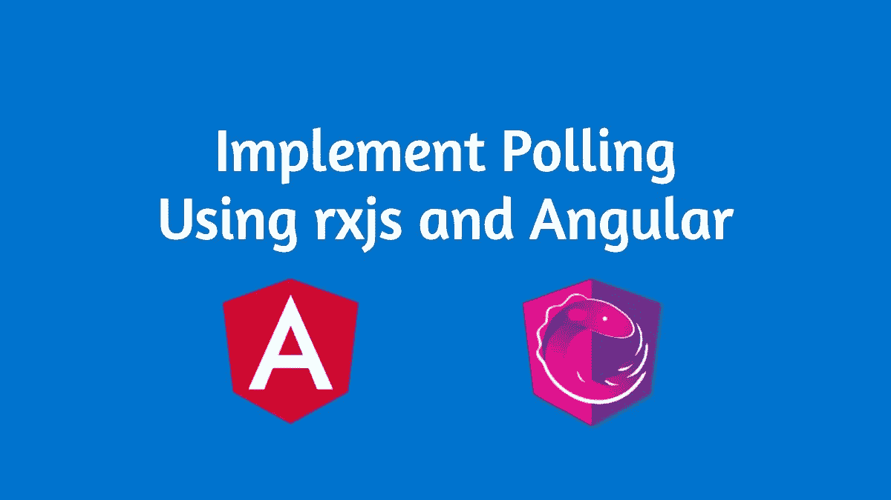

# 在 Angular 应用程序中使用 RxJS 实现轮询

> 原文：<https://betterprogramming.pub/implement-polling-using-rxjs-in-your-angular-application-278129d5a9a9>

## 或者在任何 RxJS 应用程序中

作者照片。

> "最便宜、最快、最可靠的组件是那些不存在的."— [戈登·贝尔](https://www.azquotes.com/quote/1058099)

Angular 的强大之处在于它的反应式架构。 [RxJS](https://rxjs-dev.firebaseapp.com/) 是 Angular 如何做到这一点的。RxJS 是有史以来使用最多的反应式 JavaScript 库，其受欢迎程度与日俱增。

在我以前的一篇文章中，我坦白了作为一个 Angular 开发者我后悔没有做的事情。没有深入学习 RxJS 就是其中之一，现在学习它是如此愉快的经历。

在本文中，我们将使用 RxJS 实现轮询逻辑。

# 什么是轮询？

轮询只是一个技术术语，指的是客户机定期与服务器通信以获取一些数据的技术。例如，当您在服务器上处理大量数据(例如，需要一分钟以上才能完成)时，此过程非常耗时，您需要向用户提供有关该过程当前状态的视觉反馈。

您可能希望以固定的时间间隔对服务器进行 HTTP 调用，以检查状态并基于此操作 UI。这是一个完美的投票用例。

我们将以上面的例子为例，解释 RxJS 如何帮助轻松实现这一点。

# RxJS 方式

让我们直接跳到代码:

该代码遵循以下执行流程:

1.  使用 [RxJS 区间](https://rxjs-dev.firebaseapp.com/api/index/function/interval)创建一个在连续区间上发出值的可观察值。
2.  使用`[switchMap](https://rxjs-dev.firebaseapp.com/api/operators/switchMap)` 向服务器发出 HTTP 请求，检查操作的最新状态。您也可以使用`[mergeMap](https://rxjs-dev.firebaseapp.com/api/operators/mergeMap)` ，但是如果最后一个请求在间隔之外响应，我们不需要让它一直挂起。
3.  使用`[takeWhile](https://rxjs-dev.firebaseapp.com/api/operators/takeWhile)` 来决定何时停止轮询。这里的想法是，直到函数`isStatusCompleted()` 返回一个 falsy 值，我们将保持轮询。
4.  当状态检查返回`true`时，可观察对象进入*完成*状态，我们可以执行需要在轮询完成时运行的逻辑。

黑客快乐！