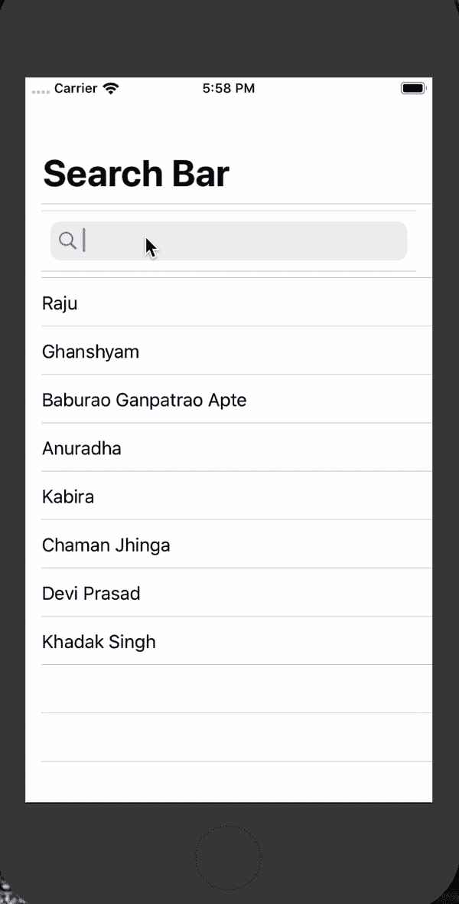
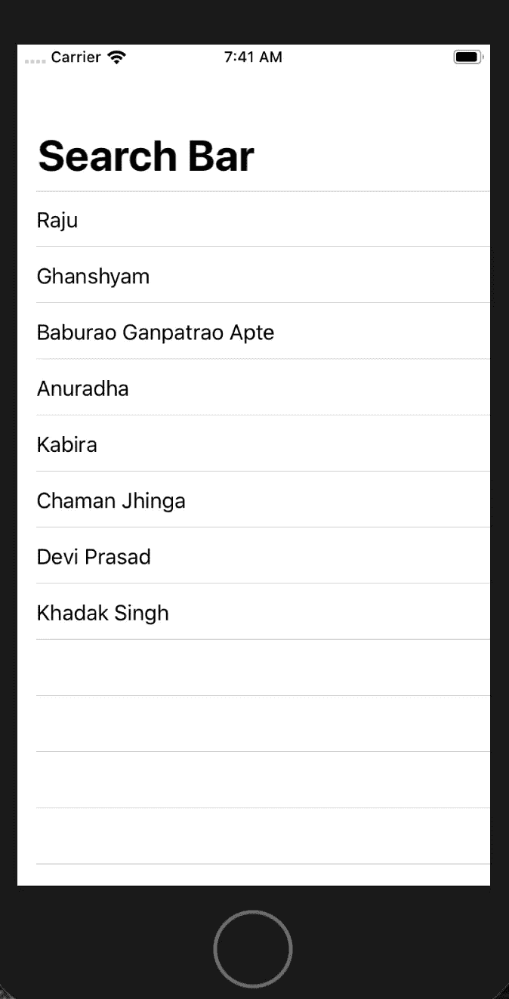

# 在 SwiftUI 中实现一个搜索栏

> 原文：<https://betterprogramming.pub/implement-searchbar-in-swiftui-556a204e1970>

## 搜索您的数据，找到您真正需要的东西



# 步骤 1:如何创建您的 SwiftUI 项目

在 Xcode 中，进入文件→新建→项目→单视图 App →下一步→选择用户界面→ SwiftUI →下一步→选择你想要的项目位置→完成。

# 步骤 2: ContentView.swift

默认的`SwiftUI(ContentView)` 文件会出现以下代码:

```
**import** SwiftUI**struct** ContentView: View {**var** body: **some** View {
    Text(”Hello World!”)
  }
}**struct** ContentView_Previews: PreviewProvider { **static** **var** previews: **some** View {
     ContentView()
   }
}
```

在右边，您可以看到 UI 的预览。

如果你看不到预览，进入调整编辑器选项，选择画布(或按下`option+CMD+enter` ) *。* 之后，确保画布正在显示 UI 预览。


# 步骤 3:创建用户界面

在`ContentView`体内，我们将做以下事情:

1.  初始化字符串数组变量
2.  定义`NavigationView`并命名`navigationBarTitle`
3.  在`NavigationView`中定义列表
4.  该列表将显示一个包含字符串数组中的名称的文本

所以我们的代码看起来会像这样:

```
**import** SwiftUI**struct** ContentView: View {**let** names = [“Raju”, “Ghanshyam”, “Baburao Ganpatrao Apte”,             “Anuradha”, “Kabira”, “Chaman Jhinga”, “Devi Prasad”, “Khadak    Singh”]**var** body: **some** View {
      NavigationView{
         List {
            ForEach(**self**.names, id: \.**self**) { name **in** Text(name)
            }
       }
       .navigationBarTitle(Text(“Search Bar”))
    }
  }
}**struct** ContentView_Previews: PreviewProvider {
   **static** **var** previews: **some** View {
      ContentView()
   }
}
```



# 步骤 4:创建搜索栏

现在的问题是:你打算如何展示一个`UISearchBar`？

所以为了显示一个`UISearchBar`，我们将使用`UIViewControllerRepresentable`协议。

```
**struct** SearchBar : UIViewRepresentable {}
```

现在，我们必须实现协议方法，它们是`updateUIViewController`、`makeCoordinator`和`makeUIViewController`。

```
//Update UIViewcontrolleer Method
**func** updateUIViewController(**_** uiViewController:
UIImagePickerController, 
context: UIViewControllerRepresentableContext<SearchBar>) 
{

}//Make Coordinator which will commnicate with the Search bar
**func** makeCoordinator(){}// Create UIViewController which we will display inside the View of the UIViewControllerRepresentable
**func** makeUIViewController(context: UIViewControllerRepresentableContext<SearchBar>)
{}
```

因为我们已经实现了协议`UIViewControllerRepresentable`的所有方法，所以让我们在`makeUIViewController`方法中创建一个`UISearchBar`。

```
**func** makeUIView(context: UIViewRepresentableContext<SearchBar>) -> UISearchBar {**let** searchBar = UISearchBar(frame: .zero)
searchBar.delegate = context.coordinator
**return** searchBar}
```

# 步骤 5:创建 UI 搜索栏协调器

现在我们必须创建一个协调器，它可以在`UIViewControllerRepresentable`和`UISearchBar`委托方法之间进行通信。

所以我们将创建一个新的类，`Cordinator`，它将实现协议`NSOBject`和`UISearchBarDelegate`，并将实现这些协议所需的方法。

协调器看起来会像这样:

```
**class** Cordinator : NSObject, UISearchBarDelegate {**func** searchBar(**_** searchBar: UISearchBar, 
                  textDidChange searchText: String) 
   {
      // Pass searchText value to the content view
   }}
```

现在，如果用户输入任何东西，我们必须通知我们的`ContentView`来显示过滤后的结果。

为此，我们将使用`@Binding`和`@State`的概念。我们将创建一个名为`text`的`Binding`变量，所以现在我们的`ImagePickerCordinator`将如下所示:

```
**class** Cordinator : NSObject, UISearchBarDelegate {@Binding **var** text : String**init**(text : Binding<String>) 
   {
      _text = text
   }**func** searchBar(**_** searchBar: UISearchBar, 
                  textDidChange searchText: String) 
   {
      text = searchText
   }}
```

既然我们的协调器已经准备好进行通信，让我们对`UIViewControllerRepresentable` `makeCoordinator()`函数进行修改。

```
**func** makeCoordinator() -> SearchBar.Cordinator {
   **return** Cordinator(text: $text)
}
```

为了传入`binding`变量，我们将在`UIViewControllerRepresentable`中创建这个变量。现在,`UIViewControllerRepresentable`文件看起来像这样:

```
**import** SwiftUI**struct** SearchBar : UIViewRepresentable {
   @Binding **var** text : String

   **func** searchBar(**_** searchBar: UISearchBar, 
                  textDidChange searchText: String) {
      text = searchText
   }
}**func** makeCoordinator() -> SearchBar.Cordinator {
      **return** Cordinator(text: $text)
   }**func** makeUIView(context: UIViewRepresentableContext<SearchBar>) 
   -> UISearchBar {

      **let** searchBar = UISearchBar(frame: .zero)
      searchBar.delegate = context.coordinator
      **return** searchBar
   }**func** updateUIView(**_** uiView: UISearchBar, 
                context: UIViewRepresentableContext<SearchBar>) {
       uiView.text = text
    }
}
```

# 步骤 7:在 ContentView 中实现 UISearchBar

在`contentView`内部，我们只需要创建`@State`变量，命名为`searchTerm`，类型为`String`。

每当`searchTerm`变量值更新时，我们必须过滤列表。为此，我们将对`String array`使用默认的`filter`方法。

我们要在列表里面调用`SearchBar``UIViewControllerRepresentable`；在调用`SearchBar`时，我们必须传递绑定变量。就这样——我们准备好了。

所以我们的`ContentView`代码看起来像这样:

```
**import** SwiftUI**struct** ContentView: View {**let** names = [“Raju”, “Ghanshyam”, “Baburao Ganpatrao Apte”,   “Anuradha”, “Kabira”, “Chaman Jhinga”, “Devi Prasad”, “Khadak Singh”]@State **private** **var** searchTerm : String = “”**var** body: **some** View {
      NavigationView{
         List {
            SearchBar(text: $searchTerm)

            ForEach(**self**.names.filter{
              **self**.searchTerm.isEmpty ? **true** :    $0.localizedStandardContains(**self**.searchTerm)
}, id: \.**self**) { name **in** Text(name)
              }
         }
          .navigationBarTitle(Text(“Search Bar”))}
    }
}**struct** ContentView_Previews: PreviewProvider {
   **static** **var** previews: **some** View {
      ContentView()
   }
}
```

# 资源

你可以在 [GitHub](https://github.com/rathodmayur93/SearchBarSwiftUI) 上找到这个项目。