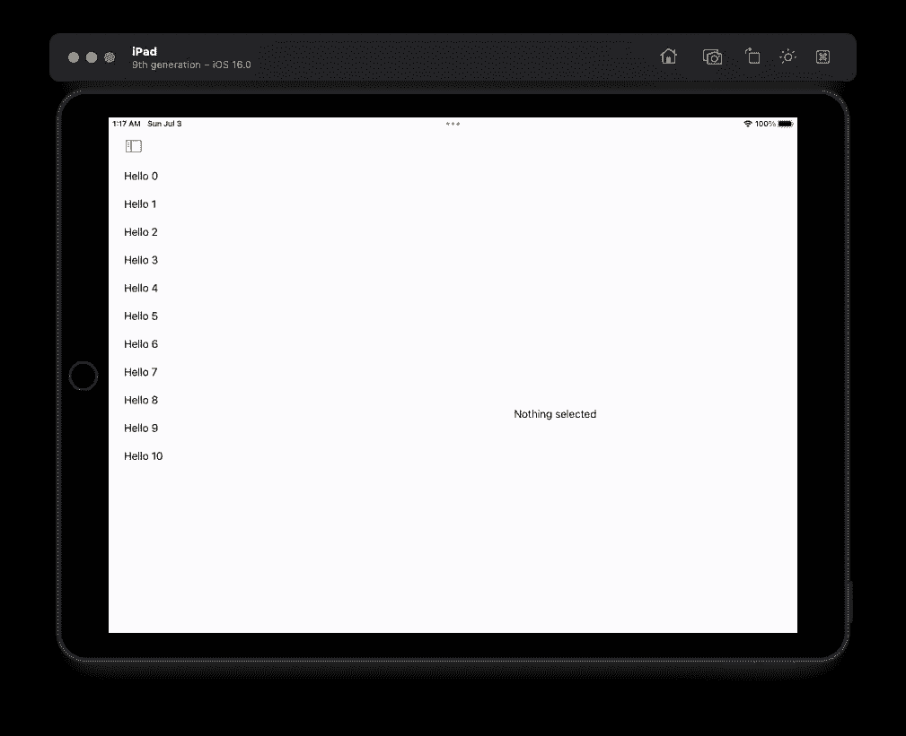
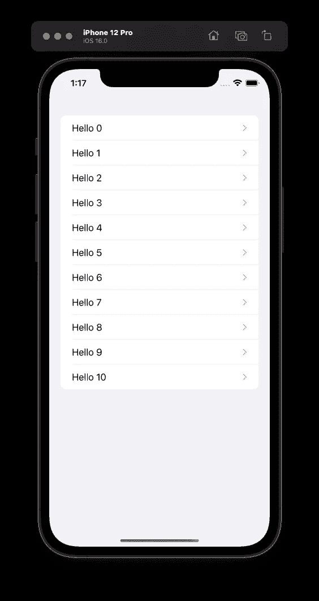

# 使用 NavigationStack 和 NavigationSplitView 实现 SwiftUI 导航

> 原文：<https://betterprogramming.pub/implement-swiftui-navigation-with-navigationstack-and-navigationsplitview-d1d813a74941>

## 苹果已经弃用了 NavigationView，但未来已经到来


图片来自[pix abay](https://pixabay.com/?utm_source=link-attribution&utm_medium=referral&utm_campaign=image&utm_content=632394)firm bee

苹果公司已经否决了 NavigationView，它以前被用作本质上是一堆视图的包装器，当呈现时被推送，当关闭时弹出。这是 iOS 导航从一开始就熟悉的工作方式，没有物理的后退按钮，但在顶部有一个导航栏，上面有一个后退按钮，描述“后退”在哪里。

有两种实现导航的新方法，但它们在 iPhone 上看起来非常相似，原因我将在后面讨论。

我们开始吧！

# 导航堆栈

这个应用程序从几个`Hashable`和`Identifiable`结构开始非常简单。

存储导航状态的`Screen`枚举是`Hashable`是必要的，因为我稍后将使用的`NavigationLink`的新初始化器需要它。为了成为`Hashable`，相关值也需要成为`Hashable`。如果它们只是一个`String`和一个`Int`，这仍然是正确的，但是我想利用`ForEach`，它要求类型也是`Identifiable`。因为原始值类型`String`和`Int`是可互换的，并且它们没有定义它们的唯一属性。

我已经将数据作为两个数组添加到`ContentView`中。

我可以(也可能应该)使用一个`ObservableObject`来存储数据，但是我更愿意编写更多的代码来专门演示导航。

现在我有数据，但没有地方显示它。

这里有一个简单的`List`，其中一个`Section`用于单词，另一个用于数字。

每个单词和数字变成一个`NavigationLink`，它将传递一个`Screen`值作为`navigationDestination`，这个值还不存在。

现在我终于可以通过在一个`NavigationStack`中放入一个`ItemsListView`并添加`navigationDestination`来完成这个应用了。这适用于任何情况下的 Screen enum，所以我使用一个`switch`来决定基于给定值做什么。

在这种情况下，我在这里所做的只是显示值，但显然这些可能是完全不同的屏幕，以完全不同的方式显示数据。

# 导航拆分视图

iPad 是使用`NavigationSplitView`的显而易见的选择。

详细信息栏始终显示，即使您只有一个`NavigationLink`。

这意味着您所做的任何改变状态的事情，比如改变一个`State`属性，将会更新 detail 列，如果它使用那个属性的话。



作者截图

我花了一段时间才弄明白如何让一个`NavigationSplitView`在 iPhone 上工作。修改`State`属性来设置选择项的常规`Button`不会导致任何事情发生。

这是因为在 iPhone 上实际上有一个`NavigationStack`，而在 iPad 上有足够的空间来放置侧边栏。

换句话说，没有某种导航，细节列就无法显示。



作者截图

为了解决这个问题，我使用了一个设置值的`NavigationLink`。

这给了我在 iPhone 和 iPad 上想要的行为，而不需要编写特定于平台的代码。

感谢阅读！

```
**Want Daily Coding Tips like these?**These tips previously appeared in my newsletter [Type Safely](https://typesafely.substack.com/).
```