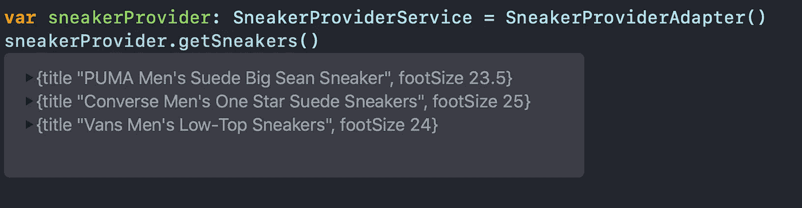

# 在 Swift 5 中实施适配器设计模式

> 原文：<https://betterprogramming.pub/implement-the-adapter-design-pattern-in-swift-165ac22bc868>

## 让不兼容的接口协同工作

照片由 [matthaeus](https://unsplash.com/@matthaeus123?utm_source=medium&utm_medium=referral) 在 [Unsplash](https://unsplash.com?utm_source=medium&utm_medium=referral) 上拍摄

在本教程中，我们将通过在 Xcode 操场上快速实现适配器设计模式来了解它。

`Adapter`模式允许我们使不兼容的界面适应我们应用程序的现有功能。

这是我们的示例项目。我们有一个用户可以购买运动鞋的应用程序，我们希望集成一个从亚马逊获取运动鞋的第三方服务。我们的问题是，我们的应用程序使用厘米来测量运动鞋的尺寸，但第三方服务以英国鞋码格式返回尺寸。我们将通过使用`Adapter`设计模式来解决这个问题。

# 我们开始吧

看看我们应用程序的现有功能:

我们使用`SneakerProviderService`协议来指定我们想要如何检索运动鞋。

我们导入的第三方服务如下所示:

我们可以看到每双运动鞋都有一个属性`ukSize`，但是我们想在我们的应用程序中使用厘米。

所以让我们为`ThirdPartySneakerProvider`定义`Adapter`:

我们定义了`SneakerProviderAdapter`类并符合`SneakerProviderService`协议。我们有一个类型为`ThirdPartySneakerProvider`的私有属性。

正如我们所看到的，`getSneakers()`方法返回一个`Sneaker`数组，但是`ThirdPartySneakerProvider`返回一个`ThirdPartySneaker`数组，所以我们必须在幕后执行一个转换。

`convertFromUKtoCentimeters`方法为我们提供了一种将英国尺寸转换成厘米的方法。所以我们在`.map`函数中使用这个方法来返回一个`Sneaker`的数组。

最后，我们可以在我们的应用程序中使用这个适配器:

结果正是我们所需要的:

# 包扎

对其他设计模式感兴趣？请随意查看我的其他相关作品:

 [## 在 Swift 5 中实施构建器设计模式

### 创建和使用自定义 URLRequests 和 URLSessionDataTasks

medium.com](https://medium.com/better-programming/implement-the-builder-design-pattern-in-swift-5-ff5bc6f2fc3d)  [## 在 Swift 中实施战略设计模式

### 只需一行代码就可以在领域和核心数据之间切换

medium.com](https://medium.com/better-programming/implement-the-strategy-design-pattern-in-swift-5d9c3f221277)  [## 新 MVC:单一责任原则和委托

### 苹果的模型视图控制器，终于做对了

medium.com](https://medium.com/better-programming/this-is-how-you-implement-mvc-architecture-in-2020-b39d65b4212f)  [## 在 Swift 5 中实施模型-视图-演示者架构

### 使用领域数据库作为业务逻辑层

medium.com](https://medium.com/better-programming/implement-a-model-view-presenter-architecture-in-swift-5-dfa21bbb8e0b)  [## 反应式 MVVM 和协调模式做对了

### 使用 Swift 5、RxSwift 和 RxDataSources

medium.com](https://medium.com/better-programming/reactive-mvvm-and-the-coordinator-pattern-done-right-88248baf8ca5)  [## 如何使用 Swift 5 在您的 iOS 应用中实现 VIPER 架构

### 使用方便的 Xcode 模板和参考报告

medium.com](https://medium.com/better-programming/how-to-implement-viper-architecture-in-your-ios-app-rest-api-and-kingfisher-f494a0891c43)  [## 在 Swift 5 中实施面向服务的架构

### 为什么只用 MVC/MVVM/蝰蛇还不够

medium.com](https://medium.com/better-programming/implement-a-service-oriented-architecture-in-swift-5-fc70b8117616) 

感谢阅读！